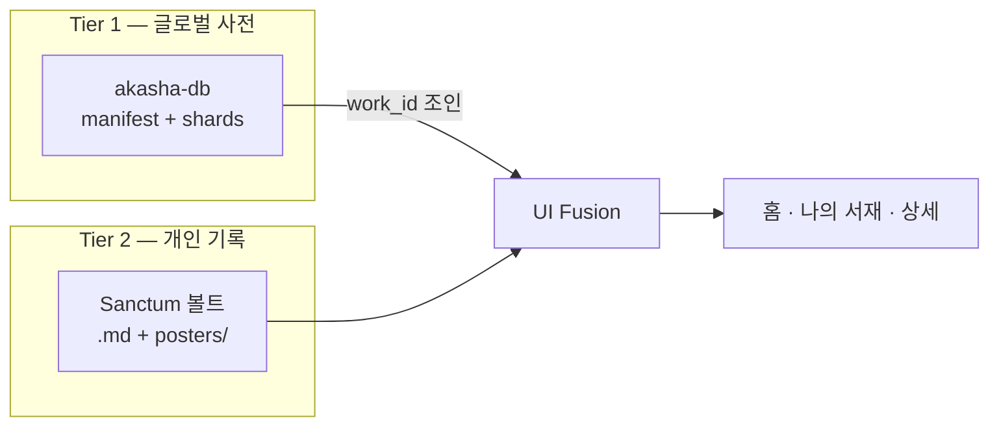

# 🏛️ AKASHA (아카샤)

> **사용자가 소유한 개인 아카이브 프로토콜** — 앱은 그 첫 번째 인터페이스다.

AKASHA는 한 사람의 기록·취향·관계·생각의 변화를 장기간 보존하고, 미래의 사람·도구·AI가 소유권을 빼앗지 않은 채 읽고 활용할 수 있게 만드는 기반이다. Markdown은 현재 원본 형식이고, 인덱스는 파생 탐색 계층이며, AI는 교체 가능한 독자·보조자다.

Steam v1은 그 비전을 **작품 감상 아카이브**로 검증한다. Sanctum vault 호환 로컬 마크다운에 감상을 남기고, 글로벌 작품 사전(`akasha-db`)과 조인해 전시한다.

**플랫폼:** Steam (Windows) · 무료 기본 앱 + Steam Commerce(출시 범위에 포함)

| 알고 싶은 것 | 문서 |
|---|---|
| **구현 현실 (무엇이 되어 있는가)** | [docs/active/CURRENT_STATE.md](docs/active/CURRENT_STATE.md) |
| **Steam 출시 운영 (BuildID · Set Live · 게이트)** | [docs/active/STEAM_RELEASE.md](docs/active/STEAM_RELEASE.md) |
| **앞으로 할 일** | [docs/active/ROADMAP.md](docs/active/ROADMAP.md) |
| **원칙 / 비전** | [Constitution](docs/active/AKASHA_ARCHIVE_CONSTITUTION.md) · [VISION](docs/active/VISION.md) |

> README는 제품 소개와 위 진입점만 제공합니다. 수치·게이트·Commerce 판정은 Active SSOT를 따릅니다.
> history의 [PROJECT_STATUS.md](docs/history/closure-2026-07/PROJECT_STATUS.md)는 **2026-07-16 스냅샷**이며 현재 상태가 아닙니다.

문서 체계 전체는 [docs/README.md](docs/README.md)를 참고하세요.

---

## 🎯 Steam v1 범위 (MVP)

### 핵심 (반드시 포함)

| 영역 | 설명 |
|------|------|
| **Sanctum 볼트** | 로컬 `.md` + YAML front-matter, 폴더 연동·자동 감시 |
| **엄선 작품 사전** | 검증된 전체 로컬 bundle (`akasha-db`), 샤딩·온디맨드 asset 로드 |
| **IP 1카드 그리드** | 같은 IP는 카드 1장, 매체는 하단 칩으로 전부 표시 |
| **나의 서재** | 아카이브한 작품 전용 뷰 + 무료 테마 2종 · Premium 테마 3종(Sakura·Amethyst·Nocturne). 구매·복원 증거는 [STEAM_RELEASE](docs/active/STEAM_RELEASE.md) / Acceptance Matrix |

### v1에 포함하는 부가 기능 (이미 구현 → 다듬기)

- **작품 검색** — 내 볼트 + 글로벌 사전 + 없으면 직접 등록
- **AI 마크다운 가져오기** — ChatGPT 등이 만든 YAML+마크다운 붙여넣기로 **새 작품** 등록 (기존 `.md` 수정 아님)
- **대시보드** — 카테고리·도메인 필터, Hall of Fame, 워치리스트, 섹션 정렬·접기
- **볼트 아카이빙** — 사용자가 아카이브한 작품만 `.md` 생성 (사전 전체는 가상 카드)

### v1에서 보류

| 항목 | 비고 |
|------|------|
| 오늘의 회상 카드 | `FeatureFlags.showRecallCard` — v1.1 |
| Timeline projection / 완성 캘린더 / 빠른 capture | `FeatureFlags.showTimeline` — v1 이후. UX-2는 기존 Records 조회 경로만 복원 |
| 취향 기반 추천 (Discover) | `FeatureFlags.showDiscoveryHome` — v1 이후 |
| TMDB / IGDB 자동 메타·포스터 연동 | **폐기** — `externalIds.*` 식별자만 Fact로 유지 |
| Riverpod 대규모 리팩터 | v1 이후 |
| 모바일 (Android / iOS) | Windows 검증 후 |

---

## 💰 Steam 배포 모델

- **기본 앱:** 무료
- **번들 무료 테마:** Classic Dark · Midnight Blue
- **Premium 테마:** Sakura · Amethyst · Nocturne (Astra/Echo 교환)
- **Steam Commerce:** v1 출시 범위에 포함. 라이브 BuildID·IAP 플래그·Acceptance 판정은 [STEAM_RELEASE.md](docs/active/STEAM_RELEASE.md)와 [CURRENT_STATE.md](docs/active/CURRENT_STATE.md)를 본다
- **향후 코스메틱 범위 (post-v1 백로그):** 서재 꾸미기 팩 · 서포터 팩 등
- **작품 구매·감상 (장기):** 플랫폼 제휴·웹결제 — Steam 수수료 회피 ([commerce-boundary.md](docs/history/policy/commerce-boundary.md))

나의 서재 **기본 뷰**(내 아카이브 모아 보기)는 무료로 제공합니다.

---

## 📚 글로벌 작품 사전 (akasha-db)

> **최종 목표:** 세상의 모든 작품 사전 (IMDb + OpenLibrary급)  
> **현재 단계:** **10,048작** (`manifest.entryCount`) → **G1 병행 확장** · v4 운영 — SD2.6 hold **해제** ([catalog-growth-charter](docs/history/programs/catalog-growth-charter.md))

| 항목 | 정책 |
|------|------|
| **철학** | **자체 DB 구축** — 가공·검증 후 적재; 무분별 API 복제 금지 ([akasha-db-policy.md](docs/history/policy/akasha-db-policy.md)) |
| **스키마** | **v4** (현재) — `wk_` 영구 ID · `hash(wk_)%256` 샤딩 · sha256 manifest — [SCHEMA.md](akasha-db/SCHEMA.md) |
| **규모 목표** | 2026 **10k** (현재 **10,048** ✅) · 2027 ~50k · 2028 ~100k · 2030 ~500k |
| **샤딩** | **v4 해시 샤딩 완료** — 비어 있지 않은 1,713 shard ([v4-migration-plan.md](docs/history/v4-migration-plan.md) Phase A~E ✅) |
| **포스터** | **대시보드 서재 미표시** · 나만의 서재에서만 유저 Sanctum vault `poster:` / `posters/` 표시 |
| **볼트** | 아카이브한 작품**만** `.md` — 사전 전체가 md가 되지 않음 |
| **장기 확장** | **Registry Pipeline** (AI extract → dedupe → shard → Git) |
| **기술** | Git source → 결정적 full-bundle builder → 앱 asset (production registry network 0) |
| **글로벌화** | `searchTokens` · [locale-catalog-policy.md](docs/history/policy/locale-catalog-policy.md) |

공개 replica(현재 production 앱에서는 사용하지 않음):

```
https://akasha-db.pages.dev/
```

소스(Git): [akasha-db](https://github.com/AIRA1346/akasha-db) — Pages 배포는
독립 데이터 배포와 미래 provider 검증을 위해 보존하지만 앱은 CDN으로 fallback하지 않습니다.

---

## 🌌 Core Philosophy (핵심 철학)

작품을 기록하는 이유는 데이터 수집이 아니라 **그때의 감동과 생각의 보존**입니다.

### 1. 📂 지능적인 다형성 기록 (Archive & Write) — **v1 ✅**

- 매체별 상태·평점·명대사를 유연한 다형성 구조로 수용
- 모든 개인 기록은 로컬 `.md`에 Sanctum vault 양식으로 보존 (100% 개인 소유)

### 2. 👑 감동의 실시간 회상 (Remind & Relive) — **v1 이후**

- **오늘의 회상 카드** — v1.1+
- **타임라인·완성 캘린더** — v1 이후

### 3. 🗺️ 다음 여정으로의 인도 (Discover & Journey) — **v1 이후**

- 외부 API 자동 메타·포스터 수집은 하지 않음 — 검증된 식별자 Fact만 저장
- **취향 기반 추천** — v1 이후

---

## 🏗️ 아키텍처 요약



- **work_id:** `wk_` + 9자리 영구 ID (예: `wk_000000111`) — 작품명과 무관한 불변 키. 구 슬러그 ID(`{sub|gen}_{category}_{slug}_{year}`)는 `legacy_aliases`로 자동 해석
- **대시보드 서재:** IP당 1카드 (`FranchiseFusionService` · `RegistryVisibilityService`) · 포스터 없는 Fact 카드
- **나만의 서재:** 아카이브된 `.md`만 표시 · 유저 `poster:` / `posters/` 이미지 표시
- **검색:** 로컬 + 사전 + 가상 항목; 같은 IP는 검색에서만 매체별 노출 가능

---

## 🛠️ Technology Stack

| 영역 | 선택 |
|------|------|
| Framework | Flutter (Windows Desktop 우선) |
| Storage | Local Markdown + YAML front-matter |
| State | `ChangeNotifier` + Coordinator (Riverpod는 v1 이후 검토) |
| Registry | JSON **v4 해시 샤딩** (`wk_` 영구 ID), 전체 로컬 bundle의 lazy asset read, `searchTokens` 교차 언어 검색 |
| Locale | `CatalogLocale` + `titles` fallback (UI i18n은 v1.1) |
| Commerce | `EntitlementService` — cosmetic(Steam) / content(제휴) 분리 |
| CI | `flutter_ci`, `ci_registry_check`, `franchise_linter` |

---

## 📂 Sanctum Vault 연동

앱에서 **폴더 연동** 시 아래 구조가 자동 생성됩니다.

```
{Vault}/
├── posters/          # 사용자 업로드 포스터
├── manga/
├── animation/
├── game/
├── book/
├── movie/
└── drama/
```

### YAML Front-matter (필수·권장)

| 필드 | 설명 |
|------|------|
| `work_id` | `wk_` 영구 ID (마스터 키). 비어 있으면 사전 매칭 후 자동 부여 · 구 슬러그 ID는 자동 변환 |
| `title` | 작품 제목 (파일명과 동기화) |
| `category` | `manga` · `animation` · `game` · `book` · `movie` · `drama` |
| `domain` | ⚠️ deprecated | Registry: `subculture` only · YAML 읽기 호환 (`AppDomain.fromStorage`) |
| `poster` | `posters/` 상대경로 또는 커스텀 URL — 나만의 서재 카드에 표시 |
| `rating` | 0.0~5.0 |
| `status` / `my_status` | 나의 상태 |
| `work_status` | 작품 상태 (완결, 출시됨 등) |
| `is_hall_of_fame` | S-Tier 명예의 전당 |

본문에는 **명대사·감상·메모** 등 자유롭게 기록합니다. **Tier 1 사전에는 Fact만** — 설명·포스터는 유저 Sanctum vault에 직접 넣습니다. ([VISION.md](docs/active/VISION.md))

### 외부 편집

Sanctum vault 폴더에서 `.md`를 수정하면 앱이 **약 0.4초 후** 자동 반영합니다. 앱 저장 시 **원자적 쓰기**(임시 파일 → rename)로 손상을 방지합니다.

---

## 🚀 개발

**Flutter SDK (로컬):** `C:\src\flutter`  
경로 기록: `tool/flutter_sdk.path`, `.vscode/settings.json`  
Windows 래퍼: `.\scripts\flutter.ps1 test`  
Release 빌드: `.\scripts\build_release.ps1` → `build\windows\x64\runner\Release\akasha.exe`

```bash
flutter pub get
flutter analyze lib/
flutter test
dart run tool/ci_registry_check.dart
dart run tool/preflight_check.dart          # 4종 핵심 gate 일괄
# 도구 전체 인덱스: tool/README.md
# production full bundle — source manifest를 재생성하지 않는 read-only builder
dart run tool/registry_bundle_builder.dart --source akasha-db --output assets/registry --source-revision <immutable-akasha-db-commit> --bundle-all
dart run tool/catalog_scale_baseline.dart --strict
# Discovery 배치 SSOT:
#   .\scripts\discovery_batch.ps1
flutter build windows
```

앱 번들에는 search index와 manifest가 선언한 **전체 1,713 shard**가 포함됩니다. 시작 시
manifest/index/eager shard만 읽고 나머지는 로컬 asset에서 lazy read하며, CDN·registry cache
fallback은 없습니다 ([ADR-015](docs/architecture/ADR-015-full-local-registry-bundle.md)).
사전 확장은 **수동 큐레이션·wikidata_ko trial** 경로를 사용합니다 (AniList API bulk·온디맨드 미사용).

Windows 실행 파일: `build/windows/x64/runner/Release/akasha.exe`

---

## 📄 관련 문서

- [docs/active/VISION.md](docs/active/VISION.md) — **제품 북극성** (Fact index + Sanctum vault)
- [docs/active/CURRENT_STATE.md](docs/active/CURRENT_STATE.md) — **구현 현실 SSOT**
- [docs/active/STEAM_RELEASE.md](docs/active/STEAM_RELEASE.md) — **Steam 출시 운영 SSOT**
- [docs/active/ROADMAP.md](docs/active/ROADMAP.md) — **앞으로 할 일** (완료 현황 기록장이 아님)
- [akasha-db/POSTER_POLICY.md](akasha-db/POSTER_POLICY.md) — **Tier 1 포스터 금지 정책**
- [docs/history/akasha-db-implementation-plan.md](docs/history/akasha-db-implementation-plan.md) — 사전 구현 계획·진행 상태
- [akasha-db/SCHEMA.md](akasha-db/SCHEMA.md) — 사전 v4 필드 규격 (`wk_`·해시 샤드)
- [docs/history/closure-2026-07/PROJECT_STATUS.md](docs/history/closure-2026-07/PROJECT_STATUS.md) — **역사 스냅샷 (2026-07-16)** · 현재 SSOT 아님
- [docs/history/policy/locale-catalog-policy.md](docs/history/policy/locale-catalog-policy.md) — 언어·작품명·검색 정책
- [docs/history/policy/commerce-boundary.md](docs/history/policy/commerce-boundary.md) — Steam IAP vs 제휴 커머스
- [akasha-db/README.md](akasha-db/README.md) — 사전 기여·샤딩 규칙
- `tool/ci_registry_check.dart` — 레지스트리·프랜차이즈·Fact-only CI
