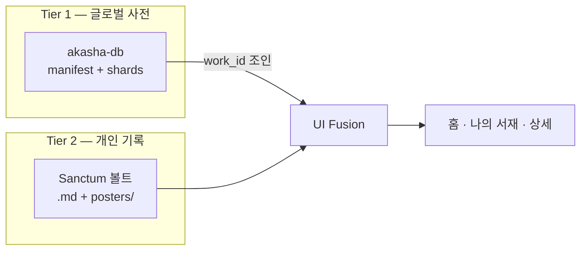

# 🏛️ AKASHA (아카샤)

> **세상 모든 작품을 기억하고, 추억하며, 다음 여정을 찾아가는 개인 미디어 아카이브 공간**

AKASHA는 단순한 미디어 감상 기록(트래커) 앱을 넘어, 유저가 사랑하고 영접한 **세상의 모든 작품들**(만화, 게임, 애니메이션, 책, 영화, 드라마 등)을 Sanctum vault 호환 로컬 마크다운으로 축적하고, 글로벌 작품 사전과 조인해 전시하는 **통합 미디어 아카이빙 플랫폼**입니다.

**1차 출시 목표:** Steam (Windows) · **v1 목표 시점:** 2026년 3분기

상세 마일스톤·백로그는 [ROADMAP.md](ROADMAP.md)를 참고하세요.

---

## 🎯 Steam v1 범위 (MVP)

### 핵심 (반드시 포함)

| 영역 | 설명 |
|------|------|
| **Sanctum 볼트** | 로컬 `.md` + YAML front-matter, 폴더 연동·자동 감시 |
| **엄선 작품 사전** | GitHub raw sync (`akasha-db`), 샤딩·온디맨드 로드 |
| **IP 1카드 그리드** | 같은 IP는 카드 1장, 매체는 하단 칩으로 전부 표시 |
| **나의 서재** *(신규 구현)* | 아카이브한 작품 전용 뷰(기본 무료) + 테마·꾸미기(IAP) |

### v1에 포함하는 부가 기능 (이미 구현 → 다듬기)

- **작품 검색** — 내 볼트 + 글로벌 사전 + 없으면 직접 등록
- **AI 마크다운 가져오기** — ChatGPT 등이 만든 YAML+마크다운 붙여넣기로 **새 작품** 등록 (기존 `.md` 수정 아님)
- **대시보드** — 카테고리·도메인 필터, Hall of Fame, 워치리스트, 섹션 정렬·접기
- **볼트 아카이빙** — 사용자가 아카이브한 작품만 `.md` 생성 (사전 전체는 가상 카드)

### v1에서 보류

| 항목 | 비고 |
|------|------|
| 오늘의 회상 카드 | 코드는 있으나 v1 스토어 설명·마케팅에서 제외 → v1.1 |
| 타임라인 / 완성 캘린더 | 철학 2번 축, v1 이후 |
| 취향 기반 추천 (Discover) | 철학 3번 축, v1 이후 |
| TMDB / IGDB 등 외부 API | 저작권·운영 리스크, v1 이후 |
| Riverpod 대규모 리팩터 | v1 이후 |
| 모바일 (Android / iOS) | Windows 검증 후 |

---

## 💰 Steam 배포 모델

- **기본 앱:** 무료
- **Steam IAP (코스메틱만):**
  - 나의 서재 **테마·꾸미기** (배경, 진열 방식 등)
  - 비주얼 테마·서재 꾸미기 팩
  - 서포터 팩
- **작품 구매·감상 (장기):** 플랫폼 제휴·웹결제 — Steam 수수료 회피 ([commerce-boundary.md](docs/policy/commerce-boundary.md))

나의 서재 **기본 뷰**(내 아카이브 모아 보기)는 무료로 제공합니다.

---

## 📚 글로벌 작품 사전 (akasha-db)

> **최종 목표:** 세상의 모든 작품 사전 (IMDb + OpenLibrary급)  
> **현재 단계:** **430작** → **G1 병행 확장** · v4 운영 — SD2.6 hold **해제** ([catalog-growth-charter](docs/programs/catalog-growth-charter.md))

| 항목 | 정책 |
|------|------|
| **철학** | **자체 DB 구축** — 가공·검증 후 적재; 무분별 API 복제 금지 ([akasha-db-policy.md](docs/akasha-db-policy.md)) |
| **스키마** | **v4** (현재) — `wk_` 영구 ID · `hash(wk_)%256` 샤딩 · sha256 manifest — [SCHEMA.md](akasha-db/SCHEMA.md) |
| **규모 목표** | 2026 ~430(v4) · 2027 ~5k · 2028 ~50k · 2030 ~500k |
| **샤딩** | **v4 해시 샤딩 완료** — 351 샤드 ([v4-migration-plan.md](docs/archive/v4-migration-plan.md) Phase A~E ✅) |
| **포스터** | **대시보드 서재 미표시** · 나만의 서재에서만 유저 Sanctum vault `poster:` / `posters/` 표시 |
| **볼트** | 아카이브한 작품**만** `.md` — 사전 전체가 md가 되지 않음 |
| **장기 확장** | **Registry Pipeline** (AI extract → dedupe → shard → Git) |
| **기술** | GitHub → Cloudflare CDN → 앱 (서버 비용 0) |
| **글로벌화** | `searchTokens` · [locale-catalog-policy.md](docs/policy/locale-catalog-policy.md) |

동기화 base URL:

```
https://raw.githubusercontent.com/AIRA1346/akasha-db/main/
```

레포: [akasha-db](https://github.com/AIRA1346/akasha-db) (앱 저장소 내 `akasha-db/` 서브모듈/미러)

---

## 🌌 Core Philosophy (핵심 철학)

작품을 기록하는 이유는 데이터 수집이 아니라 **그때의 감동과 생각의 보존**입니다.

### 1. 📂 지능적인 다형성 기록 (Archive & Write) — **v1 ✅**

- 매체별 상태·평점·명대사를 유연한 다형성 구조로 수용
- 모든 개인 기록은 로컬 `.md`에 Sanctum vault 양식으로 보존 (100% 개인 소유)

### 2. 👑 감동의 실시간 회상 (Remind & Relive) — **v1 이후**

- **오늘의 회상 카드** — v1.1+
- **타임라인·완성 캘린더** — v1 이후

### 3. 🗺️ 다음 여정으로의 인도 (Discover & Journey) — **v1 이후**

- 외부 API 자동 메타 — v1 이후 (저작권 주의)
- **취향 기반 추천** — v1 이후

---

## 🏗️ 아키텍처 요약



- **work_id:** `wk_` + 9자리 영구 ID (예: `wk_000000111`) — 작품명과 무관한 불변 키. 구 슬러그 ID(`{sub|gen}_{category}_{slug}_{year}`)는 `legacy_aliases`로 자동 해석
- **대시보드 서재:** IP당 1카드 (`FranchiseDisplayPolicy`) · 포스터 없는 Fact 카드
- **나만의 서재:** 아카이브된 `.md`만 표시 · 유저 `poster:` / `posters/` 이미지 표시
- **검색:** 로컬 + 사전 + 가상 항목; 같은 IP는 검색에서만 매체별 노출 가능

---

## 🛠️ Technology Stack

| 영역 | 선택 |
|------|------|
| Framework | Flutter (Windows Desktop 우선) |
| Storage | Local Markdown + YAML front-matter |
| State | Provider (Riverpod는 v1 이후 검토) |
| Registry | JSON **v4 해시 샤딩** (`wk_` 영구 ID), 온디맨드 fetch, `searchTokens` 교차 언어 검색 |
| Locale | `CatalogLocale` + `titles` fallback (UI i18n은 v1.1) |
| Commerce | `EntitlementService` — cosmetic(Steam) / content(제휴) 분리 |
| CI | `flutter_ci`, `ci_registry_check`, `franchise_linter` |

---

## 📂 Sanctum Vault 연동

앱에서 **폴더 연동** 시 아래 구조가 자동 생성됩니다.

```
{Vault}/
├── posters/          # 사용자 업로드 포스터
├── manga/
├── animation/
├── game/
├── book/
├── movie/
└── drama/
```

### YAML Front-matter (필수·권장)

| 필드 | 설명 |
|------|------|
| `work_id` | `wk_` 영구 ID (마스터 키). 비어 있으면 사전 매칭 후 자동 부여 · 구 슬러그 ID는 자동 변환 |
| `title` | 작품 제목 (파일명과 동기화) |
| `category` | `manga` · `animation` · `game` · `book` · `movie` · `drama` |
| `domain` | `subculture` · `generalCulture` |
| `poster` | `posters/` 상대경로 또는 커스텀 URL — 나만의 서재 카드에 표시 |
| `rating` | 0.0~5.0 |
| `status` / `my_status` | 나의 상태 |
| `work_status` | 작품 상태 (완결, 출시됨 등) |
| `is_hall_of_fame` | S-Tier 명예의 전당 |

본문에는 **명대사·감상·메모** 등 자유롭게 기록합니다. **Tier 1 사전에는 Fact만** — 설명·포스터는 유저 Sanctum vault에 직접 넣습니다. ([product-vision.md](docs/product-vision.md))

### 외부 편집

Sanctum vault 폴더에서 `.md`를 수정하면 앱이 **약 0.4초 후** 자동 반영합니다. 앱 저장 시 **원자적 쓰기**(임시 파일 → rename)로 손상을 방지합니다.

---

## 🚀 개발

**Flutter SDK (로컬):** `C:\src\flutter`  
경로 기록: `tool/flutter_sdk.path`, `.vscode/settings.json`  
Windows 래퍼: `.\scripts\flutter.ps1 test`  
Release 빌드: `.\scripts\build_release.ps1` → `build\windows\x64\runner\Release\akasha.exe`

```bash
flutter pub get
flutter analyze lib/
flutter test
dart run tool/ci_registry_check.dart
dart run tool/preflight_check.dart          # 4종 핵심 gate 일괄
dart run tool/registry_builder.dart --sync-assets   # v4 manifest + search_index + 번들 샤드 동기화
flutter build windows
```

앱 번들에는 **search_index(엄선 카탈로그 전체)** 와 **전체 v4 샤드**가 포함됩니다. 사전 확장은 **수동 큐레이션 PR**만 허용합니다 (AniList API bulk·온디맨드 미사용).

Windows 실행 파일: `build/windows/x64/runner/Release/akasha.exe`

---

## 📄 관련 문서

- [docs/product-vision.md](docs/product-vision.md) — **제품 북극성** (Fact index + Sanctum vault)
- [ROADMAP.md](ROADMAP.md) — 마일스톤·백로그·구현 상태 (프로젝트 TODO)
- [docs/akasha-db-policy.md](docs/akasha-db-policy.md) — **사전 구축·포스터·CI 마스터 정책**
- [docs/archive/akasha-db-implementation-plan.md](docs/archive/akasha-db-implementation-plan.md) — 사전 구현 계획·진행 상태
- [akasha-db/SCHEMA.md](akasha-db/SCHEMA.md) — 사전 v4 필드 규격 (`wk_`·해시 샤드)
- [docs/project-status-snapshot.md](docs/project-status-snapshot.md) — Gate·Registry·프로그램 현황 스냅샷
- [docs/policy/locale-catalog-policy.md](docs/policy/locale-catalog-policy.md) — 언어·작품명·검색 정책
- [docs/policy/commerce-boundary.md](docs/policy/commerce-boundary.md) — Steam IAP vs 제휴 커머스
- [akasha-db/README.md](akasha-db/README.md) — 사전 기여·샤딩 규칙
- `tool/ci_registry_check.dart` — 레지스트리·프랜차이즈·포스터 denylist CI
