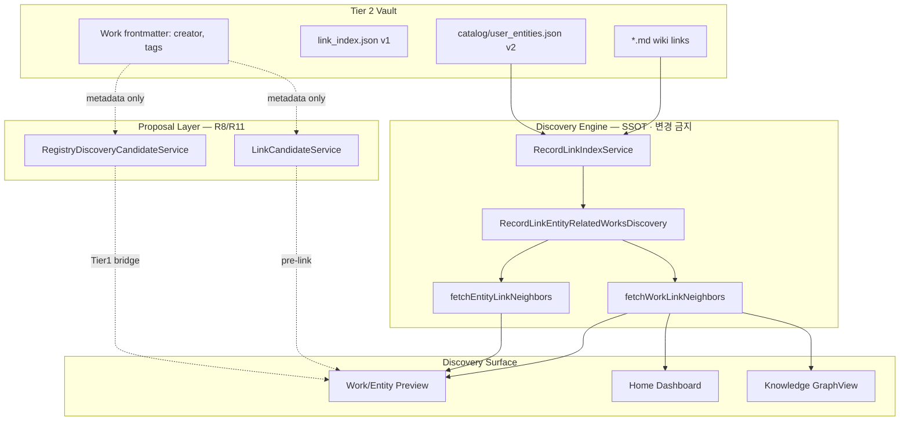
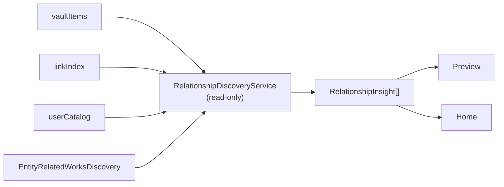

# R12 Relationship Discovery Audit + Design

> **일자:** 2026-06-22  
> **유형:** Level 3(관계 발견) 가능성 분석 + 설계안 (코드 수정 없음)  
> **선행:** [R9_DISCOVERY_ENGINE_AUDIT.md](./R9_DISCOVERY_ENGINE_AUDIT.md), [R10_PLACE_ORG_AUDIT.md](./R10_PLACE_ORG_AUDIT.md), [R11_REGISTRY_BRIDGE_AUDIT.md](./R11_REGISTRY_BRIDGE_AUDIT.md), [R6_DISCOVERY_AUDIT.md](./R6_DISCOVERY_AUDIT.md)  
> **SSOT:** [PROJECT_CONSTITUTION.md](../active/PROJECT_CONSTITUTION.md), [CURRENT_STATE.md](../active/CURRENT_STATE.md)

**방법:** R8–R11 Foundation 위 코드 사실만 인용 · 이번 Sprint는 **Audit + Design만** 수행.

**금지 (이번 Sprint):** Discovery Engine · Link Index Schema · Search Index · Registry 구조 · Collection Pipeline **수정 없음**.

---

## Executive Summary

R11까지 AKASHA Discovery는 **Level 0–2**(기록 → 직접 연결 → 2홉 이웃)를 갖추었다. Engine 천장은 여전히 **Work↔Entity↔Work 2홉**이며, R8 Proposal(`LinkCandidateService`)·R11 Bridge(`RegistryDiscoveryCandidateService`)는 **링크/아카이브 전 제안** 레이다.

**Level 3(관계 발견)** 은 「A와 C가 **왜** 연결되는가」「볼트 안에 **어떤 패턴**이 반복되는가」를 답한다. 코드상 **관계 타입을 명시적으로 계산·표시하는 레이어는 없다**. 다만 Link Index + `user_entities.json` + Work frontmatter metadata를 **런타임 집계**하면, Engine semantics를 바꾸지 않고도 **상당 부분의 Level 3**을 **Analysis/Relationship Proposal 레이어**로 구현할 수 있다.

| 판정 | 요약 |
|------|------|
| **Q1 공유 관계** | 링크 그래프에 **원시 데이터 존재** · Person/Event/Concept/Place/Org **교집합 계산 가능** · UI·서비스 **미구현** |
| **Q2 Entity↔Entity** | 공유 Work 경유 **데이터로 계산 가능** · `fetchEntityLinkNeighbors` **미노출** |
| **Q3 Theme/Cluster** | Concept Entity·Work `tags`로 **집계 가능** · 「3작품 이상」클러스터 **미구현** |
| **Q4 Serendipity** | 태그·creator·공유 Entity·heuristic·Proposal 레이어에 **신호 분산** · 통합 surfacing 없음 |
| **Q5 Level 3** | **~70% Surface/Analysis 레이어**로 가능 · **다중홉·영속 관계 인덱스**는 Engine 확장 필요 |

---

## 0. 조사 대상 코드 맵 (R11 반영)



| 대상 | 파일 | R12에서의 역할 |
|------|------|----------------|
| Discovery Engine | `entity_related_works_discovery.dart` | Entity↔Work 집합 SSOT · **홉 전파 없음** |
| Work neighbors | `work_link_neighbors.dart` | 1–2홉 UI 버킷 · R10 place/org 포함 |
| Entity neighbors | `entity_link_neighbors.dart` | journal outgoing 1홉만 |
| Entity proposal | `link_candidate_service.dart` | creator/tag/seed · **Entity 링크 제안** |
| Registry bridge | `registry_discovery_candidate_service.dart` | creator/tag/entity → **Registry Work** |
| Link Index | `record_link_index_service.dart` | `outgoing` + `incoming` schema v1 |
| User catalog | `user_catalog_store.dart` | `user_entities.json` v2 — Fusion·wiki resolve |
| Person heuristic | `work_related_characters.dart` | Work.tags ↔ catalog Person **점수** (링크 없음) |

---

## 1. 현재 Discovery Graph Capability 표

### 1.1 관계 유형별 계산·노출 현황

| 관계 유형 | Link Index 데이터 | 런타임 계산 가능 | 현재 UI 노출 | Level |
|-----------|:-----------------:|:----------------:|:------------:|:-----:|
| Work ↔ Entity (직접) | ✅ incoming/outgoing | ✅ `entityIdsForWork` | ✅ Preview/Graph/Workbench | 1 |
| Work ↔ Work (직접 `[[wk_]]`) | ✅ outgoing | ✅ score +3 | ✅ `connectedWorks` | 1 |
| Work → Entity → Work | ✅ 2× discover | ✅ score +1/entity | ✅ `connectedWorks` (cap 4) | 2 |
| **공유 Person** | ✅ 각 Work의 incoming | ✅ `ids(A) ∩ ids(B)` | ❌ 교집합 미표시 | **3 후보** |
| **공유 Event** | ✅ | ✅ 교집합 | ⚠️ 각 Work에 개별 표시만 | **3 후보** |
| **공유 Concept** | ✅ | ✅ 교집합 | ⚠️ 동일 + `work.tags` 별도 | **3 후보** |
| **공유 Place** | ✅ (R10) | ✅ 교집합 | ⚠️ 개별 섹션만 | **3 후보** |
| **공유 Organization** | ✅ (R10) | ✅ 교집합 | ⚠️ 개별 섹션만 | **3 후보** |
| Entity ↔ Entity (journal) | ✅ entity journal outgoing | ✅ 1홉 | ✅ Entity Preview outgoing | 1 |
| **Entity ↔ Entity (공유 Work)** | ✅ | ✅ discover 교차 | ❌ | **3 후보** |
| **Entity ↔ Entity (공유 journal target)** | ✅ | ⚠️ 수동 2-query | ❌ | **3 후보** |
| Work 공통 `creator` | ❌ Index 외 | ✅ `vaultItems` 스캔 | ⚠️ Registry Bridge만 (R11) | **3 후보** |
| Work 공통 `tags` | ❌ Index 외 | ✅ metadata 스캔 | ⚠️ Proposal/heuristic만 | **3 후보** |
| Concept Entity ≥3 Work | ✅ incoming count | ✅ `incomingRecordPaths` 집계 | ❌ | **3 후보** |
| Person tag heuristic | ❌ | ✅ `relatedCharactersForWork` | ⚠️ 링크와 **혼재** 표시 | 2 약한신호 |
| Registry creator bridge | ❌ graph | ✅ `WorksRegistry.search` | ✅ R11 Preview/Home | Bridge |
| 3홉+ (A→B→C→D) | — | ❌ BFS 없음 | ❌ | 4 |

### 1.2 Discovery Level 재평가 (R8–R11 반영)

| Level | 정의 | 상태 | R11까지 변화 |
|:-----:|------|:----:|-------------|
| **0** | 기록 | ✅ | Registry Preview·Archive CTA |
| **1** | 직접 연결 | ✅ | Place/Org 파이프라인 완결 (R10) |
| **2** | 이웃 발견 | ⚠️ | 2홉 Work · Proposal · Home 하이라이트 · Registry Bridge |
| **3** | **관계 발견** | ❌ | **본 문서 주제** — 데이터는 부분 존재 |
| **4** | 예상 밖 발견 | ❌ | 다중홉 proactive · embedding 없음 |

### 1.3 Preview / Home Surface 역량 (R12 기준)

| Surface | Level 1–2 | Level 3 잠재 | 비고 |
|---------|:---------:|:------------:|------|
| **Work Preview** | neighbors + LinkCandidate + Registry Bridge | 공유 Entity·테마 섹션 추가 가능 | `dashboard_preview_panel.dart` |
| **Entity Preview** | neighbors + Registry Bridge | co-linked Entity·테마 허브 가능 | `entity_dashboard_preview_panel.dart` |
| **Home 오늘의 연결** | 링크 밀도·entity 하이라이트 | 「반복 주제」카드 추가 가능 | `home_dashboard_todays_links_section.dart` |
| **Home 사전에서 발견** | Registry Bridge | Tier1 관계 아님 | R11 |
| **Knowledge Graph** | Work 타일·neighbors | 전역 패턴 뷰 없음 | 리스트형 |
| **최근 발견** | — | — | `addedAt` 정렬 · **그래프 무관** |

---

## 2. Audit 질문 답변

### Q1. 현재 그래프에서 계산 가능한 관계는 무엇인가?

**Engine이 직접 「관계 객체」를 반환하지는 않는다.** 아래는 **기존 API 조합으로 런타임에 도출 가능한** 관계다.

#### 2.1 링크 증명 관계 (강한 신호 — Level 3 핵심)

| 관계 | 계산 방법 | 코드 근거 |
|------|-----------|-----------|
| **공유 Person** | `entityIdsForWork(A) ∩ entityIdsForWork(B)` → type=person | `entity_related_works_discovery.dart` L100–124 |
| **공유 Event** | 동일 · type=event | `work_link_neighbors.dart` L63–82 |
| **공유 Concept** | 동일 · type=concept | 동일 |
| **공유 Place** | 동일 · type=place | R10 · `entity_id_codec.dart` `pl_` |
| **공유 Organization** | 동일 · type=organization | R10 · `or_` |
| **N작품이 동일 Entity 링크** | Concept C에 대해 `len(incomingRecordPaths(C)) ≥ N` | `record_link_index_service.dart` L142–144 |

**예시 (공유 인물):**

```text
Work A ──[[pe_x]]──► Person P ◄──[[pe_x]]── Work B
⇒ 관계: (A, B) shared_entity(P, person)  — 데이터 있음 · UI 없음
```

#### 2.2 구조적 2홉 (이미 Level 2로 노출)

| 관계 | 상태 |
|------|------|
| Work A · B가 동일 Entity 집합을 **공유** | `connectedWorks`에 B 표시 — **「공유 이유」라벨 없음** |
| Work A가 Entity E를 통해 C 발견 | score +1 — **어떤 E인지 UI 미표시** |

#### 2.3 메타데이터 관계 (약한 신호 — 링크 증명 없음)

| 관계 | 계산 | Index 포함 |
|------|------|:----------:|
| 동일 `creator` 문자열 | `vaultItems` 그룹핑 | ❌ |
| 동일 `tags[]` 문자열 | Work frontmatter 교집합 | ❌ |
| Person tag heuristic | `relatedCharactersForWork` | ❌ |

**판정:** Q1의 5대 공유 타입(Person/Event/Concept/Place/Org)은 **링크가 존재하면 전부 계산 가능**하다. 다만 **「관계」로 이름 붙여 surfacing하는 코드는 없다**.

---

### Q2. Entity ↔ Entity 발견은 가능한가?

#### 2.1 Person A ↔ Work X ↔ Person B (공유 Work)

**데이터: 가능 · 구현: 없음**

```text
discover(personA).workIds → { X, ... }
entityIdsForWork(X) → { personA, personB, ... }
personB ≠ personA → co-appearance on Work X
```

- `EntityRelatedWorksDiscovery.discover`는 Work id **Set**만 반환 (`entity_related_works.dart` L1–12).
- `fetchEntityLinkNeighbors`는 **focal entity journal의 outgoing**만 순회 (`entity_link_neighbors.dart` L74–114) — **공유 Work에서 만난 다른 Entity 미수집**.

**결론:** 공유 Work 기반 Entity↔Entity는 **Engine 변경 없이 Analysis 레이어에서 계산 가능**. 현재 Preview에는 **불가능**.

#### 2.2 Entity journal 직접 링크 (Person A → Concept B)

| 경로 | 가능 여부 |
|------|-----------|
| A journal `[[co_y]]` | ✅ 1홉 · Entity Preview `concepts` |
| A journal `[[pe_b]]` | ✅ 1홉 · `persons` |
| A·B 둘 다 Work X에 링크, journal 상호 링크 없음 | ✅ 데이터 있음 · ❌ UI 없음 |

#### 2.3 user_entities.json 역할

`user_catalog_store.dart` — `{vault}/catalog/user_entities.json` schema v2:

- **역할:** entityId · entityType · title · aliases · **tags** — wiki `[[Title]]` resolve · Fusion merge
- **관계 저장:** ❌ — 엣지 목록 없음 · **Link Index가 엣지 SSOT**
- **Level 3 기여:** Entity 메타(태그·별칭)로 **테마 그룹핑 보조** 가능 · 그래프 엣지 아님

---

### Q3. Theme / Cluster 발견은 가능한가?

#### 3.1 Concept Entity 기반 클러스터 (강한 신호)

**「3개 이상의 Work가 동일 Concept를 링크」** — **계산 가능**

```text
∀ concept C: works(C) = { w | C ∈ entityIdsForWork(w) }
              ≡ incomingRecordPaths(C) → workId 역해석
if |works(C)| ≥ 3 → theme cluster "C를 공유하는 N작품"
```

- Link Index `incoming[conceptId]`가 이미 **역인덱스** 역할.
- Engine 변경 없이 **집계 쿼리**만 추가하면 됨 (새 Relationship Analysis 서비스).

#### 3.2 Work `tags` 기반 클러스터 (약한 신호)

- `AkashaItem.tags` — frontmatter · **Link Index 미포함** (R9 §3.1).
- `∀ tag t: works(t) = { w | t ∈ w.tags }` — `vaultItems` 전수 스캔으로 가능.
- Concept **Entity** 링크와 **문자열 tag**는 **다른 SSOT** — 혼동 주의 (`work.tags` vs linked Concept).

#### 3.3 현재 코드 판정

| 클러스터 유형 | 계산 | 구현 | UI |
|---------------|:----:|:----:|:--:|
| Shared Concept Entity (≥N Work) | ✅ | ❌ | ❌ |
| Shared Person Entity (≥N Work) | ✅ | ❌ | ❌ |
| Work tag string (≥N Work) | ✅ | ❌ | ❌ |
| creator filmography (vault 내) | ✅ | ❌ | ⚠️ R11 Registry만 |
| Franchise IP cluster | ⚠️ | ❌ neighbors | Fusion 힌트만 |

**결론:** **「반복되는 주제」는 Level 3의 핵심 후보**이며, Concept Entity incoming 집계가 **가장 신뢰도 높은 첫 구현**이다.

---

### Q4. Vault 내부 Serendipity(예상 밖 연결) 데이터는 무엇인가?

| 신호 | 위치 | 그래프 엣지 | 현재 소비 | Serendipity 잠재 |
|------|------|:-----------:|-----------|------------------|
| **공통 Entity** | Link Index | ✅ | 2홉 Work만 | **★★★** 공유 Entity 패널 |
| **공통 tags** | Work md YAML | ❌ | heuristic·Proposal | **★★☆** 태그 클러스터 |
| **공통 creator** | Work md / Registry | ❌ | R11 Bridge | **★★☆** 볼트 내 filmography |
| **공통 Place** | Link Index | ✅ | 개별 섹션 | **★★★** 장소 허브 |
| **공통 Organization** | Link Index | ✅ | 개별 섹션 | **★★☆** 제작사 클러스터 |
| Person tag overlap | catalog tags | ❌ | `relatedCharactersForWork` | **★☆☆** 링크와 구분 필요 |
| LinkCandidate | Proposal | ❌ | Preview CTA | 연결 **전** — L4 아님 |
| Same-day records | `addedAt` | ❌ | Workbench | 시간 축 · 그래프 아님 |

**Serendipity 정의 (R12):** 사용자가 **직접 링크하지 않았으나** 볼트 전체 패턴에서 **「이 둘은 같은 맥락」**임이 드러나는 경우.

- **가장 강한 Vault Serendipity:** Work A·B가 **같은 Concept/Place/Person을 각각 링크**했지만 서로 Work 링크 없음 → 현재 **connectedWorks에도 안 뜸** (공유 Entity가 다르면) · **교집합 분석 시 발견 가능**.
- **약한 Serendipity:** 동일 tag/creator만 공유 · 링크 증명 없음 → **별도 라벨** 필요.

---

### Q5. Level 3 구현 시 — Engine 변경 없이 vs Engine 확장

#### 5.1 Engine 변경 **없이** 가능한 범위 (권장 1차)

| Capability | 구현 방식 | 건드리는 레이어 |
|------------|-----------|----------------|
| 공유 Entity 관계 (5 types) | vault Work 전수 `entityIdsForWork` → inverted index | **신규 Analysis Service** |
| Entity↔Entity via shared Work | `discover(A)` × `entityIdsForWork` 교차 | Analysis + Surface |
| Concept/Person **theme cluster** (≥N) | `incomingRecordPaths` 집계 | Analysis + Home/Preview |
| Work tag / creator cluster | `vaultItems` 스캔 | Analysis (약한 신호) |
| 「A와 C는 **P** 때문에 연결됨」 라벨 | 2홉 score에 **bridge entity** 메타 | `fetchWorkLinkNeighbors` **어댑터** 확장 (semantics 불변) |
| 관계 섹션 UI | Preview · Entity Preview · Home | Surface only |

**조건:** `EntityRelatedWorksDiscovery` · `RecordLinkIndexService` · `link_index.json` schema **시그니처·의미 불변**. R8/R11과 동일한 **Proposal/Analysis 레이어** 패턴.

#### 5.2 Engine **확장이 필요한** 범위

| Capability | 이유 |
|------------|------|
| **3홉+ 자동 전파** (A→B→C→D) | `discover`가 1회 조회·홉 전파 없음 (R9 §2.4) |
| **영속 관계 인덱스** (`relationship_index.json`) | 매 Preview 전수 스캔 비용 · 증분 갱신 SSOT |
| **Entity↔Entity 엣지 SSOT** | 현재 Link Index는 record-path 중심 · entity–entity 직접 엣지 모델 없음 |
| **의미 유사도 / embedding** | 텍스트·벡터 기반 L4 |
| **Registry Work를 그래프 노드로** | vault md 없이는 Index 미스캔 — R11 Bridge로 우회 |
| **실시간 클러스터 invalidation** | 대규모 볼트에서 index rebuild 외 **관계 캐시** 필요 시 |

#### 5.3 경계 요약

```text
┌─────────────────────────────────────────────────────────┐
│  Level 3 Phase A (Engine-safe)                          │
│  RelationshipDiscoveryService — read-only 집계            │
│  · shared entity · theme cluster · co-linked entities   │
│  · 기존 DISC + linkIndex + vaultItems + userCatalog     │
└─────────────────────────────────────────────────────────┘
                          │
                          ▼ (볼트 규모·latency 한계 시)
┌─────────────────────────────────────────────────────────┐
│  Level 3 Phase B (Engine extension)                     │
│  · materialized co-occurrence on rebuildIndex           │
│  · optional hop-limited BFS API on DISC                 │
│  · (Schema v2 — 별도 ADR 필요)                          │
└─────────────────────────────────────────────────────────┘
```

---

## 3. Level 3 Relationship Discovery 설계안

### 3.1 설계 원칙

1. **Engine SSOT 불변** — `discover` / `entityIdsForWork` 의미 유지.
2. **링크 증명 vs 약한 신호 분리** — UI에 `linked` / `inferred` 배지.
3. **R8/R11 패턴 계승** — `RelationshipDiscoveryService` = read-only Analysis.
4. **점진적 노출** — Preview 1섹션 → Home 카드 → Graph 요약.

### 3.2 신규 레이어: `RelationshipDiscoveryService` (제안)



#### 3.2.1 핵심 타입 (제안)

```dart
enum RelationshipKind {
  sharedEntity,      // ≥2 Work · 동일 Entity 링크
  coLinkedEntity,    // Entity A·B · 동일 Work 출현
  themeCluster,      // ≥N Work · 동일 Concept Entity
  creatorCluster,    // ≥N Work · 동일 creator (vault)
  tagCluster,        // ≥N Work · 동일 tag (weak)
}

class RelationshipInsight {
  final RelationshipKind kind;
  final String label;           // "미야자키 히로아키" / "성장"
  final List<String> workIds;
  final List<String> entityIds; // sharedEntity 시
  final int strength;           // 링크 수 · 공출현 수
  final bool linkProven;        // true = wiki 링크 증명
}
```

#### 3.2.2 API (제안)

| API | 입력 | 출력 | Level |
|-----|------|------|:-----:|
| `sharedEntitiesForWork(workId)` | work + vault | 다른 Work와 공유하는 Entity 목록 | 3 |
| `coEntitiesForEntity(entityId)` | entity | 같은 Work에 링크된 다른 Entity | 3 |
| `themeClusters(vault, minWorks: 3)` | vault | Concept Entity별 ≥N Work | 3 |
| `bridgeEntities(workA, workB)` | A, B | A–B connectedWorks의 **공유 Entity** (2홉 설명) | 3 |
| `insightsForWork(workId)` | work | 위 조합 · Preview용 top-K | 3 |

**구현 메모:** `themeClusters`는 `incomingEntityIds()` 순회 + `incomingRecordPaths` count로 **O(entities × paths)** — 소규모 볼트에서 충분.

### 3.3 Surface 설계 (Engine-safe)

#### P0 — Work Preview 「이 작품의 관계」

| 블록 | 내용 | 예시 |
|------|------|------|
| **공유 맥락** | `bridgeEntities(current, connectedWork)` | 「인터스텔라 ↔ メメント: Christopher Nolan(인물)」 |
| **같은 주제** | `sharedEntitiesForWork` 중 Concept | 「3작품이 '우주' 개념 공유」 |

위치: `connectedWorks` 아래 · Registry Bridge 위.

#### P1 — Entity Preview 「함께 등장하는 인물/개념」

- `coEntitiesForEntity` — Person Preview에서 **같은 Work에 연결된 다른 Person**.
- Concept Entity Preview: `themeClusters`에서 해당 Concept의 Work 수 배지.

#### P2 — Home 「반복되는 주제」

- `themeClusters(minWorks: 3)` top 1–2 · 카드 탭 → 대표 Work Preview.
- 기존 「오늘의 연결」(Level 2)과 **섹션 분리**.

#### P3 — Graph 관계 요약 (선택)

- Work 타일 subtitle: 「공유 개념 2 · 연결 작품 4」.
- 전역 패턴 뷰는 **별도 Sprint** (UI 무거움).

### 3.4 기존 레이어와의 관계

| 레이어 | Level | R12와의 관계 |
|--------|:-----:|-------------|
| Link Index + DISC | 1–2 | **읽기 전용** 입력 |
| `fetchWorkLinkNeighbors` | 2 | bridge entity 라벨 **어댑터** 확장 가능 |
| `LinkCandidateService` | pre-1 | 관계 아님 · 연결 **제안** |
| `RegistryDiscoveryCandidateService` | Bridge | Tier1 · Vault **내부** 관계 아님 |
| `CollectibleCollectionPipeline` | filter | `relatedWorkId` = 링크 증명 필터 · **insight 아님** |

### 3.5 비범위 (R12 설계)

- Link Index schema v2 · Search Index 변경
- Collection Pipeline 동작 변경
- 3홉+ Engine BFS
- ML / embedding Serendipity (Level 4)
- Registry Work 그래프 노드화 (R11으로 충분)

---

## 4. ROI 기준 우선순위

| 순위 | Initiative | ROI | Effort | Engine | 근거 |
|:----:|------------|:---:|:------:|:------:|------|
| **1** | **Shared Entity bridge 라벨** (2홉 설명) | ★★★★★ | S | ❌ | `connectedWorks` 이미 있음 · **왜 연결됐는지**만 추가 |
| **2** | **Concept theme cluster** (≥3 Work) | ★★★★☆ | M | ❌ | incoming 집계 · 헌법 「개념」축 · 링크 증명 |
| **3** | **coEntitiesForEntity** (공유 Work 출현) | ★★★★☆ | M | ❌ | Person↔Person · Entity 허브 UX |
| **4** | **sharedEntitiesForWork** 패널 | ★★★☆☆ | M | ❌ | Work Preview 관계 섹션 |
| **5** | Person/Place **≥N Work 허브** | ★★★☆☆ | M | ❌ | Concept와 동일 패턴 |
| **6** | Vault **creator cluster** | ★★☆☆☆ | S | ❌ | metadata · R11 Registry와 구분 라벨 |
| **7** | Work **tag cluster** | ★★☆☆☆ | M | ❌ | 약한 신호 · `inferred` 배지 필수 |
| **8** | Home 「반복되는 주제」섹션 | ★★★★☆ | M | ❌ | #2+#5 Surface |
| **9** | Heuristic Person **링크 분리** 표시 | ★★★☆☆ | S | ❌ | R9 기존 부채 · L3 신뢰도 |
| **10** | Materialized co-occurrence cache | ★★☆☆☆ | L | ✅ | 대형 볼트 latency |
| **11** | 3홉 BFS API | ★☆☆☆☆ | L | ✅ | Level 4에 가까움 |

**권장 Sprint 순서:** R13 **#1 bridge 라벨** → R14 **#2 Concept cluster** → R15 **#3 Entity co-appearance** → R16 Home 통합.

---

## 5. Engine 변경 필요 여부 — 최종 판정

| Level 3 기능 | Phase A (Engine-safe) | Phase B (Engine 확장) |
|--------------|:---------------------:|:-----------------------:|
| 공유 Entity 5종 | ✅ | — |
| Entity↔Entity 공유 Work | ✅ | — |
| Concept/Person theme ≥N | ✅ | ⚠️ 대규모 시 캐시 |
| 2홉 bridge 설명 | ✅ | — |
| tag/creator cluster | ✅ (weak) | — |
| 3홉+ surfacing | ❌ | ✅ BFS on DISC |
| 영속 관계 SSOT | ❌ | ✅ index extension |
| Level 4 Serendipity | ❌ | ✅ embedding / hop |

**Executive 결론:** AKASHA는 **Level 3의 대부분을 Engine semantics 변경 없이** 구현할 수 있다. 병목은 Engine이 아니라 **「관계를 집계·이름 붙이·Surface에 올리는 Analysis 레이어 부재」**이다. Engine 확장은 **볼트 규모·3홉+·Level 4** 단계에서 검토한다.

---

## 6. 성공 기준 (R13+ 구현 시 참고)

| 시나리오 | 기대 UX |
|----------|---------|
| A·B가 Concept 「성장」공유 | Home 또는 Preview에 **「3작품이 '성장' 개념 공유」** |
| A Preview에서 C (connectedWork) | **「Person P 때문에 연결」** bridge 라벨 |
| Person X Preview | **「같은 작품에 연결된 인물」** Y, Z |
| tag만 겹침 · 링크 없음 | **「추정」** 배지 · LinkCandidate와 구분 |

---

## 7. 참고 인용

| 주장 | 파일·위치 |
|------|-----------|
| Engine 2홉 천장 | R9 §2.5 · `work_link_neighbors.dart` L111–118 |
| Entity↔Entity 공유 Work 미구현 | R9 §2.2 · `entity_link_neighbors.dart` L74–114 |
| Link Index schema v1 | `record_link_index_service.dart` L24–26, L174–178 |
| user_entities.json v2 | `user_catalog_store.dart` L16–22 |
| EntityRelatedWorks 런타임 파생 | `entity_related_works.dart` L1 |
| Place/Org neighbors (R10) | `work_link_neighbors.dart` L74–79 |
| Registry Bridge (R11) | `registry_discovery_candidate_service.dart` |
| Collection = filter not insight | `collectible_collection_pipeline.dart` L9 |

---

*R12 Sprint: Audit + Design 완료 · 구현 없음*
