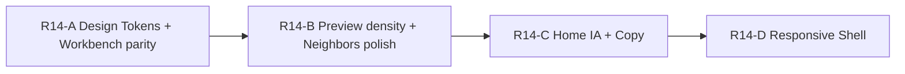

# R14 UI/UX Audit

> **일자:** 2026-06-22  
> **유형:** 코드 기준 전면 UI/UX 감사 (코드 수정 없음)  
> **선행:** R3~R5 UX 루프, R6~R11 Discovery Foundation, R12~R13 Relationship Discovery(Level 3)  
> **전제:** Discovery 기능은 충분히 구현되었다. 이후 Sprint는 **Engine/Index/Schema 변경 없이 Surface·UX 개선**에 집중한다.

**금지 (이번 Sprint):** Discovery Engine · Link Index · Search Index · Registry 구조 · Preview Stack / Save Return 정책 · Schema 변경.

**방법:** `lib/` 전역 위젯·레이아웃·스타일·네비게이션 코드를 읽고, 사용자 관점 5가지 질문에 답한다.

---

## Executive Summary

AKASHA는 **다크 프리미엄 톤**과 **탐험 중심 IA**(홈 피드 → 우측 프리뷰 → 워크벤치 기록)의 골격이 갖춰져 있다. R13까지 연결 브리지 라벨·Theme Cluster 등 **Discovery Surface**는 풍부해졌으나, **시각·정보·반응형 레이어는 데스크톱 멀티열 가정**에 머물러 있다.

| 평가 축 | 점수 | 한 줄 판정 |
|---------|------|-----------|
| **보기 좋은가** | **6 / 10** | accent·blur pill nav는 현대적이나, surface hex·grey 스케일이 화면마다 달라 「한 제품」감이 약함 |
| **정보 구조가 명확한가** | **5 / 10** | 홈 섹션·탭·사이드바 진입이 겹치고, 카피·데이터 의미가 불일치하는 구간이 있음 |
| **시각적으로 현대적인가** | **6 / 10** | M3 + glass bottom nav는 좋으나 타이포·radius·spacing 토큰화 부재로 「조립 UI」 인상 |
| **정보 밀도가 적절한가** | **5 / 10** | Preview 320px에 연결·제안·Registry·클러스터가 층층이 쌓임; Graph 펼침 시 빈 CTA 6개 반복 |
| **탐험 경험이 자연스러운가** | **7 / 10** | Preview stack·연결 탐색 루프는 잘 설계됐으나, Workbench 진입 시 컨텍스트 소실·모바일 폭에서 끊김 |

**종합:** Discovery **기능**은 R13까지 성숙했으나, **표현·일관성·적응형 레이아웃**이 병목이다. R14+는 Engine이 아닌 **Design System 정리 + IA 정돈 + Responsive Shell** 순으로 ROI가 높다.

---

## 0. 조사 대상 코드 맵

```mermaid
flowchart LR
  subgraph shell [Home Shell]
    SB[DashboardSidebar 260px]
    MAIN[Browse / Dashboard / Graph]
    WB[WorkbenchShell]
    PREV[Preview Panel 320px]
    BTM[Bottom Nav 5탭]
  end

  subgraph surfaces [주요 Surface]
    HOME[HomeDashboardView]
    PVW[DashboardPreviewPanel]
    EPV[EntityDashboardPreviewPanel]
    WDF[WorkDetailInfoForm]
    EDF[EntityDetailInfoPanel]
    KGV[KnowledgeGraphView]
  end

  subgraph tokens [Design Tokens]
    AC[AkashaColors]
    AT[AkashaTheme.dark]
    HDS[HomeDashboardStyles]
  end

  SB --> MAIN
  MAIN --> HOME
  MAIN --> KGV
  MAIN --> WB
  PREV --> PVW
  PREV --> EPV
  WB --> WDF
  WB --> EDF
  AC -.-> surfaces
  AT -.-> main.dart only
```

| 영역 | 핵심 파일 |
|------|-----------|
| Shell | `home_shell.dart`, `home_shell_scaffold.dart`, `home_shell_body.dart`, `home_shell_controller.dart` |
| Home | `home_dashboard/home_dashboard_view.dart`, `home_dashboard_*_section.dart` |
| Preview | `dashboard_preview_panel.dart`, `entity_dashboard_preview_panel.dart`, `preview_panel_chrome.dart` |
| Workbench | `workbench_shell.dart`, `work_detail_info_form.dart`, `entity_detail_info_panel.dart` |
| Graph | `knowledge_graph_view.dart`, `work_link_neighbors_sections.dart` |
| Sidebar | `dashboard_sidebar.dart`, `home_sidebar_preferences.dart` |
| Navigation | `home_navigation_coordinator.dart`, `home_shell_scaffold.dart` (bottom nav) |
| Tokens | `akasha_colors.dart`, `akasha_theme.dart`, `home_dashboard_styles.dart` |

---

## 1. Home

### 1.1 정보 구조 (IA)

**실제 렌더 순서** (`home_dashboard_view.dart`):

1. Hero — 「탐험 시작하기」
2. TopBar — 검색 · 설정 · 아바타
3. 계속 탐험하기
4. 오늘의 연결
5. 반복되는 주제 (데이터 있을 때만)
6. 사전에서 발견 (콜백 있을 때만)
7. 최근 발견
8. 최근 기록

주석은 「4섹션 IA (P5)」이나 **실구현은 6~8섹션** — 문서·코드 불일치.

**긍정**

- 탐험 허브로서 Hero → 개인화(Continue) → Discovery(오늘의 연결·주제) → 히스토리(최근) 흐름이 논리적.
- `AkashaColors.background` 페이지 배경, `HomeDashboardStyles.sectionHeader`로 섹션 제목 일부 통일.
- 콜드 스타트 시 Continue가 vault 최신 4건 fallback (`home_dashboard_continue_section.dart`).

**문제**

| 이슈 | 코드 근거 | UX 영향 |
|------|-----------|---------|
| **섹션 의미 중복** | Continue vs 「최근 발견」 모두 카드 4열·포스터 UI; Continue는 `recentExploreItems`, 최근 발견은 `addedAt` 정렬 vault | 「최근에 본 것」과 「최근 추가」 구분이 사용자에게 안 보임 |
| **카피·데이터 불일치** | 「오늘의 연결」 — 시간 기반이 아닌 링크 후보·연결 수 기반 | 신뢰도 하락 |
| **검색 CTA 중복** | Hero Primary + TopBar 검색 = 동일 `onSearch` | 시각적 중복, Hero 가치 희석 |
| **조건부 섹션 점프** | Theme/Registry `FutureBuilder` 로딩 중 `SizedBox.shrink()` | 레이아웃 점프, 로딩 피드백 없음 |
| **고정 패딩 32px** | `EdgeInsets.all(32)` | 좁은 화면에서 콘텐츠 폭 과도 축소 |
| **홈 AppBar 없음** | `home_shell_scaffold.dart` — `isHomeDashboardMode`일 때 AppBar null | 동기화·클립보드·사이드바 햄버거 접근 불가 (Tab 키만) |

### 1.2 시각·밀도

- 섹션 제목 15px bold white, Hero 22px, 보조 11~12px grey — **타이포 스케일이 파일별 분산**.
- Continue 카드 145×180, 최근 발견 200×120 — **카드 규격 이원화**.
- 선택 상태: Continue accent border **2px**, 최근 발견 **1.5px** — 미세 불일치.
- Registry bridge `#141A28` 하드코딩 — `AkashaColors.surface`와 근접하나 토큰 외.

### 1.3 Home 평가

| 질문 | 판정 |
|------|------|
| 보기 좋은가 | 카드·가로 스크롤 리듬은 좋으나 섹션 많고 스타일 미세 차이 |
| 정보 구조 | Discovery 신호는 풍부하나 섹션 역할 경계 모호 |
| 현대적 | blur·accent gradient와 어울리나 spacing/token 미정리 |
| 정보 밀도 | 세로 스크롤 피드 — 적당하나 중복 섹션으로 체감 밀도 ↑ |
| 탐험 | 카드 탭 → Preview 연결은 자연스러움 |

---

## 2. Preview (Work · Entity)

### 2.1 공통 Chrome (`preview_panel_chrome.dart`)

```
[type 배지 9px]                    [닫기]
「지금 보는 항목」9px
제목 15px bold (max 2 lines)
[이전]  [기록하기 Filled accent]
─────────────────
body (scroll)
```

- 고정 **width 320px**, `AkashaColors.surface`, 좌측 border white 8%.
- Preview stack: hub에서 replace, linked에서 push (`home_shell_controller.dart`).
- Workbench detail 열리면 Preview **즉시 숨김** (`home_shell_body.dart` 458행) — Save Return 정책상 의도적이나 탐색 컨텍스트 단절 체감.

### 2.2 Work Preview (`dashboard_preview_panel.dart`)

**본문 순서:** 포스터 140×200 → 메타 → Registry-only 배너 → 「연결」 → 이웃 섹션 또는 빈 연결 CTA → 다음 연결 제안 → Registry 추천 → (플래그) 연결 목록 버튼.

**R13 이후:** `connectedWorkBridgeLabels`로 「Christopher Nolan 때문에 연결」 등 표시 — **Level 3 UX 핵심 가치가 이 패널에 집중**.

**문제**

| 이슈 | 영향 |
|------|------|
| 320px에 연결 6섹션 + 클러스터 + 제안 + Registry | 스크롤 깊이 과다, 「한눈에」 파악 어려움 |
| Work 포스터 140×200 vs Entity 아바타 96×96 | 동일 Chrome 내 비대칭 |
| 「연결」11px grey vs 이웃 서브제목 13px white | 같은 블록 내 계층 이중화 |
| `Icons.list_alt_outlined` + 「연결 목록에서 보기」 | Graph 뷰 실체(아코디언 리스트)와 아이콘·기대 불일치 |
| Entity 대비 Work만 `WorkPreviewEmptyConnections` 풍부 CTA | Entity 프리뷰 온보딩 약함 |

### 2.3 Entity Preview (`entity_dashboard_preview_panel.dart`)

- 연결 섹션은 `EntityLinkNeighborsSections` — 섹션별 짧은 empty CTA만.
- Theme Cluster·Bridge label 없음 (Entity↔Work 맥락이므로 설계상 타당하나, 빈 상태 UX 격차).

### 2.4 Preview 평가

| 질문 | 판정 |
|------|------|
| 보기 좋은가 | Chrome은 깔끔; 본문 정보 층이 많아 다소 빽빽 |
| 정보 구조 | 연결 우선 IA는 R6~R13과 정합; 부가 섹션 우선순위 시각화 부족 |
| 현대적 | accent CTA·칩은 무난 |
| 정보 밀도 | **가장 과밀** — R14+ 1순위 완화 후보 |
| 탐험 | stack·linked preview는 우수; Workbench 진입 시 패널 소실 |

---

## 3. Workbench (Work)

### 3.1 레이아웃

```
[Tab rail 52~320px] | [Info panel ~220–400px] | [Sanctum]
```

- 배경: info `#1A1A28`, Sanctum `#12121A`, tab rail `#181824` — **`AkashaColors` 외 별도 팔레트**.
- `WorkDetailInfoForm` IA (**연결 우선**): 포스터 → 제목 `TextField` → 연결(`WorkLinkNeighborsSections`) → 연결 목록 CTA → 노트 → 메타데이터(접힘).

### 3.2 긍정

- 연결·기록(Sanctum) 분리가 AKASHA 철학과 일치.
- `sectionTitleStyle` accent 11px bold로 연결 섹션 강조.
- 자동저장 + `WorkbenchSaveStatusHint` — 상태 피드백 존재.

### 3.3 문제

| 이슈 | 코드·영향 |
|------|-----------|
| **메타데이터 읽기 전용** | `draftRating`/`draftWorkStatus` 콜백 있으나 UI 테이블은 읽기만 — 편집 기대와 불일치 |
| **제작사 `'정보 없음'` 하드코딩** | unfinished 느낌 |
| **저장·서재·삭제가 접힌 ExpansionTile 안** | 발견성 낮음 |
| **제목 fontWeight w900** | 10~13px UI 대비 과함 |
| **`Colors.tealAccent`** | incoming record 헤더 — `personAccent` 토큰 미사용 |
| **볼트 미연동 `amber[700]`** | 토큰 외 경고색 |

### 3.4 Workbench (Work) 평가

기능 밀도는 높고 전문 사용자에게 유리하나, **일상 탐험 사용자**에게는 패널이 「설정 화면」처럼 느껴질 수 있다.

---

## 4. Entity Workbench

### 4.1 Work와의 비대칭

| 항목 | Work | Entity |
|------|------|--------|
| 패널 배경 | `#1A1A28` | `#1A1A26` |
| 패딩 | 8px | **16px** |
| 제목 | 16px **editable** `TextField` | 17px **static** `Text` |
| 저장 버튼 | 10px compact row | **18px** `FilledButton.icon` |
| 액션 배치 | 메타데이터 접힘 안 | **항상 하단 노출** |
| 포스터 | 높이 ~30% 비율 | maxHeight **180px** 고정 |
| 연결 섹션 | 주제 클러스터 포함 | 클러스터 없음 |

- `_IncomingLinksSection`, `_SameDaySection`이 work/entity 패널에 **거의 동일 복제**.
- 빈 연결 CTA: 「본문에서 링크 추가하기」 vs 「기록에서 [[링크]] 추가하기」 — 카피 불일치.

### 4.2 Entity Workbench 평가

동일 「Workbench」 맥락에서 **두 collectible 타입이 다른 제품**처럼 느껴진다. R14+에서 **패널 토큰·패딩·액션 행 통일**이 최우선 UX 부채.

---

## 5. Graph (연결 목록)

### 5.1 실체

`KnowledgeGraphView` — 주석: 「v1.1 리스트형」. **노드 그래프가 아닌 ExpansionTile 리스트.**

```
헤더 (연결 목록)
[전체 빈 배너]
작품별 타일 (연결 N개 / 없음)
  └─ 펼침 → WorkLinkNeighborsSections (lazy)
```

- 정렬: 연결 수 내림차순 → 제목 오름차순.
- `AkashaColors.background` + `surfaceCard()` — **토큰 사용 모범 사례**.

### 5.2 문제

| 이슈 | 영향 |
|------|------|
| **명칭 혼용** | Sidebar 「연결 목록」, 클래스 `KnowledgeGraphView`, 버튼 아이콘 list_alt | 기대(그래프) vs 실체(리스트) 괴리 |
| **섹션 스타일** | Graph 펼침: 기본 13px white; Workbench: 11px accent | 같은 `WorkLinkNeighborsSections`, 다른 기본값 |
| **`showEmptySections: true` 기본** | 펼친 작품마다 빈 CTA 최대 6개 — 노이즈 |
| **N+1 count 로드** | 작품 수만큼 `entityIdsForWork` 순회 | 대형 볼트에서 지연 |
| **「열기」+ 펼침 이중** | trailing TextButton과 ExpansionTile | 탐색 패턴 혼란 |

### 5.3 Graph 평가

Discovery 탐색 **기능**은 충실하나, **이름·밀도·빈 상태** 정리가 필요하다.

---

## 6. Sidebar

### 6.1 구조 (`dashboard_sidebar.dart`)

- `AnimatedContainer(width: isOpen ? 260 : 0)` — **Drawer 오버레이 없음**, Row 인라인.
- 기본 닫힘 (`home_sidebar_preferences.dart` `defaultOpen: false`).
- 「도구」: 연결 목록, 타임라인 (`FeatureFlags.showKnowledgeGraph`).
- 목록: 대시보드, 나의 서재, 컬렉션(최대 8).
- accent: dashboard `AkashaColors.accent`, personal `Colors.amberAccent` — **토큰 외**.

### 6.2 문제

- 좁은 화면: 260px가 main을 압박; **모바일 Drawer 패턴 없음**.
- 홈 모드 AppBar 없음 → **사이드바 시각 토글 없음** (Tab 키·접기 버튼만).
- Bottom nav와 **서재/컬렉션 이중 진입** — active ID 불일치 (항상 `libraries.first`).

---

## 7. Navigation

### 7.1 모델

- **단일 라우트:** `MaterialApp(home: HomeShell())` — URL·딥링크·OS back 복원 없음.
- 상태: `HomeNavigationCoordinator` 플래그 (`isHomeDashboardMode`, `isExploreBrowseMode`, `isKnowledgeGraphMode`, `SidebarSelectionMode`, filter…).
- **Bottom nav 5탭** (`home_shell_scaffold.dart`): 홈 · 탐색 · 검색(FAB) · 라이브러리 · 컬렉션 — **항상 표시**, `MediaQuery` 분기 없음.

### 7.2 Browse 라우팅 (`home_shell_body.dart`)

```
Timeline → RecordsView
CollectibleCollection → CatalogEntityBrowseView
PersonalLibrary → PersonalLibraryView
else → HomeDashboard | KnowledgeGraphView | BrowseView | entity strip
```

### 7.3 Navigation 문제

| 이슈 | 영향 |
|------|------|
| 모드 플래그 분산 | 디버깅·예측 어려움 |
| 하단탭 ↔ 사이드바 비동기 | 같은 개념, 다른 active 대상 |
| Records 이중 탭 | Sidebar 타임라인 + RecordsView 내부 3탭 |
| Tab 키 = 사이드바 토글 | 포커스 이동과 충돌 가능 |
| Preview stack + workbench | 강력하나 상태 머신이 사용자에게 보이지 않음 |

---

## 8. Mobile / Responsive

### 8.1 현황

| 레이어 | 적응 여부 |
|--------|-----------|
| **Shell** (sidebar, preview, bottom nav) | **고정 px, breakpoint 없음** |
| **Browse grid** | `LayoutBuilder` + `BrowseGridMetrics` — 열 2~8만 조절 |
| **홈 대시보드** | 고정 padding 32, 가로 카드 리스트 |
| **Workbench** | 리사이즈 패널만; 폭 좁을 때 collapse 없음 |

**`MediaQuery` 사용:** shell 수준 **없음**. `LayoutBuilder`는 browse grid·entity browse·포스터 등 **국소 7파일**에만 존재.

### 8.2 좁은 화면 시나리오 (~390px)

동시 노출 가능: Sidebar 260 + TabRail 52+ + Main + Preview 320 + Info 300 → **수평 오버플로·극단 압축**. Preview·Sidebar를 숨기는 반응형 로직 **없음**.

### 8.3 Responsive 평가

**데스크톱 멀티열 전용**으로 설계됨. 모바일·태블릿은 R14+ **Shell breakpoint** 없이는 실사용 어렵다.

---

## 9. 디자인 토큰 사용 현황

### 9.1 정의 (`akasha_colors.dart`, `akasha_theme.dart`)

**AkashaColors:** `background`, `surface`, `surfaceElevated`, `sidebar`, `border`, `accent`, 엔티티 accent(`personAccent` 등), `surfaceCard()`, `borderSubtle()`.

**AkashaTheme.dark():** M3 `ColorScheme`, `FilledButton`, `Chip`, `AppBar` — **`main.dart`에서만 적용**.

**HomeDashboardStyles:** 섹션 15px, `categoryColorFor()` — 홈 일부만.

### 9.2 사용 패턴

| 패턴 | 상태 |
|------|------|
| `AkashaColors.background/surface/accent` | 홈·그래프·프리뷰에서 사용 |
| `AkashaColors.personAccent` 등 | `HomeDashboardStyles`·Continue badge에만; **연결 섹션·칩에는 미적용** |
| `Colors.grey[400~600]` | sidebar, preview, filter, neighbors **광범위 인라인** |
| Workbench hex (`#1A1A28`, `#12121A`, `#252535`…) | 토큰과 **근사값 중복** |
| `Colors.tealAccent`, `amberAccent` | Workbench·Sidebar — 토큰 체계 밖 |
| Border radius | 4 / 6 / 8 / 10 / 12 / 30 혼재 — **radius 토큰 없음** |
| Typography | 8~22px 파일별 — **TextTheme scale 미활용** |
| Spacing | 6 / 8 / 12 / 14 / 16 / 24 / 28 / 32 혼재 — **spacing 토큰 없음** |

### 9.3 토큰 진단

`AkashaTheme`이 존재하나 **Surface 위젯 대부분이 Theme 위임 없이 인라인 `TextStyle`/`BoxDecoration`**. 결과적으로 accent 색은 통일되어도 **surface 계조·보조 텍스트·컴포넌트 크기**가 화면마다 다르다.

---

## 10. 횡단 이슈 (Cross-cutting)

### 10.1 Discovery 풍부 vs Surface 과밀

R11 Registry Bridge, R13 Bridge Label·Theme Cluster가 Home·Preview·Neighbors에 **동시 노출**된다. 기능은 강하지만 **같은 신호의 중복**(홈 주제 클러스터 ↔ 프리뷰 클러스터)과 **좁은 패널 과적재**가 UX 병목.

### 10.2 연결 섹션 공유 위젯의 스타일 분기

`WorkLinkNeighborsSections` / `EntityLinkNeighborsSections`가 Preview·Workbench·Graph에서 공유되나:

- `sectionTitleStyle` 기본값이 surface마다 다름 (13px white vs 11px accent).
- Graph는 `showEmptySections: true`로 빈 CTA 최대 노출.

→ **한 컴포넌트, 세 가지 성격**.

### 10.3 카피·IA 신뢰

| UI 라벨 | 실제 데이터 |
|---------|-------------|
| 「최근 발견」 | `addedAt` 정렬 |
| 「오늘의 연결」 | 링크 후보 휴리스틱 |
| 「연결 목록」/ KnowledgeGraph | 아코디언 리스트 |
| 「4섹션 IA」 주석 | 6~8 섹션 |

### 10.4 Work / Entity 대칭성

Preview·Workbench 모두에서 Entity가 Work보다 **온보딩·편집·시각**이 열세. AKASHA가 「기록 → 연결」을 강조할수록 Entity Workbench 정돈이 중요해진다.

---

## 11. 5가지 질문 종합 평가

### Q1. 사용자가 실제로 보기 좋은가?

**부분적 Yes.** 다크 배경·보라 accent·glass bottom nav는 일관된 무드. 그러나 surface hex 5종+, grey 인라인, Work/Entity 패널 비대칭이 **「프리미엄 단일 제품」** 인상을 깎는다.

### Q2. 정보 구조가 명확한가?

**Weak.** 홈 섹션·하단탭·사이드바가 같은 개념을 다른 경로로 노출하고, 섹션 이름과 데이터 의미가 어긋나는 곳이 있다. Preview stack·연결 우선 Workbench IA는 **명확한 축** — 이 축을 전 surface에 맞추는 것이 R14+ IA 목표.

### Q3. 시각적으로 현대적인가?

**Medium.** M3·blur·gradient는 현대적이나, spacing/type/radius 비체계·컴포넌트 인라인 스타일이 **2018-era 커스텀 Flutter** 느낌을 유지.

### Q4. 정보 밀도가 적절한가?

**Preview·Graph에서 No.** 320px Preview와 Graph 펼침 empty CTA가 가장 과밀·과소. Home 세로 피드는 중간. Workbench는 파워유저 밀도.

### Q5. 탐험 경험이 자연스러운가?

**Yes with friction.** 카드 → Preview → linked push → 기록하기 → Save Return 루프는 R3~R13이 쌓은 **핵심 강점**. 마찰: Workbench 진입 시 Preview 소실, Graph 명칭, 중복 Discovery 섹션, 모바일 폭 끊김.

---

## 12. 강점 (유지할 것)

1. **Preview stack + Save Return** — 탐험 컨텍스트 보존 설계 (정책 유지).
2. **연결 우선 Workbench IA** — Sanctum과 Discovery surface 분리.
3. **공유 neighbors 위젯** — Preview / Workbench / Graph DRY.
4. **R13 Bridge Label** — 「왜 연결되었는지」가 UI에 도달 (밀도 조절만 필요).
5. **Browse grid `LayoutBuilder`** — 콘텐츠 영역 반응형의 씨앗.
6. **`AkashaColors` + `surfaceCard()`** — 토큰화 시작점 명확.

---

## 13. R14+ UI 개선 Sprint 후보 (우선순위)

> Engine / Index / Schema / Preview Stack 정책 **변경 없이** 가능한 항목만.

### P0 — 체감 ROI 최대

| # | 항목 | 범위 | 기대 효과 |
|---|------|------|-----------|
| 1 | **Design token pass (Surface only)** | grey → semantic text token, workbench hex → `AkashaColors` 승격, radius/spacing 3단계 | 「한 제품」감 즉시 개선 |
| 2 | **Work / Entity Workbench 패널 통일** | 배경·패딩·저장 행·제목 스타일 | Workbench 인지 부하 ↓ |
| 3 | **Preview 정보 계층 정리** | 연결 블록 접기·제안/Registry secondary화, 320px 내 스크롤 깊이 ↓ | Discovery 가독성 ↑ |
| 4 | **연결 섹션 스타일 단일화** | `WorkLinkNeighborsSections` 기본 `sectionTitleStyle` 통일; Graph `showEmptySections: false` | Graph·Preview 일관성 |

### P1 — IA·카피 정돈

| # | 항목 | 범위 |
|---|------|------|
| 5 | 홈 섹션 역할 재정의 | Continue vs 최근 발견 병합 또는 데이터·카피 정합 |
| 6 | 카피 감사 | 「오늘의 연결」「최근 발견」「연결 목록」 등 |
| 7 | Graph 명칭 정합 | UI 라벨·아이콘을 리스트 뷰에 맞게 (클래스 rename은 선택) |
| 8 | Entity Preview 빈 연결 CTA | Work 수준 온보딩 |

### P2 — Responsive Shell (정책 유지)

| # | 항목 | 범위 |
|---|------|------|
| 9 | Breakpoint 유틸 | `compact / medium / expanded` |
| 10 | Narrow: Preview full-sheet / hide docked 320 | `home_shell_body` 분기만 |
| 11 | Narrow: Sidebar → Drawer | `dashboard_sidebar` |
| 12 | Wide: bottom nav 숨김 또는 축소 | 데스크톱 세로 공간 회수 |

### P3 — 정리·부채

| # | 항목 |
|---|------|
| 13 | 홈 주석·미사용 섹션 파일 정리 |
| 14 | Workbench 메타데이터 — 편집 UI 복원 또는 섹션 제거 |
| 15 | Theme/Registry 섹션 로딩 스켈레톤 |
| 16 | `AkashaTheme` chip/button을 neighbors·preview에 위임 |

---

## 14. 권장 Sprint 시퀀스



| Sprint | 초점 | 성공 기준 |
|--------|------|-----------|
| **R14-A** | 토큰·Workbench Work/Entity 통일 | 두 패널을 나란히 놓았을 때 같은 제품으로 인지 |
| **R14-B** | Preview 계층·Graph empty·섹션 스타일 | Preview 스크롤 1~2 screen 내 핵심 연결 파악 |
| **R14-C** | 홈 IA·카피·Entity Preview CTA | 섹션 역할 설명 없이 사용자가 이해 |
| **R14-D** | Breakpoint·Drawer·Preview adaptive | 390px 폭에서 주요 플로우 가능 |

---

## 15. 금지 사항 준수 확인 (R14 Audit)

| 금지 | Audit 중 제안 여부 |
|------|-------------------|
| Discovery Engine 수정 | **없음** — Surface 스타일·밀도만 |
| Link Index 수정 | **없음** |
| Search Index 수정 | **없음** |
| Registry 구조 수정 | **없음** |
| Preview Stack / Save Return | **유지** — Preview 숨김 정책은 지적만, 변경 제안 없음 |
| Schema 변경 | **없음** |

---

## 16. 결론

AKASHA는 **Discovery·탐험 루프**가 R13까지 성숙했고, 코드상 **기능적 토대는 충분**하다. 다음 단계의 병목은 Engine이 아니라 **표현 계층**이다:

1. **토큰·Workbench 대칭** — 가장 빠른 「보기 좋음」
2. **Preview·Graph 밀도** — R13 관계 설명의 가독성 확보
3. **홈 IA·카피** — 신뢰와 명확성
4. **Responsive Shell** — 실사용 디바이스 폭 대응

R14+는 위 순서로 Sprint를 쪼개면, 금지 영역을 건드리지 않으면서 **실사용 UX**를 단계적으로 끌어올릴 수 있다.

---

*문서 끝.*
