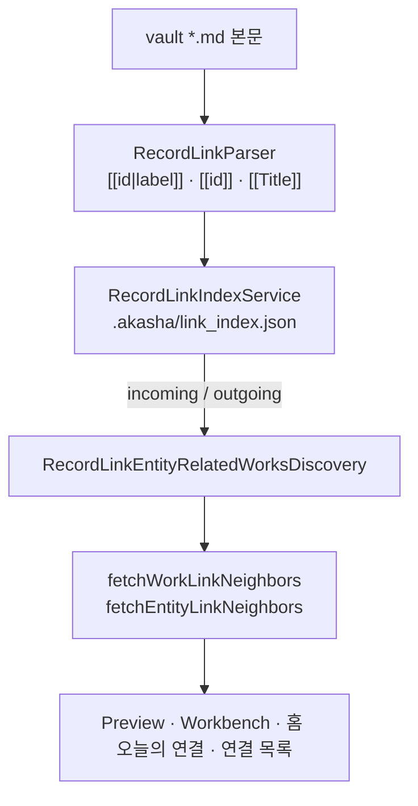

# R6 Discovery Audit — 발견(Discovery) 계층 분석

> **일자:** 2026-06-22  
> **전제:** R3/R4 UX Sprint **종료** · 현재 UX **충분** ([R5](./R5_DOGFOOD_ROUND2_REPORT.md) 판정 A)  
> **SSOT:** [PROJECT_CONSTITUTION.md](../history/closure-2026-07/PROJECT_CONSTITUTION_STUB.md), [CURRENT_STATE.md](../active/CURRENT_STATE.md)
> **질문:** 「어떻게 더 보기 좋게 만들까?」가 아니라 **「왜 사용자가 새로운 것을 발견하지 못하는가?」**

**금지 준수:** UX/UI/Navigation/Preview/Workbench 변경 없음 · 코드 수정 없음.

---

## Executive Summary

AKASHA의 **개인 지식 그래프 발견**은 `RecordLinkIndex` + `EntityRelatedWorksDiscovery` + `WorkLinkNeighbors` / `EntityLinkNeighbors`로 **1~2홉(hop) 링크 그래프**를 구현한다. 사용자가 A에 B를 `[[링크]]`로 연결하면 **B와 B를 공유하는 다른 Work**는 Preview·연결 목록·Workbench에서 **볼 수 있다**.

그러나 **발견은 전부 pull(사용자가 열어야 함)** 이고, 홈의 「최근 발견」은 **관계가 아닌 최신 추가순**이다. **Level 3(관계 패턴)·Level 4(예상 밖 발견)** 엔진은 **없다**. 헌법이 말하는 「관계를 통해 발견」은 **링크를 직접 만든 이후**에만 작동하며, **연결 0 plateau**([R5](./R5_DOGFOOD_ROUND2_REPORT.md) Scenario A)에서는 Discovery 축이 **사실상 비활성**이다.

**Constitution 갭:** 글로벌 10k Fact 검색(Fusion)은 강하지만, **개인 볼트 그래프 발견**과 **분리**되어 있다. Phase 3~5(CURRENT_STATE 미착수)와 맞물려 Place·Organization·개인 지식 타입의 발견도 **파이프라인 밖**이다.

---

## 1. 현재 Discovery 구조

### 1.1 데이터 흐름 (개인 볼트)



| 계층 | 구현 | 역할 |
|------|------|------|
| **Link Index** | `RecordLinkIndexService` | vault 전체 `.md` 스캔 → `outgoing`(sourcePath→links), `incoming`(entityId→record paths) |
| **Discovery** | `RecordLinkEntityRelatedWorksDiscovery` | Entity↔Work 집합: incoming record→workId + Entity journal outgoing→workId |
| **Neighbors** | `work_link_neighbors.dart`, `entity_link_neighbors.dart` | UI용 **제한·정렬된 이웃** (person/event/concept/work) |
| **Heuristic** | `work_related_characters.dart` | **링크 없이** Person 태그·제목 겹침 점수 (보조) |
| **Collection** | `CollectibleCollectionPipeline` | `relatedWorkId` 필터 — 특정 Work에 **실제 링크된** Entity만 Cast |
| **Global Search** | `FusionSearchService` | 로컬 vault + userCatalog + **10k Registry** — **쿼리 기반**, 그래프 무관 |

### 1.2 Link Index — 무엇이 인덱싱되는가

| 포함 | 제외 |
|------|------|
| vault 내 `.md` **본문**(YAML frontmatter 이후) | fenced code block 안 `[[...]]` |
| explicit entity id (`ent_*`, `wk_*` 등) | id 형식이 아닌 `[[Title]]` — **인덱스 시** catalog/vault 제목 해석 필요 |
| title-only `[[Title]]` → `_incomingTargetId`에서 catalog 검색 | 해석 실패 시 **incoming 미등록** |

**갱신:** 저장·vault watch 시 `rebuildIndex` — Discovery는 **항상 파싱된 링크 사실**에 의존.

### 1.3 EntityRelatedWorksDiscovery

```text
discover(entityId):
  1. incomingRecordPaths(entityId) → 각 path에서 workId 역해석
  2. entity journal 있으면 outgoingLinks(journal) → target이 Work id인 것

entityIdsForWork(workId):
  1. 모든 incoming entityId 순회 → 해당 work를 가리키는 record 있는지
  2. 모든 entity journal outgoing → target == workId
```

- **저장 SSOT 아님** — `EntityRelatedWorks`는 런타임 파생 (`entity_related_works.dart` 주석).
- **Work↔Work 직접 링크**는 `entityIdsForWork`가 아닌 `linkIndex.outgoingLinks(work.filePath)`에서 처리.

### 1.4 WorkLinkNeighbors — 이웃 계산 규칙

| 이웃 종류 | 소스 | 한도 | 비고 |
|-----------|------|:----:|------|
| **characters** (Person) | `entityIdsForWork` + 태그 heuristic | 4 | 링크 없으면 `relatedCharactersForWork` **보충** |
| **events** | `entityIdsForWork` | 3 | |
| **concepts** | `entityIdsForWork` | 3 | work.tags는 UI에 conceptTags로 별도 |
| **connectedWorks** | 직접 Work 링크 **+3점** · 공유 Entity 경유 Work **+1점**/entity | 4 | **2홉** 유일한 자동 확장 |
| **place / organization** | — | **0** | `switch`에 **미포함** — 인덱스에 있어도 neighbors **미노출** |

### 1.5 EntityLinkNeighbors

| 이웃 | 소스 | 한도 |
|------|------|:----:|
| connectedWorks | `discovery.discover` | 4 |
| persons / events / concepts | **Entity journal outgoing만** | 4 / 3 / 3 |
| incomingLinkCount | incoming record 수 | 표시만 |

- Work A에서 Entity B로 링크해도, **B의 neighbors에 A 외 다른 Entity**는 B journal에 링크가 있을 때만 보임 — **공유 Entity를 통한 Entity↔Entity 2홉 없음**.

### 1.6 Collection `relatedWorkId`

`CollectibleCollectionPipeline._resolveFilter`:

1. `kinds` + `tagsAll`로 후보 Entity 필터
2. `relatedWorkId` 설정 시 → `entityIdsForWork(relatedWorkId)`로 **이미 Work에 링크된** Entity만 대상
3. `discoverAll`로 각 Entity의 `workIds`에 `relatedWorkId` **포함 여부** 재확인

**의미:** 「이 작품 Cast」컬렉션 — **Discovery 엔진이 아니라 링크 증명 필터**. 사용자가 링크를 만들지 않으면 **빈 컬렉션**.

### 1.7 UI 서피스별 Discovery 내용

| 서피스 | Discovery 성격 | 실제 데이터 |
|--------|------------------|-------------|
| **Preview** (Work/Entity) | 1~2홉 neighbors 전체 섹션 | `fetch*LinkNeighbors` |
| **Workbench** Info | Preview와 동일 neighbors | 동일 |
| **홈 · 오늘의 연결** | 최근 Work 순 스캔 → **highlights 최대 3** | **characters + connectedWorks만** (event/concept **제외**) |
| **홈 · 최근 발견** | 이름과 달리 **addedAt 최신 4 Work** | **그래프 무관** |
| **홈 · 계속 탐험하기** | `RecentExploration` 또는 vault fallback | **탐색 이력/최신**, 관계 아님 |
| **연결 목록** (Graph) | Work별 `entityIdsForWork` **개수** 정렬 · 펼침 시 `WorkLinkNeighbors` | Preview와 **동일 이웃** · passive |
| **Fusion Search** | 글로벌+로컬 **텍스트 매칭** | 개인 그래프 **확장 안 함** |
| **Same-day** (Workbench) | 같은 날짜 Record | **시간 축** · 링크 그래프 아님 |

---

## 2. 사용자 시나리오 — A 기록 → B 연결 후 무엇이 새로 보이는가?

**설정:** Work **A** md 본문에 `[[ent_b|B]]` 저장 · index rebuild 완료.

### 2.1 즉시 새로 보이는 것 (Level 1~2)

| 관찰 위치 | 새로 보이는 것 |
|-----------|----------------|
| **Work A Preview** | B가 Person/Event/Concept 타입에 따라 해당 섹션에 **직접 표시** |
| **Entity B Preview** | connectedWorks에 **A** 표시 · incomingLinkCount ≥ 1 |
| **연결 목록** | A 행 연결 수 **+1** · 펼치면 B 표시 |
| **홈 · 오늘의 연결** | A가 최근 Work이면 B(인물) 또는 공유 Work 하이라이트 **후보** (최대 3 중) |
| **Workbench A** | Info 패널 neighbors에 B |
| **Collection (relatedWorkId=A)** | B가 kinds/tags 맞으면 **멤버 후보** |

### 2.2 조건부로 새로 보이는 것 (Level 2)

| 조건 | 새로 보이는 것 |
|------|----------------|
| **C**도 B에 링크됨 | A Preview **connectedWorks**에 C 가능 (+1점 공유 Entity) |
| A에 Person 링크 **없고** 태그만 겹침 | `relatedCharactersForWork`로 Person **추정** 표시 (링크 아님) |
| B journal에 `[[ent_c]]` 있음 | B Preview에 C (Entity outgoing) |

### 2.3 보이지 **않는** 것

| 기대 | 실제 |
|------|------|
| 홈 「최근 발견」에 B | **없음** — 최신 Work 추가순만 |
| B를 연결하지 않은 D 자동 추천 | **없음** |
| 「A와 비슷한 작품」 | **없음** (Registry 품질 검색은 **별도 쿼리**) |
| B가 Place/Organization | neighbors 섹션 **미표시** (파이프라인 gap) |
| 3홉 이상 (A→B→C→D) 자동 surfacing | **없음** — 사용자가 C·D를 **각각 열어야** |
| 푸시/알림/홈 피드 「새 발견」 | **없음** |

---

## 3. Discovery Level 분석

| Level | 정의 | 구현 여부 | 근거 |
|:-----:|------|:---------:|------|
| **0** | 기록 | ✅ **완전** | md 아카이브 · Fusion 로컬 검색 · 홈 최근 기록 |
| **1** | 직접 연결 | ✅ **완전** | Link Index incoming/outgoing · Preview 직접 이웃 |
| **2** | 이웃 발견 | ⚠️ **부분** | 공유 Entity→다른 Work (+1) · Person 태그 heuristic · **한도·타입 제한** · pull-only |
| **3** | 관계 발견 | ❌ **없음** | 패턴/구조 요약 없음 · same-day는 시간만 · Cast는 필터 not insight |
| **4** | 예상 못한 발견 | ❌ **없음** | 추천·랭킹·세렌디피티·임베딩·다중홉 proactive surfacing 없음 |

### Level 2 상세 (현재 천장)

구현된 **유일한 자동 확장**:

```text
Work A ──links──► Entity B ◄──links── Work C
         ⇒ A.connectedWorks에 C (score +1)
```

제약:

- vault에 **실제 md 링크** 필요 — Fact Registry 관계 **자동 승격 없음**
- UI마다 **4~4~3~3 cap** — 밀집 볼트에서 **대부분 숨김**
- Graph/홈은 **사용자가 스크롤·펼침·탭**해야 노출

### Level 3·4가 없는 이유 (코드 관점)

- `EntityRelatedWorksDiscovery`는 **집합 조회**이지 **그래프 탐색 엔진**이 아님
- `FusionSearchService`는 **문자열 검색** — neighbor expansion 없음
- 홈 Discovery 섹션 중 **관계 기반은 「오늘의 연결」뿐**이며 3건·2타입으로 **절단**
- CURRENT_STATE: Phase 5 「엔티티 연결성」**미착수** — 헌법 목표 대비 **백로그 상태**

---

## 4. 개인 지식 관점 평가

| 사용자 개념 | AKASHA 매핑 | Discovery 동작 | 갭 |
|-------------|-------------|----------------|-----|
| **사람** | Person | 링크·태그 heuristic·Cast | ✅ 가장 잘 됨 |
| **프로젝트** | Work(user-local) 또는 Concept | Work면 neighbors 동일 · Concept면 event급 | **타입 모델 없음** — 발견은 Work-centric |
| **개념** | Concept | 링크 시 neighbors · 오늘의 연결 **제외** | 홈 surfacing 약함 |
| **장소** | Place | catalog·Browse 가능 · **neighbors **미포함**** | **사실상 발견 불가** |
| **이벤트** | Event | 링크 시 neighbors · 오늘의 연결 **제외** | 홈 surfacing 약함 |
| **조직** | Organization | Place와 동일 gap | neighbors **미포함** |

**공통 패턴:**

1. **Work가 허브** — Entity-only 지식은 incoming·Entity Preview로 **수동 진입**
2. **글로벌 10k Discovery**와 **개인 링크 Discovery** **연결 없음** — 「이 인물의 다른 작품(Registry)」이 **자동으로** 개인 그래프에 안 들어옴
3. 첫 링크 전 — R5 Scenario A: 홈 Discovery 섹션 **공허** — **「발견」이 아니라 「대기」**

---

## 5. Discovery 병목 — 「왜 새로운 것을 발견하지 못하는가?」

### 5.1 선행 조건 병목 (Cold Graph)

| 병목 | 메커니즘 |
|------|----------|
| **링크 0 = Discovery 0** | Index·Discovery·Neighbors **전부 링크 파생** |
| 홈 Hero는 「발견」을 말하지만 | 「최근 발견」= **recency** · 「오늘의 연결」= **빈 카피** |
| Registry 10k는 항상 있음 | **개인 관계**와 무관 — 「내 우주」 발견이 아님 |

**핵심:** 사용자는 **먼저 연결(Link)을 완료**해야 Discovery가 켜진다. 헌법 순환 「기록→연결→**발견**」에서 **발견이 맨 뒤**에 고정.

### 5.2 Pull-only 병목

| 병목 | 메커니즘 |
|------|----------|
| Proactive feed 없음 | 새 이웃이 생겨도 **홈이 알려주지 않음** (오늘의 연결 3건 제외) |
| 연결 목록 passive | N작품 × 펼치기 — **피로** ([R5](./R5_DOGFOOD_ROUND2_REPORT.md)) |
| Preview Stack | 발견은 **사용자가 이웃 탭**할 때만 |

### 5.3 표현 병목 (엔진은 있는데 안 보임)

| 병목 | 메커니즘 |
|------|----------|
| neighbor cap 4+4+3+3 | 밀집 그래프 **대부분 절단** |
| Place/Org 파이프라인 누락 | 링크해도 **주요 UI에 안 나옴** |
| 오늘의 연결 | event/concept **미수집** · entity 타입 라벨 **「인물」 고정** |
| 최근 발견 **네이밍** | 관계 발견 **기대 유발** · 실제는 addedAt |

### 5.4 모델 병목 (Constitution vs 구현)

| 헌법 | 구현 |
|------|------|
| 문화 지식 **그래프** | **리스트형 1~2홉** 인덱스 |
| 5대 Entity | neighbors에 **3타입만** (Person/Event/Concept) |
| Discovery = 검색 품질 | Registry 검색 **강함** · **그래프 발견** 약함 |
| Phase 3~5 연결성 | CURRENT_STATE **미착수** |

### 5.5 개인 지식 병목

- 프로젝트·업무 지식 → Work/Concept **우회**
- Fusion은 **사용자가 검색어를 알 때**만 작동 — **구조적 발견** 없음
- Entity journal 기반 Entity↔Entity는 **1홉 outgoing만**

---

## 6. Constitution 대비 차이

| 헌법 문장 | 현재 Discovery 실체 | 차이 |
|-----------|----------------------|------|
| 「관계를 기록하고 **탐색**」 | 링크 후 Preview/Graph **수동 탐색** | 관계 **전** 탐색은 Registry 검색뿐 |
| 「**발견**」4축 | Level 0~2 vault 한정 · Level 3~4 공백 | **발견**이 **연결의 부산물** |
| 5대 Entity 우주 | Work 허브 · Place/Org **발견 약함** | 우주 **불완전** |
| Search Quality > Performance | Fusion/Registry **강** | **그래프 Discovery**에는 검색 인프라 **재사용 안 함** |
| Entity ≠ Record | 인덱스는 Record 본문 · Discovery는 Entity↔Work | **원칙 준수** — 발견 단계는 **아직 얕음** |

**R5 판정과의 정합:** UX는 Scenario B에서 **탐험 루프(~94%)**를 닫았으나, 그 루프는 **이미 링크가 있는 볼트** 전제. **Discovery 엔진**은 UX와 별개로 **cold·sparse graph에서 약함**.

---

## 7. 다음 단계 우선순위 (Discovery 엔지니어링)

> UX 재설계 **아님** — Discovery **계층** 보강 순서.

| 우선순위 | 방향 | 다루는 병목 | Level 목표 |
|:--------:|------|-------------|:----------:|
| **P0** | **Cold graph Discovery** — 링크 0일 때 「연결 후보」(Registry·태그·제목·기존 catalog) | 선행 조건 · R5 Scenario A plateau | 0→1 **브릿지** |
| **P1** | **Neighbor 파이프라인 완전성** — Place/Organization neighbors · 오늘의 연결 타입 확장 | 표현 병목 · 헌법 5 Entity | Level 2 **완전** |
| **P2** | **Proactive surfacing** — 홈/피드가 recency가 아닌 **link_index 파생** 하이라이트 (새 이웃·새 2홉) | Pull-only | Level 2→3 **입구** |
| **P3** | **Registry ↔ Vault 브릿지** — 검색/Fact에서 「내 볼트에 연결」·「이 Entity의 다른 Fact」 | 모델 병목 · Fusion 분리 | Level 3 |
| **P4** | **관계 패턴 / 다중홉** — 공유 Entity 클러스터·경로 요약 (엔진; UI는 기존 Preview/Graph 소비) | Level 3~4 공백 | Level 3~4 |
| **P5** | **Phase 3 개인 Entity** — 프로젝트·비문화 타입 SSOT | 개인 지식 ([R5](./R5_DOGFOOD_ROUND2_REPORT.md) C) | 전 축 |

**의존성:** P0·P1은 **Link Index·Discovery 코드** 확장 — R4 Do-Not-Touch(UX)와 **충돌 없음**. P3는 Registry/Search **읽기** 확장. P4는 **Graph Engine** 신규 계층 (R4에서 UI만 touch했던 영역의 **백엔드**).

---

## 8. 부록 — 코드 앵커

| 구성요소 | 파일 |
|----------|------|
| Link Index | `lib/services/record_link_index_service.dart` |
| Link Parser | `lib/services/record_link_parser.dart` |
| Entity↔Work Discovery | `lib/services/entity_related_works_discovery.dart` |
| Work Neighbors | `lib/utils/work_link_neighbors.dart` |
| Entity Neighbors | `lib/utils/entity_link_neighbors.dart` |
| Person Heuristic | `lib/utils/work_related_characters.dart` |
| Collection Cast | `lib/services/collectible_collection_pipeline.dart` |
| 홈 오늘의 연결 | `lib/screens/home/views/home_dashboard/home_dashboard_todays_links_section.dart` |
| 홈 최근 발견 | `lib/screens/home/views/home_dashboard/home_dashboard_recent_discovery_section.dart` |
| 연결 목록 | `lib/screens/home/views/knowledge_graph_view.dart` |
| Global Fusion | `lib/services/fusion_search_service.dart` |

---

## 9. 결론

AKASHA Discovery는 **「사용자가 만든 wiki 링크의 1~2홉 조회기」**로 잘 구현되어 있다. **A→B 연결 후 B와 공유 Work C를 보는** Scenario B 경험은 **실제로 작동**한다([R5](./R5_DOGFOOD_ROUND2_REPORT.md)).

사용자가 **새로운 것을 발견하지 못하는** 주된 이유는:

1. **발견이 링크 이후에만 켜진다** (cold graph dead zone)  
2. **발견이 전부 pull**이고 홈은 **recency를 발견으로 표기**한다  
3. **Level 3~4 관계·세렌디피티 엔진이 없다**  
4. **Registry 강점과 개인 그래프가 분리**되어 있다  
5. **Place/Org·개인 지식 타입**이 파이프라인에서 **빠져 있다**

R5의 「UX 충분 → Discovery 강화」 판정과 **정합**한다. 다음 작업은 Preview/Navigation이 아니라 **Discovery 엔진·서피스 데이터** 층이다.
