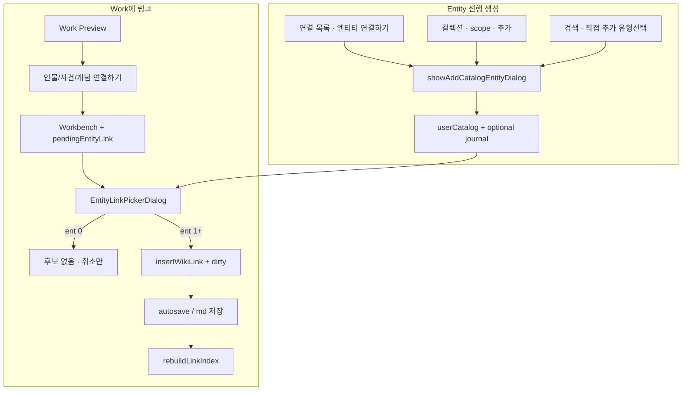
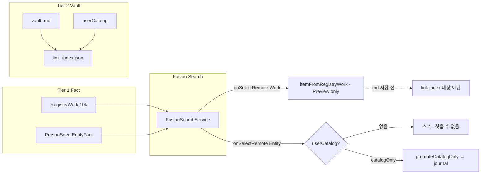

# R7 Discovery Foundation Audit

> **일자:** 2026-06-22  
> **전제:** R3~R5 UX Sprint **종료** · UX 재개편 **없음**  
> **목표:** `기록 + 연결` → `기록 + 연결 + 발견` 이동을 위한 **엔지니어링 기반** 분석  
> **선행:** [R6_DISCOVERY_AUDIT.md](./R6_DISCOVERY_AUDIT.md)  
> **SSOT:** [PROJECT_CONSTITUTION.md](../active/PROJECT_CONSTITUTION.md), [CURRENT_STATE.md](../active/CURRENT_STATE.md)

**금지 준수:** UX 리디자인 · Preview · Navigation · Workbench 수정 없음 · 코드 수정 없음.

**질문:** 「어떻게 더 예쁘게 보여줄까?」가 아니라 **「사용자가 첫 연결을 어떻게 만들고, 그 연결이 어떻게 발견으로 이어지는가?」**

---

## Executive Summary

| 영역 | 핵심 발견 |
|------|-----------|
| **P0 Cold Graph** | Preview 「인물 연결하기」가 **가장 짧아 보이지만**, 엔티티 0이면 **Picker가 빈 상태로 막힘**. 실질 최단 완료 경로는 **Entity 선생성 → Preview 연결** (6~8클릭). |
| **P1 Link Candidate** | `work.creator` · `work.tags` · `PersonSeedRegistry` · `userCatalog` · `relatedCharactersForWork` 등 **데이터는 있으나** 「연결 후보」로 **조합하는 계층 없음**. |
| **P2 Place/Org** | Link Index·Discovery **포함** · Neighbors·Picker·Empty CTA·홈 하이라이트 **누락**. |
| **P3 Registry↔Vault** | Registry Work 탭 = **메모리 Preview만** (vault md 없음). Person Seed 검색 탭 = **userCatalog 없으면 실패**. Work↔Person Fact 관계 **스키마 없음**. |

**첫 연결 → 발견 체인:** `[[링크]]` 삽입 → md 저장 → `signalVaultChanged` → `rebuildLinkIndex` (800ms debounce) → `entityIdsForWork` / neighbors / 홈·연결 목록 갱신. **이 체인은 작동**하나, **첫 링크까지 도달하는 경로**가 Cold Graph에서 **끊김**.

---

## P0 — Cold Graph 진입 분석

**프로필:** 볼트 연동 · vault Work md **N건**(예: 10) · `userCatalog` Entity **0** · `link_index` incoming/outgoing **0**.

### 0.1 가능한 진입 경로 (코드 추적)



### 0.2 경로별 클릭·막힘

| # | 경로 | 클릭 (추정) | 첫 **연결** 완료? | 막힘 |
|---|------|:-----------:|:----------------:|------|
| **A** | Hero → 검색 Work → Preview → **인물 연결하기** → Picker | **5~6** | ❌ | `EntityLinkPickerCandidates` = **userCatalog만** · ent 0 → **「연결할 Entity가 없습니다」** · Picker에 **생성 CTA 없음** (`entity_link_picker_dialog.dart` actions: 취소만) |
| **B** | Preview → **기록 열고 직접 작성** → 본문 `[[제목]]` 수동 | **4~5** + 입력 | ⚠️ | Entity **catalog에 동일 제목** 있어야 `resolveTitleToEntityId`·incoming 성공 · ent 0이면 **인덱스 실패** |
| **C** | 연결 목록 → **엔티티 연결하기** → Person 추가 → (홈) Work Preview → 인물 연결 | **7~9** | ✅ | Entity·Work **분리 생성** — 사용자가 **두 축을 이어야** 함 |
| **D** | 컬렉션 → Person → 추가 → Work Preview → 연결 | **7~9** | ✅ | C와 동일 |
| **E** | 검색 → **직접 추가 (유형 선택)** → Entity → Work Preview → 연결 | **6~8** | ✅ | 볼트 필수 (`openSearchDialog` onCustomAdd) |

### 0.3 코드 앵커 — Cold Graph 핵심

| 단계 | 파일 | 동작 |
|------|------|------|
| Preview empty CTA | `work_preview_empty_connections.dart` | Person/Event/Concept 3버튼 · Place/Org **없음** |
| 연결 시작 | `home_shell_controller.openWorkFromPreviewToConnect` | `pendingWorkEntityLinkType` + `openWorkFromPreview` |
| Picker 후보 | `entity_link_picker_candidates.dart` | `_linkableTypes` = person/event/concept only · **catalog 검색만** |
| 링크 삽입 | `work_detail_workspace._maybeRunPendingEntityLinkPick` | `insertWikiLink` → `_markDirty` |
| Index 갱신 | `home_vault_coordinator.bindVaultWatch` | save 후 **800ms** `rebuildLinkIndex` |

### 0.4 「가장 쉬운」경로 판정

| 기준 | 판정 |
|------|------|
| **클릭 최소 (연결 1건 완료)** | **C/D/E** — Entity **먼저** 만든 뒤 Preview CTA (**7~9클릭**) |
| **인지 부담 최소** | **A** — Hero narrative·Preview CTA와 **정합** |
| **실제 성공률** | **A는 ent 0에서 실패** · 사용자는 **A를 시도했다가 막히고** C/D를 **우연히** 찾아야 함 |

**결론 (P0):** UX상 Primary는 **Path A**이나, 엔티티 0 Cold Graph에서 **엔지니어링적으로 완결되지 않음**. Foundation Sprint의 P0는 **Path A dead-end 제거**(Picker·후보·선생성)가 ROI 최상.

### 0.5 첫 연결 → 발견 이어짐 (연결 성공 후)

| 시점 | 시스템 반응 | 발견 서피스 |
|------|-------------|-------------|
| T+0 | `insertWikiLink` 본문에 `[[ent_id\|title]]` | — |
| T+2s | autosave → vault md | — |
| T+~3s | `rebuildLinkIndex` | incoming[ent_id] += work path |
| T+3s+ | `fetchWorkLinkNeighbors` | Preview **인물** 섹션 · Graph count **+1** |
| 다음 홈 로드 | `home_dashboard_todays_links_section` | 최근 Work에서 **인물 하이라이트** (최대 3) |
| Entity Preview | `fetchEntityLinkNeighbors` | connectedWorks에 **해당 Work** |

**갭:** 첫 연결 **전**에는 위 서피스 **전부 빈 상태** — R6 Level 0~1 plateau.

---

## P1 — Link Candidate (기존 데이터만)

### 1.1 활용 가능 데이터 인벤토리

| 데이터 소스 | 위치 | 현재 사용처 | **연결 후보로 미사용** |
|-------------|------|-------------|------------------------|
| `AkashaItem.creator` | vault md / `itemFromRegistryWork` | 메타·Fusion 검색 토큰 | ✅ **후보 미생성** |
| `RegistryWork.creator` | akasha-db 10k | → `AkashaItem.creator` 복사 | ✅ |
| `AkashaItem.tags` | vault / registry | `relatedCharactersForWork` | ⚠️ **표시만** (링크 아님) |
| `RegistryWork.tags` | akasha-db | 아카이브 시 tags | ✅ |
| `userCatalog` Person/Event/Concept | 로컬 catalog | Picker·Fusion catalogHits | **쿼리/전체 목록**만 · Work 기준 **제안 없음** |
| `PersonSeedRegistry` | `assets/entities/person_seed.json` | Fusion `entityGlobalHits` | 검색 **탭 시 catalog 없으면 실패** |
| `EntityFact.aliases` | seed | search match | Work creator와 **매칭 로직 없음** |
| `relatedCharactersForWork` | `work_related_characters.dart` | neighbors **characters 보충** | Person catalog **있을 때만** · **제안 UI 아님** |
| `RecordLinkNavigator.resolveTitleToEntityId` | title ↔ catalog | index·navigate | **사용자 입력** 후행 |
| `FranchiseRegistry` | franchise groups | Fusion **중복 제거·힌트** | 자동 Work↔Work 링크 **아님** |
| `EntityTagValidation.buildWorkTitleIndex` | add entity dialog | 태그 검증 | Discovery **미사용** |
| `collectibleCollection relatedWorkId` | collection filter | Cast **필터** | 후보 **생성 아님** (이미 링크된 것만) |

### 1.2 후보 생성 가능성 (로직 없이 **이론상**)

| 후보 유형 | 입력 | 매칭 규칙 (제안 가능) | 신뢰도 | 기존 코드 근접 |
|-----------|------|----------------------|:------:|----------------|
| **Creator → Person** | `work.creator` | seed/catalog Person `title`/`aliases` **문자열 포함** | 중 | `PersonSeedRegistry.search` · `userCatalog.search` |
| **Tag → Person** | `work.tags` ∩ `person.tags` | `relatedCharactersForWork` **동일 점수** | 중~저 | **이미 구현** (neighbors 보충) |
| **Tag → Concept** | work.tags | concept catalog tags | 저 | 수동 |
| **Registry Person 검색** | creator 이름 | `entityRegistry.search(creator)` | 중 | Fusion **일회 검색**과 동일 데이터 |
| **Sibling Work** | `FranchiseRegistry` | 같은 franchise **다른 workId** | 중 | Fusion hint only |
| **Title-only link** | `[[creator]]` | index 시 resolve | 저 | 사용자 확인 필요 |
| **Vault Work co-occurrence** | 없음 | **데이터 없음** | — | 링크 전엔 **공출현 불가** |

### 1.3 「연결 후보」계층 부재

현재 **후보를 산출하는 단일 모듈 없음**. 데이터는:

- **FusionSearch** — 사용자 **쿼리** 필요
- **EntityLinkPicker** — catalog **전체/검색** (Work 맥락 무관)
- **relatedCharactersForWork** — neighbors **렌더링**에 흡수 · **링크 제안·원클릭 연결 없음**

**R6 질문에 대한 답:** Cold Graph에서 발견으로 가려면 **후보 계층**이 `work.creator` + `PersonSeedRegistry` + `userCatalog`를 **Work 단위로 조합**해 Picker/Index **이전**에 넘겨야 함. **UI 변경 없이**도 `LinkCandidatePort` 같은 **순수 서비스**로 ROI 높음.

### 1.4 후보 → 연결 → 발견 파이프라인 (목표 상태)

```text
[기존 데이터] → LinkCandidateService (신규 계층)
                    ↓
              Picker / Cold Graph API (소비 — UX 변경 최소)
                    ↓
              insertWikiLink → index → neighbors (기존)
```

---

## P2 — Place / Organization 상태

### 2.1 파이프라인 단계별 포함 여부

| 단계 | Person/Event/Concept | Place | Organization |
|------|:--------------------:|:---:|:------------:|
| `EntityAnchorType` enum | ✅ | ✅ | ✅ |
| `add_catalog_entity_dialog` | ✅ | ✅ (Browse) | ✅ |
| `EntityArchiveService.usesArchiveFirstFlow` | ✅ | ❌ | ❌ |
| `EntityLinkPickerCandidates._linkableTypes` | ✅ | ❌ | ❌ |
| `RecordLinkParser` / Link Index | ✅ (id 기준) | ✅ | ✅ |
| `EntityRelatedWorksDiscovery` | ✅ (type 무관) | ✅ | ✅ |
| `fetchWorkLinkNeighbors` switch | ✅ | **❌** | **❌** |
| `fetchEntityLinkNeighbors` switch | ✅ | **❌** | **❌** |
| `WorkPreviewEmptyConnections` CTA | ✅ | **❌** | **❌** |
| `home_dashboard_todays_links` | person only | **❌** | **❌** |
| Fusion search icon | ✅ | ✅ | ✅ |

### 2.2 누락 구간 정리

```text
[사용자가 Place md에 [[work]] 링크]
        ↓
Link Index ✅ (entityId incoming/outgoing)
        ↓
EntityRelatedWorksDiscovery.discover(placeId) ✅ → workIds
        ↓
fetchWorkLinkNeighbors / fetchEntityLinkNeighbors
        ↓  switch default: break
UI neighbors ❌ — Place/Org **화면에 안 나타남**
```

**추가 막힘:** Cold Graph **Picker·Empty CTA**에서 Place/Org **연결 진입 불가** — 수동 `[[id]]` 또는 Entity journal 편집만 가능.

### 2.3 Constitution 갭

헌법 5대 Entity 중 **Place·Organization**은 **Fact·Browse에는 있으나 Discovery 서피스에서 사실상 제외**. R6 Level 2 **불완전**.

---

## P3 — Registry ↔ Vault 단절 지점

### 3.1 흐름도



### 3.2 단절 지점 상세

| # | 지점 | 코드 | 결과 |
|---|------|------|------|
| **D1** | Registry Work 선택 | `home_dialogs_coordinator.openSearchDialog` → `HomeAutoArchive.itemFromRegistryWork` → `onPreviewLocalWork` | **vault md 미생성** · `filePath` 없을 수 있음 · **그래프 노드는 vault Work 기준** |
| **D2** | Person Seed 선택 | `_openEntityFromSearch` → `CollectibleOpener.findEntity(userCatalog)` | seed에만 있는 Person → **「찾을 수 없습니다」** |
| **D3** | Work↔Person Fact 엣지 | `RegistryWork` / `EntityFact` | **creator 문자열만** · 구조화된 **관계 필드 없음** |
| **D4** | Registry → 자동 링크 | — | creator가 있어도 **Person Entity 자동 생성·링크 없음** |
| **D5** | Auto-archive | `HomeAutoArchive.run` | Registry Work → vault md **일괄 생성** · **Entity·링크는 생성 안 함** |
| **D6** | Fusion catalogOnly Entity | `onPromoteCatalogEntity` | userCatalog **선행 필요** · journal 생성은 **수동 promote** |
| **D7** | Discovery 소비 | `fetchWorkLinkNeighbors` | Registry에만 있는 Fact → **neighbors 0** |

### 3.3 Registry가 Discovery에 기여하는 유일 경로 (현재)

| 경로 | Discovery 기여 |
|------|----------------|
| 검색 → Work Preview → (사용자 연결) | **간접** — Work 진입점만 |
| Auto-archive → vault 10 Work | **연결 목록 행 증가** · 링크 0이면 **이웃 0** |
| `item.creator` / `tags` on archived item | **P1 후보 원천** (미연결) |
| Person Seed 검색 | **실패 또는 수동 catalog 추가** 후에야 사용 |

**헌법 「검색 품질 > 성능」:** Registry **검색(Recall)** 은 강함 · **검색 결과 → 개인 그래프 연결** 은 **끊김**.

---

## Constitution / CURRENT_STATE 대비

| 문서 | 기대 | R7 관찰 |
|------|------|---------|
| Constitution §1 | 관계 기록·**탐색** | 탐색은 **링크 후** pull-only |
| Constitution §3 Discovery | 4축 중 Discovery | **Level 2 천장** · Cold **비활성** |
| Constitution §2 5 Entity | Place·Org 포함 | Discovery 파이프라인 **3/5만** |
| CURRENT_STATE Phase 3~5 | Entity·연결성 **미착수** | Cold Graph·Registry bridge **공백과 일치** |
| R5 판정 A | UX 충분 | **Discovery Foundation**은 UX **이후** 계층 |

---

## 구현 ROI 순위

> UX 재설계 **없이** · **기존 데이터·포트** 확장 기준. R6 P0~P5와 정합.

| 순위 | 항목 | 다루는 갭 | 산출물 성격 | ROI | 의존 |
|:----:|------|-----------|-------------|:---:|------|
| **1** | **Cold Graph Link Completion** — Picker 빈 목록 시 **catalog+seed 후보** · creator 기반 **1-tap 후보** · seed 탭 시 **catalog upsert** | P0 Path A dead-end · D2 | `LinkCandidateService` + Picker/Search **소비** (최소 UI) | **최고** | userCatalog · PersonSeed |
| **2** | **Work-context Link Candidates** — `work.creator`/`tags` → Person/Concept **ranked list** (연결 전 제안) | P1 계층 부재 | 순수 서비스 + 기존 CTA **데이터 배선** | **최고** | #1과 동시 가능 |
| **3** | **Registry Work → Vault 명시 정책** — Preview-only item과 vault md **상태 구분** · 연결 CTA 전 **archive 보장** (정책·서비스) | D1 · D5 | coordinator/archive **한 지점** | **높음** | vault save |
| **4** | **Place/Org Neighbors 파이프라인** — `work_link_neighbors` / `entity_link_neighbors` switch 확장 · picker `_linkableTypes` (선택) | P2 전 구간 | **4파일** 수준 · Graph/Preview **자동 수혜** | **중~높음** | 없음 |
| **5** | **홈 · 오늘의 연결 데이터 확장** — event/concept · Place/Org 타입 라벨 (로직만) | R6 표현 병목 | `todays_links_section` **수집 로직** | **중간** | #4 |
| **6** | **Registry↔Person Fact 엣지** (akasha-db 스키마) | D3 · D4 | **데이터·파이프라인** — CURRENT_STATE Phase | **중간 (장기)** | 스키마 |
| **7** | **Proactive Discovery Feed** — #2 후보를 홈/Graph **push** (recency 대체) | R6 pull-only | 소비자 UI **얇은 추가** | **중간** | #1·#2 |
| **8** | **Multi-hop / 관계 패턴 엔진** | R6 Level 3~4 | Graph Engine **신규** | **낮음 (초기)** | #1~4 |

### ROI 근거 요약

- **#1·#2:** 코드 변경 대비 **Cold Graph → 첫 링크 → 첫 발견** 전구간 해소 · R5 Scenario A plateau **직격**.
- **#3:** Registry 검색은 **이미 Primary 진입** — vault md 없이 Preview만 있으면 **index·Graph·연결 CTA** 불일치 지속.
- **#4:** 헌법 5 Entity **완성도** · 기존 Index **변경 없음**.
- **#6~8:** UX와 무관한 **데이터·엔진** — #1~4 없이 하면 **첫 연결 병목** 잔존.

---

## 부록 — 코드 앵커 (R7)

| 주제 | 파일 |
|------|------|
| Cold CTA | `lib/widgets/work_preview_empty_connections.dart` |
| Preview 연결 배선 | `lib/screens/home/home_shell_controller.dart` L307–313 |
| Picker 후보 | `lib/services/entity_link_picker_candidates.dart` |
| Picker UI (빈 목록) | `lib/screens/home/dialogs/entity_link_picker_dialog.dart` |
| 링크 삽입 | `lib/features/workbench/presentation/work_detail_workspace.dart` L152–181 |
| Index rebuild | `lib/screens/home/coordinators/home_vault_coordinator.dart` L82–92, L120–123 |
| Tag heuristic | `lib/utils/work_related_characters.dart` |
| Registry Preview | `lib/screens/home/coordinators/home_dialogs_coordinator.dart` L96–108 |
| Entity search 실패 | `lib/screens/home/coordinators/home_dialogs_coordinator.dart` L191–201 |
| Person Seed | `lib/services/person_seed_registry.dart` |
| Fusion entity global | `lib/services/fusion_search_service.dart` L139–153 |
| Place/Org gap | `lib/utils/work_link_neighbors.dart` L57–66 |
| Auto-archive | `lib/screens/home/home_auto_archive.dart` |

---

## 결론

**기록 + 연결**은 Path C/D/E로 **가능**하나, 제품이 유도하는 **Path A는 엔티티 0에서 dead-end**다. **발견**은 첫 링크 **이후** index→neighbors 체인으로 **작동**하지만, **연결 후보·Registry bridge·Place/Org** 공백 때문에 「기록 + 연결 + **발견**」으로 **이동하지 못한다**.

R7 Foundation의 **첫 구현 타겟**은 UX 개편이 아니라:

1. **Link Candidate 서비스** (기존 creator/tags/seed/catalog)  
2. **Cold Graph Path A 완결** (Picker·Search·catalog 승격)  
3. **Place/Org neighbors 완성**  

이다. 이 세 가지가 갖춰져야 R6의 **P2 Proactive surfacing**과 **Registry bridge**가 의미를 갖는다.
