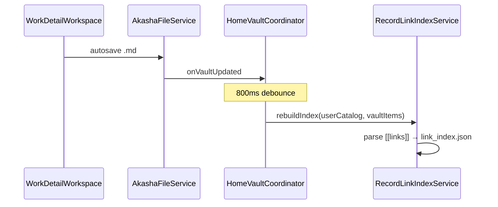

# R8 Discovery Implementation Plan — 코드 기준 Audit

> **일자:** 2026-06-22  
> **Sprint:** R8 Discovery Foundation  
> **선행:** [R6_DISCOVERY_AUDIT.md](./R6_DISCOVERY_AUDIT.md), [R7_DISCOVERY_FOUNDATION_AUDIT.md](./R7_DISCOVERY_FOUNDATION_AUDIT.md)  
> **SSOT:** [PROJECT_CONSTITUTION.md](../active/PROJECT_CONSTITUTION.md), [CURRENT_STATE.md](../active/CURRENT_STATE.md)

**범위:** Discovery Foundation (P0 Cold Graph · P1 Link Candidate 설계)  
**금지 준수:** Search Index · Recall Validation · Link Index Schema · Discovery Semantics · Collection Pipeline · Registry Sync · Workbench Layout · Preview Stack · Save Return **무변경**

---

## Executive Summary

| 우선순위 | 목표 | R8 조치 |
|---------|------|---------|
| **P0** | Cold Graph에서 첫 `[[wiki]]` 연결 완료 | Entity Link Picker **catalog 0 → PersonSeed fallback** + 선택 시 **userCatalog 승격** |
| **P1** | Work 맥락 기반 Link Candidate 계층 | **설계만** — [R8_P1_LINK_CANDIDATE_DESIGN.md](./R8_P1_LINK_CANDIDATE_DESIGN.md) |

P0는 **Picker·catalog 승격**만 수정한다. `insertWikiLink` · `rebuildLinkIndex` · Link Index · Discovery 파이프라인은 **기존 경로 재사용**.

---

## 1. Entity Link Picker 구조

### 1.1 진입점

| 진입 | 파일 | 동작 |
|------|------|------|
| Preview CTA | `work_preview_empty_connections.dart` | Person / Event / Concept 연결 버튼 |
| Shell | `home_shell_controller.openWorkFromPreviewToConnect` | `pendingEntityLinkType` 설정 후 Workbench 오픈 |
| Workbench | `work_detail_workspace._maybeRunPendingEntityLinkPick` | 탭 전환 후 `showEntityLinkPickerDialog` |
| 수동 | `markdown_body_editor.dart` | 본문 편집 중 Entity 연결 |

### 1.2 다이얼로그 · 후보 빌더

```
showEntityLinkPickerDialog
  └─ EntityLinkPickerDialog
       ├─ TextField (이름·별칭 검색)
       ├─ EntityLinkPickerCandidates.build(...)
       └─ _select(candidate) → EntityLinkSelection
```

| 컴포넌트 | 파일 | 역할 |
|----------|------|------|
| Dialog | `entity_link_picker_dialog.dart` | UI · 검색 · 행 선택 · seed 승격 |
| Candidates | `entity_link_picker_candidates.dart` | catalog 검색 → **0건 시 seed fallback** |
| Promotion | `entity_seed_catalog_promotion.dart` | `EntityFact` → `UserCatalogEntity` · `ensureInCatalog` |

### 1.3 후보 규칙 (R8 이후)

| 단계 | 조건 | 결과 |
|------|------|------|
| 1 | `userCatalog.load()` | catalog SSOT |
| 2 | query 빈 문자열 | `userCatalog.all` · 아니면 `userCatalog.search(query)` |
| 3 | 필터 | `_linkableTypes` = person / event / concept · Work entity 제외 · `anchorTypeFilter` 적용 |
| 4 | 정렬 | archived 우선 → title asc |
| 5 | **catalog ≥ 1** | catalog 후보만 반환 (**seed 미사용**) |
| 6 | **catalog = 0** | `_buildSeedFallback` — `PersonSeedRegistry` (Person만 · 최대 12건) |

`EntityLinkPickerCandidate` 필드:

- `entity` — 표시·선택용 `UserCatalogEntity`
- `isArchived` — vault journal 존재 여부
- `origin` — `catalog` | `seed`
- `seedFact` — seed 선택 시 승격 원본

### 1.4 R7 대비 변경 (P0)

| 항목 | R7 (Before) | R8 (After) |
|------|-------------|------------|
| 후보 소스 | `userCatalog` only | catalog 우선 · **0건 시 PersonSeed** |
| ent 0 + Person CTA | 「연결할 Entity가 없습니다」 dead-end | seed 목록(5명) 또는 검색 매칭 |
| 선택 시 | catalog entity 그대로 | seed → `ensureInCatalog` 후 동일 `EntityLinkSelection` |
| Event/Concept Cold | dead-end 유지 | seed 번들 없음 — **의도적** (Person MVP) |

---

## 2. Entity 생성 흐름

### 2.1 기존 경로 (변경 없음)

| 경로 | 파일 | 산출 |
|------|------|------|
| 연결 목록 · 컬렉션 · 검색 직접 추가 | `add_catalog_entity_dialog.dart` | `userCatalog.upsert` + optional journal |
| Fusion catalogOnly promote | `onPromoteCatalogEntity` | catalog → vault journal |
| Auto-archive Registry Work | `HomeAutoArchive.run` | vault Work `.md` (Entity 아님) |

### 2.2 R8 신규 경로 — Seed 승격

```
EntityLinkPickerDialog._select(seed)
  → EntitySeedCatalogPromotion.ensureInCatalog(fact)
       ├─ userCatalog.getById(id) hit → 기존 반환
       └─ miss → entityFromFact(fact) → userCatalog.upsert
  → EntityLinkSelection(entityId, title, entityType)
```

- **global seed id 유지** (`pe_000000001` 등) — 새 id 발급 없음
- **Schema 변경 없음** — 기존 `UserCatalogEntity` 필드만 사용
- journal은 **생성하지 않음** — 링크 삽입·저장 후 Discovery는 incoming 경로로 연결

---

## 3. insertWikiLink 경로

| 단계 | 파일 | 동작 |
|------|------|------|
| Picker 반환 | `entity_link_selection.dart` | `entityId` · `title` · `entityType` |
| 패치 생성 | `markdown_edit_actions.dart` `insertWikiLink` | `[[entityId\|title]]` 토큰 삽입 |
| 적용 | `work_detail_workspace._maybeRunPendingEntityLinkPick` | `_bodyCtrl` 갱신 · `WorkDetailDraftOps.syncBodyFromEditor` |
| dirty | `_markDirty()` | autosave 트리거 |

**R8 변경 없음** — seed 승격 후에도 동일 `EntityLinkSelection` → 동일 `insertWikiLink` 호출.

---

## 4. rebuildLinkIndex 경로



| 항목 | 파일 | 비고 |
|------|------|------|
| 저장 감지 | `home_vault_coordinator.bindVaultWatch` | 400ms items reload · **800ms** index rebuild |
| rebuild | `RecordLinkIndexService.rebuildIndex` | vault `.md` 본문 스캔 |
| 소비 | `RecordLinkEntityRelatedWorksDiscovery` | `entityIdsForWork` · `discover` |

**R8 변경 없음** — Link Index Schema · 파싱 규칙 · Discovery semantics 유지.

---

## 5. userCatalog 승격 경로

| 승격 유형 | 트리거 | 구현 |
|-----------|--------|------|
| 수동 Entity 추가 | `showAddCatalogEntityDialog` | 신규 id · upsert |
| Fusion catalogOnly | `onPromoteCatalogEntity` | journal 생성 |
| 검색 기여 | `showCatalogAddContributionDialog` | contribution inbox |
| **R8 Seed (신규)** | Picker seed 행 선택 | `EntitySeedCatalogPromotion.ensureInCatalog` |

공통 포트: `UserCatalogPort` (`load` · `search` · `getById` · `upsert` · `all`).

---

## 6. PersonSeedRegistry 사용 위치

| 사용처 | 파일 | 용도 |
|--------|------|------|
| Fusion Search | `fusion_search_service.dart` | `entityRegistry.search` → `entityGlobalHits` |
| Search Dialog 기본 | `home_dialogs_facade.dart` | `entityRegistry ?? PersonSeedRegistry.instance` |
| **R8 Picker fallback** | `entity_link_picker_candidates.dart` | `listFacts` / `search` (catalog 0일 때만) |

에셋: `assets/entities/person_seed.json` (5명 MVP).

R8 추가 API:

- `listFacts({EntityAnchorType? type})` — 빈 쿼리 Picker용
- `search('')` — **여전히 `[]`** (Fusion 동작 보존)

Entity 검색 탭에서 seed 선택 시 catalog 없으면 실패하는 **D2 단절**은 R8 범위 밖 (Fusion / CollectibleOpener).

---

## 7. creator / tags 사용 위치

| 데이터 | 위치 | 현재 사용 | 연결 후보 |
|--------|------|-----------|-----------|
| `AkashaItem.creator` | vault md · registry 복사 | Fusion 로컬 검색 토큰 | **미사용** |
| `AkashaItem.tags` | vault md · registry | Fusion 검색 · `relatedCharactersForWork` heuristic | **표시·보충만** |
| `RegistryWork.creator/tags` | akasha-db | archive 시 item에 복사 | **미사용** |
| Person `tags` / `aliases` | userCatalog | Picker 검색 · tag overlap score | P1 후보 원천 |

`relatedCharactersForWork` (`work_related_characters.dart`):

- work.tags ↔ person.tags (+2) · title 포함 (+3) · alias (+1)
- `fetchWorkLinkNeighbors`에서 **링크된 Person 부족 시** characters 보충
- **제안 UI 아님** — neighbors 계산 내부 heuristic

---

## 8. Discovery 파이프라인 진입점

### 8.1 데이터 흐름 (변경 없음)

```
vault .md ──► RecordLinkParser ──► link_index.json
                                        │
                                        ▼
                        RecordLinkEntityRelatedWorksDiscovery
                                        │
                    ┌───────────────────┼───────────────────┐
                    ▼                   ▼                   ▼
         fetchWorkLinkNeighbors  fetchEntityLinkNeighbors  CollectibleCollectionPipeline
                    │                   │                   (relatedWorkId)
                    ▼                   ▼
         Preview · Workbench      Entity Preview
         홈 오늘의 연결            연결 목록
```

### 8.2 UI 진입점

| 서피스 | 파일 |
|--------|------|
| Work Preview 연결 섹션 | `work_link_neighbors_sections.dart` |
| Entity Preview 이웃 | `entity_link_neighbors` 소비 위젯 |
| 홈 하이라이트 | `home_dashboard_todays_links_section.dart` |
| Graph | link count · neighbor 기반 |

### 8.3 R8 P0 성공 시 체인

Cold Graph (ent 0) → Preview → 인물 연결 → **seed 선택** → catalog upsert → `[[pe_xxx|Title]]` → save → `rebuildLinkIndex` → `entityIdsForWork` / neighbors / 홈 하이라이트 **활성화**.

---

## 9. P0 구현 범위 · 금지 사항 체크리스트

| 항목 | R8 P0 |
|------|-------|
| `entity_link_picker_candidates.dart` | ✅ seed fallback |
| `entity_seed_catalog_promotion.dart` | ✅ 신규 |
| `entity_link_picker_dialog.dart` | ✅ async select · seed UI hint |
| `person_seed_registry.dart` | ✅ `listFacts` only |
| Link Index Schema | ❌ 변경 없음 |
| Discovery Semantics | ❌ 변경 없음 |
| Search Index / Fusion ranking | ❌ 변경 없음 |
| Preview / Workbench layout | ❌ 변경 없음 |

---

## 10. 후속 (P1 — 설계만)

[R8_P1_LINK_CANDIDATE_DESIGN.md](./R8_P1_LINK_CANDIDATE_DESIGN.md) 참조:

- `LinkCandidateService` — Work 맥락에서 creator · tags · PersonSeed · catalog 조합
- Preview / Picker / Empty CTA UI 연결 지점
- Place / Organization Discovery UI gap — **별도 Sprint**

---

## 관련 산출물

- [R8_P0_IMPLEMENTATION_REPORT.md](./R8_P0_IMPLEMENTATION_REPORT.md) — 구현·테스트 결과
- [R8_P1_LINK_CANDIDATE_DESIGN.md](./R8_P1_LINK_CANDIDATE_DESIGN.md) — Link Candidate 설계
