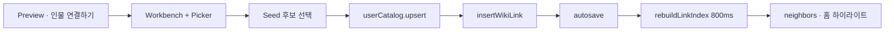

# R8 P0 Implementation Report — Cold Graph Completion

> **일자:** 2026-06-22  
> **Sprint:** R8 Discovery Foundation · P0  
> **계획:** [R8_DISCOVERY_IMPLEMENTATION_PLAN.md](./R8_DISCOVERY_IMPLEMENTATION_PLAN.md)  
> **선행 Audit:** [R7_DISCOVERY_FOUNDATION_AUDIT.md](./R7_DISCOVERY_FOUNDATION_AUDIT.md) § P0

---

## 목표

**Cold Graph** (userCatalog Entity 0 · link_index 0)에서 Preview **「인물 연결하기」** 경로(Path A)의 dead-end 제거.

성공 기준:

> 빈 볼트 + 작품만 존재 → Preview → 인물 연결하기 → 후보 선택 → `[[wiki]]` 생성 → Link Index 반영

---

## Before / After

| 상황 | Before (R7) | After (R8 P0) |
|------|-------------|---------------|
| ent 0 · Person CTA | Picker 「연결할 Entity가 없습니다」 · 취소만 | PersonSeed 5명(또는 검색 매칭) 노출 |
| seed 행 선택 | — | `userCatalog.upsert` → `EntityLinkSelection` |
| 링크 삽입 | (도달 불가) | 기존 `insertWikiLink` |
| Link Index | — | save 후 800ms `rebuildLinkIndex` (기존) |
| Event/Concept ent 0 | dead-end | **변경 없음** (seed 번들 없음) |

---

## 변경 파일

### 신규

| 파일 | 역할 |
|------|------|
| `lib/services/entity_seed_catalog_promotion.dart` | `EntityFact` → `UserCatalogEntity` 변환 · `ensureInCatalog` |

### 수정

| 파일 | 변경 요약 |
|------|-----------|
| `lib/services/entity_link_picker_candidates.dart` | `EntityLinkPickerCandidateOrigin` · catalog 0 시 `_buildSeedFallback` |
| `lib/services/person_seed_registry.dart` | `listFacts({EntityAnchorType? type})` |
| `lib/screens/home/dialogs/entity_link_picker_dialog.dart` | async `_select` · seed 안내 문구 · `UserCatalogEntity` import |

### 미변경 (의도적)

- `markdown_edit_actions.dart` · `work_detail_workspace.dart` (링크 삽입 흐름)
- `home_vault_coordinator.dart` · `RecordLinkIndexService`
- Discovery · Fusion Search · Preview layout · Workbench layout

---

## 구현 상세

### 1. Seed Fallback 조건

`EntityLinkPickerCandidates.build`:

1. catalog 후보를 빌드·정렬
2. **길이 ≥ 1** → catalog만 반환 (기존 동작)
3. **길이 = 0** → `_buildSeedFallback`:
   - `anchorTypeFilter`가 Event/Concept만이면 **빈 목록** (Person seed만 존재)
   - 빈 쿼리 → `PersonSeedRegistry.listFacts`
   - 검색 쿼리 → `PersonSeedRegistry.search`
   - catalog에 이미 있는 id 제외 · 최대 12건 · title 정렬

### 2. 선택 시 승격

`EntityLinkPickerDialog._select`:

```dart
if (candidate.isSeed && candidate.seedFact != null) {
  entity = await EntitySeedCatalogPromotion.ensureInCatalog(
    userCatalog: widget.userCatalog,
    fact: candidate.seedFact!,
  );
}
Navigator.pop(context, EntityLinkSelection(...));
```

- global id (`pe_000000001`) 유지
- idempotent: 이미 catalog에 있으면 upsert 생략

### 3. UI 힌트

- 부제: seed 후보 있을 때 「내 카탈로그에 없습니다 · 사전 인물에서 연결할 수 있습니다」
- 행 부제: 「사전 인물」

---

## E2E 흐름 (수동 검증 시나리오)



1. 볼트 연동 · vault Work 1건 · `userCatalog` Entity 0
2. Work Preview → 「인물 연결하기」
3. Picker에 PersonSeed 목록 표시 (예: Albert Einstein)
4. 행 선택 → Work 본문에 `[[pe_000000001|Albert Einstein]]` (또는 해당 seed)
5. autosave 후 Link Index incoming에 entity id 반영
6. Preview 인물 섹션 · Graph count 갱신 확인

---

## 테스트

**명령:** `flutter test test/entity_link_picker_test.dart`

**결과:** **13/13 PASS**

| 테스트 | 검증 |
|--------|------|
| `empty catalog falls back to person seed list` | catalog 0 → seed 후보 |
| `catalog miss with query uses seed search` | 검색어로 seed 매칭 |
| `catalog hit suppresses seed fallback` | catalog 있으면 seed 미노출 |
| `ensureInCatalog upserts seed fact once` | idempotent upsert |
| `seed row promotes to catalog on select` | Dialog 선택 → catalog 1건 |

기존 회귀 (title/alias/tag 검색 · archived 정렬 · work 제외 · wiki token) **유지**.

---

## 금지 사항 준수

| 금지 항목 | 준수 |
|-----------|------|
| Search Index | ✅ 미변경 |
| Recall Validation | ✅ 미변경 |
| Link Index Schema | ✅ 미변경 |
| Discovery Semantics | ✅ 미변경 |
| Collection Pipeline | ✅ 미변경 |
| Registry Sync | ✅ 미변경 |
| Workbench Layout | ✅ 미변경 |
| Preview Stack | ✅ 미변경 |
| Save Return | ✅ 미변경 |

---

## 알려진 제한

| 제한 | 사유 |
|------|------|
| Event/Concept Cold Graph | Person seed 번들만 존재 — R7과 동일 dead-end |
| Place / Organization | R8 범위 밖 |
| Fusion 검색 탭 seed 선택 (D2) | CollectibleOpener catalog 필수 — 별도 과제 |
| journal 미생성 | 링크만으로 Discovery incoming 충분 — archive-first flow는 promote 경로 유지 |

---

## 다음 단계

- **P1:** [R8_P1_LINK_CANDIDATE_DESIGN.md](./R8_P1_LINK_CANDIDATE_DESIGN.md) — `LinkCandidateService` 구현 Sprint
- **P2 (미정):** Place/Organization Discovery UI · Event/Concept seed
