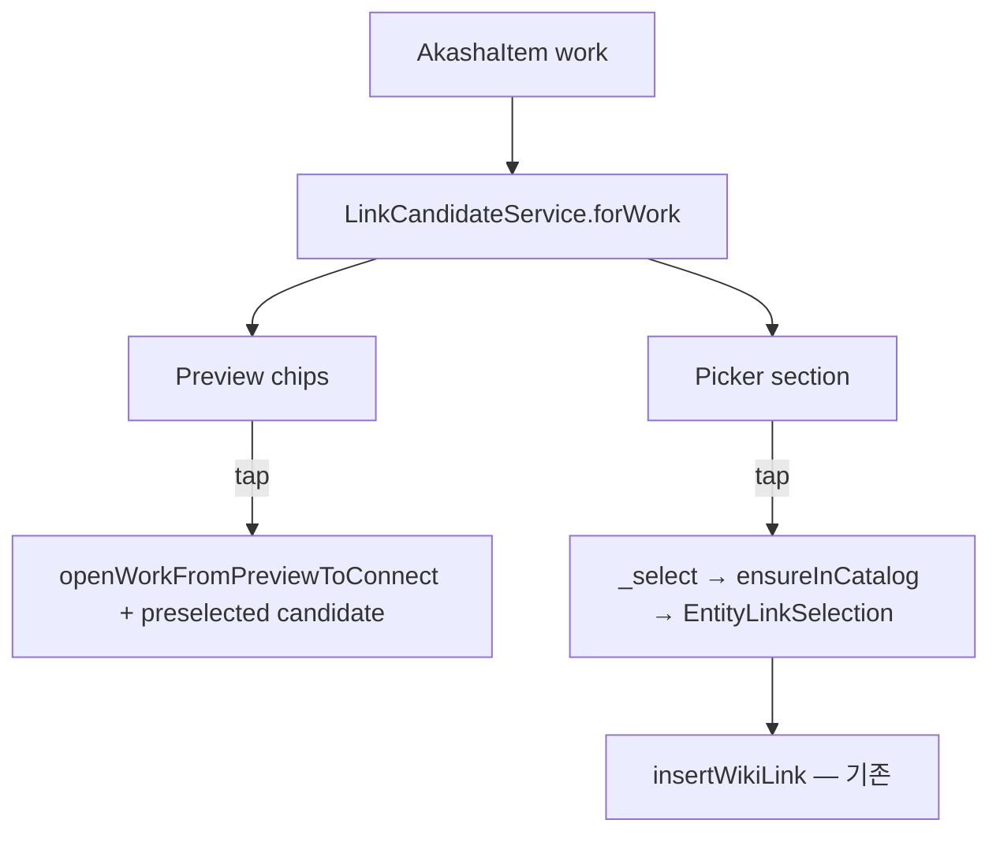

# R8 P1 Link Candidate Design — LinkCandidateService

> **일자:** 2026-06-22  
> **Sprint:** R8 Discovery Foundation · P1 (설계만 · **구현 없음**)  
> **선행:** [R7_DISCOVERY_FOUNDATION_AUDIT.md](./R7_DISCOVERY_FOUNDATION_AUDIT.md) § P1, [R8_DISCOVERY_IMPLEMENTATION_PLAN.md](./R8_DISCOVERY_IMPLEMENTATION_PLAN.md) § 7

---

## 문제

Work 맥락에서 「누구와 연결하면 좋을까」를 제안하는 **계층이 없다**.

데이터는 분산되어 있다:

| 소스 | 존재 | 연결 후보로 조합 |
|------|:----:|:----------------:|
| `work.creator` | ✅ | ❌ |
| `work.tags` | ✅ | ⚠️ heuristic만 (`relatedCharactersForWork`) |
| `PersonSeedRegistry` | ✅ | ⚠️ P0 Picker fallback만 |
| `userCatalog` | ✅ | ⚠️ 전역 검색만 |

**목표:** Work 단위 **Link Candidate** 목록을 점수·출처와 함께 반환하는 `LinkCandidateService` 설계.

**금지 (구현 시에도):** Link Index Schema · Discovery Semantics · Search Index 변경 없음. 후보는 **제안**이며, 실제 그래프 엣지는 기존 `[[wiki]]` 삽입만 생성.

---

## 설계 원칙

1. **Read-only 제안** — candidate 선택 시 P0와 동일: catalog 승격(필요 시) + `insertWikiLink`
2. **Work-scoped** — 입력은 항상 `AkashaItem` (Work) + `UserCatalogPort` + optional registries
3. **출처 투명** — UI에 `creator` / `tag` / `seed` / `catalog` provenance 표시
4. **기존 heuristic 승격** — `relatedCharactersForWork` 로직을 candidate score로 흡수
5. **Cold Graph 호환** — catalog 0이어도 creator·seed 후보 가능 (P0 seed 승격 재사용)

---

## API 설계

### 8.1 타입

```dart
enum LinkCandidateSource {
  creator,      // work.creator 문자열 매칭
  tagOverlap,   // work.tags ↔ entity tags/aliases
  personSeed,   // PersonSeedRegistry
  catalog,      // userCatalog 전역 (낮은 우선순위)
}

class LinkCandidate {
  final String entityId;       // 비어 있으면 "미승격" seed/creator 문자열 후보
  final String title;
  final EntityAnchorType anchorType;
  final LinkCandidateSource source;
  final double score;
  final EntityFact? seedFact;  // seed 출처 시 승격용
  final String? matchDetail;   // UI 부제 (예: "creator 일치", "태그: 미야자키")
}

abstract final class LinkCandidateService {
  static Future<List<LinkCandidate>> forWork({
    required AkashaItem work,
    required UserCatalogPort userCatalog,
    EntityRegistryPort? personSeed = PersonSeedRegistry.instance,
    EntityAnchorType? typeFilter,
    int limit = 8,
  });
}
```

### 8.2 입력 제약

- `work is EntityItem` → `[]`
- `work.workId` empty → `[]`
- `typeFilter` — Preview CTA와 동일 (person / event / concept)

### 8.3 출력

- `score` 내림차순 · 동점 시 `title` asc
- 이미 `entityIdsForWork`에 연결된 id **제외** (optional `discovery` 주입 시)
- 동일 `entityId`·동일 title 중복 **merge** — 최고 score·복수 source 유지

---

## Candidate Score 규칙

### 기본 점수 테이블

| 규칙 | source | score | 조건 |
|------|--------|:-----:|------|
| **C1** Creator exact | `creator` | **10.0** | `work.creator` trim ≠ '' · PersonSeed title 또는 catalog person title **대소문자 무시 일치** |
| **C2** Creator token | `creator` | **7.0** | creator를 공백/쉼표 분리 · seed/catalog alias·title **부분 일치** |
| **C3** Tag exact | `tagOverlap` | **5.0** | `work.tags` ∩ `person.tags` (기존 `relatedCharactersForWork` +2 상당) |
| **C4** Tag in alias | `tagOverlap` | **3.0** | work tag ∈ person aliases |
| **C5** Title in tag | `tagOverlap` | **4.0** | person tag가 work.title 포함 (기존 +3 상당) |
| **C6** Person seed browse | `personSeed` | **2.0** | catalog에 없는 seed · creator/tags 매칭 없음 · **browse filler** |
| **C7** Catalog tag heuristic | `catalog` | **1.0** | catalog person · C3–C5 미충족 · 낮은 관련성 |
| **C8** Already linked | — | **제외** | `discovery.entityIdsForWork` 포함 id |

### 정규화

- creator 비교: NFC trim · 연속 공백 collapse · lowercase
- tag: trim · lowercase
- **최소 노출 score:** `≥ 2.0` 또는 상위 N건 (limit) — browse filler(C6)는 Cold Graph에서만 상위에 올라오도록 catalog·creator 매칭 우선

### creator → 미승격 후보

creator 문자열이 seed/catalog와 매칭되나 **catalog에 Entity 없음**:

```dart
LinkCandidate(
  entityId: '',  // 또는 matched seed id if seed hit
  title: matchedTitle,
  source: LinkCandidateSource.creator,
  score: 10.0,
  seedFact: matchedSeedFact,
)
```

선택 시: P0 `EntitySeedCatalogPromotion.ensureInCatalog` 또는 `showAddCatalogEntityDialog` 프리필 — **구현 시 P0 경로 재사용**.

---

## 데이터 소스별 수집

### creator (`AkashaItem.creator`)

- Registry archive 시 `RegistryWork.creator` 복사됨
- Fusion 로컬 검색에만 사용 중 → **LinkCandidate 1순위 신호**

### tags (`AkashaItem.tags`)

- `relatedCharactersForWork` 점수 규칙을 C3–C5로 formalize
- Event/Concept: tag → concept entity `tags` 매칭 (동일 규칙 · typeFilter 적용)

### PersonSeedRegistry

- `listFacts` + `search(creator)` + alias 매칭
- P0: Picker fallback · P1: **Work 맥락 점수화**

### userCatalog

- `catalog.all` person/event/concept
- 이미 링크된 id 제외
- tag heuristic (C7) — 전역 browse 아님 · **work 맥락 있을 때만**

---

## UI 연결 지점 (구현 Sprint)

| 지점 | 파일 (예상) | UX |
|------|-------------|-----|
| **1. Work Preview empty connections** | `work_preview_empty_connections.dart` | CTA 아래 「추천 연결」 chips (상위 3) |
| **2. Entity Link Picker 상단** | `entity_link_picker_dialog.dart` | 검색창 아래 「이 작품과 관련」 섹션 — `forWork` 결과 |
| **3. Workbench neighbors 로딩 전** | `work_detail_workspace.dart` | skeleton · optional banner |
| **4. Preview 인물 섹션 보충** | `work_link_neighbors_sections.dart` | 링크 0일 때 candidate → 「연결 제안」 (링크된 이웃과 시각 구분) |

**우선순위 (구현 Sprint):**

1. **Picker 상단** — P0 seed fallback과 **공존**: scored candidates 먼저 · 나머지 seed browse
2. **Preview empty CTA** — Path A 클릭 전 **인지 부담 감소**
3. neighbors 섹션 — Discovery semantics 변경 없이 **제안 레이블만** 추가

### UI 데이터 흐름



`preselected candidate` — Workbench `pendingEntityLink` + Picker auto-highlight (Workbench layout 변경 최소: dialog 파라미터만).

---

## 비목표 (P1 설계 범위 밖)

| 항목 | 이유 |
|------|------|
| Place / Organization candidates | anchor type · neighbors gap — 별도 Sprint |
| Event/Concept seed bundle | 에셋 없음 |
| ML / embedding ranking | Constitution: 검색 품질 우선이나 이번은 규칙 기반 MVP |
| 자동 `[[wiki]]` 삽입 | 사용자 명시 선택 필수 |
| Link Index / Discovery 변경 | 금지 |

---

## 테스트 계획 (구현 Sprint)

| 테스트 | 내용 |
|--------|------|
| `creator exact match` | creator 「宮崎駿」 → Miyazaki seed score 10 |
| `tag overlap` | work.tags `미야자키` → matching person |
| `excludes linked` | 이미 링크된 id 미포함 |
| `cold graph browse` | creator/tags 없음 → seed C6 filler ≤ limit |
| `type filter` | event CTA → event/catalog only |
| integration | Picker 「이 작품과 관련」 섹션 렌더 |

---

## 마이그레이션 · `relatedCharactersForWork`

구현 시:

- `fetchWorkLinkNeighbors` 내부 `relatedCharactersForWork` 호출을 **`LinkCandidateService.forWork` 결과의 tagOverlap 부분집합**으로 대체 가능
- **Discovery semantics 동일** — 여전히 링크 없을 때만 characters 보충 · limit 4
- 또는 1단계: neighbors는 유지 · Picker/Preview만 LinkCandidate 소비 (**리스크 낮음**)

---

## 요약

| 항목 | 결정 |
|------|------|
| 서비스 | `LinkCandidateService.forWork` |
| 신호 | creator > tag > seed > catalog |
| 선택 후 | P0 `ensureInCatalog` + `insertWikiLink` |
| 1차 UI | Picker 상단 · Preview chips |
| Schema | 변경 없음 |

**R8 Sprint 산출:** 본 문서만 — 코드 구현은 **후속 Sprint**.
