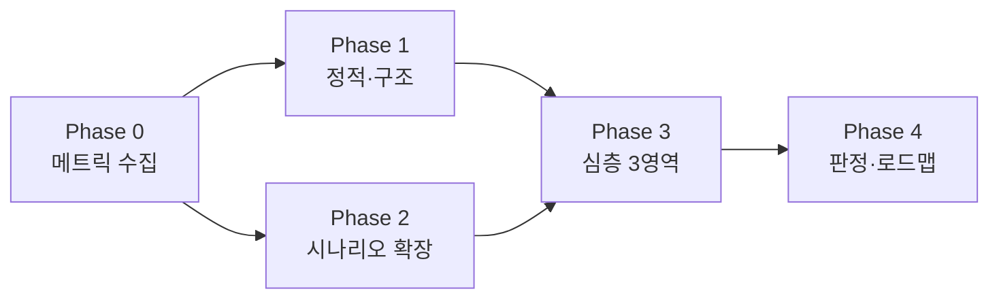

# Code Quality Review Plan — 구조·확장성·유지보수 검토

> **상태:** MVR **실행 완료** (2026-06-12) · Full Review 잔여  
> **목적:** 「잘 짜였는가 · 확장 가능한가 · 유지보수 쉬운가 · 더 나은 방법은」를 **증거 기반**으로 판단  
> **범위:** `lib/` + `test/` (**앱 검토**) · `tool/`은 **3모듈 spot check**만 · `akasha-db`는 gate 확인  
> **산출:** [reviews/](../reviews/) — [baseline](../reviews/code-metrics-baseline.md) · [structure](../reviews/code-quality-structure-review.md) · [report](../reviews/code-quality-review-report.md)  
> **개편 계획:** [app-architecture-refactor-plan.md](app-architecture-refactor-plan.md) (MVR Should-fix → Wave 매핑)  
> **상위:** [product-vision.md](../product-vision.md) · [data-architecture-redesign.md](../strategy/data-architecture-redesign.md) · [baseline-v1.md](../strategy/baseline-v1.md)

---

## 1. 한 줄

**출시 전·후에 코드베이스를 6개 축으로 점검하고, 개선안은 ADR·소규모 PR 단위로만 제안한다.**  
리라이트·Riverpod 전면 도입은 **본 검토의 비목표**.

---

## 2. 검토 질문 (North Star)

| # | 질문 |
|---|------|
| Q1 | **490 → 5k → 50k** 카탈로그에서 앱·tool이 버티는가? |
| Q2 | **서재·볼트·사전** 3축 기능을 추가할 때 `home_screen`만 커지지 않는가? |
| Q3 | 신규 기여자가 **어디를 고쳐야 하는지** 30분 안에 찾을 수 있는가? |
| Q4 | 테스트 없이 깨지기 쉬운 **결합 지점**이 어디인가? |
| Q5 | 데이터·제품 정책(Tier1 no-poster 등)이 **코드 구조**와 일치하는가? |

---

## 3. 현재 스냅샷 (검토 출발점)

| 항목 | 수치·사실 |
|------|-----------|
| `lib/**/*.dart` | **121** 파일 |
| `test/**/*.dart` | **67** 파일 · **254** tests green |
| `tool/**/*.dart` | **113** 파일 |
| 최대 파일 | `home_screen.dart` **~1385줄** · import **70** |
| 500줄+ 파일 | 6개 (home, work_detail_workspace, poster_card, fusion_search, work_library_panel, franchise_fusion) |
| 350~499줄 | 4개 (add_work_dialog, works_registry, web_image_search, registry_shard_loader) |
| `testWidgets` | **~10** (5 파일) |
| 상태 관리 | `StatefulWidget` + plain `Home*Controller` · `WorkbenchController`(ChangeNotifier) **혼재** |
| DI | **싱글톤 서비스** (`AkashaFileService()`, `WorksRegistry`, `RegistrySyncService` 등) |
| Riverpod | **미도입** (ROADMAP v1.1+) |
| 데이터 설계 | **v4 샤딩·wk_** — 문서·gate 성숙 ([baseline-v1](../strategy/baseline-v1.md)) |
| 앱 설계 | **부분 분할** — `home/` coordinator 추출 진행 중 · God screen 잔존 |

**가설 (검증 대상):**

- **강점:** Tier1/Tier2 분리 · registry tool·CI · `HomeRegistrySync` coordinator · `LibraryMembershipApply` SSOT · `MyLibraryPipeline`  
- **약점:** 홈 화면 오케스트레이션 집중 · 싱글톤 테스트 격리 · Controller 패턴 불일치 · 대형 위젯·다이얼로그

---

## 4. 검토 축 (6 Dimensions)

### D1 — 모듈 경계·결합도 (Coupling)

**무엇을 본다**

- 화면 → 서비스 → 모델 의존 방향 (역방향 import 여부)
- `home_screen`이 직접 import하는 모듈 수·책임 수
- `lib/screens/home/*` vs `lib/screens/home_screen.dart` 역할 분담

**방법**

```powershell
# import fan-out (수동 보조)
rg "^import " lib/screens/home_screen.dart | Measure-Object
rg "home_screen" lib --glob "*.dart" -l
```

**산출:** 결합도 히트맵 (High / Medium / Low) · **God object 후보 Top 5**

---

### D2 — 응집도·파일 크기 (Cohesion)

**기준선 (권장, v1 실무)**

| 구분 | 줄 수 | 판정 |
|------|------|------|
| Screen | ≤ 400 | ✅ |
| Widget | ≤ 350 | ✅ |
| Service | ≤ 400 | ⚠️ 초과 시 분할 검토 |
| Dialog | ≤ 250 | ⚠️ |

**대상 파일 (우선 검토)**

| 파일 | 줄 | 검토 포인트 |
|------|---:|-------------|
| `home_screen.dart` | ~1385 | 오케스트레이션 vs UI 혼재 |
| `work_detail_workspace.dart` | ~650 | 워크벤치 4열 책임 |
| `poster_card.dart` | ~505 | 표시 정책·카드 UI·DnD 혼재 |
| `fusion_search_dialog.dart` | ~466 | 검색 로직 UI 내장 |
| `franchise_fusion_service.dart` | ~412 | IP 1카드 알고리즘 복잡도 |
| `add_work_dialog.dart` | ~377 | Dialog 기준(250) 초과 |
| `works_registry.dart` + `registry_shard_loader.dart` | ~725 | 로더·캐시·필터 경계 |

**산출:** 파일별 「책임 1문장」 + 분할 후보·**분할 안 해도 되는 이유**

---

### D3 — 확장성 (Extensibility)

**시나리오 기반 — “추가하면 어디가 아픈가”**

| 시나리오 | 터치 포인트 예상 | 검증 방법 |
|----------|------------------|-----------|
| E1 새 `MediaCategory` 1종 | enums, parser, folder, grid chip | 체크리스트 15분 |
| E2 curated 서재 필드 1개 추가 | `PersonalLibraryConfig`, storage, pipeline | 기존 test 확장 |
| E3 카탈로그 **5k** manifest | loader, search_index, cold start | **기존 validation 대조** — 전체 재실험 생략 ([bottleneck](../validation/registry-bottleneck-validation-report.md) · [5k](../validation/scale-5k-risk-analysis.md)) |
| E4 Steam IAP 실결제 | `EntitlementService` only? | grep + 시퀀스 다이어그램 |
| E5 Wikidata discovery insert | `tool/discovery` → app 경계 | shadow_write 경로 추적 |
| E6 UI i18n (ARB) | 하드코딩 문자열 grep | `lib/` 한글 리터럴 샘플링 |

**산출:** 시나리오별 **확장 비용** (S/M/L) · blocking coupling 목록

---

### D4 — 테스트·관측 가능성 (Testability)

**현황**

- Unit test 풍부 (`tool/`, parser, membership, registry codec)
- Widget test 일부 (`work_library_panel`, `widget_test` smoke)
- **통합:** `home_screen`·전체 browse flow E2E **거의 없음**

**검토 항목**

| 항목 | 질문 |
|------|------|
| 싱글톤 | `resetForTesting` / mock 주입 가능한가? |
| File I/O | vault·registry disk 의존 테스트 격리 |
| Flutter binding | `path_provider` mock 패턴 일관성 |
| 회귀 | 신기능 PR 시 **어떤 test가 막아주는가** |

**산출:** 테스트 피라미드 갭 · **우선 추가할 5개 테스트** (행동 기준)

---

### D5 — 일관성·컨벤션 (Consistency)

| 영역 | 기대 패턴 | 점검 |
|------|-----------|------|
| 네이밍 | `*Service`, `*Controller`, `*Dialog` | 불일치 목록 |
| Controller | `WorkbenchController`(CN) vs `Home*Controller`(plain) | 갱신 경로·네이밍 점검 |
| async/error | `mounted` 체크 · SnackBar | home vs detail 비교 |
| SSOT | `memberOrder`, `work_id`, poster policy | `CatalogPosterPolicy` vs [data-policy](../data-policy.md) |
| Feature flag | `FeatureFlags` | v1 off 기능 경로 |
| Deprecated | 0 call site | `rg @Deprecated` |

**산출:** 컨벤션 위반 Top 10 (자동 + 수동)

---

### D6 — 성능·리소스 (Performance)

**프로파일 없이 할 수 있는 정적 검토**

| 항목 | 위험 신호 |
|------|-----------|
| cold start | `main.dart` prefetch 범위 |
| 그리드 | `FranchiseFusion` 전체 재계산 빈도 |
| vault watch | 400ms debounce · 대량 md |
| search | `search_index` 전량 메모리 ([bottleneck report](../validation/registry-bottleneck-validation-report.md)) |
| rebuild | `setState` on `home_screen` 범위 |

**산출:** P0/P1 성능 리스크 · **측정이 필요한 3개 실험** (시간·메모리)

---

## 5. 실행 Phase



### Phase 0 — 메트릭 베이스라인 (0.5일) ✅ MVR

| # | 작업 | 산출 |
|---|------|------|
| 0.1 | 파일 줄 수·import 수 Top 20 | [code-metrics-baseline.md](../reviews/code-metrics-baseline.md) |
| 0.2 | `flutter analyze` · test count | [cleanup-inventory](../cleanup-inventory.md) · [release-readiness](../release-readiness-checklist.md) **인용** |
| 0.3 | `rg` 한글 UI 문자열 샘플 | i18n 준비도 (ARB 미도입) |
| 0.4 | 싱글톤·static 서비스 목록 | testability 인벤토리 |

**DoD:** baseline 문서 1페이지 ✅

---

### Phase 1 — 정적·구조 리뷰 (1~2일)

| # | 작업 | 담당 축 |
|---|------|---------|
| 1.1 | `home_screen` 책임 분해 (메서드·필드 목록) | D1, D2 |
| 1.2 | `lib/services/` 의존 그래프 (mermaid) | D1 |
| 1.3 | 500줄+ 파일 각 30분 리뷰 | D2 |
| 1.4 | `@Deprecated` · dead path | D5 |

**DoD:** 「결합 High 5 · 분할 후보 3 · **Keep 패턴 3**」표 ✅ → [structure review](../reviews/code-quality-structure-review.md)

---

### Phase 2 — 확장 시나리오 드릴 (1~2일)

| # | 시나리오 | 방법 |
|---|----------|------|
| 2.1 | E1~E3 (카테고리·서재·5k) | 체크리스트 + 기존 validation 도구 |
| 2.2 | E4 IAP | 시퀀스 + 단일 진입점 확인 |
| 2.3 | E5 discovery | tool→db→번들 경로 추적 |
| 2.4 | E6 i18n | 문자열 grep 통계 |

**DoD:** 시나리오별 S/M/L 비용 · E3는 **기존 문서 diff 표** (재스파이크 선택)  
**MVR:** E3·E4만 — E3 대조 ✅ · E4 IAP 시퀀스 ✅

---

### Phase 3 — 심층 3영역 (2~3일)

**병렬 가능 — 각 영역 4~6시간**

| 영역 | 파일·모듈 | 핵심 질문 |
|------|-----------|-----------|
| **A. Registry 런타임** | `works_registry`, `registry_shard_loader`, `registry_sync_service` | 5k에서 loader·캐시 전략 충분한가 |
| **B. 홈·서재 UX** | `home_screen`, `home/*`, `my_library_pipeline`, `library_membership_apply` | 새 담기 경로 추가 시 변경 파일 수 |
| **C. 워크벤치** | `workbench/*`, `work_detail_workspace` | E2 「저장하고 담기」 재사용 가능한가 |

**DoD:** 영역별 **강점 3 · 리스크 3 · 개선안 1~2** (각 PR ≤ 3일 추정)  
**MVR:** **B. 홈·서재만** ✅ — A·C는 Full Review

---

### Phase 4 — 종합 판정·로드맵 (0.5~1일) ✅ MVR

**산출:** [code-quality-review-report.md](../reviews/code-quality-review-report.md)

| 섹션 | 내용 |
|------|------|
| Executive | 총평 1페이지 (출시 관점) |
| 점수표 | D1~D6 · Green / Amber / Red |
| Must-fix (출시 전) | 최대 3건 · **`structure` / `feature` / `ops` 태그 분리** |
| Should-fix (v1.1) | 우선순위 Top 5 |
| Won't-fix / Defer | Riverpod 전면 등 |
| 대안 비교 | 2~3개 (예: home coordinator vs Riverpod scope) |

**판정 루브릭**

| 등급 | 의미 |
|------|------|
| **Green** | v1 출시·5k 병행에 구조적 blocker 없음 |
| **Amber** | 기술부채 있으나 **국소 리팩터**로 흡수 가능 |
| **Red** | 확장 시나리오에서 **측정된 blocker** (근거 필수) |

---

## 6. 평가 기준 (체크리스트 요약)

### 유지보수 쉬움?

- [ ] 신규 기능의 **진입 파일**이 1~2개로 설명 가능
- [ ] God file 1개 미만 (또는 분할 계획·일정 있음)
- [ ] 정책 변경(data-policy) 시 **단일 config/policy** 계층 존재
- [ ] PR 리뷰어가 **테스트로 회귀** 확인 가능

### 확장성 높음?

- [ ] 5k manifest **실측** cold start·검색 latency 기록
- [ ] 새 curated 필드·매체가 **스키마 migration** 패턴 있음
- [ ] Discovery insert가 app 런타임과 **분리** (tool only)

### 더 나은 방법?

- [ ] 각 Amber 항목에 **2안 비교** (비용·리스크·v1 적합성)
- [ ] ADR 필요 여부 표시 ([adr/README.md](../adr/README.md))

---

## 7. 비목표 (명시적 제외)

| 항목 | 이유 |
|------|------|
| Riverpod 전면 마이그레이션 | ROADMAP v1.1+ · 리스크 |
| `home_screen` 1PR 전면 분할 | 출시 diff |
| akasha-db 스키마 변경 | baseline-v1 고정 |
| UI 디자인 리뉴얼 | 제품 검토 별도 |
| 100% test coverage | 비용 대비 |

---

## 8. 일정·리소스 (1인 스튜디오)

### Full Review (~8일)

| Phase | 기간 | 누적 |
|-------|------|------|
| 0 | 0.5일 | 0.5일 |
| 1 | 1~2일 | 2.5일 |
| 2 | 1~2일 | 4.5일 |
| 3 | 2~3일 | 7.5일 |
| 4 | 0.5~1일 | **~8일** |

### MVR — Minimum Viable Review (~2.5일) ✅ **출시 전 권장**

| Day | 내용 | 산출 |
|-----|------|------|
| 0.5 | Phase 0 (0.3~0.4) + Phase 1.1 | [baseline](../reviews/code-metrics-baseline.md) |
| 1 | Phase 3B + E4 | [structure](../reviews/code-quality-structure-review.md) |
| 0.5 | Phase 4 | [report](../reviews/code-quality-review-report.md) |

**병행:** MVR ║ M2 P0 QA + depot  
**권장 순서:** repo cleanup ✅ → **MVR** ✅ → M2 수동 QA → Full Phase 2~3A,C (출시 후)

---

## 9. 기존 문서·도구 연계

| 문서·도구 | 검토에서 쓰는 방식 |
|-----------|-------------------|
| [registry-bottleneck-validation-report.md](../validation/registry-bottleneck-validation-report.md) | D6 실측 근거 |
| [search-index-validation-plan.md](../validation/search-index-validation-plan.md) | E3 5k 시나리오 |
| [scale-5k-risk-analysis.md](../validation/scale-5k-risk-analysis.md) | D3 Top3 리스크 대조 |
| ROADMAP §코드 품질 | Phase 4 개선안 입력 |
| `tool/preflight_check` | 회귀 gate (검토 중 유지) |

---

## 10. 즉시 시작 (Phase 0 첫날)

```powershell
# 메트릭
Get-ChildItem lib -Recurse -Filter *.dart | ForEach-Object { ... }  # 줄 수
C:\src\flutter\bin\flutter.bat test
C:\src\flutter\bin\flutter.bat analyze lib/

# 결합
rg "^import " lib/screens/home_screen.dart
rg "AkashaFileService\(\)|WorksRegistry\.|RegistrySyncService\(\)" lib --glob "*.dart" -c
```

→ `docs/reviews/code-metrics-baseline.md` 초안 작성

---

## 11. 문서 이력

| 일자 | 변경 |
|------|------|
| 2026-06-12 | v1 계획 — 6축 · 5 Phase · AKASHA 스냅샷 반영 |
| 2026-06-12 | v2 — MVR/Full 분리 · tool 범위 · Controller·Keep 패턴 · E3 재실험 생략 |
| 2026-06-12 | **MVR 실행** — reviews/ 3문서 · 종합 Amber |
