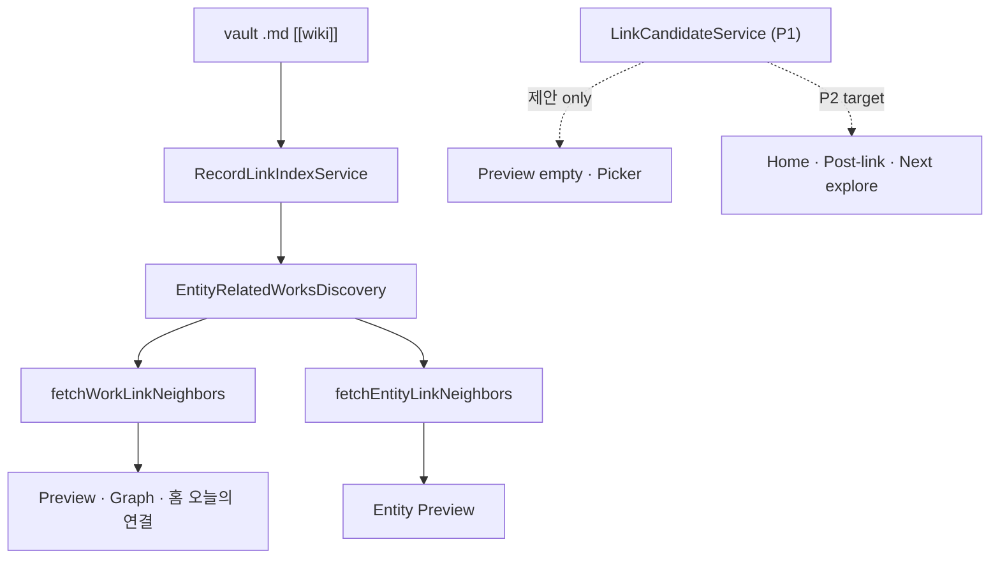

# R8 P2 Discovery Surface Audit

> **일자:** 2026-06-22
> **Sprint:** R8-P2 Discovery Surface
> **전제:** R8-P0/P1 Foundation 완료 — 첫 연결 생성 경로 확보
> **선행:** [R6_DISCOVERY_AUDIT.md](./R6_DISCOVERY_AUDIT.md), [R7_DISCOVERY_FOUNDATION_AUDIT.md](./R7_DISCOVERY_FOUNDATION_AUDIT.md), [R8_P1_IMPLEMENTATION_REPORT.md](./R8_P1_IMPLEMENTATION_REPORT.md)
> **SSOT:** [PROJECT_CONSTITUTION.md](../../closure-2026-07/PROJECT_CONSTITUTION_STUB.md), [CURRENT_STATE.md](../../../active/CURRENT_STATE.md)

**금지 준수:** Search Index · Recall Validation · Link Index Schema · Discovery Semantics · Collection Pipeline · Registry Sync · Preview Stack · Save Return **무변경**
**범위:** Discovery **Engine** 수정 없음 · **Surface** (Home · Preview · Graph UI) 강화만

---

## Executive Summary

| 질문 | 한 줄 답 |
|------|----------|
| Q1 오늘의 연결 | **실제 링크 이웃**이지만 **최신 Work 순 스캔** · characters/connectedWorks만 · event/concept **제외** |
| Q2 LinkCandidate @ Home | **가능** — 엔진 변경 없이 cold/unlinked Work에 **제안 레이어**로 삽입 |
| Q3 Preview 연결 후 | **1~2홉 neighbors** · Entity Preview · Graph count · Save Return — **능동 제안 없음** |
| Q4 Graph | **단순 조회** (리스트형) · 연결 밀도 정렬 · pull-only |
| Q5 링크 후 능동 노출 | neighbors · connectedWorks 2홉 · 홈 하이라이트(지연) — **「다음 연결」제안 없음** |

**P1이 해결한 것:** 연결 **전** (Cold Graph)
**P2가 해결할 것:** 연결 **후** (Warm Graph) — 앱이 관계를 **보여주고 이어갈 경로를 제안**

---

## Discovery 파이프라인 재확인 (코드 기준)



| 계층 | 파일 | P2에서 |
|------|------|--------|
| Link Index | `RecordLinkIndexService` | ❌ 무변경 |
| Discovery | `EntityRelatedWorksDiscovery` | ❌ 무변경 |
| Work neighbors | `work_link_neighbors.dart` | ❌ semantics 유지 · Surface만 소비 |
| Entity neighbors | `entity_link_neighbors.dart` | ❌ 동일 |
| Link candidates | `link_candidate_service.dart` | ✅ Surface 확장 (excludeLinked) |

**갱신 타이밍:** save → `signalVaultChanged` → 800ms debounce `rebuildLinkIndex` → `vault.loadItems` → Home `vaultItems` 갱신 → `HomeDashboardTodaysLinksSection.didUpdateWidget` 재로드.

---

## Audit Q1 — 「오늘의 연결」은 실제로 무엇을 보여주는가?

**파일:** `home_dashboard_todays_links_section.dart`

### 데이터 소스

```dart
// L60-80: vaultItems를 addedAt 내림차순 → 각 Work에 fetchWorkLinkNeighbors
for (final work in sorted) {
  if (highlights.length >= 3) break;
  for (final person in neighbors.characters) { ... }
  for (final connected in neighbors.connectedWorks) { ... }
}
```

| 항목 | 실제 동작 |
|------|-----------|
| Work 선택 순서 | `vaultItems` **`addedAt` 최신순** (링크 시점·밀도 무관) |
| 이웃 계산 | `fetchWorkLinkNeighbors` — Link Index + Discovery |
| characters | **직접 링크 Person** + `relatedCharactersForWork` **heuristic 보충** |
| connectedWorks | 직접 Work 링크 (+3) · 공유 Entity 경유 Work (+1) — **2홉** |
| **미포함** | `neighbors.events` · `neighbors.concepts` |
| 카드 표시 | `Work → 인물/작품 · {target title}` |
| 탭 동작 | entity → `onOpenEntity` · connectedWork → `onOpenWork` |

### 이름 vs 실제

| 기대 (Discovery Surface) | 실제 |
|--------------------------|------|
| 오늘 **새로 생긴** 연결 | ❌ 링크 타임스탬프 없음 · **최신 추가 Work** 스캔 |
| 관계 **발견** 하이라이트 | ⚠️ 2홉 connectedWorks 포함하나 **선택 기준 비투명** |
| 다양한 엔티티 타입 | ❌ Person·Work만 |

### 갱신 갭

- `didUpdateWidget`은 `vaultItems` 변경만 감지 — link index rebuild 후 items reload되면 **갱신됨**
- 링크 직후 ~1s 지연 (autosave + 800ms index) 후 반영
- **연결 0인 최신 Work**가 먼저 스캔되면 빈 neighbors → **다음 Work로 skip 없이** 루프 계속 (비효율·빈 카드 없음)

### 판정

**반쯤 Discovery:** 실제 그래프 이웃을 쓰지만, **최신 추가순 큐레이션**이라 R6 「최근 발견」과 **차별화 약함**. event/concept·「다음 연결」제안 부재.

---

## Audit Q2 — LinkCandidateService를 Home에서 활용할 수 있는가?

**파일:** `link_candidate_service.dart`

### 현재 API

```dart
LinkCandidateService.candidatesForWork({
  required AkashaItem work,
  required UserCatalogPort userCatalog,
  EntityAnchorType? typeFilter,
  Set<String>? excludeEntityIds,  // ← P2 핵심
  int limit = 8,
})
```

### Home 활용 가능성

| 시나리오 | 활용 | Engine 변경 |
|----------|:----:|:-------------:|
| 연결 0 Work가 오늘의 연결 상위에 걸릴 때 | **「연결 제안」카드** (creator/tag/seed) | ❌ |
| 이미 1+ 링크 있는 Work | `excludeEntityIds: linkedIds` → **다음 연결** chip | ❌ |
| 홈 전역 cold start | 최근 Work 1건에 대해 candidates 상위 1~2 | ❌ |
| 「최근 발견」대체 | ❌ — addedAt과 목적 충돌 · 섹션 역할 분리 유지 |

### 제약

- LinkCandidate는 **제안** — 그래프 엣지 생성은 기존 `insertWikiLink`만
- Home에서 연결 CTA까지 넣으면 Preview/Workbench **진입 경로** 필요 — `onConnectSuggested` 패턴 **재사용 가능** (P1)

### 판정

**✅ 활용 가능** — Discovery Semantics 변경 없이 Home Surface에 **「아직 연결 안 된 후보」** 레이어 추가 가능.

---

## Audit Q3 — Work Preview 연결 이후 추가 발견 경로

**파일:** `dashboard_preview_panel.dart`, `work_link_neighbors_sections.dart`, `entity_link_neighbors.dart`

### 연결 있음 (`neighbors.hasAnyLink || tags.nonEmpty`)

| 경로 | 데이터 | 홉 |
|------|--------|:--:|
| 주요 인물 | 직접 링크 + tag heuristic | 1 (+추정) |
| 연결된 작품 | 직접 + 공유 Entity | 1~2 |
| 관련 사건/개념 | 직접 링크만 | 1 |
| conceptTags | work.tags 표시 (링크 아님) | — |
| Entity 탭 | `onOpenEntity` → Entity Preview | — |
| 연결 목록 | `onGoKnowledgeGraph` | pull |

### Entity Preview (연결 후)

`fetchEntityLinkNeighbors`:

- `connectedWorks` — 이 Entity를 가리키는 Work들
- persons/events/concepts — **Entity journal outgoing만** (Work에서 링크해도 B↔C Entity 2홉 **없음**)

### Save Return (`home_shell_controller._maybeReturnToPreviewAfterSave`)

- Preview에서 연결 시작 → Workbench 저장 → **Preview 복귀**
- `dashboard_preview_panel`은 `item.workId` 동일 시 neighbors **재로드 안 함** (`didUpdateWidget` workId만 비교)
- **갭:** 링크 직후 Preview 복귀 시 `vaultItems`/linkIndex는 갱신되나 **panel이 item 참조만 같으면 neighbors stale 가능** — `linkIndex` 또는 neighbors revision 전달 필요 (Surface fix, semantics 무변경)

### P1이 추가한 경로 (연결 **전**만)

- `WorkPreviewEmptyConnections` — 「추천 연결」chips
- 조건: `!hasAnyLink && tags.isEmpty` — **연결 1건 생기면 추천 섹션 사라짐**

### 판정

연결 **후** 발견은 **기존 neighbors pull**에 한정. **「다음으로 탐험할 연결」**(미연결 후보) Surface **없음** — P2-C 타겟.

---

## Audit Q4 — Graph(연결 목록)는 발견 도구인가 조회 도구인가?

**파일:** `knowledge_graph_view.dart`

| 특성 | 코드 사실 |
|------|-----------|
| 형태 | `ListView` + `ExpansionTile` — **노드 그래프 아님** (L128 카피 명시) |
| 정렬 | `_linkCounts` (entityIdsForWork 개수) **내림차순** |
| 상호작용 | 펼침 시 `fetchWorkLinkNeighbors` lazy load |
| empty | CTA: 기록 열기 · 엔티티 연결하기 |
| 발견성 | 연결 **많은** Work 우선 — 밀집 영역 힌트는 있음 |
| 능동성 | **없음** — 사용자가 Work 펼쳐야 이웃 표시 |
| 2홉 | `WorkLinkNeighborsSections` — Preview와 **동일** |
| LinkCandidate | **미사용** |

### R3B 판정 재확인

| 기준 | 평가 |
|------|------|
| 발견 도구 | ⚠️ **약함** — 정렬은 유의미하나 제안·하이라이트 없음 |
| 조회 도구 | ✅ **주 목적** — 볼트 전체 연결 인벤토리 |

### 판정

**단순 조회 + 약한 밀도 탐색**. P2에서 Graph 구조 변경 없이 **「새 연결 후 해당 Work 행 하이라이트」**·**미연결 Work에 제안 배너** 정도는 Surface 범위.

---

## Audit Q5 — 새 링크 후 앱이 능동적으로 보여줄 수 있는 정보

### 이미 가능 (Engine 그대로)

| 정보 | 소스 | 현재 노출 | 지연 |
|------|------|-----------|------|
| 새로 링크된 Entity | `entityIdsForWork` | Preview neighbors (갱신 시) | ~1s |
| 공유 Entity 경유 Work | `discoverAll` + workScores | connectedWorks | 동일 |
| Entity→Work 역방향 | `discovery.discover` | Entity Preview | 동일 |
| 홈 하이라이트 | todays_links | 최신 Work 스캔 | items reload 후 |
| Graph 연결 수 | `entityIdsForWork.length` | subtitle +1 | `_loadCounts` **수동** — vaultItems 변경 시 **재호출 없음** (갭) |

### 아직 안 보여주는 것 (Surface만으로 추가 가능)

| 정보 | 구현 수단 | P2 매핑 |
|------|-----------|---------|
| **다음 연결 제안** | `LinkCandidateService` + `excludeEntityIds` | P2-C |
| 링크 직후 **2홉 Work** 강조 | neighbors.connectedWorks 상단 배너 | P2-B |
| **미연결** 최신 Work에 creator 후보 | Home card hybrid | P2-A |
| event/concept in 오늘의 연결 | neighbors.events/concepts 카드에 포함 | P2-A |
| Graph **방금 연결한 Work** 펼침 힌트 | `recentLinkedWorkId` state (UI only) | P2-B optional |

### 능동성 한계 (Engine — P2 범위 밖)

- 3홉 이상 · ML 추천 · 푸시 알림
- Place/Organization neighbors
- 링크 **시각** 기반 「오늘」정렬 (Schema 변경 필요)

---

## 조사 대상 파일 요약

| 파일 | 역할 | P2 Gap |
|------|------|--------|
| `home_dashboard_todays_links_section.dart` | 홈 연결 하이라이트 | event/concept 누락 · 최신순만 · 제안 없음 |
| `home_dashboard_recent_discovery_section.dart` | **addedAt 최신 4 Work** | 이름≠관계 · LinkCandidate 무관 |
| `work_preview_empty_connections.dart` | 연결 0 CTA + P1 추천 | 연결 후 **사라짐** |
| `work_link_neighbors.dart` | neighbors semantics | 변경 금지 · 소비만 |
| `entity_link_neighbors.dart` | Entity 이웃 | 변경 금지 |
| `link_candidate_service.dart` | Work 후보 | Home·post-link **미연결** |
| `knowledge_graph_view.dart` | 연결 목록 | index 갱신 미반영 · 제안 없음 |

---

## P1 대비 Surface 상태

| Surface | P1 (연결 전) | P2 필요 (연결 후) |
|---------|-------------|-------------------|
| Preview empty | ✅ 추천 연결 | — |
| Preview linked | neighbors만 | **다음 탐험** 제안 |
| Picker | ✅ 이 작품과 관련 | exclude linked 확장 |
| Home 오늘의 연결 | neighbors 일부 | Discovery **큐레이션** + 제안 hybrid |
| Graph | 조회 only | post-link **highlight** (optional) |

---

## R8-P2 구현 계획 (제안)

### 원칙

1. **Engine 0 diff** — `fetchWorkLinkNeighbors` · Discovery · Index 그대로
2. **LinkCandidate = 제안 레이어** — 연결 실행은 P0/P1 경로 재사용
3. **Preview Stack / Save Return** — chrome·복귀 로직 유지 · neighbors **갱신 키**만 추가 가능

---

### P2-A — Home 「오늘의 연결」Discovery Surface화

**목표:** 실제 관계 하이라이트 + 미연결 Work에 제안

| 항목 | 구현 |
|------|------|
| A1 | Work 우선순위: **링크 있는 Work 먼저** (`entityIdsForWork > 0`) · 동점 시 addedAt |
| A2 | 하이라이트 타입 확장: **events · concepts** 카드 추가 (기존 neighbors 필드) |
| A3 | 하이라이트 3칸 미달 + 링크 0 Work 존재 시: **LinkCandidate 1칸** 「연결 제안」카드 |
| A4 | 카드 부제에 관계 유형 표시: `2홉 작품` · `creator` · `인물` 등 |
| A5 | `didUpdateWidget`: `linkIndex` revision 또는 vaultItems **참조 동일 시 hash** 갱신 (선택) |

**파일:** `home_dashboard_todays_links_section.dart` (+ 소형 `home_dashboard_link_highlight.dart` helper optional)

**테스트:** highlight 정렬 · event 카드 · candidate 카드 렌더

---

### P2-B — 새 링크 생성 직후 발견 이웃 노출

**목표:** Save Return 후 사용자가 **새로 열린 그래프**를 즉시 인지

| 항목 | 구현 |
|------|------|
| B1 | `dashboard_preview_panel`: `linkIndex`/`vaultItems` 변경 시 `_neighborsFuture` **재로드** (workId 동일 허용) |
| B2 | neighbors 로드 후 **신규 링크 배너** (선택): connectedWorks 상위 1건 「이 작품과도 연결됨」 |
| B3 | Workbench 저장 후 controller에 `lastLinkedWorkId` (session UI state) → Graph 해당 행 **accent** (optional, Graph only) |
| B4 | **제안 strip**: 링크 후 `LinkCandidateService.candidatesForWork(excludeEntityIds: linked)` 상위 2 — Preview 하단 |

**파일:** `dashboard_preview_panel.dart`, `work_link_neighbors_sections.dart` (배너 위젯), `home_shell_controller.dart` (optional session flag)

**금지 준수:** Save Return 흐름 유지 · Preview chrome 무변경

---

### P2-C — Preview 「다음으로 탐험할 연결」

**목표:** `hasAnyLink` 상태에서 **미연결 후보** 제안

| 항목 | 구현 |
|------|------|
| C1 | `WorkLinkNeighborsSections` 하단 또는 `dashboard_preview_panel`에 **「다음 탐험」** 섹션 |
| C2 | `LinkCandidateService.candidatesForWork(excludeEntityIds: linkedEntityIds, limit: 3)` |
| C3 | chip 탭 → `onConnectSuggested` (P1) 재사용 |
| C4 | linkedEntityIds = `discovery.entityIdsForWork` — **제외만** · neighbors 계산 변경 없음 |

**조건:** `neighbors.hasAnyLink` — empty CTA와 **분리** (empty는 P1 추천 유지)

**파일:** `dashboard_preview_panel.dart`, 신규 `work_preview_next_connections.dart` (소형 위젯)

---

### 구현 순서 · 리스크

| 순서 | 항목 | 리스크 | 완화 |
|:----:|------|--------|------|
| 1 | **P2-C** | Preview 레이아웃 | 섹션 **추가만** · chrome 무변경 |
| 2 | **P2-B** | stale neighbors | `didUpdateWidget` linkIndex trigger |
| 3 | **P2-A** | Home 혼잡 | 카드 3 유지 · 타입 혼합 |

### 테스트 계획

| 테스트 | 내용 |
|--------|------|
| `link_candidate_service` | excludeEntityIds 회귀 (기존) |
| `home_dashboard_todays_links_section_test` | linked-first 정렬 · event highlight |
| `dashboard_preview_panel_test` | next connections 섹션 · post-link reload |
| widget | 추천 chip → onConnectSuggested |

### 비목표 (P2)

- `home_dashboard_recent_discovery_section` 이름 변경/로직 교체
- Graph → 실제 node 그래프
- Discovery engine · neighbors heuristic 변경
- Place/Organization

---

## 관련 산출물 (예정)

- `docs/history/programs/discovery-r6-r13/R8_P2_IMPLEMENTATION_REPORT.md` — 구현 후

---

## Audit 결론

R8-P1까지 AKASHA는 **「첫 연결을 만들 수 있다」**. R8-P2는 **「연결한 뒤 무엇을 더 탐험할지 앱이 말해준다」**로 Discovery Level 1→2 **체감**을 올린다. Engine은 이미 2홉·neighbors 데이터를 가지고 있으나, Surface가 **최신순 나열·pull-only·연결 후 제안 부재**로 발견 가치를 숨기고 있다. **LinkCandidateService + neighbors 소비 확장**만으로 금지 범위 내 구현 가능하다.
