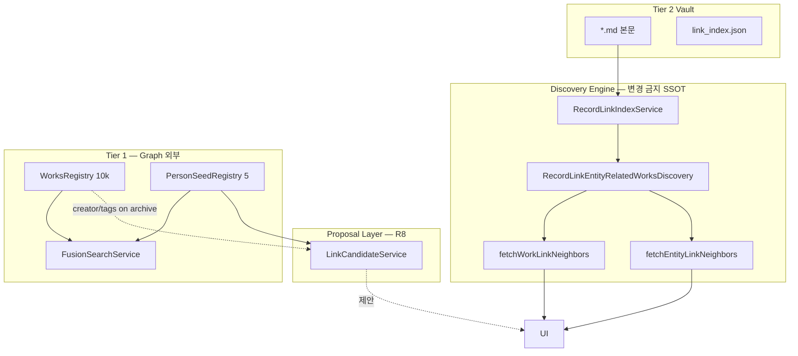

# R9 Discovery Engine Audit

> **일자:** 2026-06-22
> **유형:** 코드 기준 Engine·Surface 경계 분석 (코드 수정 없음)
> **선행:** [R6_DISCOVERY_AUDIT.md](./R6_DISCOVERY_AUDIT.md), [R7_DISCOVERY_FOUNDATION_AUDIT.md](./R7_DISCOVERY_FOUNDATION_AUDIT.md), [R8_DISCOVERY_IMPLEMENTATION_PLAN.md](./R8_DISCOVERY_IMPLEMENTATION_PLAN.md), [R8_P1_LINK_CANDIDATE_DESIGN.md](./R8_P1_LINK_CANDIDATE_DESIGN.md), [R8_P2_DISCOVERY_SURFACE_AUDIT.md](./R8_P2_DISCOVERY_SURFACE_AUDIT.md), [R8_P2_IMPLEMENTATION_REPORT.md](./R8_P2_IMPLEMENTATION_REPORT.md)
> **SSOT:** [PROJECT_CONSTITUTION.md](../../closure-2026-07/PROJECT_CONSTITUTION_STUB.md), [CURRENT_STATE.md](../../../active/CURRENT_STATE.md)

**방법:** 추측 금지 · 아래 인용 파일·함수 기준만 사용.

---

## Executive Summary

AKASHA Discovery는 **vault `[[wiki]]` 링크에서 파생된 집합 조회**가 핵심이다. 자동 그래프 탐색 엔진은 없으며, **실질 자동 확장은 2홉(Work→Entity→Work)까지**다. R8 Foundation/Surface는 **연결 전·후 제안 레이어**를 추가했으나, **10k Registry 그래프**와 **Place/Organization**은 여전히 파이프라인 밖 또는 UI에서 절단된다.

| Discovery Level | R6 판정 | R9 재평가 (R8 반영) |
|-----------------|---------|---------------------|
| 0 기록 | ✅ | ✅ |
| 1 직접 연결 | ✅ | ✅ |
| 2 이웃 발견 | ⚠️ 부분 | ⚠️ **2홉 Work만** · cap · pull · P2 Surface 보강 |
| 3 관계 발견 | ❌ | ❌ |
| 4 예상 밖 발견 | ❌ | ❌ |

---

## 1. Discovery 아키텍처 (코드 맵)



| 계층 | 파일 | 역할 |
|------|------|------|
| Index | `record_link_index_service.dart` | vault `.md` 스캔 → `outgoing` / `incoming` (schema v1) |
| Discovery | `entity_related_works_discovery.dart` | Entity↔Work 집합 · `entityIdsForWork` |
| Work neighbors | `work_link_neighbors.dart` | UI용 이웃 + 2홉 Work 점수 + tag heuristic |
| Entity neighbors | `entity_link_neighbors.dart` | Entity journal outgoing + incoming count |
| Proposal | `link_candidate_service.dart` | Work 맥락 후보 (링크 **생성 전**) |
| Global search | `fusion_search_service.dart` | 쿼리 기반 · 그래프 무관 |

---

## 2. Q1 — 몇 홉(hop)까지 발견 가능한가?

### 2.1 1홉 — 직접 연결

| 경로 | 코드 | 조건 |
|------|------|------|
| **Work → Entity** | `entityIdsForWork` (`entity_related_works_discovery.dart` L100–124) | incoming: Work md가 Entity를 가리킴 · outgoing: Entity journal이 Work id를 가리킴 |
| **Work → Work** | `linkIndex.outgoingLinks(filePath)` (`work_link_neighbors.dart` L84–92) | 본문 `[[wk_…]]` 직접 링크 · score **+3** |
| **Entity → Work** | `discover(entityId)` (`entity_related_works_discovery.dart` L127–155) | incoming record paths → workId · journal outgoing 중 Work id |

**UI 노출:** `WorkLinkNeighbors` characters/events/concepts · `EntityLinkNeighbors.connectedWorks`.

### 2.2 2홉 — 공유 Entity 경유 Work

```dart
// work_link_neighbors.dart L95–102
final relatedByEntity = await discovery.discoverAll(linkedEntityIds);
for (final workId in related.workIds) {
  workScores[workId] = (workScores[workId] ?? 0) + 1;
}
```

| 경로 | 의미 | 제한 |
|------|------|------|
| **Work A → Entity B → Work C** | A와 C가 **같은 Entity**를 링크 | `connectedWorks`만 · vault에 **C의 md 존재** 필요 · limit **4** |
| **Work A → Work B** (직접) | 1홉이지만 score 우선 (+3 > +1) | 동일 |

**공유 Work 경유 Entity 확장:** **없음**. `fetchEntityLinkNeighbors`는 **해당 Entity journal의 outgoing**만 (`entity_link_neighbors.dart` L64–94) — Work A에서 B로 링크해도 **B Preview에 A 외 Entity 2홉 없음**.

### 2.3 2홉 — 공유 작품 경유 Entity

| 경로 | 코드 판정 |
|------|-----------|
| Work A · Work C가 **같은 Work D**를 링크 → Entity E 발견 | **미구현** — Work co-reference 집계 없음 |
| Entity B의 `discover` → 여러 Work → 다른 Entity | **미구현** — `discoverAll`은 Work id 집합만 반환 |

### 2.4 3홉 이상 · 다중 홉

| 탐색 | 결과 |
|------|------|
| BFS/DFS 그래프 순회 | **코드 없음** |
| `EntityRelatedWorksDiscovery` | Entity당 **Work id Set** 1회 조회 — **홉 전파 없음** |
| Franchise 2홉 | `FranchiseRegistry` — Fusion **중복 제거·힌트**만 · neighbors **미연동** |

### 2.5 Q1 요약표

| 홉 유형 | 구현 | UI | vault md 필요 |
|---------|:----:|:--:|:-------------:|
| Work ↔ Entity 직접 | ✅ | ✅ | ✅ |
| Work ↔ Work 직접 | ✅ | ✅ connectedWorks | ✅ |
| Work → Entity → Work | ✅ | ✅ connectedWorks (+1) | ✅ (C) |
| Entity → Entity (공유 Work) | ❌ | ❌ | — |
| Entity → Entity (journal chain) | ⚠️ 1홉만 | Entity Preview outgoing | ✅ |
| 3홉+ | ❌ | ❌ | — |

**결론:** Engine 기준 **자동 발견 천장 = 2홉 (Work–Entity–Work)**. 그 외는 사용자가 **각 노드를 수동으로 열어** 1홉씩 반복해야 한다.

---

## 3. Q2 — 「이미 연결된 것」만인가? 약한 신호는?

### 3.1 Engine 계층 (Link Index + Discovery)

| 데이터 | Index/Discovery 사용 | 근거 |
|--------|---------------------|------|
| `[[wiki]]` explicit id | ✅ incoming/outgoing | `record_link_index_service.dart` |
| `[[Title]]` title-only | ✅ catalog/vault 해석 성공 시 | `_incomingTargetId` L251–267 |
| `work.creator` | ❌ | Discovery 코드 경로 **없음** |
| `work.tags` | ❌ | Index/Discovery **없음** |
| PersonSeed | ❌ | Discovery **없음** |
| Registry metadata | ❌ | 10k Work는 **vault md 없으면 그래프 노드 아님** |

**판정:** `EntityRelatedWorksDiscovery` · `RecordLinkIndexService`는 **「이미 파싱된 링크」만** 그래프로 취급한다.

### 3.2 Neighbors 계층 — 약한 신호 혼입 (1곳)

`fetchWorkLinkNeighbors` L69–78:

```dart
if (characters.length < characterLimit) {
  for (final entity in relatedCharactersForWork(...)) {
    characters.add(entity);
  }
}
```

| 신호 | 소스 | 그래프 엣지 | UI 구분 |
|------|------|:-----------:|:-------:|
| tag overlap | `work_related_characters.dart` | **없음** | ❌ 링크된 Person과 **동일 섹션** |
| title = person.title | 동일 | 없음 | ❌ |

**판정:** **Person 한정** tag heuristic이 neighbors에 **링크 없이** 표시된다. Event/Concept/Place에는 heuristic **없음**.

### 3.3 Proposal 계층 (R8 — 링크 생성 **전**)

`LinkCandidateService` (`link_candidate_service.dart`):

| reason | score | 그래프 엣지 | 용도 |
|--------|:-----:|:-----------:|------|
| creator | 10/7 | 없음 (제안) | Preview/Home/Picker |
| tag | 5/4/3 | 없음 | 동일 |
| seed | 2 | 없음 (선택 시 승격) | Cold Graph |
| catalog | 1 | 없음 | fallback |

**소비 Surface (R8):** Preview empty · Picker · Home 오늘의 연결(연결 제안 카드) · Preview next connections (`excludeEntityIds`).

**판정:** 약한 신호는 **「발견」이 아니라 「연결 제안」**으로만 사용. 사용자가 선택해 `insertWikiLink`해야 그래프에 진입한다.

### 3.4 Fusion Search (Registry)

`fusion_search_service.dart` L75–80: local `creator` · `tags` **검색 토큰**.
**쿼리 필수** · neighbor expansion **없음** · 개인 그래프 **미반영**.

### 3.5 Q2 종합

| 계층 | 연결된 것만? | 약한 신호 |
|------|:------------:|-----------|
| Link Index | ✅ | ❌ |
| Discovery | ✅ | ❌ |
| Work neighbors | ⚠️ Person heuristic | tag (표시만) |
| LinkCandidate | N/A (pre-link) | creator/tag/seed/catalog |
| Fusion | N/A (search) | registry/local metadata |

---

## 4. Q3 — 10k Registry vs Vault 그래프 단절

### 4.1 단절 지점 (코드)

| # | 지점 | 파일 | 결과 |
|---|------|------|------|
| **R1** | Registry Work 검색 선택 | `home_dialogs_coordinator.dart` L103–108 | `HomeAutoArchive.itemFromRegistryWork` → **메모리 Preview** · `filePath` 없을 수 있음 |
| **R2** | Link Index 대상 | `record_link_index_service.dart` L77 | **vault `.md`만** 스캔 |
| **R3** | Discovery vaultItems | `RecordLinkEntityRelatedWorksDiscovery` | `_vaultItems` — **볼트 Work만** `connectedWorks` 해석 |
| **R4** | Person Seed 검색 | `_openEntityFromSearch` L191–195 | `CollectibleOpener.findEntity(userCatalog)` — seed만 있으면 **실패** |
| **R5** | Registry 관계 필드 | `RegistryWork` | `creator` 문자열 · **구조화 Person 엣지 없음** |
| **R6** | Auto-archive | `home_auto_archive.dart` L49–53 | Registry → vault md **일괄 생성** · Entity/링크 **생성 안 함** |

### 4.2 Registry metadata가 Vault로 오는 경로

| 경로 | creator/tags 전달 |
|------|-------------------|
| Auto-archive / `itemFromRegistryWork` | `AkashaItem.creator` · `tags` ← `RegistryWork` (L101–105) |
| md 파싱 + registry merge | `markdown_parser.dart` L262–276 |
| LinkCandidate (vault Work) | archived Work의 creator/tags **사용 가능** |

### 4.3 「아직 기록하지 않은」Registry Work를 Discovery로 끌어올 경로

| 경로 | Discovery 성격 | 그래프 포함 |
|------|----------------|:-----------:|
| **Fusion Search** | 사용자 쿼리 → 10k hit | ❌ |
| **Registry Preview** (검색) | `itemFromRegistryWork` Preview | ❌ (md 없음) |
| **Auto-archive** | 설정 시 vault md 생성 | ⚠️ 노드만 · 링크 0 |
| **Library add** | 나의 서재 멤버십 | ❌ 그래프 |
| **LinkCandidate** | vault Work의 creator → **Person seed/catalog** | ❌ Registry **Work** 제안 **없음** |
| **connectedWorks 2홉** | vault 내 Work만 | ❌ Registry |
| **Franchise hint** | Fusion dedupe | ❌ neighbors |

**결론:** **미아카이브 Registry Work는 개인 Discovery 그래프에 자동 진입하지 않는다.** 유일한 대량 유입은 **Auto-archive(사용자 설정)** 또는 **검색 후 수동 아카이브**. creator/tags는 **아카이브된 Work**를 통해 **간접**적으로 LinkCandidate에만 기여한다.

---

## 5. Q4 — Place / Organization 파이프라인

`EntityIdCodec` (`entity_id_codec.dart` L16–17): prefix `pl_` · `or_` — **ID 체계는 존재**.

### 5.1 단계별 상태

| 단계 | Person/Event/Concept | Place | Organization |
|------|---------------------|:-----:|:------------:|
| **ID codec** | ✅ | ✅ `pl_` | ✅ `or_` |
| **userCatalog 저장** | ✅ | ✅ 가능 | ✅ 가능 |
| **Archive-first flow** | ✅ `entity_archive_service.dart` L12–15 | ❌ 미포함 | ❌ |
| **Entity Link Picker** | ✅ `_linkableTypes` | ❌ | ❌ |
| **PersonSeed fallback** | ✅ | ❌ | ❌ |
| **LinkCandidateService** | ✅ `_linkableTypes` L50–54 | ❌ | ❌ |
| **Preview empty CTA** | ✅ 3버튼 | ❌ | ❌ |
| **Link Index incoming** | ✅ id 있으면 인덱싱 | ⚠️ **인덱스 가능** | ⚠️ 동일 |
| **fetchWorkLinkNeighbors** | ✅ switch | ❌ `default: break` L64–65 | ❌ |
| **fetchEntityLinkNeighbors** | ✅ switch | ❌ `default: break` L90–91 | ❌ |
| **WorkLinkNeighborsSections UI** | ✅ 4섹션 | ❌ 섹션 없음 | ❌ |
| **Home 오늘의 연결** | ✅ (R8 P2) | ❌ | ❌ |
| **Graph expansion** | ✅ | ❌ (링크해도 타일에 **미표시**) | ❌ |
| **Fusion entity hits** | Person seed | catalog Person만 | catalog만 |

**핵심 갭:** Place/Org를 **링크해도** `entityIdsForWork`에는 포함될 수 있으나 (`incoming`에 id 등록), `fetchWorkLinkNeighbors` switch가 **버킷에 넣지 않아** Preview·Graph·Home에서 **발견 불가**.

---

## 6. Q5 — Discovery Level 재평가 (R8 반영)

### Level 0 — 기록

| 항목 | 상태 | 코드 |
|------|------|------|
| vault md 아카이브 | ✅ | `AkashaFileService` |
| Fusion 로컬+10k 검색 | ✅ | `fusion_search_service.dart` |
| 홈 최근 기록 | ✅ | `home_dashboard_recent_records_section.dart` |
| R8 LinkCandidate | ✅ pre-link 제안 | 연결 **전** 단계 |

### Level 1 — 직접 연결

| 항목 | 상태 | 코드 |
|------|------|------|
| `[[wiki]]` → Index | ✅ | `RecordLinkIndexService` |
| Preview/Workbench neighbors | ✅ | `fetch*LinkNeighbors` |
| R8 Cold Graph Path A | ✅ | seed + candidate + insertWikiLink |

### Level 2 — 이웃 발견

| 항목 | R6 | R9 (R8 후) |
|------|-----|------------|
| Work→Entity→Work 2홉 | ⚠️ | ⚠️ 동일 Engine · **P2 Surface** (오늘의 연결·next connections) |
| Person tag heuristic | ⚠️ | ⚠️ 동일 · **미표시 구분** |
| 홈 proactive | ❌ | ⚠️ **3카드** 하이라이트 + 연결 제안 |
| Pull-only | ✅ | ✅ Graph/Preview 여전히 pull |
| cap 4/4/3/3 | ✅ | ✅ |
| Place/Org | ❌ | ❌ |

**R8 변화:** Engine Level 2 **불변**. Surface에서 **제안·하이라이트**로 Level 2 **체감**만 상승.

### Level 3 — 관계 발견

| 기대 | 코드 |
|------|------|
| 패턴 요약 («이 작가의 3작품») | ❌ |
| creator-franchise 자동 클러스터 | ❌ (Franchise는 Fusion만) |
| Cast 컬렉션 insight | ❌ (필터만 · `CollectibleCollectionPipeline`) |
| Entity↔Entity 공유 Work | ❌ |

### Level 4 — 예상 밖 발견

| 기대 | 코드 |
|------|------|
| 3홉+ surfacing | ❌ |
| ML/embedding | ❌ |
| 세렌디피티 랭킹 | ❌ |
| Registry 10k → 개인 그래프 자동 확장 | ❌ |

---

## 7. Home · Graph Surface (R8 P2 이후)

| Surface | Engine 데이터 | R8 P2 변경 |
|---------|---------------|------------|
| **오늘의 연결** | neighbors + LinkCandidate | 링크 밀도 우선 · event/concept · 연결 제안 |
| **최근 발견** | `addedAt` top 4 | **변경 없음** · 그래프 무관 |
| **계속 탐험하기** | `RecentExplorationStore` | 변경 없음 |
| **Knowledge Graph** | `entityIdsForWork` count + neighbors | vault/index 갱신 시 reload |
| **Preview** | neighbors + LinkCandidate next | post-link 제안 |

---

## 8. Person Seed · Registry Work 요약

| 자산 | 규모 | Discovery Engine | Proposal | Search |
|------|------|------------------|----------|--------|
| **WorksRegistry** | ~10,048 | vault md 후에만 | creator→Person만 간접 | Fusion `searchAsync` |
| **PersonSeedRegistry** | 5 (`person_seed.json`) | ❌ | ✅ LinkCandidate/Picker | Fusion `entityGlobalHits` |
| **userCatalog** | 가변 | 링크 후 | ✅ tag/catalog | Fusion `catalogHits` |

---

## 9. 다음 Discovery ROI Top 5

R8 완료 후 **Engine 변경 없이 ROI가 높은 순** + Engine 확장이 필요한 항목 포함.

| Rank | 항목 | 왜 ROI가 높은가 | 우선순위 | 예상 난이도 | Engine/Surface |
|:----:|------|-----------------|:--------:|:-----------:|:--------------:|
| **1** | **Place/Organization 파이프라인 완결** | 링크해도 neighbors·Picker·Candidate·CTA **전부 누락** — 헌법 5대 엔티티 중 2개 **발견 불가** | **P0** | **M** (Surface + picker buckets; archive flow 별도) | 주로 Surface · neighbors switch 확장 |
| **2** | **Registry Work Link Candidate** (`creator`/`tags` → **같은 creator 10k Work** 제안) | 10k와 개인 그래프 **단절(R3)** 의 직접 해소 · vault 없이 **「다음 작품」** 제안 | **P0** | **M–H** | Proposal 확장 · Registry read-only · **그래프 엣지는 사용자 아카이브 시** |
| **3** | **Fusion Person Seed → catalog 자동 승격 (D2)** | 검색 탭 seed 선택 **실패** (`_openEntityFromSearch`) · R8 P0 승격 로직 **재사용** | **P1** | **L** | Surface/flow only |
| **4** | **Entity↔Entity 발견 (공유 Work 경유)** | Work A→B 링크 후 **B와 같은 Work를 가리키는 다른 Entity** 미노출 · Level 2 **천장 상향** | **P1** | **H** | **Discovery semantics 확장** — `fetchEntityLinkNeighbors` 또는 신규 discover |
| **5** | **약한 신호 UI 분리 + Registry franchise neighbors** | tag heuristic과 **실링크 혼동** 제거 · `FranchiseRegistry`를 connectedWorks **보조 신호**로 (vault Work 한정) | **P2** | **L–M** | Surface 라벨링 + optional score in neighbors |

### Rank 1 상세 — Place/Organization

- `fetchWorkLinkNeighbors` / `fetchEntityLinkNeighbors` switch에 `place` · `organization` 버킷
- `WorkLinkNeighborsSections` 섹션 추가
- `EntityLinkPickerCandidates._linkableTypes` · `LinkCandidateService` · Preview CTA 확장
- `EntityArchiveService.usesArchiveFirstFlow` — 정책 결정 필요 (R1 범위 밖이면 catalog-only)

### Rank 2 상세 — Registry Work Candidate

- `LinkCandidateService`에 `RegistryPort` 주입 · `work.creator` 매칭 `registry.searchAsync(creator)` → **미아카이브 Work** 제안
- 선택 시: 기존 Preview (`itemFromRegistryWork`) 또는 auto-archive + LinkCandidate Person 연결
- **Discovery Engine 변경 없이** 10k를 **제안 레이어**로 끌어올림

### 의도적 비포함 (낮은 ROI / 높은 비용)

| 항목 | 사유 |
|------|------|
| 3홉+ BFS Engine | Level 4 · Schema·성능·UX 전면 설계 |
| Link timestamp in Index | Schema 변경 금지 이력 · 「오늘의 연결」진짜 구현은 별 Sprint |
| 「최근 발견」로직 교체 | addedAt 역할 분리 유지 (R8 P2 결정) |
| ML ranking | Constitution 검색 품질 우선이나 인프라 과다 |

---

## 10. Audit 결론

AKASHA Discovery **Engine**은 R6 분석 이후 **구조적으로 동일**하다: **vault 링크 파생 · 최대 2홉 Work 확장 · 집합 조회**. R8은 **Proposal Layer**와 **Surface**로 Cold/Warm Graph **체감**을 크게 올렸으나, **Level 3–4**와 **Registry 그래프 융합**·**Place/Org**는 여전히 미해결이다.

다음 Sprint의 최고 ROI는 **(1) Place/Org 파이프라인 완결**과 **(2) Registry Work를 Link Candidate로 끌어오는 것** — 둘 다 헌법 「발견」에 직접 기여하며, (2)는 Engine 변경 없이 10k 단절을 완화할 수 있다.

---

## 관련 문서

- [R8_P2_DISCOVERY_SURFACE_AUDIT.md](./R8_P2_DISCOVERY_SURFACE_AUDIT.md)
- [R8_P1_IMPLEMENTATION_REPORT.md](./R8_P1_IMPLEMENTATION_REPORT.md)
