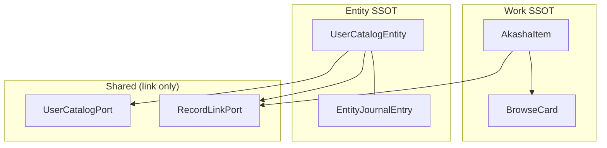

# R2-E Architecture Alignment Check

> **상태:** 조사 완료 (구현 없음)  
> **날짜:** 2026-06-19  
> **설계 의도:** Work · Person · Concept · Event = **동급 Collectible** (Entity ≠ Work metadata)

---

## Executive Summary

코드는 **두 개의 병렬 browse stack**으로 분리되어 있다.

| Stack | SSOT | Gallery | Detail | 감상 진입 |
|-------|------|---------|--------|-----------|
| **Work** | `AkashaItem` | `BrowseCard` → `PosterCard` | `WorkDetailWorkspace` | Workbench |
| **Entity** | `UserCatalogEntity` + journal | `CatalogEntityBrowseView` | `EntityJournalDialog` | Sheet |

Work 「특별 취급」은 **모델·파이프라인·카드·정렬·Workbench 전 구간**에 걸쳐 있으나, **Entity는 이미 독립 gallery + Sheet**를 갖는다.  
Collectible 통합의 **첫 추상화 대상 = `CollectibleRef` (id + kind + title + tap route)** — pipeline/card 통합 이전.  
**병렬 유지가 유리한 구간:** Phase 1~2 (Entity gallery, type filter, Sheet).  
**통합 비용 < 유지 비용 전환점:** mixed grid + personal library Entity membership + semantic collection filter **동시 요구** (Phase 3+).

---

## 0. 사용자 흐름 vs 현재 코드

목표: 스바루 카드 → Sheet → Re:Zero → 다른 캐릭터

```
[CatalogEntityBrowseView]  tap
        ↓
[EntityJournalDialog]      incoming Record → openRecordPath
        ↓
[Workbench openWork]       wiki [[pe_u_…]] tap
        ↓
[EntityJournalDialog]      (다른 Person)
```

| 단계 | 코드 | 상태 |
|------|------|:----:|
| 1. 스바루 카드 감상 | `CatalogEntityBrowseView` (ListTile, grid 미구현) | △ UI |
| 2. Sheet | `showEntityJournalDialog` | ✅ |
| 3. Re:Zero 이동 | `_IncomingLinksSection` → `RecordLinkNavigator.findVaultItemForRecordPath` → `onOpenWork` | ✅ |
| 4. Work에서 캐릭터 탐색 | `WorkbenchShell` → `onWikiLinkTap` → `RecordLinkNavigator.navigateLink` | ✅ |

**Collectible 동급 「감상」:** Work=Workbench, Entity=Sheet — **진입 surface는 다르지만 연결 탐색 graph는 공유** (`RecordLinkPort`).

---

## 1. Work 「특별 취급」 계층 — 코드 기준

### 1.1 의존성 규모 (lib/*.dart 파일 수)

| 심볼 | 파일 수 | 역할 |
|------|--------:|------|
| `AkashaItem` | **~75** | Work SSOT · vault · registry · UI 전반 |
| `BrowseCard` | **~26** | Work gallery view model |
| `PosterCard` | **~5** | Work card widget |
| `UserCatalogEntity` / `CatalogEntityBrowseView` | **~17** | Entity parallel stack |

### 1.2 모델



| Work 전용 | Entity parallel | 공유 |
|-----------|-----------------|------|
| `AkashaItem` (`workId`, `MediaCategory`, rating, status, poster, HoF) | `UserCatalogEntity` (`entityId`, `EntityAnchorType`, aliases) | `title`, `addedAt`, vault `.md` |
| `BrowseCard` (formatSlots, franchiseId) | `EntityBrowseCard` (설계, 미구현) | — |
| `RegistryWork` / `WorksRegistry` | `UserCatalogStore` | Fusion merge tiers |
| `ContentItem` / `GameItem` status enums | journal `body` | wiki `[[entityId\|Title]]` |

**Work 특별점:** `AkashaItem` abstract contract가 **감상 상태 API** (`myStatus`, `workStatus`, `rating`)를 core로 강제 → Entity가 같은 타입 불가.

**Entity가 Work metadata로 취급되는 흔적:**
- `BrowseEntityScope.work` / `.all` → Work grid **우선** (`showsWorkGrid`)
- `UserCatalogEntity.isWorkEntity` — catalog 내 Work mirror
- Fusion: Work hits vs Entity hits **별도 섹션** (`FusionSearchSections`)
- **반박:** Entity journal · catalog · Sheet · type scope browse — **독립 lifecycle** (Archive-First policy)

### 1.3 파이프라인

| Pipeline | 입력 | 출력 | Entity |
|----------|------|------|:------:|
| `BrowsePipeline` | `List<AkashaItem>` + `BrowseFilterState` | `List<BrowseCard>` | ❌ |
| `MyLibraryPipeline` | `AkashaItem` + `PersonalLibraryConfig` | `BrowseCard` | ❌ |
| `FranchiseFusionService` | registry + vault works | `BrowseCard` | ❌ |
| `CatalogEntityBrowseView._reload` | `UserCatalogPort` + `BrowseEntityScope` | `List<UserCatalogEntity>` | ✅ 전용 |

**Work 특별:** `BrowseFilterState` = domain · **MediaCategory** · workStatus · myStatus — Entity scope **별도** (`HomeBrowseFilterController.entityScope`, filterState에 **미포함**).

**Routing split** (`home_shell_body.dart`):

```
entityScope.showsWorkGrid ?
  BrowseView → BrowsePipeline → BrowseDashboardSections
  : CatalogEntityBrowseView (Entity only)
```

### 1.4 카드

| | Work | Entity |
|--|------|--------|
| Widget | `PosterCard` ← `HomePosterCardFactory` | `_CompactEntityCard` / `ListTile` |
| Input | `BrowseCard` → `AkashaItem` | `UserCatalogEntity` |
| Grid | `BrowsePosterGrid` / `CuratedReorderGrid` | **없음** (ListView) |
| DnD | `WorkDraggableCard` | ❌ |
| Context menu | library · hide registry/franchise | ❌ |

### 1.5 정렬

| API | 대상 | Work 필드 |
|-----|------|-----------|
| `sortBrowseCards` | `BrowseCard` | rating, releaseYear, title, addedAt |
| `sortItems` | `AkashaItem` | 동일 |
| `CatalogEntityBrowseView` | Entity | **`addedAt` only** |

`SortCriteria.ratingDesc` · `yearDesc` · HoF · watchlist — **Work 전용**. Entity는 `helpers.dart` sort 경로 **미사용**.

### 1.6 Workbench

| | Work | Entity |
|--|------|--------|
| Controller | `WorkbenchController.openWork(AkashaItem)` | ❌ |
| Detail | `WorkDetailWorkspace` (Sanctum, rating, poster) | `EntityJournalDialog` |
| Tabs | `WorkTab` × N | ❌ |
| Wiki navigate | `onWikiLinkTap` → Entity Sheet **or** Work | ✅ |

**의도적 분리:** Entity 「감상」= Sheet 편집 + link graph — Workbench Sanctum **부적합** (Step 1.5).

### 1.7 Work 특별 취급 요약표

| 계층 | Work 특별 | Entity 독립 존재 |
|------|-----------|-----------------|
| **모델** | `AkashaItem` 75 files | `UserCatalogEntity` + journal |
| **파이프라인** | Browse + MyLibrary + Fusion | `_reload` only |
| **카드** | PosterCard factory | Compact / ListTile |
| **정렬** | 5 criteria (rating/year/HoF) | addedAt |
| **Workbench** | 전용 tab workspace | Sheet (parallel) |
| **Filter UI** | domain/category/status | scope chip (type) |
| **Personal library** | memberOrder **workId** | ❌ |
| **Link graph** | — | **공유** RecordLinkPort |

---

## 2. Collectible 계층 — 무엇을 먼저 추상화?

### 2.1 ❌ 먼저 하면 안 되는 것

| 후보 | 이유 |
|------|------|
| `CollectibleCard` 통합 위젯 | Work/Entity layout·필드 차이 큼 — Phase 1 deliverable 지연 |
| `BrowsePipeline` 확장 | registry fusion · status filter = Work 전용 |
| Workbench Entity tab | Sheet 기능 중복 · 대규모 |

### 2.2 ✅ 1순위: `CollectibleRef` (navigation + identity)

**최소 union — 기존 타입 mapping only:**

```dart
enum CollectibleKind { work, person, concept, event, place, organization, custom }

class CollectibleRef {
  final CollectibleKind kind;
  final String id;           // workId | entityId
  final String title;        // AkashaItem.title | UserCatalogEntity.title
}
```

**왜 먼저:** 사용자 흐름(§0)은 **탐색 graph**가 core — 카드 shape 통합보다 **「어디로 열까」** routing SSOT가 선행.

**사용처 (즉시):**
- `RecordLinkNavigator` — 이미 work vs entity 분기
- Fusion search tap routing
- (future) mixed collection member list

### 2.3 2순위: `CollectibleBrowseItem` (gallery row)

Step 3 설계 `EntityBrowseCard` + Work side `BrowseCard` adapter:

| 필드 | Work source | Entity source |
|------|-------------|-----------------|
| `ref` | CollectibleRef.work | CollectibleRef.person/… |
| `subtitle` | creator | aliases[0] |
| `summary` | — | journal preview |
| `archived` | vault | journal exists |

**Pipeline 통합 아님** — **gallery cell model** only.

### 2.4 3순위: `CollectibleCollection` (user-defined sets)

장기 vision (영웅 · IP cast) — §4.

### 2.5 추상화 순서

```
CollectibleRef (tap route)
  → EntityBrowseCard + EntityCollectibleCard (Entity gallery)
  → EntityRelatedWorksDiscovery (IP filter, derived)
  → CollectibleCollection + tags (semantic filter)
  → CollectibleCard / unified grid (Phase 3+)
```

---

## 3. 병렬 vs 통합 — 비용 전환점

### 3.1 병렬 안 (현재 + EntityCollectibleCard)

**변경:** ~4–8 files (`entity_browse_card`, `entity_collectible_card`, `catalog_entity_browse_view`, tests)

**유지 비용:**
- Grid metrics 2벌 (BrowsePosterGrid vs Entity Wrap)
- Card chrome 2벌 (PosterCard vs EntityCollectibleCard)
- Filter 2축 (`BrowseFilterState` vs `BrowseEntityScope`)
- Detail 2벌 (Workbench vs Sheet) — **의도적·영구**

### 3.2 통합 안 (CollectibleCard)

**변경:** ~25–40 files (Step 0.5) — `poster_card`, `browse_card`, pipelines, `browse_dashboard_sections`, `personal_library_view`, DnD, sort, factory, tests

### 3.3 전환점 (코드 기준 트리거)

| # | 트리거 | 병렬 한계 | 통합 필요 surface |
|---|--------|-----------|-------------------|
| T1 | **동일 grid에 Work + Person** (`BrowseEntityScope.all` today = strip + work grid) | 2 layout 병치 | `BrowseDashboardSections` or unified Wrap |
| T2 | **Personal library에 Entity membership** | `memberOrder: workId` only | `MyLibraryPipeline`, `PersonalLibraryMembershipService`, DnD |
| T3 | **semantic collection filter** (영웅 tag) | tags 없음 + type-only scope | filter model + catalog schema |
| T4 | **curated reorder mixed types** | `CuratedReorderGrid(BrowseCard)` | collection member union |
| T5 | **card chrome 3+ divergence** 유지보수 | Person/Concept/Event subtle UX | shared `CollectibleCard` shell |

**전환점 판정:**

| Phase | 권장 | 이유 |
|-------|------|------|
| **1–2** | **병렬** | T1~T4 미충족 · Entity gallery + Sheet만 목표 |
| **2.5** | 병렬 + `CollectibleRef` | graph navigation 통일 · card는 분리 |
| **3** | **T1 또는 T2 발생 시** 통합 ROI | strip+grid UX 한계 or 서재 Entity |
| **3+** | T3+T4 → **CollectibleCollection** 선행, full CollectibleCard는 optional |

**유지 비용 > 통합 비용:** **T1 + T2** 동시 또는 **T1 + T3** — 대략 **mixed IP gallery + semantic collection** 요구 시점.

---

## 4. 장기 collection — 선행 데이터 모델

### 4.1 시나리오별

| Collection | 필수 선행 | 파생 가능 (저장 없음) | 비고 |
|------------|-----------|----------------------|------|
| **영웅 tag Person** | **`Entity.tags: List<String>`** (catalog + journal mirror) | — | Work.tags는 **Entity에 없음** |
| **Re:Zero 등장 Person** | **`EntityRelatedWorksDiscovery`** (link index) | incoming from `wk_u_rezero` paths | explicit `relatedWorkIds` = P2 최적화 |
| **마녀교 관련 Concept** | **`Entity.tags`** or concept **cluster tag** | link graph query on `[[co_u_…]]` | faction = tag가 현실적 |

### 4.2 반드시 선행 (우선순위)

| P | 모델 / 계층 | 이유 | 코드 현황 |
|---|-------------|------|-----------|
| **P0** | **`Entity.tags`** | semantic filter SSOT | ❌ 없음 |
| **P0** | **`CollectibleCollection`** (id, name, `memberRefs: List<CollectibleRef>`, optional filter spec) | user-defined 「영웅」「Re:Zero cast」 | ❌ `PersonalLibraryConfig` = workId only |
| **P1** | **`EntityRelatedWorksDiscovery`** (derived) | IP-scoped browse without tag | API 조합만 (Step 2) |
| **P1** | **`CollectibleRef`** | mixed member · tap route | ❌ |
| **P2** | `Entity.relatedWorkIds` (optional explicit) | index rebuild 비용 · offline | ❌ |
| **P2** | Entity `coverUri` | card parity | policy 금지 |

### 4.3 `CollectibleCollection` sketch (설계)

```dart
class CollectibleCollection {
  final String id;
  final String name;
  final List<CollectibleRef> members;      // explicit curation
  final CollectibleCollectionFilter? filter; // dynamic: tag, relatedWorkId, kind
}

class CollectibleCollectionFilter {
  final CollectibleKind? kind;               // person only
  final List<String>? tagsAll;             // hero
  final String? relatedWorkId;             // wk_u_rezero
}
```

**기존 `PersonalLibraryConfig`와 관계:** today workId `memberOrder` — **확장 또는 병렬** (Work library ≠ semantic collection).

### 4.4 선행 없이 불가능한 것

- 「영웅」only browse — **tags 없으면 불가**
- Personal library Person shelf — **CollectibleCollection or memberRefs**
- 동일 grid Work+Person — **CollectibleBrowseItem** (통합 UI; tags 불필요)

---

## 5. 설계 의도 정렬 — 권장 로드맵

| 단계 | 목표 | Work stack | Entity stack | Collectible layer |
|------|------|------------|--------------|-------------------|
| **R2-E Phase 1** | Entity 독립 gallery | **무변경** | `EntityCollectibleCard` + grid | `EntityBrowseCard` |
| **Phase 2** | Work badge · IP filter | 무변경 | card + discovery | `EntityRelatedWorksDiscovery` |
| **Phase 2.5** | graph navigation SSOT | 무변경 | Sheet 유지 | **`CollectibleRef`** |
| **Phase 3** | tags · collections | adapter only | tags schema | **`Entity.tags` + `CollectibleCollection`** |
| **Phase 4** | mixed grid / unified card | refactor if T1+T2 | merge gallery | `CollectibleCard` (optional) |

**원칙:** Entity ≠ Work metadata — **동급 Collectible**이지만 **감상 surface (Workbench vs Sheet)는 분리 유지 가능**.

---

## 6. 관련 문서 · 파일

| 문서 | 내용 |
|------|------|
| [r2e-step0.5](r2e-step0.5-collectible-architecture-audit.md) | PosterCard · CollectibleItem 설계 |
| [r2e-step2](r2e-step2-entity-relation-discovery-audit.md) | Work relation derived |
| [r2e-step3](r2e-step3-entity-collection-surface-audit.md) | CatalogEntityBrowseView surface |
| [user-local-catalog-policy.md](../policy/user-local-catalog-policy.md) | Entity = Tier 2 SSOT |
| [link-identity-policy.md](../policy/link-identity-policy.md) | graph canonical |

| 코드 | Work 특별 |
|------|-----------|
| `lib/models/akasha_item.dart` | Work model |
| `lib/models/browse_card.dart` | Work card VM |
| `lib/services/browse_pipeline.dart` | Work pipeline |
| `lib/widgets/poster_card.dart` | Work card UI |
| `lib/utils/helpers.dart` | Work sort |
| `lib/features/workbench/` | Work detail |
| `lib/screens/home/views/catalog_entity_browse_view.dart` | Entity gallery |
| `lib/services/record_link_navigator.dart` | **공유 graph** |
