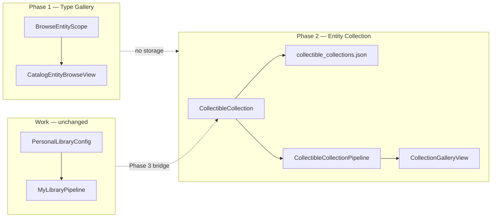

# R2-E Collection Architecture Audit

> **상태:** 조사 완료 (구현 없음)  
> **날짜:** 2026-06-19  
> **설계 의도:** 장기 vision = **사용자 정의 Collection** (영웅 · IP cast · concept cluster)

---

## Executive Summary

현재 코드에서 「컬렉션」에 **가장 가까운 것 = `PersonalLibraryConfig` (curated) + `memberOrder`** — 단 **Work ID 전용** · Entity 불가.  
`DashboardConfig`는 **필터 preset** (멤버 없음). `BrowseEntityScope`는 **비영속 type filter**.  
`CuratedReorderGrid`는 **BrowseCard DnD UI** — 저장소 아님.  
**Phase 2 최소 저장:** `PersonalLibraryStorageService` 패턴 복제 → `{vault}/.akasha/collectible_collections.json` **신규 모델** (PersonalLibraryConfig 일반화 ❌).  
**Phase 1** Entity Gallery는 collection storage **불필요**.

---

## 1. 「컬렉션」에 가장 가까운 구조

### 1.1 비교표 (코드 기준)

| 구조 | 사용자 이름 | 멤버 목록 | 순서 | Entity | 영속 | UI |
|------|:-----------:|:---------:|:----:|:------:|:----:|-----|
| **`PersonalLibraryConfig` curated** | ✅ `name` | ✅ `memberOrder` | ✅ manual + DnD | ❌ | ✅ vault JSON | PersonalLibraryView |
| **`PersonalLibraryConfig` filter** | ✅ | △ filter-derived | ❌ | ❌ | ✅ | 동일 |
| **`DashboardConfig`** | ✅ | ❌ | ❌ | ❌ | prefs | BrowseView filter |
| **`BrowseEntityScope`** | chip label | △ catalog filter | addedAt | ✅ type | ❌ session | CatalogEntityBrowseView |
| **`CuratedReorderGrid`** | — | — | ✅ UI only | ❌ | ❌ | reorder handle |
| **`memberOrder`** | — | ✅ field | SSOT | workId strings | via library | — |
| **`SortCriteria.manualOrder`** | — | view state | ✅ | Work cards | section prefs | curated sort |
| **`isHallOfFame`** | — | item flag | — | ❌ | vault md | HoF section |
| **`user_entities.json`** | — | catalog index | — | ✅ all | vault | ❌ UI 노출 금지 |
| **`link_index.json`** | — | graph derived | — | ✅ | vault | Sheet incoming |

### 1.2 1순위: `PersonalLibraryConfig` (curated)

**저장:** `{vault}/.akasha/personal_libraries.json` (`PersonalLibraryStorageService`)

```dart
// lib/models/personal_library_config.dart
PersonalLibraryMode mode;      // filter | curated
List<String> memberOrder;      // curated SSOT — today workId only
Set<MediaCategory> categories;   // overlay filter
Set<String> workStatuses / myStatuses;
List<String> inclusionRules;   // default ['archived'] — Work archive gate
```

**파이프라인:** `MyLibraryPipeline._buildCurated` → `RegistryPort.setContainsWorkId` → `BrowseCard`

**UI:** sidebar library list · `PersonalLibraryView` · `CuratedReorderGrid` (manual sort 시)

**「영웅 컬렉션」과의 gap:** Person entityId 저장 필드 없음 · pipeline이 `AkashaItem`만 resolve.

### 1.3 2순위: filter-mode library / dashboard

- **`PersonalLibraryConfig` filter** — archived works ∩ domain/category/status
- **`DashboardConfig`** — 동일 filter snapshot, **멤버십 없음** (`HomeDashboardController`)

→ **동적 집합**이지 사용자가 고른 「영웅」set 아님.

### 1.4 3순위: `BrowseEntityScope`

- Person / Concept chip → **전체 catalog type slice**
- `HomeBrowseFilterController.entityScope` — prefs에 **collection으로 저장 안 됨**
- custom name · explicit membership · reorder **없음**

### 1.5 기타 (컬렉션 아님)

| | |
|--|--|
| `CuratedReorderGrid` | `List<BrowseCard>` + `onReorder` → `memberOrder` **쓰기**만 |
| `FranchiseRegistry` | IP fusion grouping — **시스템** · user collection ❌ |
| `WorkDragPayload` | DnD add **work** to library |

---

## 2. `PersonalLibraryConfig` — workId only · 확장 가능성

### 2.1 workId only인 **코드상 이유**

| 레이어 | Work 가정 |
|--------|-----------|
| 필드명 | `memberWorkIds` getter · `addWork` / `removeWork` |
| `MyLibraryPipeline._buildCurated` | `ArchivedWorksQuery` + `setContainsWorkId` |
| 정렬 | `_sortByMemberOrder(BrowseCard)` · franchise member workIds |
| DnD | `WorkDragPayload.workId` → `membership.addWork` |
| 카드 | `BrowseCard` → `PosterCard` |
| fusion | `FranchiseFusionService.fuseScoped(memberItems: AkashaItem)` |

**역사적 제품 의미:** 「나만의 **서재**」= archived **Work** curation (D8 curated library).

### 2.2 `memberOrder` JSON — 형식상 확장?

```dart
// normalizeMemberOrder — empty/duplicate만 제거, id 형식 검증 없음
static List<String> normalizeMemberOrder(List<String> order)
```

**JSON에 `pe_u_*` 문자열 저장은 가능** — 그러나:

| 단계 | pe_u_* in memberOrder |
|------|----------------------|
| 저장 | ✅ 문자열로 들어감 |
| `MyLibraryPipeline` | ❌ AkashaItem match 실패 → **카드 0개** |
| `PersonalLibraryMembershipService` | ❌ `setContainsWorkId` only |
| `CuratedReorderGrid` | ❌ upstream BrowseCard 없음 |

**결론:** 필드 컨테이너는 generic string list · **전체 stack이 Work ID semantics** — `CollectibleRef(kind+id)`로 확장하려면 **pipeline + membership + grid 전부 변경** 필요. PersonalLibraryConfig 필드만 바꿔서는 **불충분**.

---

## 3. `CuratedReorderGrid` — BrowseCard 전용 · Entity 가능?

### 3.1 API (코드)

```dart
// lib/widgets/curated_reorder_grid.dart
final List<BrowseCard> cards;
final Widget Function(BrowseCard card) cardBuilder;
final void Function(int oldIndex, int newIndex) onReorder;
```

**BrowseCard 전용** — generic index list 아님.

### 3.2 호출链

```
PersonalLibraryView (useCuratedReorder)
  → BrowseDashboardSections (libraryCards: List<BrowseCard>)
    → CuratedReorderGrid
      → onCuratedReorder → PersonalLibraryView.applyCuratedGridReorder
        → membership.reorderVisibleInOrder(visibleWorkIds: workId[])
```

### 3.3 EntityCollectibleCard 태우기

| 접근 | 가능 | 비용 |
|------|:----:|------|
| A. `CuratedReorderGrid` generic `List<T>` + index reorder | ✅ | widget + 2 call sites |
| B. `EntityCuratedReorderGrid` 복제 | ✅ | duplicate layout |
| C. Entity를 BrowseCard로 **어댑터** | △ | AkashaItem 없음 · 무의미 |

**Phase 2 Entity-only collection:** B 또는 A — **Work CuratedReorderGrid와 memberOrder pipeline 공유 불가** (reorder persist가 workId).

**Phase 3 mixed:** generic `CollectibleReorderGrid` + `CollectibleCollection.memberOrder: List<CollectibleRef>`.

---

## 4. 「영웅」「Re:Zero 등장인물」— 최소 변경 저장 구조

### 4.1 시나리오별 최소 요구

| Collection | 멤버 정의 | 선행 데이터 |
|------------|-----------|-------------|
| **영웅** | explicit Person set **or** tag match | **`Entity.tags`** |
| **Re:Zero 등장인물** | explicit list **or** `relatedWorkId=wk_u_rezero` | tags **or** link index query |

### 4.2 재사용 가능한 **패턴** (모델 그대로 ❌)

| 재사용 | 신규 |
|--------|------|
| `PersonalLibraryStorageService` (vault `.akasha/*.json`) | `collectible_collections.json` |
| `HomePersonalLibraryController` load/save/list pattern | `CollectibleCollectionController` |
| sidebar named list UI pattern | collection picker tab |
| `PersonalLibraryConfig` **필드 shape** (id, name, ordered members) | **`CollectibleRef` member** |

### 4.3 최소 JSON (Phase 2 설계)

```json
{
  "version": 1,
  "collections": [
    {
      "id": "col_heroes",
      "name": "영웅",
      "memberOrder": [
        {"kind": "person", "id": "pe_u_emilia01"},
        {"kind": "person", "id": "pe_u_subaru01"}
      ],
      "filter": { "tagsAll": ["영웅"], "kinds": ["person"] }
    },
    {
      "id": "col_rezero_cast",
      "name": "Re:Zero 등장인물",
      "filter": { "kinds": ["person"], "relatedWorkId": "wk_u_rezero01" }
    }
  ]
}
```

**`filter` vs `memberOrder`:**
- **explicit curation** → `memberOrder` (영웅 hand-pick)
- **dynamic IP cast** → `filter.relatedWorkId` (link index derived, 저장 없이 재계산)

### 4.4 PersonalLibraryConfig 확장 vs 신규 파일

| | PersonalLibraryConfig에 필드 추가 | 신규 `CollectibleCollection` |
|--|-----------------------------------|-------------------------------|
| JSON migration | memberOrder 의미 혼란 | 깨끗 |
| 34 files `PersonalLibraryConfig` | 전부 회귀 위험 | 격리 |
| sidebar 「서재」 semantics | Work library 오염 | 병렬 「컬렉션」 |
| **Phase 2 권장** | ❌ | ✅ |

**가장 작은 변경:** storage **패턴** 재사용 + **신규** model/file — PersonalLibrary **로직** 재사용 ❌.

---

## 5. `CollectibleCollection` — 신규 vs PersonalLibraryConfig 일반화

### 5.1 의존성 규모

| | 파일 수 (lib+test) |
|--|-------------------:|
| `PersonalLibraryConfig` | ~34 |
| `memberOrder` | ~19 |
| `DashboardConfig` | ~8 |

### 5.2 일반화 PersonalLibraryConfig — ❌ 비권장

**이유:**
1. `master_archive` · filter/curated mode · **Work status/category** — Entity 무의미
2. `MyLibraryPipeline` / `BrowseDashboardSections` / HoF / watchlist — **Work-only** bundle
3. 「서재」와 「영웅 컬렉션」 **제품 개념 분리** (Collectible parity)
4. migration: 기존 `memberOrder` workId → `{kind:work,id}` 전환 + 19 file

### 5.3 신규 `CollectibleCollection` — ✅ 권장

```dart
class CollectibleRef {
  final String kind;   // work | person | concept | event | …
  final String id;     // wk_* | pe_* | …
}

class CollectibleCollection {
  final String id;
  String name;
  List<CollectibleRef> memberOrder;
  CollectibleCollectionFilter? filter;  // tagsAll, relatedWorkId, kinds
}
```

**Phase 3:** `PersonalLibraryConfig` = Work-only subset **or** `kind:work` collection alias — **통합 UI**에서만 bridge.

### 5.4 관계 diagram



---

## 6. Phase 1 / 2 / 3 — 영향 파일 · 난이도

### Phase 1 — Entity Gallery

**목표:** type scope Person/Concept grid · `EntityCollectibleCard` · Sheet tap

| 변경 | 파일 | 난이도 |
|------|------|:------:|
| 신규 model | `lib/models/entity_browse_card.dart` | S |
| 신규 widget | `lib/widgets/entity_collectible_card.dart` | S |
| grid wiring | `lib/screens/home/views/catalog_entity_browse_view.dart` | S |
| optional util | `_preview` extract from `entity_journal_view.dart` | S |
| tests | `test/entity_collectible_card_test.dart` | S |

**무변경 (~70+ files):** PersonalLibrary*, BrowsePipeline, PosterCard, Workbench, collection storage

| | |
|--|--|
| **총 touch** | ~4–6 files |
| **난이도** | **낮음 (S)** |
| **리스크** | 낮음 — Entity path isolated |

---

### Phase 2 — Collection

**목표:** 사용자 named collection · 영웅(explicit+tag) · Re:Zero cast(filter)

| 변경 | 파일 | 난이도 |
|------|------|:------:|
| **P0 schema** | `Entity.tags` — `user_catalog_entity.dart`, `user_catalog_store.dart`, `entity_journal_parser.dart`, policy doc | M |
| 신규 model | `collectible_ref.dart`, `collectible_collection.dart`, `collectible_collection_filter.dart` | S |
| storage | `collectible_collection_storage_service.dart` (mirror `personal_library_storage_service.dart`) | S |
| controller | `home_collectible_collection_controller.dart` (mirror `home_personal_library_controller.dart`) | M |
| resolve pipeline | `collectible_collection_pipeline.dart` — members + filter(tags, relatedWorkId via link index) | **L** |
| related works | `entity_related_works_discovery.dart` (Step 2 derived) | M |
| gallery UI | `collectible_collection_view.dart` or extend sidebar + browse | M |
| create/edit UI | dialog for name · add entity · tag filter | M |
| tests | storage, pipeline, filter | M |

**선행 없으면 불가:** `Entity.tags` (영웅) · link index query (Re:Zero cast dynamic)

| | |
|--|--|
| **총 touch** | ~12–18 files |
| **난이도** | **중~높음 (M–L)** |
| **리스크** | catalog schema · vault sync |

**CuratedReorderGrid:** Entity collection manual order 시 **generic reorder grid** 신규 (~2 files) — Work grid **미연동**.

---

### Phase 3 — Mixed Collectible Library

**목표:** Work + Person + Concept 단일 gallery · personal library mixed · optional unified reorder

| 변경 | 파일 | 난이도 |
|------|------|:------:|
| unified pipeline | `collectible_pipeline.dart` or extend collection pipeline | **L** |
| grid abstraction | generic `CollectibleGrid` / `CollectibleReorderGrid` | M |
| `BrowseDashboardSections` adapter | `lib/widgets/browse_dashboard_sections.dart` | **L** |
| `PersonalLibraryView` mixed | `personal_library_view.dart`, `my_library_pipeline.dart` | **L** |
| membership | `personal_library_membership_service.dart` → `CollectibleRef` | M |
| DnD | `work_draggable_card.dart` → collectible payload | M |
| card factory | `home_poster_card_factory.dart` + entity card branch | M |
| routing | `home_shell_body.dart` — scope all mixed grid | M |
| Workbench + Sheet tap route | `CollectibleRef` open dispatch | M |
| migration | PLC memberOrder ↔ collection bridge (optional) | M |
| tests | pipeline, mixed grid, reorder | L |

| | |
|--|--|
| **총 touch** | ~25–40 files |
| **난이도** | **높음 (L)** |
| **리스크** | Work browse 회귀 · DnD · sort |

---

### 6.1 Phase 요약

| Phase | Storage | Pipeline | UI | Touch | Difficulty |
|-------|---------|----------|-----|------:|:----------:|
| **1 Gallery** | none | `CatalogEntityBrowseView._reload` | Entity grid | 4–6 | **S** |
| **2 Collection** | `collectible_collections.json` + `Entity.tags` | `CollectibleCollectionPipeline` | named collection gallery | 12–18 | **M–L** |
| **3 Mixed** | unified `CollectibleRef` | mixed resolve + optional PLC bridge | unified grid + sidebar | 25–40 | **L** |

---

## 7. Vision 흐름 매핑

| 사용자 행동 | Phase 1 | Phase 2 | Phase 3 |
|-------------|---------|---------|---------|
| Person gallery browse | ✅ scope chip | ✅ | ✅ |
| 「영웅」collection | ❌ | ✅ tags + collection | ✅ |
| 「Re:Zero cast」 | ❌ | ✅ filter.relatedWorkId | ✅ |
| Work + Person same shelf | ❌ | ❌ | ✅ |
| curated reorder mixed | ❌ | △ entity-only reorder | ✅ |

---

## 8. 관련 파일

| 파일 | Collection 관련 |
|------|-------------------|
| `lib/models/personal_library_config.dart` | closest existing model |
| `lib/services/personal_library_storage_service.dart` | storage pattern SSOT |
| `lib/services/my_library_pipeline.dart` | curated member resolve |
| `lib/services/personal_library_membership_service.dart` | add/reorder workId |
| `lib/widgets/curated_reorder_grid.dart` | BrowseCard DnD |
| `lib/widgets/browse_dashboard_sections.dart` | curated grid host |
| `lib/models/browse_entity_scope.dart` | ephemeral type collection |
| `lib/models/dashboard_config.dart` | filter preset only |
