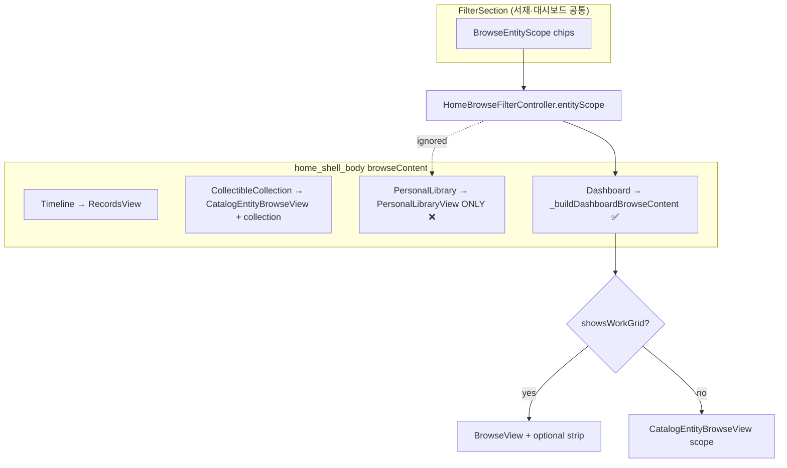
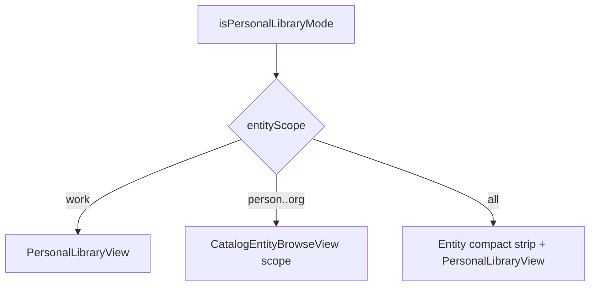
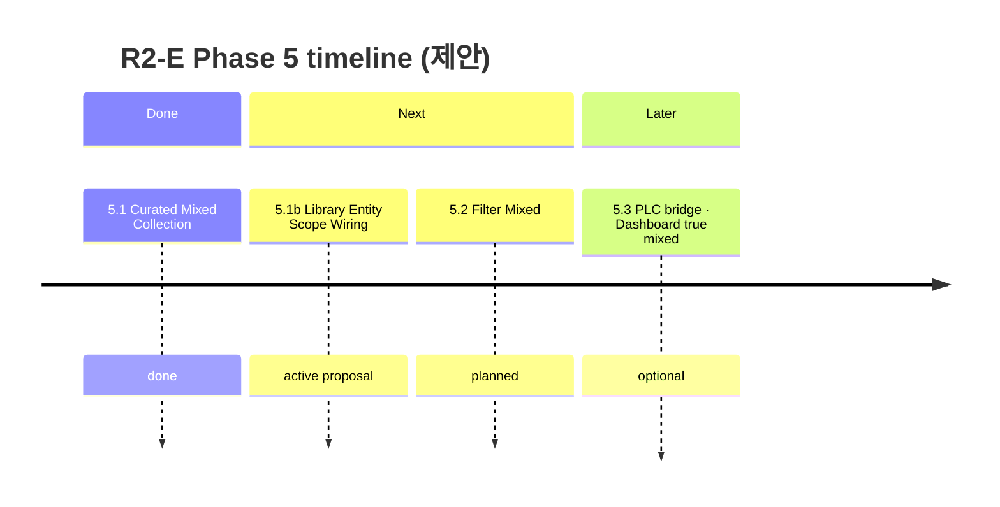

# R2-E — Personal Library × Entity Scope Wiring Planning Review

> **상태:** 5.1b wiring **구현 완료** (2026-06-19)  
> **날짜:** 2026-06-19  
> **전제:** Phase 5.1 Curated Mixed MVP ✅ (`924b422`) · Phase 3 Entity gallery ✅  
> **방법:** Step 3 Audit · Phase 5 Planning · 현재 코드 대조 (**구현 없음**)

---

## Executive Summary

**증상:** 나만의 서재(`master_archive` 등)에서 상단 **Person / Concept … 칩**을 선택해도 browse 영역이 **`PersonalLibraryView`(Work 포스터 그리드)** 로 고정되어 Entity Collectible 카드 그리드로 전환되지 않는다.

**근본 원인:** `BrowseEntityScope` 라우팅이 **대시보드 browse 경로에만** 적용되고, **개인 서재 모드는 `entityScope`를 무시**한다. Phase 5.1(사이드바 「컬렉션」 mixed shelf)은 이 경로를 **의도적으로 Out of Scope**였다.

**권장 판정:** **Go (Wiring Fix)** — 소규모 라우팅 패치(~3–5 files, S difficulty).  
**Must NOT:** `MyLibraryPipeline` · `PersonalLibraryConfig` schema · PLC membership 확장.

**로드맵 위치:** Phase 5.1 **후속 wiring** · Phase 5.3(PLC bridge / dashboard true mixed) **선행 또는 병렬** 가능.

---

## 1. 사용자 기대 vs 현재 (Gap)

### 1.1 기대 UX (서재 모드 + Entity scope chip)

| Entity scope 칩 | 기대 browse 영역 |
|-----------------|------------------|
| **Work** | `PersonalLibraryView` — 서재 Work 포스터 (기존과 동일) |
| **Person / Concept / Event / Place / Org** | `CatalogEntityBrowseView` — **Entity Collectible 카드 그리드** |
| **전체 (`all`)** | Work 서재 그리드 + Entity **compact strip** (대시보드 `all`과 동일 패턴) |

### 1.2 실제 UX (버그)

| 동작 | 결과 |
|------|------|
| 서재 선택 + Person 칩 | FilterSection은 Work 필터(domain/category) **숨김** (`showsWorkGrid == false`) |
| browse 본문 | **`PersonalLibraryView` 고정** — Work 포스터만 표시 |
| FilterSection Entity 칩 | **시각적 dead control** — 상태는 바뀌지만 본문 미반영 |

**Phase 3 Audit에서 이미 기록됨:**  
[`r2e-step3-entity-collection-surface-audit.md`](r2e-step3-entity-collection-surface-audit.md) §2.2 — *「`entityScope` chip을 Person으로 바꿔도 Entity gallery로 전환되지 않음」*.

---

## 2. As-Is 아키텍처 (Root Cause)

### 2.1 라우팅 분기 (핵심)



**문제 코드:**

```314:327:lib/screens/home/home_shell_body.dart
: isPersonalLibraryMode
? PersonalLibraryView(
    filteredCards: filteredCards,
    ...
  )
: _buildDashboardBrowseContent(),
```

대시보드는 `_buildDashboardBrowseContent()`에서 `filterCtrl.entityScope`를 읽어 분기:

```340:380:lib/screens/home/home_shell_body.dart
Widget _buildDashboardBrowseContent() {
  final scope = filterCtrl.entityScope;
  if (!scope.showsWorkGrid) {
    return CatalogEntityBrowseView(..., scope: scope, ...);
  }
  // Work grid + optional entity strip for .all
}
```

### 2.2 Filter / Card 파이프라인 (부수 관찰)

| 레이어 | Entity scope 반영 | 비고 |
|--------|:-----------------:|------|
| `FilterSection` | ✅ | 칩 UI · `showsWorkGrid`로 Work 필터 표시/숨김 |
| `HomeFilterCoordinator.setEntityScope` | △ | `filterCtrl`만 갱신 · `syncFiltersToActiveView` **미호출** (Entity browse에는 무관) |
| `HomeBrowseCoordinator.personalBrowseCards` | ❌ | `MyLibraryPipeline` + `BrowseFilterState` only |
| `home_shell_scaffold` `filtered` | ❌ | 서재 모드 항상 `personalBrowseCards` (Entity scope 전환 시에도 Work cards 계산) |

**설계상 분리 (의도적):**  
`BrowseFilterState` = domain · category · workStatus · myStatus — **Entity scope는 별도 축** (`HomeBrowseFilterController.entityScope`).  
Entity gallery는 **catalog type slice** (`BrowseEntityScope.catalogEntityType`) — Work 필터와 직교.

### 2.3 Phase 5.1과의 관계

| Surface | Phase 5.1 범위 | Entity scope |
|---------|----------------|--------------|
| Sidebar 「컬렉션」 | ✅ Mixed curated grid | `scope: all` 고정 |
| Sidebar 「나만의 서재」 | ❌ Out of scope | **미연결 (본 이슈)** |
| Dashboard | ❌ 미변경 | ✅ 기존 동작 |

Phase 5.1 **Explicitly Out:** `PersonalLibraryConfig` / `MyLibraryPipeline` 변경.  
본 wiring fix는 **라우팅만** — Phase 5.1 판정과 **충돌 없음**.

---

## 3. To-Be (Wiring Fix Scope)

### 3.1 목표

**서재 모드에서도 대시보드와 동일한 Entity scope 라우팅 semantics** — Work grid leg만 `PersonalLibraryView`로 대체.



### 3.2 Entity gallery 데이터 범위 (MVP)

| 질문 | MVP 결정 | 후속 (Phase 5.3) |
|------|----------|------------------|
| Person 칩 = catalog 전체 Person? | **Yes** — 대시보드와 동일 | 서재 멤버 Work에 **연결된 Person** subset |
| Curated 서재 + Person | catalog 전체 (reorder 없음) | Entity `memberOrder` in PLC |
| Domain/category 필터 | Entity scope에서 **숨김** (기존 FilterSection) | tags / relatedWork filter |

**Rationale:** Step 3 Audit §3 — type axis filter는 **이미 구현됨**. 서재 wiring은 **표면 전환**만으로 사용자 bug 해소. PLC-scoped Entity는 membership schema 변경 → **5.3**.

### 3.3 Work leg 차이 (의도적 유지)

| | Dashboard Work | Personal Library Work |
|--|----------------|----------------------|
| View | `BrowseView` + `BrowsePipeline` | `PersonalLibraryView` + `MyLibraryPipeline` |
| Sections | catalog window / load more | HoF · watchlist · year · curated reorder |
| Theme | default | `LibraryTheme` (scaffold) |

Entity leg는 **동일 widget** (`CatalogEntityBrowseView`) — library theme은 scaffold 배경만 적용.

---

## 4. 구현 설계 (제안)

### 4.1 Option A — `home_shell_body` 분기 확장 (**권장**)

**변경:** `isPersonalLibraryMode` 분기에서 `PersonalLibraryView` 직접 반환 → **`_buildPersonalLibraryBrowseContent()`** 추출.

**의사 코드:**

```dart
Widget _buildPersonalLibraryBrowseContent() {
  final scope = filterCtrl.entityScope;

  if (!scope.showsWorkGrid) {
    return CatalogEntityBrowseView(
      scope: scope,
      // collection: null — global catalog slice
      highlightEntityId: filterCtrl.highlightEntityId,
      entityGallerySort: sectionPrefs.entityGallerySort,
      onEntityGallerySortChanged: ...,
      userCatalog: userCatalog,
      linkIndex: linkIndex,
      vaultItems: items,
      onOpenWork: onOpenBrowseItem,
    );
  }

  final workGrid = PersonalLibraryView(
    filteredCards: filteredCards,
    ... // 기존 props
  );

  if (scope == BrowseEntityScope.all) {
    return Column(
      children: [
        _entityDiscoveryStrip(), // 기존 dashboard helper 재사용
        Expanded(child: workGrid),
      ],
    );
  }

  return workGrid;
}
```

**장점:** 최소 diff · Step 3 Audit 권장(`CatalogEntityBrowseView` full mode) 그대로 · 회귀 범위 좁음.  
**단점:** dashboard / library Work leg 중복 (기존 `_buildDashboardBrowseContent`와 parallel).

### 4.2 Option B — 공통 `EntityScopeBrowseRouter` 추출

Work grid를 `Widget Function()` inject:

```dart
EntityScopeBrowseLayout(
  scope: filterCtrl.entityScope,
  workGridBuilder: () => isPersonalLibraryMode ? PersonalLibraryView(...) : BrowseView(...),
  entityStripBuilder: _entityDiscoveryStrip,
  entityGalleryBuilder: (scope) => CatalogEntityBrowseView(scope: scope, ...),
)
```

**장점:** dashboard · library **단일 routing SSOT**.  
**단점:** Phase 5.3 dashboard true mixed grid 시 signature 변경 가능 — **5.1b에는 과함**.

**권장:** **Option A** 착수 → dogfood 후 Option B 리팩터는 5.3에서.

### 4.3 수정 파일 (예상)

| 파일 | 변경 |
|------|------|
| `lib/screens/home/home_shell_body.dart` | `_buildPersonalLibraryBrowseContent()` · browseContent 분기 |
| `test/...` (신규 1) | scope → surface routing 순수 함수 또는 widget smoke |

**선택 (성능 micro):**

| 파일 | 변경 |
|------|------|
| `lib/screens/home/home_shell_scaffold.dart` | Entity-only scope일 때 `personalBrowseCards` 빌드 **skip** (불필요 pipeline 호출 방지) |

**수정 금지:**

- `MyLibraryPipeline` · `PersonalLibraryConfig` · `PersonalLibraryMembershipService`
- `CollectibleCollectionPipeline` · sidebar 컬렉션 mixed path
- `FilterSection` (이미 올바름)

### 4.4 `HomeFilterCoordinator.setEntityScope` — 변경 불필요

Entity gallery는 catalog reload — Work filter sync와 무관.  
`onEntityScopeChanged` → `scheduleRebuild`만으로 충분 (현행).

---

## 5. Edge Cases · UX Notes

| # | 시나리오 | 기대 |
|---|----------|------|
| E1 | `master_archive` + Work | 기존과 100% 동일 |
| E2 | Curated 서재 + Work | curated reorder · membership 그대로 |
| E3 | Curated 서재 + Person | Entity grid · **reorder/DnD 없음** (collection prop null) |
| E4 | Person → Work 복귀 | domain/category 필터 **유지** · `personalBrowseCards` 재적용 |
| E5 | Dashboard Person → 서재 전환 | `entityScope` global — **Person grid 유지** (fix 후) |
| E6 | Entity archived snack | `onEntityArchived`가 scope+highlight 설정 — 서재에서도 grid 표시 |
| E7 | Workbench open | browse 숨김 — scope 무관 (기존) |
| E8 | `all` + compact strip tap | Entity Sheet — dashboard와 동일 |

**Known limitation (문서화):** Entity scope in 서재 = **global catalog**, not 「이 서재에 담긴 Work의 Person」. Phase 5.3에서 bridge.

---

## 6. 회귀 매트릭스

| # | 시나리오 | Fix 전 | Fix 후 Must |
|---|----------|:------:|:-----------:|
| R1 | Dashboard Work grid | ✅ | ✅ |
| R2 | Dashboard Person grid | ✅ | ✅ |
| R3 | Dashboard `all` strip+grid | ✅ | ✅ |
| R4 | 서재 Work (`master_archive`) | ✅ | ✅ |
| R5 | **서재 Person** | ❌ Work grid | ✅ Entity grid |
| R6 | Curated 서재 Work reorder | ✅ | ✅ |
| R7 | Sidebar 컬렉션 mixed | ✅ (5.1) | ✅ |
| R8 | Timeline / Records | ✅ | ✅ |
| R9 | FilterSection chip ↔ Work filter visibility | ✅ | ✅ |
| R10 | Library theme background | ✅ | ✅ (Entity grid 포함) |

**테스트 제안:**

1. `browse_entity_scope_test.dart` — `showsWorkGrid` / `catalogEntityType` (기존)
2. **신규** `personal_library_entity_scope_routing_test.dart` — routing helper unit test
3. Manual E2E — master_archive → Person → 카드 tap → Sheet

---

## 7. Effort · 리스크

| ID | 항목 | 값 |
|----|------|-----|
| Difficulty | **S** | |
| Files | **2–4** (body + test + optional scaffold) | |
| Duration | **0.5–1 day** | |
| Blocker | 없음 | |

| ID | 리스크 | 심각도 | 완화 |
|----|--------|:------:|------|
| W1 | Dashboard browse 회귀 | Med | dashboard 분기 **미변경** · R1–R3 매트릭스 |
| W2 | 사용자 혼란 (서재 Person = 전체 catalog) | Low | release note · 5.3 scoped filter |
| W3 | `all` strip + PersonalLibraryView 레이아웃 | Low | dashboard Column 패턴 복제 |
| W4 | Scope creep → PLC Entity membership | Med | schema 변경 **Explicit defer** |

---

## 8. 로드맵 배치



| Phase | 본 이슈와 관계 |
|-------|----------------|
| **Phase 5.1b (본 문서)** | 서재 browse **라우팅** — schema 변경 없음 |
| **5.1b+ (dashboard strip)** | Work scope에서 Entity Discovery strip **숨김** — [`showsEntityDiscoveryStrip`] |
| **5.2** | CollectibleCollection filter mixed — **무관** |
| **5.3** | PLC Entity membership · dashboard single mixed grid · `PersonalLibraryView` mixed |

**판정:** 5.1b는 5.2 **선행 불필요** · 5.3 **선행 가능** (오히려 5.3 PLC 작업 전 UX hole 메움).

---

## 9. Go / No-Go

| 기준 | 판정 |
|------|:----:|
| Phase 3 Audit gap 재현 확인 | **Go** |
| Phase 5.1과 scope 충돌 없음 | **Go** |
| 최소 wiring으로 기대 UX 충족 | **Go** |
| PLC schema 변경 필요 | **No-Go** — 본 sprint 제외 |
| **5.1b Library Entity Scope Wiring 착수** | **Go** |

---

## 10. 권장 다음 액션

1. **본 Planning Review 승인** (사용자 확인)
2. **5.1b 구현** — Option A · `home_shell_body` routing
3. Unit test + manual E2E (R4–R6, R5)
4. Dogfood — master_archive · curated 서재 · scope 전환
5. Phase 5.2 / 5.3 계획은 기존 [`r2e-phase5-mixed-library-planning-review.md`](r2e-phase5-mixed-library-planning-review.md) 유지

**Explicitly Out of 5.1b:**

- Entity를 서재 `memberOrder`에 추가
- `PersonalLibraryView` 내부 mixed grid
- tags / relatedWorkId filter in 서재
- Dashboard `BrowseView` → true single mixed grid (5.3)

---

## Appendix A — Dashboard Work scope · Entity Discovery strip (확인됨)

### 증상

대시보드(`master_index` 등)에서 **Work** 칩 선택 시에도 상단 **「Entity Discovery · N」** strip에 Person(예: 나츠키 스바루)이 표시된다. **Person** 칩에서는 full gallery에만 나타나야 정상.

### 근본 원인

`_buildDashboardBrowseContent()`가 `showsWorkGrid`(Work **또는** 전체)일 때 **항상** `_entityDiscoveryStrip()`을 붙인다. strip은 내부적으로 `BrowseEntityScope.all` catalog slice를 로드한다.

```373:379:lib/screens/home/home_shell_body.dart
// Fix 전: work · all 모두 strip 표시
return Column(children: [_entityDiscoveryStrip(), Expanded(child: workGrid)]);
```

**설계 의도** ([Phase 5 planning §1.1](r2e-phase5-mixed-library-planning-review.md)): compact strip = **`BrowseEntityScope.all` 전용** — Work-only grid와 분리.

### 수정 (적용됨)

| 항목 | 내용 |
|------|------|
| `BrowseEntityScope.showsEntityDiscoveryStrip` | `all` only |
| `_buildDashboardBrowseContent` | `work` → Work grid만 · `all` → strip + grid |

**회귀:** R2/R3 매트릭스 — `all` strip 유지 · `work` strip 제거.

---

## 11. 관련 문서

| 문서 | 내용 |
|------|------|
| [r2e-step3-entity-collection-surface-audit.md](r2e-step3-entity-collection-surface-audit.md) | Gap 최초 기록 §2.2 |
| [r2e-phase5-mixed-library-planning-review.md](r2e-phase5-mixed-library-planning-review.md) | Phase 5.1/5.3 경계 |
| [r2e-architecture-alignment-check.md](r2e-architecture-alignment-check.md) | Entity scope routing §1.3 |
| [r2e-collection-architecture-audit.md](r2e-collection-architecture-audit.md) | BrowseEntityScope vs collection |

**Personal Library × Entity Scope Wiring Planning Review: Complete · Go (5.1b)**
