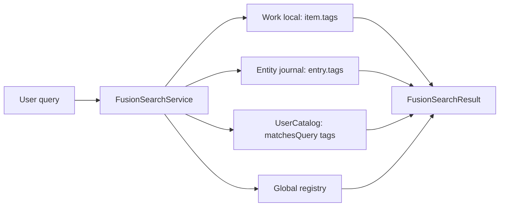

# R2-E Phase 2 — Entity.tags Architecture Audit

> **상태:** 조사 완료 (구현 없음)  
> **날짜:** 2026-06-20  
> **전제:** Phase 1 Entity Gallery **Accepted** · Should Fix(성능)는 기록만 · **기능 확장 우선**  
> **상위:** [Phase 1 Implementation Plan](r2e-phase1-entity-gallery-implementation-plan.md) · [Step 1 Information Audit](r2e-step1-entity-collectible-information-audit.md) · [Collection Architecture](r2e-collection-architecture-audit.md)

---

## Executive Summary

현재 Entity 경로 어디에도 **`tags` 필드가 없다.** Work는 `AkashaItem.tags` + work `.md` frontmatter `tags:` + Fusion local tier 검색 + Workbench `EditableTagChips`까지 **완결된 패턴**을 갖는다. Entity는 동급 Collectible이지만 semantic 분류 축이 비어 있다.

**Phase 2 최우선 목표 = `Entity.tags`** — 영웅 · 주인공 · 마녀 · 판타지 같은 **감상 축**의 SSOT. tags는 **관계(Relation)가 아니며**, Work 소속·Re:Zero cast 표현 수단으로 쓰지 않는다 (Work 연결 = wiki link + link graph 유지).

**권장 저장:** Archive-First 정합 — **`vault/entities/{type}/*.md` frontmatter `tags:` (SSOT)** + **`user_entities.json` mirror (Fusion·picker 검색)**. Work `markdown_parser.dart`의 YAML list 형식과 **동일 convention** 재사용.

**마이그레이션:** breaking change 없음 — 기존 entity/journal에 `tags` 없으면 `[]`. `user_entities.json` **schema v1 → v2**.

**Collection (`CollectibleCollection`)** 은 tags **이후** — filter `kind=person AND tags contains 영웅` 은 tags 구현 후 1~2 sprint 내 착수 가능. **Re:Zero 등장인물** 은 tags ❌ → **`EntityRelatedWorksDiscovery`** (link graph, 별 Phase).

---

## 0. 로드맵 정렬

| 문서 (구) | 사용자 Phase 2 (현재) | 비고 |
|-----------|----------------------|------|
| `r2e-architecture-alignment-check.md` Phase 2 = Related Works badge | **Phase 2 = Entity.tags** | Related Works → **tags 이후** |
| 동 문서 Phase 3 = tags + Collection | **Collection = tags 이후** | 순서 유지 |
| Phase 1 Should Fix (Wrap eager, N×incoming, vault rescan) | **기록만 · 미구현** | Entity 300~1000 시점 |

---

## 1. 설계 원칙 (Phase 2 불변)

### 1.1 tags가 하는 일

| ✅ tags | ❌ tags 금지 |
|---------|-------------|
| semantic / 감상 축 분류 | Work 소속 · IP membership |
| Person: `영웅`, `주인공`, `이세계전이` | Person: `Re:Zero`, `ReZero`, `리제로` (작품명 tag) |
| Work: `판타지`, `이세계` (Work 자체 tags) | Entity→Work **관계 저장** |
| Collection filter input | Related Works 대체 |

### 1.2 Entity = 독립 Collectible

- tags는 **Entity 자신의 속성** — catalog(Tier 1.5) + journal(Tier 2)에 둔다.
- 나츠키 스바루의 tags는 Re:Zero catalog entry의 metadata가 **아니다**.
- Re:Zero **등장인물 컬렉션** = `EntityRelatedWorksDiscovery` + optional `CollectibleCollectionFilter.relatedWorkId` — **tags에 작품명 넣지 않음**.

### 1.3 Work tags와의 대칭

| | Work | Entity (목표) |
|--|------|---------------|
| Runtime model | `AkashaItem.tags` | `UserCatalogEntity.tags` |
| Vault SSOT | work `.md` `tags:` via `MarkdownParser` | entity `.md` `tags:` via `EntityJournalParser` |
| Fusion local tier | `item.tags` match | catalog tags + journal frontmatter parse |
| Edit UI | `EditableTagChips` (Workbench) | Entity Sheet + Add dialog |
| Registry bridge | `RegistryWork.tags` | `toRegistryWork().tags` mirror |

---

## 2. 현재 상태 (코드 기준)

### 2.1 필드 부재

| 모델 / 저장 | `tags` |
|-------------|:------:|
| `UserCatalogEntity` | ❌ |
| `EntityJournalEntry` | ❌ |
| `EntityJournalParser` frontmatter | ❌ |
| `EntityBrowseCard` | ❌ |
| `EntityFact` / `person_seed.json` | ❌ |
| `CatalogEntityAddResult` | ❌ |

**Work 참조:** `AkashaItem.tags` (`lib/models/akasha_item.dart` L28), `MarkdownParser` serialize/parse (`lib/services/markdown_parser.dart` L100–103, L223–227).

### 2.2 aliases와의 비대칭 (선행 패턴)

| 필드 | journal frontmatter | catalog JSON |
|------|:-----------------:|:------------:|
| `aliases` | ❌ | ✅ |
| `title` | ✅ SSOT | mirror |
| `tags` (목표) | ✅ **SSOT 권장** | mirror |

aliases가 catalog-only인 역사적 이유: Add dialog에서 aliases 입력 → draft entity → journal에는 title만 serialize. tags는 **처음부터 journal + catalog dual-write** 로 설계해 Archive-First §10과 정합시키는 것이 낫다.

---

## 3. 저장 구조 (권장)

### 3.1 Entity journal frontmatter (Tier 2 SSOT)

**파일:** `vault/entities/{person|concept|event|…}/{title}.md`

```yaml
---
entity_type: person
entity_id: "pe_u_a1b2c3d4"
record_kind: entityJournal
title: "나츠키 스바루"
added_at: "2026-06-20T12:00:00.000Z"
tags: ["영웅", "주인공", "이세계전이"]
---
```

- 형식: Work와 동일 — YAML **list of strings** (comma string fallback parse 허용, `MarkdownParser` convention)
- `EntityJournalParser.parse` / `serialize` 확장
- `EntityJournalEntry.tags: List<String>` 추가

### 3.2 User catalog JSON (Tier 1.5 mirror)

**파일:** `{vault}/catalog/user_entities.json`

```json
{
  "version": 2,
  "entities": [
    {
      "entityId": "pe_u_a1b2c3d4",
      "entityType": "person",
      "title": "나츠키 스바루",
      "aliases": ["スバル"],
      "tags": ["영웅", "주인공", "이세계전이"],
      "addedAt": "...",
      "source": "user"
    }
  ]
}
```

- `UserCatalogStore.schemaVersion`: **1 → 2**
- `fromJson`: `tags` 없으면 `[]`
- `toJson`: 항상 `tags` array emit (빈 배열 포함 — 검색·filter 일관성)

### 3.3 Sync 규칙 (Archive-First)

| 이벤트 | journal | catalog |
|--------|---------|---------|
| Archive-First add (기본) | create + `tags` | mirror after save |
| Entity Sheet tag edit | **SSOT write** | `EntityCatalogSync.mirrorFromJournal` |
| nameOnly add | — | tags in catalog only |
| promote catalog-only → archive | copy tags → frontmatter | unchanged |
| journal delete | delete | remove entity |
| 충돌 | **journal wins** (policy §10) | upsert from journal |

**Mirror hook:** `EntityCatalogSync.mirrorFromJournal` — today `aliases`는 draft 유지, `title`/`addedAt`은 entry에서. tags는 **`entry.tags` → catalog** (draft fallback for catalog-only).

### 3.4 정책 문서 갱신 필요

`docs/policy/user-local-catalog-policy.md` §4.1 v1 스키마 표에 **`tags` 추가** (Tier 1.5 minimal Fact — Work `RegistryWork.tags`와 대칭, description/poster 금지와 **무충돌**).

---

## 4. 영향 범위 (7개 조사 항목)

### 4.1 `UserCatalogEntity` — 영향 ★★★

**파일:** `lib/models/user_catalog_entity.dart`

| 변경 | 내용 |
|------|------|
| 필드 | `final List<String> tags` (default `const []`) |
| `fromJson` / `toJson` | `tags` list parse/emit |
| `userLocal()` factory | optional `tags` param |
| `fromAkashaItem` | Work mirror — `item.tags` 복사 (Work catalog entry parity) |
| `matchesQuery` | tag substring match 추가 |
| `toRegistryWork` | `RegistryWork(..., tags: tags)` — `searchTokens`에 tag 포함 |
| `copyWith` | (없으면 mirror/sync용 추가 검토) |

**직접 의존 (~17 files):** browse, fusion, archive, picker, dialogs, navigator — **필드 추가만으로 compile break** (const constructor call sites에 default `[]`).

**마이그레이션:** JSON v2 lazy — 코드 deploy 시 `fromJson` default `[]`, persist 시 v2 write.

---

### 4.2 Entity journal frontmatter — 영향 ★★★

**파일:**

| 파일 | 변경 |
|------|------|
| `lib/services/entity_journal_parser.dart` | parse/serialize `tags` |
| `lib/core/archiving/entity_journal_entry.dart` | `tags` field |
| `lib/services/entity_vault_store.dart` | save/update 시 tags round-trip (`serialize` params) |
| `lib/services/entity_vault_loader.dart` | parse 결과에 tags (parser 경유) |

**Work `EntityFrontmatter` 와 분리 유지** — non-work entity는 `EntityJournalParser` 전용 (`entity_frontmatter_test.dart`는 Work YAML 테스트 — 혼동 주의).

**테스트 확장:**

- `test/entity_vault_w4_test.dart` — tags round-trip
- `test/archive_first_r1_test.dart` — tag edit → catalog mirror

---

### 4.3 Catalog sync — 영향 ★★

**파일:**

| 파일 | 역할 |
|------|------|
| `lib/services/entity_catalog_sync.dart` | **`mirrorFromJournal`에 tags mirror** |
| `lib/services/entity_archive_service.dart` | save / sync / promote / delete orchestration — hook unchanged, downstream model 변경 |
| `lib/services/user_catalog_store.dart` | `schemaVersion = 2` |
| `lib/data/adapters/user_catalog_store_adapter.dart` | pass-through (변경 없거나 version only) |

**Registry sync (`registry_sync_service.dart`):** **무관** — global akasha-db; user catalog local only.

**Vault load backfill (policy §10, 미구현):** tags 추가 시 **함께 구현 권장** — journal exists · catalog missing → upsert with tags from frontmatter.

---

### 4.4 Entity picker — 영향 ★★

**파일:**

| 파일 | 변경 |
|------|------|
| `lib/services/entity_link_picker_candidates.dart` | `userCatalog.search` → `matchesQuery`에 tag match 자동 포함 |
| `lib/screens/home/dialogs/entity_link_picker_dialog.dart` | tile subtitle에 tag chip (optional Phase 2.1) |

**현재 검색:** title · creator · aliases · `toRegistryWork().searchTokens` — tags 추가 후 **별도 filter param 없이** query match 가능.

**Linkable types:** person · event · concept only (변경 없음).

---

### 4.5 EntityVaultStore — 영향 ★★

**파일:** `lib/services/entity_vault_store.dart`

| Method | tags 영향 |
|--------|-----------|
| `saveCatalogEntity` | `EntityJournalParser.serialize(tags: entity.tags)` |
| `updateEntry` | entry.tags preserve + body/title rewrite |
| `deleteEntry` | — |

**Path conflict / filename:** title-based path — tags 변경은 **파일 rename 불필요** (aliases와 동일).

**Sheet save flow (`entity_journal_dialog.dart`):** today body-only edit → **tag edit UI 추가** 시 `updateEntry` + `EntityArchiveService.syncCatalogFromJournal`.

---

### 4.6 FusionSearch — 영향 ★★★

**파일:** `lib/services/fusion_search_service.dart`

| Tier | 현재 | tags 후 |
|------|------|---------|
| Local work `.md` | `item.tags` ✅ | unchanged |
| Local entity journals | title · body only | **+ `entry.tags`** |
| User catalog | `matchesQuery` | **+ tags** (via entity model) |
| Global entity registry | title · aliases · description | optional future (`EntityFact.tags`) |

**Dedup / catalogOnly:** unchanged — archived journal wins over catalog hit.

**Sections (`fusion_search_sections.dart`, `fusion_search_dialog.dart`):** UI 변경 없이 hit pool 확대. tag-only search → Person journal/catalog match.

---

### 4.7 Archive-First 정책 — 충돌 여부 ★

**결론: 충돌 없음 — 정합 강화.**

| 정책 | tags 정렬 |
|------|-----------|
| Tier 2 `.md` = 제품 SSOT | journal frontmatter `tags` ✅ |
| Tier 1.5 = 배관 index | catalog mirror for Fusion ✅ |
| description · poster Tier 1.5 금지 | tags는 **minimal semantic Fact** — Work tags precedent ✅ |
| catalog-only nameOnly 예외 | tags catalog-only until promote ✅ |
| SSOT conflict: journal wins | tag edit on Sheet → journal first ✅ |
| UI 「catalog」 노출 금지 | tag UI copy = 「태그」·Sheet — catalog 단어 ❌ |

**주의 (product, not technical):** 사용자 교육 — 「Re:Zero」를 Person tag로 넣지 말 것 (가이드·placeholder). **validation hard-block은 Phase 2 scope外** (optional lint later).

---

## 5. UI 사용처

### 5.1 Phase 2 필수 UI

| Surface | 변경 | 우선순위 |
|---------|------|:--------:|
| **Add Entity dialog** (`add_catalog_entity_dialog.dart`) | `EditableTagChips` or comma field | P0 |
| **Entity Sheet** (`entity_journal_dialog.dart`) | tag read/edit + save mirror | P0 |
| **FusionSearch** | no UI (search behavior only) | P0 |

### 5.2 Phase 2.1 (같은 Epic, card/display)

| Surface | 변경 | 우선순위 |
|---------|------|:--------:|
| **Entity Gallery card** (`entity_collectible_card.dart`) | tag chip row (max 2–3, overflow) | P1 |
| **`EntityBrowseCard`** | `tags` derived from entity | P1 |
| **Entity link picker tile** | tag hint | P2 |
| **Entity journal list** (`entity_journal_view.dart`) | optional tag line | P2 |

### 5.3 재사용 가능 UI

- **`EditableTagChips`** (`lib/widgets/editable_tag_chips.dart`) — Workbench proven; Entity Sheet에 그대로 사용
- **`parseTagList`** — comma parse 공용

### 5.4 Phase 2에서 하지 않음

- Gallery tag **filter chip bar** → Collection/filter Epic
- Related Works badge on card → `EntityRelatedWorksDiscovery` Epic
- Work stack / PosterCard / BrowsePipeline 변경 ❌

---

## 6. 검색 영향



| Query 예 | Phase 2 후 기대 |
|----------|----------------|
| `영웅` | Person catalog/journal tags match |
| `주인공` | 동일 |
| `Re:Zero` | Work title/wiki match only — **Person tag match ❌ (by design)** |
| `나츠키` | title / alias (기존) |

**`UserCatalogStore.search`:** entityType filter 유지 — tag filter API (`tagsContains`)는 **Collection 전** optional helper로 `user_catalog_store.dart`에 추가 가능.

---

## 7. Collection 준비도

### 7.1 tags 없이 불가능한 것

| Collection | filter spec | tags 필요 |
|------------|-------------|:---------:|
| **영웅 서재** | `kind=person AND tags ∋ 영웅` | ✅ P0 |
| **악당 Person** | `tags ∋ 악당` | ✅ |
| **마녀 Concept cluster** | `kind=concept AND tags ∋ 마녀` | ✅ |

### 7.2 tags와 무관 (별 Epic)

| Collection | mechanism |
|------------|-----------|
| **Re:Zero 등장인물** | `EntityRelatedWorksDiscovery` + `relatedWorkId=wk_u_rezero` |
| **Explicit cast list** | `CollectibleCollection.members: List<CollectibleRef>` |
| **Mixed Work+Person shelf** | `CollectibleRef` + mixed grid (Phase 4) |

### 7.3 `CollectibleCollection` sketch (tags 후 착수)

```dart
class CollectibleCollectionFilter {
  final CollectibleKind? kind;       // person
  final List<String>? tagsAll;       // ["영웅"]
  final String? relatedWorkId;       // link graph — NOT tags
}
```

**저장:** `{vault}/.akasha/collectible_collections.json` (신규 — `PersonalLibraryConfig` 일반화 ❌, [collection audit](r2e-collection-architecture-audit.md) §1).

**Phase 1 gallery:** tag filter 없음 — Phase 2 tags 완료 후 **BrowseEntityScope 옆 tag chip filter** 또는 **Collection sidebar entry** 로 확장. **새 리팩터 불필요** — `CatalogEntityBrowseView`에 filter predicate 추가만.

---

## 8. 마이그레이션

| 대상 | 작업 | breaking |
|------|------|:--------:|
| `user_entities.json` v1 | read v1 without tags → `[]`; write v2 | ❌ |
| Existing entity `.md` | parse without `tags` → `[]` | ❌ |
| `UserCatalogStore.schemaVersion` | `2` | ❌ |
| Global Contribution merge | entityId 치환 시 **tags array preserve** (policy §5.3) | — |
| Legacy `sub_*` / nameOnly entities | catalog-only tags until user archives | — |

**일괄 migration tool:** 불필요 (lazy default). optional: one-shot journal frontmatter `tags: []` materialize — cosmetic only.

---

## 9. 영향 파일 체크리스트

### P0 — schema & sync

| 파일 | 변경 유형 |
|------|-----------|
| `lib/models/user_catalog_entity.dart` | field + json + search |
| `lib/core/archiving/entity_journal_entry.dart` | field |
| `lib/services/entity_journal_parser.dart` | parse/serialize |
| `lib/services/entity_catalog_sync.dart` | mirror tags |
| `lib/services/entity_vault_store.dart` | serialize params |
| `lib/services/user_catalog_store.dart` | schema v2 |

### P0 — flows

| 파일 | 변경 유형 |
|------|-----------|
| `lib/screens/home/dialogs/add_catalog_entity_dialog.dart` | tag input |
| `lib/screens/home/dialogs/entity_journal_dialog.dart` | tag edit + save |
| `lib/services/entity_archive_service.dart` | promote: catalog tags → journal |
| `lib/services/fusion_search_service.dart` | journal tier tag match |

### P1 — display

| 파일 | 변경 유형 |
|------|-----------|
| `lib/models/entity_browse_card.dart` | optional tag list |
| `lib/widgets/entity_collectible_card.dart` | tag chips |
| `lib/screens/home/views/catalog_entity_browse_view.dart` | pass tags to card |

### P1 — tests

| 파일 | 변경 유형 |
|------|-----------|
| `test/entity_vault_w4_test.dart` | tags round-trip |
| `test/archive_first_r1_test.dart` | sync mirror |
| `test/fusion_search_service_test.dart` | tag search hit |
| `test/user_catalog_test.dart` | json v2 |
| `test/entity_link_picker_test.dart` | tag query |
| `test/entity_body_preview_test.dart` | — (unchanged) |

### P2 — docs / policy

| 파일 | 변경 유형 |
|------|-----------|
| `docs/policy/user-local-catalog-policy.md` | §4.1 tags field |
| `docs/programs/r2e-architecture-alignment-check.md` | Phase 번호 정렬 (optional) |

### 변경 금지 (Phase 2)

`AkashaItem`, `PosterCard`, `BrowsePipeline`, `WorkbenchController`, Work `MarkdownParser` behavior, `RecordLinkIndexService`, mixed grid.

---

## 10. Related Works · Re:Zero Cast (Phase 2 범위外)

| 항목 | 시점 | mechanism |
|------|------|-----------|
| Card Work badge | tags **이후** | `EntityRelatedWorksDiscovery` |
| IP cast filter | tags **이후** | link graph `incomingRecordPaths` + Work id |
| tags에 `Re:Zero` | **금지** | product rule |

근거: [Step 2 Relation Discovery Audit](r2e-step2-entity-relation-discovery-audit.md) — incoming + body parse 조합, 저장 필드 불필요.

---

## 11. 권장 구현 순서

### Step 1 — Schema & parser (1 PR)

1. `EntityJournalEntry.tags` + `EntityJournalParser` parse/serialize
2. `UserCatalogEntity.tags` + json v2 + `matchesQuery` + `toRegistryWork().tags`
3. Tests: parser round-trip, catalog json v2 default

### Step 2 — Sync pipeline (1 PR)

1. `EntityCatalogSync.mirrorFromJournal` tags
2. `EntityVaultStore` save/update tags round-trip
3. `EntityArchiveService.promoteCatalogOnly` — catalog tags → journal frontmatter
4. Tests: `archive_first_r1_test` extension

### Step 3 — Edit surfaces (1 PR)

1. Add dialog — tag input (`EditableTagChips`)
2. Entity Sheet — tag edit + save → journal + catalog mirror
3. Manual: add Person with tags → Sheet edit → Fusion search by tag

### Step 4 — Search (1 PR)

1. `FusionSearchService` local entity journal tier — `entry.tags`
2. Tests: fusion tag hit, picker tag hit

### Step 5 — Gallery display (1 PR, P1)

1. `EntityCollectibleCard` tag chips (subtitle, max 3, no Work names)
2. Optional: gallery header tag filter (prep for Collection)

### Step 6 — Collection foundation (tags 후 Epic)

1. `CollectibleCollection` model + storage
2. Filter mode: `kind + tagsAll`
3. Sidebar + filtered `CatalogEntityBrowseView` or dedicated collection view

---

## 12. 구현 계획안 (요약)

**Epic:** R2-E Phase 2 — Entity.tags  
**Goal:** Person/Concept/Event/Place/Org에 semantic tag 축 부여 · Work.tags와 대칭 · Collection/filter 선행 데이터 완성

| Sprint slice | Deliverable | Success criteria |
|--------------|-------------|------------------|
| **2a Schema** | parser + catalog v2 | existing vault load 무손실; tags round-trip test green |
| **2b Flows** | add + sheet edit | 나츠키 스바루에 `영웅`,`주인공` 추가·편집 → `.md` frontmatter + JSON mirror |
| **2c Search** | Fusion + picker | query `영웅` → archived Person hit |
| **2d Display** | gallery card chips | tag visible on card; **no Work name tags** in UX copy |
| **2e (next Epic)** | CollectibleCollection | 「영웅 서재」filter collection opens Person subset |

**리스크:**

| Risk | Mitigation |
|------|------------|
| aliases catalog-only vs tags journal SSOT 이중 패턴 | tags만 journal-first; aliases migration은 별 ticket |
| nameOnly catalog tags orphan | promote copies to frontmatter (Step 2) |
| 사용자가 Work명을 tag로 입력 | placeholder/guide; hard validation deferred |
| Policy §10 backfill still missing | Step 2에서 journal→catalog backfill optional 포함 |

**Phase 1 Should Fix:** 이번 Epic에 **포함하지 않음** (기록 유지).

---

## 13. 관련 문서

| 문서 | 관계 |
|------|------|
| [r2e-step1-entity-collectible-information-audit.md](r2e-step1-entity-collectible-information-audit.md) | tags ❌ confirmed |
| [r2e-collection-architecture-audit.md](r2e-collection-architecture-audit.md) | Collection after tags |
| [r2e-step2-entity-relation-discovery-audit.md](r2e-step2-entity-relation-discovery-audit.md) | Related Works ≠ tags |
| [user-local-catalog-policy.md](../policy/user-local-catalog-policy.md) | Tier 1.5 · sync §10 |
| [archive-first-realignment-plan.md](archive-first-realignment-plan.md) | Archive-First SSOT |

---

## 14. 문서 이력

| 날짜 | 내용 |
|------|------|
| 2026-06-20 | Phase 2 Entity.tags architecture audit — 조사 완료, 구현 없음 |
