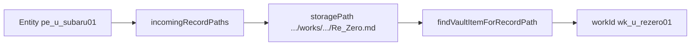
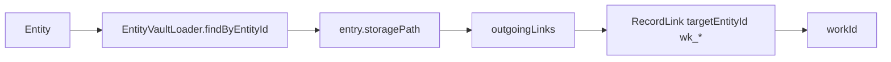

# R2-E Phase 4 — EntityRelatedWorksDiscovery Audit

> **상태:** Discovery 경로 검증 완료 · **구현 착수 전**  
> **날짜:** 2026-06-19  
> **전제:** Phase 3 CollectibleCollection ✅ (Accepted) · `filter.relatedWorkId` schema only  
> **상위:** [Phase 3 Audit](r2e-phase3-collectible-collection-architecture-audit.md) · [Step 2 Relation Discovery](r2e-step2-entity-relation-discovery-audit.md)

---

## Executive Summary

**Re:Zero Cast** 같은 `relatedWorkId` Collection은 **현재 코드만으로 구현 가능**하다.  
전용 one-call API는 없지만, **검증된 조합 경로**가 존재한다:

```
incomingRecordPaths(entityId)
  → storagePath
  → findVaultItemForRecordPath / md frontmatter work_id
  → workId
```

R2-B canonical authoring(Work 본문 → Person 링크)은 **incoming이 주 경로**이며, `r2b_entity_link_pipeline_test.dart` · `record_link_navigator_test.dart`로 E2E 확인됨.

**Phase 4 구현 전제 충족.** Step 1 `EntityRelatedWorksDiscovery` 착수 가능.

| 축 | source | Collection 예 |
|----|--------|---------------|
| **A — semantic** | `Entity.tags` | 영웅 · 성장 · 구원 |
| **B — relation** | link graph → `workIds` | Re:Zero Cast · Fate Servants |

**두 축 혼합 금지** — tags에 `Re:Zero` 넣지 않음.

---

## 1. record path → workId 역추적 API 존재 여부

### 1.1 Port / Navigator surface (현재)

| API | 위치 | 반환 | path → workId |
|-----|------|------|:-------------:|
| `incomingRecordPaths(entityId)` | `RecordLinkPort` | `List<String>` storage paths | ❌ (path만) |
| `outgoingLinks(sourcePath)` | `RecordLinkPort` | `List<RecordLink>` | △ explicit `wk_*` only |
| `findVaultItemForRecordPath(path, vaultItems)` | `RecordLinkNavigator` | `AkashaItem?` | **✅** `.workId` |
| `_readWorkIdFromMd(path)` | `RecordLinkNavigator` (private) | `String?` | **✅** frontmatter `work_id:` |
| `linkedWorksForEntity(...)` | — | — | **❌ 없음** |

### 1.2 `findVaultItemForRecordPath` resolve 순서

```85:118:lib/services/record_link_navigator.dart
  static Future<AkashaItem?> findVaultItemForRecordPath({
    required String storagePath,
    required List<AkashaItem> vaultItems,
  }) async {
    // 1) vaultItems.filePath exact match (case-insensitive on Windows)
    // 2) read work_id from md frontmatter → match vaultItems.workId
    // 3) unique basename fallback
  }
```

**공개 API로 path → workId 역추적 가능** — `AkashaItem.workId` 또는 frontmatter parse(vault miss 시).

### 1.3 outgoing에서의 workId

Entity journal `storagePath` → `outgoingLinks` → `RecordLink.targetEntityId` where `EntityIdCodec.typeFromId(id) == work`:

- Person body `[[wk_u_rezero01|Re:Zero]]` → **workId 직접** (path 불필요)
- Work journal outgoing → Person id (Cast 필터에 **불필요** — incoming이 역방향 커버)

### 1.4 결론 (§1)

| 질문 | 답 |
|------|-----|
| incoming → path | ✅ `RecordLinkPort.incomingRecordPaths` |
| path → workId | ✅ `RecordLinkNavigator.findVaultItemForRecordPath` (+ private md fallback) |
| one-call Discovery | ❌ **신규 `EntityRelatedWorksDiscovery` 필요** |

---

## 2. Entity → workId 최소 경로 (문서화)

### 2.1 Primary — incoming (R2-B canonical)



| 단계 | 코드 | 입력 | 출력 |
|:----:|------|------|------|
| 1 | `linkIndex.incomingRecordPaths(entityId)` | `pe_u_subaru01` | `[normalized path, …]` |
| 2 | `RecordLinkNavigator.findVaultItemForRecordPath(path, vaultItems)` | path | `AkashaItem { workId, title }` |
| 2′ | (vault miss) `_readWorkIdFromMd(path)` | path | `wk_*` from frontmatter |

**index build 시점:** Work `.md` 본문 `[[pe_u_…|…]]` or `[[나츠키 스바루]]` → `incoming[entityId]` (`record_link_index_service.dart` L95–98).

**검증 테스트:**

- `test/r2b_entity_link_pipeline_test.dart` L109–128 — explicit Work→Person
- `test/record_link_navigator_test.dart` L134–143 — titleOnly `[[나츠키 스바루]]`
- `test/record_link_index_test.dart` L66–68 — bidirectional index

### 2.2 Supplement — outgoing (Entity journal → Work)



| 단계 | 코드 | 조건 |
|:----:|------|------|
| 1 | `EntityVaultLoader.findByEntityId(vault, entityId)` | journal 존재 |
| 2 | `linkIndex.outgoingLinks(entry.storagePath)` | entity `.md` indexed |
| 3 | filter `EntityIdCodec.typeFromId(target) == work` | explicit `[[wk_u_…]]` |

**케이스:** Person journal에 `[[wk_u_rezero01|Re:Zero]]` 직접 작성 (`record_link_index_test.dart` L47–55).

**한계:** catalog-only (journal 없음) → outgoing **불가** — incoming만.

### 2.3 Cast 필터에 불필요한 incoming

| path 유형 | `findVaultItemForRecordPath` | Cast에 포함 |
|-----------|:----------------------------:|:-----------:|
| `works/**.md` (Work journal) | ✅ workId | **✅** |
| `entities/person/*.md` | ❌ / non-work | ❌ |
| `timeline/*.md` | ❌ | ❌ |
| `journal/*.md` (freeform) | ❌ | ❌ |

**Work 필터:** resolve 결과 `workId != null` 인 path만 `workIds`에 추가.

---

## 3. Discovery 결과 모델 초안

### 3.1 Phase 4 최소 (Collection pipeline용)

```dart
/// link graph 파생 — catalog / frontmatter / tags SSOT 변경 없음.
class EntityRelatedWorks {
  final String entityId;
  final Set<String> workIds;

  const EntityRelatedWorks({
    required this.entityId,
    required this.workIds,
  });

  bool isRelatedTo(String workId) => workIds.contains(workId);
}
```

### 3.2 예시 (설계)

| Entity | workIds | 경로 |
|--------|---------|------|
| 나츠키 스바루 `pe_u_subaru01` | `{ wk_u_rezero01 }` | Work Re:Zero 본문 incoming |
| 에밀리아 `pe_u_emilia01` | `{ wk_u_rezero01 }` | 동일 |
| Saber `pe_u_saber01` | `{ wk_u_fate_stay_night }` | Work Fate 본문 incoming |
| catalog-only Person (링크 없음) | `{}` | — |

### 3.3 Phase 4.5+ 확장 (UI용 · Phase 4 범위外)

```dart
class EntityRelatedWorkRef {
  final String workId;
  final String displayTitle;
  final RelatedWorkSource source; // incomingPath | outgoingExplicit
}
```

Card badge · Sheet 「관련 작품」 섹션은 **Phase 4.5**.

---

## 4. Collection filter — `relatedWorkId` semantics

### 4.1 현재 schema

```dart
// CollectibleCollectionFilter
final String? relatedWorkId;  // e.g. wk_u_rezero01
```

Pipeline (`collectible_collection_pipeline.dart` L44): **TODO** — tagsAll/kind only.

### 4.2 Phase 4 predicate

**Re:Zero Cast** filter:

```json
{
  "mode": "filter",
  "filter": {
    "kinds": ["person"],
    "relatedWorkId": "wk_u_rezero01"
  }
}
```

**필요 조건 (entity 단위):**

```dart
discovery.forEntity(entity.entityId).workIds.contains(filter.relatedWorkId)
```

| 조합 | semantics |
|------|-----------|
| `relatedWorkId` only | kind ∩ work relation |
| `tagsAll` only | kind ∩ exact tags (Phase 3) |
| **both set** | kind ∩ tagsAll **AND** relatedWorkId (권장) |

예: `tagsAll: ["영웅"]` + `relatedWorkId: wk_u_rezero01` → Re:Zero 영웅 Person.

### 4.3 tags와의 분리 (재확인)

| filter field | 의미 | Re:Zero Cast |
|--------------|------|:------------:|
| `tagsAll` | semantic 축 | ❌ 사용 안 함 |
| `relatedWorkId` | IP / Work relation | **✅** |

---

## 5. incoming vs outgoing vs merge — 판단

### 5.1 Re:Zero Cast 목표

> 「그 Entity가 연결된 **Work journal**이 속한 작품」

= Work `.md` record가 Person을 링크 → incoming → workId.

### 5.2 방향별 평가

| 방향 | R2-B 커버 | Cast 적합 | 비고 |
|------|:---------:|:---------:|------|
| **incoming** | **✅ 주류** | **✅** | Work→Person canonical |
| outgoing (entity journal) | △ 보조 | △ | Person→Work explicit만 |
| **merge (dedupe workId)** | **✅** | **✅ 권장** | 누락 방지 |

### 5.3 Phase 4 Discovery 알고리즘 (권장)

```
workIds = {}

// Primary
for path in incomingRecordPaths(entityId):
  workId = resolveWorkIdFromPath(path, vaultItems, userCatalog)
  if workId != null: workIds.add(workId)

// Supplement
if journal != null:
  for link in outgoingLinks(journal.storagePath):
    if isWorkId(link.targetEntityId):
      workIds.add(link.targetEntityId)

return EntityRelatedWorks(entityId, workIds)
```

**Cast Collection에는 incoming-only도 동작**하지만, merge가 **안전 default** (Setup B Person→Work explicit 포함).

### 5.4 역방향 쿼리 (Work → all Person) — 불필요

Cast filter는 **entity-centric**:

```
∀ entity ∈ catalog: entity.workIds ∋ filter.relatedWorkId
```

Work-centric inverse index **불필요** (N×Discovery로 충분 · Person ~100–300).

---

## 6. Phase 4 / 4.5 범위 재정의

### Phase 4 ✅ (구현 대상)

| Step | 산출물 | 난이도 |
|:----:|--------|:------:|
| **1** | `EntityRelatedWorksDiscovery` — incoming + outgoing merge, `Set<workId>` | M |
| **2** | `CollectibleCollectionPipeline` — `relatedWorkId` branch + Discovery 주입 | M |
| **3** | Collection Edit Dialog — Work picker (`userCatalog` work entities + vault) | S |
| **4** | Preset 검증 — Re:Zero Cast / Fate Servants filter JSON + pipeline test | S |

**Step 1 신규 파일 (예상):**

- `lib/services/entity_related_works_discovery.dart`
- `lib/models/entity_related_works.dart`
- `test/entity_related_works_discovery_test.dart` (Setup A/B from r2b tests)

**Step 2 Pipeline 추가 입력:**

```dart
static List<UserCatalogEntity> resolve({
  required CollectibleCollection collection,
  required Iterable<UserCatalogEntity> catalog,
  RecordLinkPort? linkIndex,           // NEW
  List<AkashaItem> vaultItems = const [], // NEW
  EntityRelatedWorksDiscovery? discovery, // inject for test
});
```

**Step 4 preset 예:**

```json
{
  "id": "col_u_rezero_cast",
  "title": "Re:Zero Cast",
  "mode": "filter",
  "filter": {
    "kinds": ["person"],
    "relatedWorkId": "wk_u_rezero01"
  }
}
```

### Phase 4.5 ⏸ (범위外)

| 항목 | 이유 |
|------|------|
| Entity Sheet 「관련 작품」 섹션 | UI · displayTitle 필요 |
| `EntityCollectibleCard` Work badge | `EntityRelatedWorkRef` |
| Related Works 탐색 / inverse browse | 제품 surface |
| Discovery bulk cache / denormalized store | 규모 이슈 시 |

---

## 7. 구현 리스크 · Should Fix (Phase 4 착수 시)

| # | 항목 | 영향 | 대응 |
|---|------|------|------|
| 1 | Pipeline N×Discovery | 300 Person × incoming | Step 1 batch helper or memoize per reload |
| 2 | vaultItems 필수 | catalog-only work | `_readWorkIdFromMd` fallback + catalog work lookup |
| 3 | index stale | link 후 Collection empty | 기존 rebuildIndex 훅 유지 |
| 4 | timeline incoming noise | false path | workId null → skip (이미 설계) |
| 5 | `relatedWorkId` + empty graph | Cast 0명 | empty state UX (Phase 4.5) |

---

## 8. Cast 시나리오 검증 매트릭스

| Setup | Work body | Person journal | incoming → workId | outgoing supplement |
|-------|-----------|----------------|:-----------------:|:-------------------:|
| **A R2-B** | `[[pe_u_subaru\|Subaru]]` | (없어도 됨) | ✅ `wk_u_rezero01` | — |
| **A′ titleOnly** | `[[나츠키 스바루]]` | — | ✅ (catalog resolve) | — |
| **B explicit** | — | `[[wk_u_rezero01\|Re:Zero]]` | △ Work도 link하면 중복 | ✅ |
| **C isolated** | — | — | ❌ `{}` | ❌ — Cast **미포함** (정상) |

**판정:** Setup A/A′만으로 **Re:Zero Cast MVP 충분**. merge는 Setup B 포함용.

---

## 9. 관련 파일 · 테스트 (SSOT)

| 파일 | 역할 |
|------|------|
| `lib/core/ports/record_link_port.dart` | incoming / outgoing port |
| `lib/services/record_link_index_service.dart` | index build · persist |
| `lib/services/record_link_navigator.dart` | path → AkashaItem / workId |
| `lib/services/entity_vault_loader.dart` | entity journal path |
| `lib/models/collectible_collection_filter.dart` | `relatedWorkId` schema |
| `lib/services/collectible_collection_pipeline.dart` | Phase 4 branch TODO |
| `test/r2b_entity_link_pipeline_test.dart` | **Cast 경로 E2E** |
| `test/record_link_navigator_test.dart` | path → workId |
| `test/record_link_index_test.dart` | index bidirectional |

---

## 10. Go / No-Go

| 항목 | 판정 |
|------|:----:|
| path → workId API | **Go** (조합) |
| Re:Zero Cast 데이터 경로 | **Go** (incoming E2E verified) |
| `relatedWorkId` filter semantics | **Go** (`workIds.contains`) |
| tags 혼합 | **No** (별 축) |
| Phase 4 Step 1 착수 | **✅ Go** |

**다음 액션:** Step 1 `EntityRelatedWorksDiscovery` + unit test (r2b fixture reuse) → Step 2 pipeline branch.
