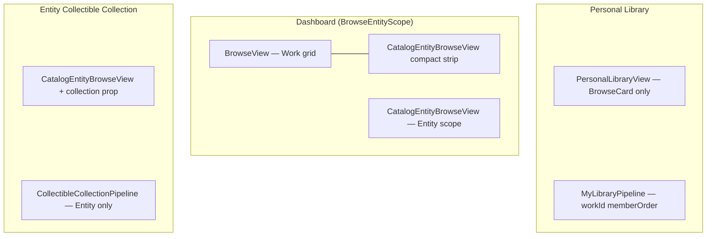

# R2-E Phase 5 — Mixed Library Planning Review

> **상태:** 계획 검토 · **착수 전**  
> **날짜:** 2026-06-19  
> **전제:** Phase 4 ✅ · Phase 4.5 (MF-1/2, SF-1) ✅ [Accept](r2e-phase4.5-performance-audit.md)  
> **방법:** 기존 Audit · 현재 코드 대조 · 범위·리스크·단계 제안 (**구현 없음**)

---

## Executive Summary

**R2-E Phase 5 = Mixed Library** — Work와 Entity(Person/Concept/…)를 **동일 Collectible 축**에서 한 shelf/grid에 표시하는 단계이다.

| | R2-E Phase 5 | Wave / entity-centric 「Phase 5 Connection」 |
|--|--------------|---------------------------------------------|
| 목표 | Work + Entity **mixed gallery / collection** | Link UI · Sheet 관련 작품 · sameDay |
| SSOT | `CollectibleRef` · `CollectibleCollection` | `RecordLink` · graph navigation |
| 관계 | **별도 로드맵** — Connection은 Phase 5와 병렬·후속 가능 |

**현재:** Entity Collection(Phase 3–4)과 Work Personal Library는 **병렬 시스템**으로 안정 동작. Phase 5는 이 둘을 **한 컬렉션·한 그리드**로 합치는 작업이다.

**권장 판정:** **Conditional Go** — 전체 Mixed(25–40 files)를 한 번에 하지 말고 **3단계 Sprint**로 쪼개 착수.  
**Must 선행:** Phase 5.0 Preparation Audit(세부 시나리오·회귀 매트릭스) → **5.1 Schema + Curated Mixed MVP**.

---

## 1. 현재 아키텍처 (As-Is)

### 1.1 Browse / Collection 3갈래

| Surface | 카드 VM | 멤버 ID | Pipeline | Tap |
|---------|---------|---------|----------|-----|
| `BrowseView` | `BrowseCard` | — (filter) | `BrowsePipeline` | Workbench |
| `PersonalLibraryView` | `BrowseCard` | `workId` | `MyLibraryPipeline` | Workbench |
| `CatalogEntityBrowseView` | `EntityBrowseCard` | `entityId` | catalog / `CollectibleCollectionPipeline` | Entity Sheet |

**`BrowseEntityScope.all`:** Work **grid** + Entity **compact strip** — **단일 mixed grid 아님** (`home_shell_body.dart` L360–366).

### 1.2 Collectible 모델 (Phase 3–4 완료)

| 타입 | Work 지원 | 비고 |
|------|:---------:|------|
| `CollectibleKind` | ❌ (주석: Phase 5 reserved) | person … organization만 |
| `CollectibleRef` | ❌ | Entity id only |
| `CollectibleCollection` | ❌ | Entity-only collection |
| `CollectibleCollectionPipeline` | ❌ | `!e.isWorkEntity` 고정 |
| `CollectibleCollectionFilter.kinds` | Entity kinds only | work filter 없음 |

Work는 여전히 **`PersonalLibraryConfig` + `AkashaItem` + `BrowseCard`** 축.

### 1.3 Phase 4.5 이후 전제

- Cast / relatedWorkId reload: **Accept** — Phase 5 blocker 없음
- 잔여 SF-R1~R2: Mixed **curated** 소규모(M≈20)에는 영향 적음 · 대형 tags gallery는 Phase 5와 **직交 적음**

---

## 2. Phase 5 Vision (To-Be)

[`r2e-phase3-collectible-collection-architecture-audit.md`](r2e-phase3-collectible-collection-architecture-audit.md) §11 · [`r2e-collection-architecture-audit.md`](r2e-collection-architecture-audit.md) §Phase 3:

| 축 | Phase 5 목표 |
|----|--------------|
| **Storage** | `CollectibleRef { kind: work, id: wk_* }` in `memberOrder` |
| **Filter** | mixed `kinds` (work + person …) · IP shelf filter (optional) |
| **Pipeline** | unified resolve → **mixed card list** |
| **UI** | Work `PosterCard` + Entity `EntityCollectibleCard` **동일 Grid** |
| **Tap** | `CollectibleRef` → Workbench **or** Entity Sheet dispatch |
| **Curated reorder** | mixed `memberOrder` DnD |
| **Bridge (optional)** | `PersonalLibraryConfig` ↔ `CollectibleCollection` |

### 2.1 대표 사용자 시나리오

| 시나리오 | MVP(5.1) | Full(5.3) |
|----------|:--------:|:---------:|
| 「Re:Zero IP」= Work 1 + Cast Person N | △ curated hand-pick | ✅ filter: work + relatedWorkId |
| 「최애 shelf」= Work 3 + Person 5 explicit | ✅ curated mixed | ✅ |
| master_archive Work library | ❌ PLC 유지 | △ optional bridge |
| Dashboard scope.all 단일 grid | ❌ | ✅ BrowseView mixed |
| DnD Work → mixed collection | ❌ | ✅ collectible payload |

---

## 3. Gap 분석

### 3.1 Schema / Model

| Gap | 현재 | Phase 5 필요 |
|-----|------|--------------|
| `CollectibleKind.work` | 없음 | enum + codec |
| Work in `CollectibleRef` | parse 시 person fallback | explicit kind |
| `CollectibleCollection` doc | Entity-only | mixed member 허용 |
| JSON migration | — | `kind:work` round-trip test |

### 3.2 Pipeline

| Gap | 현재 | Phase 5 필요 |
|-----|------|--------------|
| Resolve curated | Entity catalog lookup only | + `AkashaItem` / vault for `wk_*` |
| Resolve filter | Entity tags · relatedWorkId | Work filter spec **(범위 결정 필요)** |
| Sort | `entity_browse_sort` | mixed sort policy **(Must 결정)** |
| Discovery | EntityRelatedWorks | Work 쪽 불필요 · mixed filter 시 optional |

### 3.3 UI / Routing

| Gap | 현재 | Phase 5 필요 |
|-----|------|--------------|
| Grid cell | 단일 card type | `CollectibleGridCell` or dual builder |
| Reorder | `EntityCuratedReorderGrid` vs `CuratedReorderGrid` | **generic mixed reorder** |
| Edit dialog | Entity member picker | + Work picker |
| `home_shell_body` | collection → Entity view only | mixed view branch |
| DnD | `WorkDragPayload` → PLC only | → `CollectibleRef` |

### 3.4 Personal Library (고위험)

| 접근 | Touch | Risk | 권장 |
|------|------:|:----:|:----:|
| **A. 병렬 유지** — Mixed = CollectibleCollection only | M | Low | **5.1–5.2 기본** |
| **B. Bridge** — PLC curated → import as collection | M | Med | 5.3 optional |
| **C. PLC 일반화** — `MyLibraryPipeline` mixed | L+ | **High** | **Phase 5 후반 or defer** |

[`r2e-collection-architecture-audit.md`](r2e-collection-architecture-audit.md) §5.2: **PersonalLibraryConfig 일반화 ❌** — 신규 CollectibleCollection 확장 권장.

---

## 4. 범위 옵션 (Decision Matrix)

### Option A — **Curated Mixed MVP** (권장 5.1)

**In:** `CollectibleKind.work` · curated `memberOrder` with work+entity · mixed grid · mixed reorder · edit dialog Work add · tap dispatch  
**Out:** filter-mode mixed · PLC bridge · BrowseDashboardSections · dashboard scope.all mixed

| | |
|--|--|
| Touch | ~12–16 files |
| Difficulty | **M** |
| 회귀 | Work browse / PLC **미접촉** |
| Done | 「Re:Zero + 스바루」explicit shelf E2E |

### Option B — **Filter Mixed** (5.2)

**In:** A + filter `kinds: [work, person]` + `relatedWorkId` → Work catalog entity + Cast persons  
**Out:** PLC · dashboard mixed

| | |
|--|--|
| Touch | +6–8 files |
| Difficulty | **M+** |
| 리스크 | Work filter semantics · duplicate work+entity |

### Option C — **Full Mixed Library** (collection audit §Phase 3)

**In:** B + `PersonalLibraryView` mixed + `BrowseDashboardSections` + DnD + PLC bridge  
**Out:** —

| | |
|--|--|
| Touch | ~25–40 files |
| Difficulty | **L** |
| 리스크 | Work regression · sort · DnD · 34-file PLC graph |

**권장:** **A → B → (필요 시) C**. C는 제품 dogfood 후 Go.

---

## 5. 제안 Sprint 구조

### Phase 5.0 — Preparation Audit (코드 수정 없음)

- Mixed 시나리오 5개 · 회귀 매트릭스 (PLC · dashboard · entity collection)
- Sort / filter semantics ADR-lite
- Card union 타입 결정 (`CollectibleBrowseItem` vs dual-list)
- **Go/No-Go for 5.1**

### Phase 5.1 — Curated Mixed MVP (Option A)

| Step | 산출물 |
|:----:|--------|
| 1 | `CollectibleKind.work` · `CollectibleRef` work parse · JSON tests |
| 2 | `CollectibleCollectionPipeline` curated work branch (`AkashaItem` resolve) |
| 3 | `CollectibleMixedBrowseView` or extend collection view — dual card grid |
| 4 | `openCollectible(CollectibleRef)` dispatch (Workbench / Sheet) |
| 5 | Edit dialog — add Work to curated collection |
| 6 | `MixedCuratedReorderGrid` or generalize entity grid |
| 7 | Tests · PLC/dashboard **회귀 없음** 확인 |

**수정 금지 (5.1):** `MyLibraryPipeline` · `BrowsePipeline` · `PosterCard` 내부 · `PersonalLibraryConfig` schema

### Phase 5.2 — Filter Mixed (Option B)

- `CollectibleCollectionFilter` — work kinds · optional work-level filter (TBD)
- Pipeline filter branch: union Work catalog + Entity filter
- Preset 예: 「Re:Zero IP Shelf」

### Phase 5.3 — Integration (Option C, optional)

- PLC bridge / import
- Dashboard `BrowseEntityScope.all` → true mixed grid
- `WorkDragPayload` → CollectibleCollection

---

## 6. 기술 결정 (Must Decide before 5.1)

| # | 질문 | 옵션 | 권장 |
|---|------|------|------|
| D1 | Mixed card VM | `CollectibleBrowseItem` union vs `(BrowseCard \| EntityBrowseCard)` sealed | **Sealed union** — grid builder 단순 |
| D2 | Curated reorder SSOT | `CollectibleRef` list only (기존) | **유지** — Pipeline이 cards 재생성 |
| D3 | Mixed sort | manualOrder only vs kind-grouped vs unified addedAt | **5.1: manualOrder only** (curated) |
| D4 | Work member source | vaultItems · catalog `wk_*` · both | **catalog Work entity + vaultItems** (Edit Dialog 패턴 재사용) |
| D5 | Entity Collection 회귀 | work member in entity-only collection? | **허용** — kind dispatch · filter는 5.2 |
| D6 | Sidebar | 새 mixed section vs 기존 「컬렉션」 | **기존 컬렉션** — title/mode로 구분 |

---

## 7. 리스크 · 회귀

| ID | 리스크 | 심각도 | 완화 |
|----|--------|:------:|------|
| R1 | Work browse / PLC 회귀 | High | 5.1에서 PLC·BrowseView **미수정** |
| R2 | Tap wrong surface (Work→Sheet) | Med | `CollectibleRef.kind` dispatch 단일 진입 |
| R3 | Grid layout (aspect ratio Work vs Entity) | Med | 5.1 grid — entity `0.68` vs poster `0.78` **행 분리 or max height** |
| R4 | Curated reorder id collision | Low | `CollectibleRef` = kind+id composite key |
| R5 | Performance large mixed | Low | 5.1 curated M small · SF-R2는 scope gallery |
| R6 | Scope creep → BrowseDashboardSections | High | **Explicit defer** to 5.3 |

**회귀 테스트 필수 (5.1):**

- Hero / Cast / Intersection Entity collections
- Personal library curated reorder
- Dashboard Work grid + entity strip
- Workbench open from Work card

---

## 8. Phase 4.5 잔여와의 관계

| Phase 4.5 잔여 | Phase 5 영향 | 권장 |
|----------------|--------------|------|
| SF-R1 entityIdsForWork + discoverAll 2× vault | Cast filter only · mixed curated **무관** | Phase 5 **병렬** |
| SF-R2 tags gallery M× incoming | Mixed grid Entity leg only | 5.2+ if large filter collections |
| SF-R3 _openEntity cache | Entity tap in mixed grid | 5.1 optional |

**Phase 5 착수를 SF-R1/R2 완료에 **묶지 않음**** (4.5 Audit 판정과 일치).

---

## 9. Effort · 파일 예상 (5.1 MVP)

| 영역 | 신규 | 수정 |
|------|:----:|:----:|
| Model (`CollectibleKind`, `CollectibleRef`, union VM) | 1–2 | 2–3 |
| Pipeline curated work resolve | 0 | 1 |
| Mixed browse view + shell routing | 1 | 2 |
| Edit dialog Work member | 0 | 1 |
| Mixed reorder grid | 0–1 | 1 |
| Open dispatch helper | 1 | 1 |
| Tests | 2 | 2 |
| **합계** | **~5–7** | **~8–10** |

Difficulty: **M** · Duration: 1 sprint (Collection Phase 3 Entity-only 대비 +30% scope)

---

## 10. Go / No-Go

| 기준 | 판정 |
|------|:----:|
| Phase 4 기능 Complete | **Go** |
| Phase 4.5 MF Accept | **Go** |
| 아키텍처 방향 (CollectibleCollection 확장, PLC 일반화 ❌) | **Go** |
| Full Mixed 25–40 files 한 번에 | **No-Go** — 분할 필요 |
| 5.0 Preparation Audit | **Go** — 5.1 직전 권장 |
| **Phase 5.1 Curated Mixed MVP 착수** | **Conditional Go** |

**조건:** D1–D6 결정 · 5.0에서 회귀 매트릭스 확정 · Option A scope lock.

---

## 11. 권장 다음 액션

1. **Phase 5.0 Audit** — D1–D6 확정 · 시나리오·회귀表 · (선택) wireframe 1장  
2. **Phase 5.1 구현** — Curated Mixed MVP only  
3. Dogfood — 「Re:Zero IP explicit shelf」수동 E2E  
4. **Phase 5.2** — filter mixed (Re:Zero Work + Cast)  
5. Phase 5.3 / PLC bridge — dogfood 후

**Explicitly Out of Phase 5.1:**

- `EntityRelatedWorksDiscovery` 변경
- `PersonalLibraryConfig` / `MyLibraryPipeline` 변경
- `BrowseDashboardSections` mixed
- Wave Connection / Entity Sheet 「관련 작품」 UI
- Persistent discovery cache (NF-1)

---

## 12. 관련 문서

| 문서 | 내용 |
|------|------|
| [r2e-phase4.5-performance-audit.md](r2e-phase4.5-performance-audit.md) | Phase 5 Go 판정 |
| [r2e-phase3-collectible-collection-architecture-audit.md](r2e-phase3-collectible-collection-architecture-audit.md) | Phase 3/4/5 경계 |
| [r2e-collection-architecture-audit.md](r2e-collection-architecture-audit.md) | PLC vs CollectibleCollection |
| [r2e-step0.5-collectible-architecture-audit.md](r2e-step0.5-collectible-architecture-audit.md) | CollectibleItem · PosterCard gap |
| [r2e-step3-entity-collection-surface-audit.md](r2e-step3-entity-collection-surface-audit.md) | Browse surface map |

**Phase 5 Planning Review: Complete · Conditional Go (5.1 MVP)**
