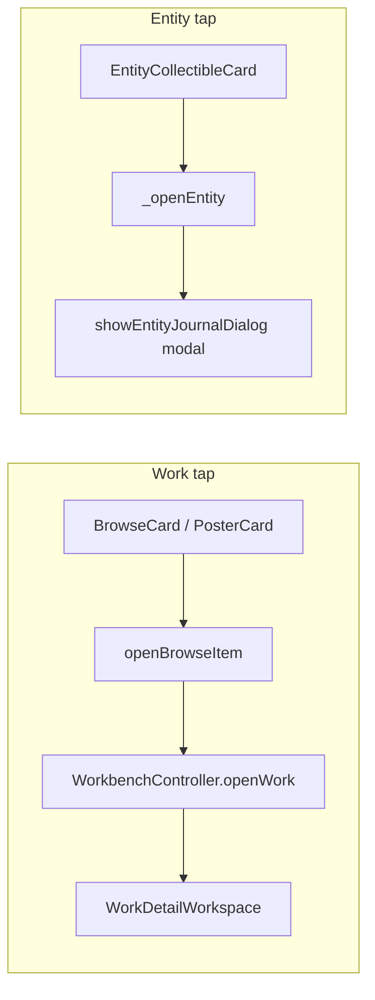
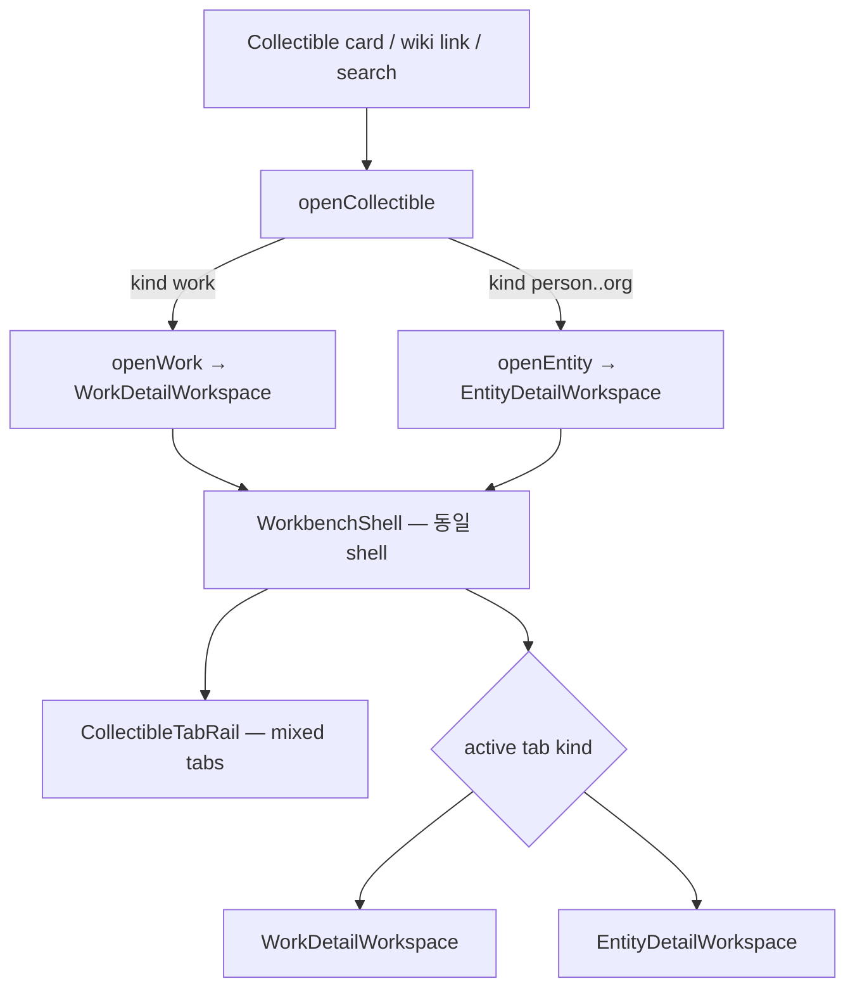
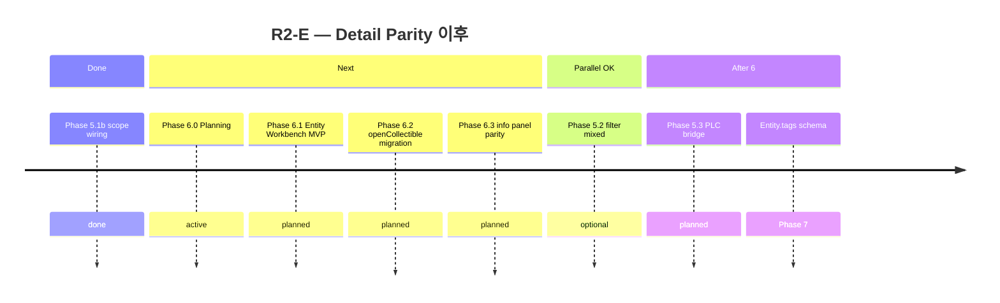

# R2-E Phase 6 — Collectible Detail Parity Planning Review

> **상태:** Phase 6.1 MVP ✅ · Phase 6.2 migration **구현 완료** (2026-06-20)  
> **날짜:** 2026-06-19  
> **전제:** Phase 5.1b Entity scope wiring ✅ · Phase 5.1 mixed shelf ✅  
> **사용자 요구:** Work · Person · Concept … **동급 Collectible** — **카드 클릭 → Workbench형 정보창 · 탭 · 편집 · 링크 탐색**까지 동일 UX  
> **방법:** Step 0.5 · Architecture Alignment · 현재 코드 대조 (**구현 없음**)

---

## Executive Summary

**갤러리·컬렉션·필터 층(Phase 1~5.1b)은 완료**되었으나, **감상 surface(Detail)는 여전히 이원화**되어 있다.

| Collectible | 카드 tap | Detail surface |
|-------------|----------|----------------|
| **Work** | `openBrowseItem` → `WorkbenchController.openWork` | `WorkDetailWorkspace` — 탭 레일 + 작품정보 + **Sanctum** |
| **Entity** | `_openEntity` → `showEntityJournalDialog` | **모달 Entity Sheet** (max 560×680) |

**권장 판정:** **Conditional Go** — Phase 6를 **4 Sprint(6.0~6.3)** 로 분할.  
**Must 선행:** 6.0 ADR(D1~D5) · wireframe 1장 · 회귀 매트릭스.  
**Must NOT (6.1):** `AkashaItem` / Entity model 통합 · rating/poster Entity 추가.

---

## 1. 사용자 요구 vs 현재 (Gap)

### 1.1 스크린샷 기준 기대 UX

| 동작 | Work (기준) | Entity (현재) | Entity (목표) |
|------|-------------|---------------|---------------|
| 카드 클릭 | Workbench 진입 | **Dialog 팝업** | **Workbench 진입** |
| 탭 레일 | 여러 Work 동시 열기 | ❌ | Work + Entity **혼합 탭** |
| 좌측 정보 | 작품정보 (포스터·rating·상태·태그) | Sheet 상단 메타 | **Entity 정보 패널** (type·별칭·태그) |
| 우측 본문 | Sanctum (미리보기·편집·md) | Sheet 내 TextField | **Sanctum 재사용** (journal body) |
| wiki `[[…]]` | Sanctum → 연속 탐색 | Sheet 편집 only · incoming 별도 | **동일 wiki 탐색** |
| incoming links | — (Work) | Sheet 섹션 | 정보 패널 or Sanctum 보조 |
| 저장 / Ctrl+S | Workbench auto-save | Sheet 저장 후 **닫힘** | **탭 유지 + auto-save** |
| browse 복귀 | 탭 유지 · 상세만 숨김 (`showBrowse`) | Dialog 닫기 | **동일** |

### 1.2 코드 분기 (Root Cause)



**`WorkbenchController`는 Work 전용:**

```39:55:lib/features/workbench/data/workbench_controller.dart
  void openWork(AkashaItem item) {
    final id = WorkTab.idFor(item);
    ...
    tabs.add(WorkTab(id: id, item: item));
    _workViewVisible = true;
  }
```

**Entity Sheet 진입점 (~6곳):**

| 파일 | 용도 |
|------|------|
| `catalog_entity_browse_view.dart` | 갤러리 · compact strip · mixed grid |
| `record_link_navigator.dart` | wiki / link graph |
| `home_dialogs_coordinator.dart` | 검색 · fusion · promote |
| `entity_journal_view.dart` | Records 축 |

---

## 2. As-Is 아키텍처

### 2.1 Work Detail Stack

```
WorkbenchShell
  ├─ WorkTabRail (List<WorkTab>)
  └─ WorkDetailWorkspace
       ├─ WorkDetailInfoPanel (poster, rating, status, tags, 서재 담기)
       └─ SanctumPagePanel (preview · body · file · wiki tap)
```

- **SSOT:** `AkashaItem` + vault `.md`
- **탭 ID:** `workId` or file cache key
- **dirty / auto-save / vault sync:** ✅

### 2.2 Entity Detail Stack

```
showEntityJournalDialog (Dialog maxWidth 560)
  └─ _EntityJournalDialog
       ├─ header (Entity Sheet · type · entityId)
       ├─ aliases · tags · incoming · sameDay
       ├─ body TextField / SelectableText
       └─ footer (생성 · 편집 · 저장 · 삭제 · 닫기)
```

- **SSOT:** `UserCatalogEntity` (catalog JSON) + `EntityJournalEntry` (vault `.md`)
- **탭 없음** · **Sanctum 없음** · 저장 시 **Navigator.pop**
- **기능:** incoming links · sameDay · tags · EntityArchiveService — **Sheet에만 존재**

### 2.3 Step 0.5 원래 판정 vs 사용자 요구

| 문서 | 원래 권장 | 사용자 요구 |
|------|-----------|-------------|
| [r2e-step0.5 §5.2](r2e-step0.5-collectible-architecture-audit.md) | Phase 1~2 **Sheet 유지** | ❌ |
| [r2e-step0.5 §5.3](r2e-step0.5-collectible-architecture-audit.md) | Phase 3 **optional Entity Workspace** | ✅ **지금 착수** |
| [r2e-architecture-alignment §1.6](r2e-architecture-alignment-check.md) | Workbench vs Sheet **의도적 분리** | **통합 shell · kind별 필드** |

**재정의:** 「동급 Collectible」= **같은 Workbench shell** + **kind별 메타 필드**(rating/poster는 Work only).

---

## 3. To-Be Vision (Phase 6)

### 3.1 목표 UX



### 3.2 EntityDetailWorkspace (제안 레이아웃)

**WorkDetailWorkspace와 동형** — 3열 정보 + 4열 Sanctum:

| 영역 | Work | Entity (Phase 6) |
|------|------|------------------|
| **탭 타일** | 포스터 썸네일 + 제목 | type icon + 제목 (+ archived dot) |
| **정보 패널** | poster · rating · status · HoF · tags | type badge · title · **aliases** · **tags** · **incoming count** · catalog-only badge |
| **Sanctum** | work body (description/review/quotes) | **entity journal body** |
| **wiki tap** | `onWikiLinkTap` → graph | **동일** → `openCollectible` |
| **저장** | md + catalog sync | `EntityVaultStore` + `EntityArchiveService.syncCatalogFromJournal` |
| **삭제** | detail delete dialog | `EntityArchiveService.deleteArchivedEntity` |
| **서재 담기** | PersonalLibrary curated | **defer** → CollectibleCollection (5.3) |

**Sanctum 재사용 근거:** `SanctumPagePanel`은 `AkashaItem` 비의존 — markdown controller + `onWikiLinkTap` only. Entity journal body에 **동일 wiki UX** 적용 가능.

**Work 전용 UI — Entity에서 숨김 (정책):** rating · workStatus/myStatus · poster · HoF · formatSlots · registry fusion chip.

---

## 4. 기술 설계 (Must Decide)

### D1 — Tab 모델

| 옵션 | 설명 | 권장 |
|------|------|:----:|
| **A. Sealed `CollectibleTab`** | `WorkCollectibleTab` \| `EntityCollectibleTab` | **✅** |
| B. `WorkTab` + parallel `EntityTab` lists | Controller 2벌 | ❌ |
| C. `CollectibleItem` SSOT tab payload | Step 0.5 중장기 | defer |

```dart
sealed class CollectibleTab {
  String get id;
  String get title;
  bool isDirty;
}

final class WorkCollectibleTab extends CollectibleTab { AkashaItem item; }
final class EntityCollectibleTab extends CollectibleTab {
  UserCatalogEntity entity;
  EntityJournalEntry? journal;
}
```

### D2 — Controller API

| API | 동작 |
|-----|------|
| `openCollectible(CollectibleRef ref, …)` | kind dispatch |
| `openWork(AkashaItem)` | 기존 유지 (wrapper) |
| `openEntity(UserCatalogEntity, {EntityJournalEntry?})` | **신규** |
| `hasOpenDetail` | rename from `hasOpenWork` |
| `syncFromVault` | Work tabs + Entity journal reload |

### D3 — Sheet 처리

| 옵션 | 권장 |
|------|:----:|
| **A. Sheet deprecated** — 모든 경로 Workbench | **✅ 6.2 이후** |
| B. Sheet = compact peek · double-click → Workbench | △ |
| C. Sheet 유지 + Workbench optional | ❌ 사용자 요구와 불일치 |

**6.1~6.2:** `showEntityJournalDialog` 내부를 **Workbench host로 redirect**하거나 thin wrapper로 유지(회귀 완화).

### D4 — 미아카이브 Entity (catalog-only)

| 상태 | UX |
|------|-----|
| catalog only · journal 없음 | Workbench 진입 → **「journal 생성」** CTA (Sheet `_creating` flow 이전) |
| journal 있음 | full Sanctum |

### D5 — Work entity mirror (`isWorkEntity`)

catalog Work mirror는 tap 시 **`openWork(vault AkashaItem)`** 우선 — Entity workspace **skip** (기존 `RecordLinkNavigator` Work 분기 유지).

---

## 5. Sprint 구조 (제안)

### Phase 6.0 — Preparation (코드 없음)

- D1~D5 확정 · wireframe (탭 + Entity 정보 + Sanctum)
- Feature parity表 (§6)
- 회귀 매트릭스 · call site inventory

### Phase 6.1 — Entity Workbench MVP

**In:**

- `CollectibleTab` sealed + `WorkbenchController.openEntity`
- `EntityDetailWorkspace` + `EntityDetailInfoPanel` (minimal)
- `SanctumPagePanel` 연동 (journal body)
- `catalog_entity_browse_view` tap → `openEntity`
- dirty · save · close tab

**Out:** incoming/sameDay UI 이전 · search/wiki 전 경로 · Sheet 제거

| | |
|--|--|
| Files | ~8–12 신규/수정 |
| Difficulty | **M+** |
| Done | Person 카드 → Workbench 탭 · journal 편집 · wiki tap |

### Phase 6.2 — Unified `openCollectible` + 경로 마이그레이션

**In:**

- `openCollectible(CollectibleRef)` helper
- `record_link_navigator` · `home_dialogs_coordinator` · `entity_journal_view` · mixed grid
- `WorkTabRail` → **`CollectibleTabRail`** (Work + Entity 타일)
- `hasOpenWork` → `hasOpenDetail` rename (call sites)

**Out:** Sheet 코드 삭제

| | |
|--|--|
| Files | +6–10 |
| Difficulty | **M** |

### Phase 6.3 — Feature parity (Entity 정보 패널)

**In:**

- incoming links section (Sheet에서 이전)
- sameDay section
- tags 편집 (정보 패널)
- auto-save · external vault change (Work 패턴)
- Ctrl+S · close-tab dirty dialog (Entity branch)

**Out:** rating/poster · PLC 「서재 담기」

| | |
|--|--|
| Files | +4–6 |
| Difficulty | **M** |

### Phase 6.4 — Polish (optional)

- Entity tab icon/by-type color
- catalog-only → archived promote flow in-workbench
- Sheet 완전 제거 · dead code cleanup
- E2E: Re:Zero Work tab ↔ 스바루 Entity tab 왕복

---

## 6. Feature Parity Matrix

| 기능 | Work | Entity Sheet (현재) | Phase 6 Target |
|------|:----:|:-------------------:|:--------------:|
| Workbench 탭 | ✅ | ❌ | ✅ |
| Split pane (정보 + 본문) | ✅ | △ 단일 scroll | ✅ |
| Sanctum preview/edit/file | ✅ | ❌ TextField only | ✅ |
| wiki link navigate | ✅ | △ incoming only | ✅ |
| auto-save | ✅ | ❌ | ✅ 6.3 |
| dirty close guard | ✅ | ❌ | ✅ 6.3 |
| tags | ✅ | ✅ | ✅ |
| rating / status | ✅ | ❌ N/A | ❌ hide |
| poster | ✅ | ❌ policy | ❌ placeholder |
| incoming links | — | ✅ | ✅ 6.3 |
| sameDay | — | ✅ | ✅ 6.3 |
| delete journal | ✅ | ✅ | ✅ |
| add to library/collection | ✅ | ❌ | △ 5.3 |
| search open | Workbench | Sheet | Workbench 6.2 |

---

## 7. 수정 파일 (예상)

| 영역 | 신규 | 수정 |
|------|:----:|:----:|
| `collectible_tab.dart` · tab model | 1 | — |
| `workbench_controller.dart` | — | 1 |
| `entity_detail_workspace.dart` · info panel | 2 | — |
| `workbench_shell.dart` · tab rail | — | 2 |
| `open_collectible.dart` (dispatch) | 1 | — |
| `catalog_entity_browse_view.dart` | — | 1 |
| `record_link_navigator.dart` | — | 1 |
| `home_dialogs_coordinator.dart` | — | 1 |
| `entity_journal_dialog.dart` | — | 1 (redirect/deprecate) |
| `home_workbench_coordinator.dart` | — | 1 |
| Tests | 3–4 | 2 |
| **합계** | **~5–7** | **~10–14** |

**수정 금지 (6.1):**

- `AkashaItem` abstract contract
- `BrowsePipeline` / `MyLibraryPipeline`
- `PosterCard` / Work Sanctum body schema
- Tier 1.5 Entity poster policy

---

## 8. 리스크 · 회귀

| ID | 리스크 | 심각도 | 완화 |
|----|--------|:------:|------|
| R1 | Work Workbench 회귀 | **High** | Work tab path **무변경** · 6.1 Entity additive only |
| R2 | Controller complexity (mixed tabs) | Med | sealed `CollectibleTab` · unit tests |
| R3 | Entity catalog-only / path conflict | Med | Sheet `_save` error handling **이전** |
| R4 | `hasOpenWork` rename blast radius | Med | 6.2 dedicated PR · grep |
| R5 | Sanctum Work body vs Entity journal semantics | Low | separate draft ops · shared widget only |
| R6 | Scope creep → full CollectibleItem | Med | **Explicit defer** |

**회귀 테스트 필수:**

- Work 카드 → Workbench → Sanctum → save
- Person 카드 → Entity tab → save → 탭 유지
- wiki `[[pe_u_…]]` from Work Sanctum → Entity tab
- wiki from Entity Sanctum → Work tab
- sidebar browse 전환 · 탭 유지 (`showBrowse`)
- mixed collection grid Work + Entity tap
- Records · entity_journal_view open

---

## 9. 로드맵 배치



| Phase | 관계 |
|-------|------|
| **5.2 Filter mixed** | 6과 **병렬 가능** (gallery leg) |
| **5.3 PLC bridge** | 6.3 이후 「Entity 서재 담기」자연스러움 |
| **7 tags schema** | filter collection · 정보 패널 확장 |

---

## 10. Go / No-Go

| 기준 | 판정 |
|------|:----:|
| 사용자 요구 명확 (Workbench parity) | **Go** |
| Sheet 기능 재사용 가능 (Sanctum · archive service) | **Go** |
| 6.1 MVP로 Person E2E 가능 | **Go** |
| 한 번에 Sheet 제거 + CollectibleItem | **No-Go** |
| Entity rating/poster 동등화 | **No-Go** (policy) |
| **Phase 6.0 → 6.1 착수** | **Conditional Go** |

**조건:** D1 sealed tab · D3 Sheet deprecation timeline · §6 parity表 합의.

---

## 11. 권장 다음 액션

1. **Phase 6.0** — D1~D5 확정 · wireframe · 회귀表 (본 문서 리뷰)
2. **Phase 6.1** — `openEntity` + `EntityDetailWorkspace` MVP
3. Dogfood — master_archive Person → 스바루 → Re:Zero wiki 왕복
4. **Phase 6.2** — 전 tap 경로 · `openCollectible`
5. **Phase 6.3** — incoming · sameDay · auto-save
6. Phase 5.2 / 5.3 — 6과 병렬 또는 6.2 이후

**Explicitly Out of Phase 6:**

- `CollectibleItem` unified model (Step 0.5 중장기)
- Entity rating · poster · workStatus
- `PersonalLibraryConfig` Entity membership (→ 5.3)
- Dashboard true single mixed grid (→ 5.3)

---

## 12. 관련 문서

| 문서 | 내용 |
|------|------|
| [r2e-step0.5-collectible-architecture-audit.md](r2e-step0.5-collectible-architecture-audit.md) | §5 Sheet vs Workspace |
| [r2e-architecture-alignment-check.md](r2e-architecture-alignment-check.md) | Work vs Entity stack |
| [r2e-step1-entity-collectible-information-audit.md](r2e-step1-entity-collectible-information-audit.md) | Entity 필드 · policy |
| [r2e-phase5-mixed-library-planning-review.md](r2e-phase5-mixed-library-planning-review.md) | Tap dispatch (5.1 partial) |
| [r2e-personal-library-entity-scope-wiring-planning-review.md](r2e-personal-library-entity-scope-wiring-planning-review.md) | 5.1b 완료 |

**Phase 6 Collectible Detail Parity Planning Review: Complete · Conditional Go (6.0 → 6.1)**
