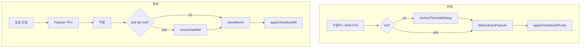

# 서재 담기 1단계 통합 — Popover 우선 · md 자동 생성

> **상태:** **완료** (Phase 1~3 · 2026-06-10)  
> **지위:** Case A/B/C · E1 · `ArchiveThenAddDialog` 대체 SSOT  
> **상위:** [curated-personal-library-plan.md](./curated-personal-library-plan.md) §7.5 · [curated-library-membership-ui-plan.md](./curated-library-membership-ui-plan.md)  
> **대체 예정 API:** 상위 §7.9 `ensureVaultMdThenAdd` → **`ensureVaultMd` + `applyPanel`** (구현 완료)

---

## 1. 한 줄

**우클릭·Shift+F10 → 곧바로 「어느 서재에 담을지」 popover 한 번.**  
**「적용」= `ensureVaultMd`(필요 시) → `_loadItems()` → `applyCheckboxDiff`** — E1·dialog·(완료 정의) DnD·검색 **공통**.  
별도 「기록 만들고 담기」 1차 AlertDialog는 **폐기**.

---

## 2. 배경

> **Historical (2026-06-10 이전)** — §2.2~2.3은 개편 **전** As-Is 기록.  
> **2026-06-12:** `ArchiveThenAddDialog` 파일 삭제 · call site **0** · `LibraryMembershipApply.applyPanel` SSOT.

### 2.1 사용자 제기 (2026-06-10)

| # | 불편 | 현재 동작 |
|---|------|-----------|
| U1 | **2단계** | 1차 `ArchiveThenAddDialog` → 2차 `WorkLibraryPopover` |
| U2 | **순서 역전** | 사용자는 서재 선택 먼저 · md는 부수 효과 |
| U3 | **Shift+F10** | 메뉴 없이 md 없이 담긴 것처럼 보임 (버그) |
| U4 | **입력 불일치** | 우클릭 2단 vs 키보드 체감 상 다른 동작 |

### 2.2 코드 — 현재 시퀀스 (E1)

`home_screen.dart` → `_openWorkLibraryMenu` / `_showAddToLibraryForCard`:

```
우클릭 / long-press / Shift+F10 (PosterCard → 동일 콜백)
  → [canCurate && !isArchivedInVault] showArchiveThenAddDialog  ← 1차
  → showWorkLibraryPopover / Dialog                                ← 2차
  → WorkLibraryPanel._apply → applyCheckboxDiff (vault gate 없음)  ← H3
```

**`ArchiveThenAddDialog` 실제 동작** (`archive_then_add_dialog.dart`):

- 「기록 만들고 담기」→ **`saveItem`만** (서재 `addWork` 없음)
- 상위 plan §7.5.2 「saveItem → addWork」 문구와 **불일치** → 본 개편 시 상위 plan도 갱신

### 2.3 `showArchiveThenAddDialog` 호출처 (4곳 — Phase 2까지 0 목표)

| # | 함수 | 진입 | Phase |
|---|------|------|:-----:|
| S1 | `_openWorkLibraryMenu` | E1 우클릭·Shift+F10 | 1 |
| S2 | `_showAddToLibraryForCard` | E2/E4 dialog | 1 |
| S3 | `_addRegistryWorkToLibrary` | E3 검색 [담기] | 2 |
| S4 | `_addWorkToLibrary` | E0 DnD-A drop | 2 |

### 2.4 Shift+F10 — 코드 사실 + 재현 시나리오

**코드 사실:** 우클릭과 Shift+F10은 **동일** `_openWorkLibraryMenu(card, anchor)` 호출 (`PosterCard.onOpenLibraryMenu`).

| 시나리오 | 증상 | 가설 |
|----------|------|------|
| **R-A** | Shift+F10 후 **아무 UI 없음** | H1: 카드 `Focus`/`Shortcuts` 미도달 · Tab 순서 없음 |
| **R-B** | popover는 보이나 **적용 후 md 없음** | H3: `applyCheckboxDiff`만 실행 · `memberOrder` 고아 id |
| **R-C** | 우클릭 2단 · Shift+F10 다른 체감 | R-A + 사용자 DnD-A 혼동 (H2) 또는 R-B |

**Phase 0 (blocking):** md 없는 사전 카드로 R-A/R-B 각각 1회 — 포커스 위젯·`memberOrder`·vault 파일 존재 여부 기록.

**확정된 구조적 허점 (H3):** `WorkLibraryPanel._apply()` → `applyCheckboxDiff` — **add 경로에 vault 검증 없음**.

---

## 3. 목표 UX

### 3.1 원칙

1. **1패널** — 서재 체크리스트가 첫 화면 (popover · dialog 동일 `WorkLibraryPanel`)
2. **md는 「적용」 시** — D1: 담기 전 볼트 md 보장
3. **제목** — Registry/카드 기본값 · panel 상단 inline (AlertDialog 없음)
4. **우클릭 = Shift+F10 = long-press** — 선행 `ArchiveThenAddDialog` **제거**
5. **hide-only** — `canCurate == false && hasHide` → 서재 섹션 없음 · archive gate 없음 (**유지**)
6. **member 실패 시 md** — v1: **md 유지** + 스낵바 재시도 (Q5) · md 자동 삭제 안 함

### 3.2 목표 화면

```
┌─ 「원피스」 ─────────────────────┐
│  제목  [ 원피스              ]   │  ← Case A 제외 (md 없을 때)
│  (읽을 예정 · 만화)              │  ← Case B/C 메타 읽기 전용
├──────────────────────────────────┤
│  [ 이 매체만 | IP 전체 (3) ]      │  ← Case D
├──────────────────────────────────┤
│  ☑ 인생 명작 · 현재 서재          │
│  ☐ 읽을 예정 2026                 │
├──────────────────────────────────┤
│  [ 취소 ]            [ 적용 ]     │
└──────────────────────────────────┘
```

| Case | 제목 행 | md 생성 |
|------|:-------:|---------|
| **A** md 있음 | 숨김 | skip |
| **B** 사전·미아카이브 | 표시 | `HomeAutoArchive` 기본값 |
| **C** 로컬 초안 (`wk_` 미발급) | 표시 | `MarkdownParser.ensureWorkId` + `saveItem` |

---

## 4. 기술 설계

### 4.1 레이어 (SSOT)

| 레이어 | 책임 | 파일 (안) |
|--------|------|-----------|
| **UI** | 체크 diff · 제목 입력 | `WorkLibraryPanel` |
| **Coordinator** | vault md · reload · membership | `home_screen.dart` 또는 `library_membership_apply.dart` |
| **Membership** | `memberOrder` diff only | `PersonalLibraryMembershipService` |

**금지:** `PersonalLibraryMembershipService`에서 `AkashaFileService.saveItem` 직접 호출.

### 4.2 `ensureVaultMd` + `applyLibraryPanel` (Coordinator)

```dart
/// 볼트 md 없으면 saveItem. 있으면 no-op. 실패 시 throw/Result.
Future<AkashaItem> ensureVaultMd({
  required AkashaItem draft,
  String? titleOverride,
});

/// UI 「적용」 유일 public 진입 (E1 · dialog · DnD · E3)
Future<MembershipApplyResult> applyLibraryPanel({
  required BrowseCard card,
  required AkashaItem draft,
  required List<String> workIds,
  required Map<String, bool?> desiredChecked,
  required Map<String, bool?> initialChecked,
  String? titleOverride,
  required Future<void> Function() reloadItems,
  required PersonalLibraryMembershipService membership,
});
```

**순서 (엄수):**

1. `vaultPath == null` → 스낵바 · 중단  
2. **add diff 있음** (`desired true && !initial equivalent`) && `!isArchivedInVault(draft)` →  
   - `ensureVaultMd` (제목 trim · empty → UI에서 적용 비활성)  
   - 실패 → **member diff 실행 안 함**  
3. **`reloadItems()`** — Case D `entireIpWorkIds`·체크 상태 재계산 전제  
4. `workIds` 재해석 (`FranchiseLibraryScope` · 저장된 id 기준)  
5. `membership.applyCheckboxDiff` — **add 경로는 step 2를 거친 id만**  
6. `MembershipApplyResult` + 스낵바  

**Case D (Q1):** IP 전체 토글 = **볼트 md 있는 id만** 일괄 add. 대표 1건 md 없으면 step 2에서 먼저 생성 → step 3 reload 후 IP 범위 갱신.

**remove-only diff:** md 없는 id는 보통 member에 없음 · orphan id 제거는 기존 `removeWork` 유지.

### 4.3 `WorkLibraryPanel` — UI만

| 항목 | 내용 |
|------|------|
| `needsArchive` | coordinator가 `showTitleEditor` 전달 |
| `_apply()` | **`request.onApply(...)`** 콜백 — panel은 file service 모름 |
| 적용 disabled | md 필요 && 제목 empty · diff 없음 · applying |

**`WorkLibraryMenuRequest` 확장:**

```dart
final AkashaItem draftItem;
final bool showTitleEditor;
final Future<MembershipApplyResult> Function({
  required String? titleOverride,
  required List<String> workIds,
  required Map<String, bool?> desiredChecked,
  required Map<String, bool?> initialChecked,
}) onApply;
```

### 4.4 진입점 — 선행 dialog 제거

| 트리거 | Phase | 변경 |
|--------|:-----:|------|
| 우클릭 · long-press · Shift+F10 | 1 | S1: popover 즉시 · `draftItem` 전달 |
| `_showAddToLibraryForCard` | 1 | S2: 동일 |
| E3 · `_addRegistryWorkToLibrary` | 2 | S3 |
| DnD `_addWorkToLibrary` | 2 | S4: `ensureVaultMd` + 단일 `addWork` (Q2) |

`_openWorkLibraryMenu` / `_showAddToLibraryForCard`에서 **`showArchiveThenAddDialog` 삭제** — md는 **`applyLibraryPanel`만**.

### 4.5 Shift+F10 (Phase 1)

| # | 작업 |
|---|------|
| K1 | `FocusNode` + **포커스 링** |
| K2 | hover/focus 시각 표시 |
| K3 | `onInvoke` → `_openWorkLibraryMenu` only (코드 감사) |
| K4 | (권장) 그리드 `FocusTraversalGroup` |
| K5 | T29: `requestFocus` 후 Shift+F10 |

### 4.6 `applyCheckboxDiff` gate (Membership)

- **UI·Coordinator 외 직접 호출:** 테스트·E9 등 legacy — 유지 가능  
- **add 분기:** `workIds` 각 id에 대해 `containsWork` 또는 vault md 존재 검증 · 없으면 skip + debug assert (dev)  
- **권장 public API:** Coordinator `applyLibraryPanel` — E1/E3/DnD 담기 UX

### 4.7 상위 plan SSOT 갱신 (Phase 1 직후 최소)

| 문서 | 갱신 |
|------|------|
| `curated-personal-library-plan.md` §7.5.2 | Case B = panel 통합 · ArchiveThenAdd deprecated |
| §7.5 E1 시퀀스 | 「popover → 적용 시 md」 |
| §7.9 | `ensureVaultMdThenAdd` → `applyLibraryPanel` 구현명 매핑 |

---

## 5. 데이터·정책

| 결정 | 유지 |
|------|------|
| D1 | 담기 = 볼트 md (`ensureVaultMd` on apply) |
| D2 | 멤버십 = `memberOrder` |
| D7 | `memberOrder` SSOT |
| D6 | DnD-A 1순위 · drop = 대상 서재 고정 (Q2) |

---

## 6. 구현 단계

### Phase 0 — 재현 (blocking · 0.5d)

| # | 작업 |
|---|------|
| 0.1 | R-A / R-B 재현 체크리스트 작성 |
| 0.2 | Case A 회귀 기준선 (popover만) |

### Phase 1 — E1 1단 + gate + Shift+F10 (1~2d)

**순서 (gate 먼저 — 1.1만 선행 시 H3 악화 방지):**

| # | 작업 |
|---|------|
| 1.1 | `ensureVaultMd` + `applyLibraryPanel` + `onApply` callback |
| 1.2 | `WorkLibraryPanel` 제목 행 · Case B/C |
| 1.3 | S1·S2 선행 `ArchiveThenAdd` 제거 |
| 1.4 | Shift+F10 포커스 UX |
| 1.5 | T27~T31 · T33 |
| 1.6 | 상위 plan §7.5.2/E1 최소 갱신 | ✅ |

**Phase 1 DoD:** ✅

### Phase 2 — call site 0 (1d) · **「통합 완료」 필수**

| # | 작업 | 상태 |
|---|------|:----:|
| 2.1 | S3 · S4 → `ensureVaultMd` / panel / shared helper | ✅ |
| 2.2 | `archive_then_add_dialog.dart` deprecated · import 0 | ✅ |
| 2.3 | T34 (DnD) · E3 panel 통합 | ✅ |

**Phase 2 DoD:** ✅

### Phase 3 — polish

| # | 작업 | 상태 |
|---|------|:----:|
| 3.1 | 적용 중 로딩 · member 실패 스낵바 (Q5) | ✅ |
| 3.2 | membership UI · parent plan 교차 갱신 | ✅ |

---

## 7. 테스트

| ID | 시나리오 | 기대 |
|----|----------|------|
| T27 | md 없음 · 우클릭 | ArchiveThenAdd **없음** · popover 즉시 |
| T27b | md 없음 · popover · **취소** | md·member unchanged |
| T28 | md 없음 · check · 적용 | vault md 1 + member append |
| T28b | T28 후 Case D IP 범위 | reload 후 `entireIpWorkIds` 정합 |
| T29 | Shift+F10 + `requestFocus` | T27 동일 popover |
| T30 | md 있음 | 제목 행 없음 · T22~T25 회귀 |
| T31 | saveItem 실패 · 적용 | member **unchanged** |
| T32 | IP 1/3 · tristate · 적용 | Q1 정책 |
| T33 | hide-only · `canCurate` false | 서재 섹션 없음 · archive gate 없음 |
| T34 | DnD-A md 없음 (Phase 2) | auto-md + target library only |

---

## 8. open questions

| # | 질문 | **권장 기본값** |
|---|------|----------------|
| Q1 | Case D IP · md 없는 매체 | 대표 1건 `ensureVaultMd` → **reload** → 볼트 id만 add |
| Q2 | DnD-A md 없음 | drop 시 `ensureVaultMd` + `addWork(targetId)` · panel 없음 |
| Q3 | 제목 | 기본값으로 적용 · empty만 금지 |
| Q4 | Phase 2 | **「통합 완료」= call site 0** · Phase 1만으로 완료 선언 금지 |
| Q5 | member 실패 | **md 유지** · 재적용 안내 · md 삭제 rollback v2 |

---

## 9. 비목표

| 항목 | 이유 |
|------|------|
| DnD-B · popover scroll dismiss | 완료 |
| `memberOrder` 스키마 | D7 |
| E2 워크벤치 본문 UX | 별도 · `저장하고 담기`는 E2 track |

---

## 10. diagram



---

## 11. 완료 정의 (Release checklist)

- [x] §2.3 S1~S4 `showArchiveThenAddDialog` **0**
- [x] E1: 1패널 · 적용 = md + member
- [x] Shift+F10 = 우클릭 (T29)
- [x] hide-only (T33)
- [x] 상위 §7.5.2/E1 문구 일치
- [x] T27~T34 PASS

---

## 12. 문서 이력

| 일자 | 변경 |
|------|------|
| 2026-06-10 | v1 초안 |
| 2026-06-10 | v2 — call site·coordinator·reload·Shift+F10 재현·DoD·테스트·Q5 보강 |
| 2026-06-10 | Phase 3 — Q5 스낵바 · parent plan §7.5 갱신 |
