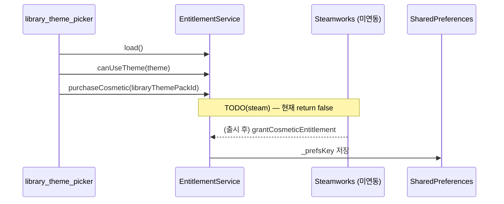

# Code Quality Structure Review — MVR Phase 1 + 3B

> **일자:** 2026-06-12  
> **범위:** D1 결합 · D2 응집 · D5 일관성 · **B. 홈·서재** 심층  
> **입력:** [code-metrics-baseline.md](code-metrics-baseline.md)

---

## 1. `home_screen` 책임 분해 (Phase 1.1)

`home_screen.dart`는 **오케스트레이터 + UI 빌더**가 한 파일에 공존한다. 이미 추출된 coordinator와 아직 화면에 남은 책임을 구분한다.

| # | 책임 영역 | 대표 메서드·필드 | 추출 상태 |
|---|-----------|------------------|-----------|
| R1 | Vault 연결·감시 | `_initVault`, `_loadItems`, `_vaultUpdateSubscription` | 화면 내 |
| R2 | Registry 동기화 | `_registrySync`, `_syncRegistry`, `_prefetchRegistryForCurrentFilters` | ✅ `HomeRegistrySync` |
| R3 | 자동 아카이브 | `_autoArchiveRegistryWorks` | ✅ `HomeAutoArchive` (호출만) |
| R4 | 대시보드 CRUD | `_loadDashboards`, `_showDashboardEditDialog`, `_deleteDashboard` | `_dashboardCtrl` + 화면 |
| R5 | 나만의 서재 CRUD | `_loadPersonalLibraries`, edit/delete, DnD | `_personalLibCtrl` + 화면 |
| R6 | Browse 필터 | `_filterCtrl`, `_toggleCategory`, `_onDomainChanged` | ✅ `HomeBrowseFilterController` |
| R7 | 서재 담기·적용 | `_addWorkToLibrary`, `_applyWorkLibraryPanel` | ✅ `LibraryMembershipApply` (로직) |
| R8 | 워크벤치 | `_workbench`, `_onWorkbenchWorkSaved` | ✅ `WorkbenchController` (ChangeNotifier) |
| R9 | 메인 그리드 빌드 | `build`, `_buildGrid`, `_buildPosterCard` | 화면 내 (~400줄) |
| R10 | 다이얼로그 오케스트레이션 | `_showAddDialog`, vault/settings/sync, clipboard 등 **15+** | 개별 dialog 파일 · 호출은 화면 |
| R11 | 카탈로그 기여 | `_showCatalogContributionsInbox`, `_proposeCatalogAdd` | 화면 + dialog |
| R12 | IAP·테마 | `_showLibraryThemePicker`, `EntitlementService.instance.load()` | ✅ `library_theme_picker` |
| R13 | 검색 | `_showSearchDialog` | `FusionSearchDialog` 위임 |
| R14 | Recall (flag off) | `RecallPicker`, `TodayRecallCard` | v1.1 |

**핵심:** coordinator·service 추출은 **진행 중**이나, **R9·R10·R4/R5 UI 연동**이 여전히 `home_screen`에 집중 → God object **잔존**.

---

## 2. 결합도 히트맵 (D1)

| 등급 | 모듈 | 근거 |
|:----:|------|------|
| **High** | `home_screen.dart` | import **70** · private 메서드 **~57** · `lib/` 유일 진입 (`main.dart`만 참조) |
| **High** | `works_registry.dart` + `registry_shard_loader.dart` | static 전역 · 앱 전역 검색·browse 의존 |
| **Medium** | `work_detail_workspace.dart` | 워크벤치 4열 · vault·membership 교차 |
| **Medium** | `poster_card.dart` | registry·vault·policy·DnD 교차 |
| **Medium** | `fusion_search_dialog.dart` | 검색 UI + registry 쿼리 내장 |
| **Low** | `library_membership_apply.dart` | 단방향 service · UI 무의존 |
| **Low** | `home_registry_sync.dart` | 콜백 주입 · 테스트 용이 |

### `home_screen` import fan-out (요약)

- **screens/home/** 12+ (coordinator, dialogs)
- **services/** 15+ (file, registry, pipeline, membership, entitlement…)
- **widgets/** 10+
- **models/utils/config** 10+

**역방향:** `home_screen`을 import하는 파일은 `main.dart` **뿐** — 순환은 없으나 **단일 집중점**이 명확.

---

## 3. 응집도 — 분할·유지 판정 (D2)

### 결합 High 5 · 분할 후보 3 · Keep 3

| 구분 | 대상 | 판정 |
|------|------|------|
| **High 1** | `home_screen` | Amber — coordinator 패턴으로 **점진 분할** (출시 후) |
| **High 2** | `works_registry` + loader | Amber — 5k까지 static OK ([scale-5k](../validation/scale-5k-risk-analysis.md)) |
| **High 3** | `work_detail_workspace` | Defer — E2 워크벤치 트랙 |
| **High 4** | `poster_card` | Amber — 표시 정책·카드 UI 혼재 |
| **High 5** | `fusion_search_dialog` | Amber — service 추출 백로그 |
| **분할 후보 1** | `home_screen` dialog 호출 → `HomeDialogs` facade | v1.1 · PR ≤3일 |
| **분할 후보 2** | `fusion_search_dialog` → `FusionSearchService` | v1.1 |
| **분할 후보 3** | `poster_card` — policy vs layout split | v1.1 polish |
| **Keep 1** | `MyLibraryPipeline` | curated/filter browse **단일 파이프** |
| **Keep 2** | `LibraryMembershipApply` | 담기 apply **SSOT** |
| **Keep 3** | `HomeRegistrySync` | 콜백 주입 coordinator **확장 모델** |

### 500줄+ 파일 책임 1문장

| 파일 | 책임 1문장 |
|------|------------|
| `home_screen` | 홈 browse·서재·볼트·사전·워크벤치 **전역 오케스트레이션** |
| `work_detail_workspace` | 열린 작품의 4열 편집·포스터·멤버십 패널 |
| `poster_card` | browse 카드 렌더·메뉴·드래그·포스터 정책 |
| `fusion_search_dialog` | franchise/registry 통합 검색 UI |
| `work_library_panel` | 담기 패널 UI + membership 체크박스 |
| `franchise_fusion_service` | IP 1카드 fusion 알고리즘 |

---

## 4. D5 — Controller·패턴 불일치

| 타입 | 클래스 | 갱신 방식 |
|------|--------|-----------|
| ChangeNotifier | `WorkbenchController` | `notifyListeners` → `home_screen._onWorkbenchChanged` |
| Plain class | `HomeDashboardController` | mutate 후 부모 `setState` |
| Plain class | `HomeBrowseFilterController` | 동일 |
| Plain class | `HomePersonalLibraryController` | 동일 |
| Callback coordinator | `HomeRegistrySync` | `onSyncingChanged` 등 주입 |

**문제:** `*Controller` 네이밍이 **ChangeNotifier를 암시**하나 홈 3종은 state holder일 뿐.  
**권장 (v1.1):** 문서화 또는 `Home*State` 리네이밍 — **출시 전 리네이밍은 비권장** (diff 범위).

### SSOT·정책 정합

| 정책 | 코드 | 일치 |
|------|------|:----:|
| Tier1 no-poster | `CatalogPosterPolicy.tier1RegistryPostersEnabled = false` | ✅ |
| `memberOrder` SSOT | `PersonalLibraryConfig` · `MyLibraryPipeline` | ✅ |
| Cosmetic vs content IAP | `EntitlementKind` 분리 | ✅ |
| `@Deprecated` call site | cleanup 후 **0** | ✅ |

---

## 5. Phase 3B — 홈·서재 심층

### 5.1 신규 「담기」경로 — 터치 파일 수

| 단계 | 파일 |
|------|------|
| UI 진입 | `poster_card` / `work_library_menu` / `home_screen` |
| Apply 로직 | `library_membership_apply.dart` |
| 멤버십 상태 | `personal_library_membership_service.dart` |
| 저장 | `personal_library_storage_service.dart` · vault md |
| Browse 반영 | `my_library_pipeline.dart` |

**확장 비용:** curated 필드 1개 추가 → **S** (모델+storage+test)  
**확장 비용:** 새 담기 UI surface 1개 → **M** (`home_screen` wiring 추가 가능성)

### 5.2 강점 3

1. **`LibraryMembershipApply`** — ensureVaultMd → applyPanel 단일 경로
2. **`MyLibraryPipeline`** — dashboard vs personal library browse 분리
3. **`FranchiseLibraryScope`** — IP 전체 vs 단일 매체 담기 범위 명확

### 5.3 리스크 3

1. **`home_screen` thin wrapper** — `_applyWorkLibraryPanel`이 화면에 남아 신규 진입점마다 wiring 반복
2. **`setState` 범위** — 필터·서재·그리드가 동일 State — 불필요 rebuild 가능
3. **E2E 부재** — curated 담기·DnD reorder 회귀는 unit만, widget flow **10건** 수준

### 5.4 개선안 (각 ≤3일)

| # | 개선 | PR 추정 |
|---|------|---------|
| I1 | `HomeMembershipCoordinator` — `_addWorkToLibrary`·`_applyWorkLibraryPanel` 이전 | 2~3일 |
| I2 | curated 담기 smoke `testWidgets` 1건 | 1일 |
| I3 | `EntitlementService` Steam IAP → `grantCosmeticEntitlement` (**기능**, M2) | 별도 트랙 |

---

## 6. E4 IAP 경계 (Phase 2.2 MVR)

| 질문 | 답 |
|------|-----|
| 단일 진입점? | ✅ `EntitlementService` only |
| UI에서 결제 분산? | ❌ `library_theme_picker` + `home_screen.load()` 만 |
| content SKU UI? | ❌ `grantContentEntitlement` 호출처 없음 (의도적) |
| M2 blocker? | **기능** gap — 구조는 **Green** |

---

## 7. E3 5k — 기존 validation 대조 (재실험 생략)

| 문서 | 결론 | MVR 판정 |
|------|------|----------|
| [registry-bottleneck-validation-report](../validation/registry-bottleneck-validation-report.md) | 402작품 기준 search_index parse ~30ms · 선형 scan ~4ms | 490에서 **무위험** |
| [scale-5k-risk-analysis](../validation/scale-5k-risk-analysis.md) | 5k 성능 **거의 무위험** · 공급·운영이 병목 | 앱 구조 **Red 아님** |
| [search-index-validation-plan](../validation/search-index-validation-plan.md) | synthetic 10k~1M | 출시 후 스파이크 |

**Gap:** 앱 cold start **490 manifest 실측 ms**는 문서에 미기록 → v1.1 측정 실험 1건 권장.

---

## 8. Phase 1+3B DoD

- [x] home 책임표 (R1~R14)
- [x] 결합 High 5 · 분할 3 · Keep 3
- [x] Controller 불일치 기록
- [x] 홈·서재 강점/리스크/개선안
- [x] E4 시퀀스 · E3 문서 대조

**다음:** [code-quality-review-report.md](code-quality-review-report.md) (Phase 4 종합)
