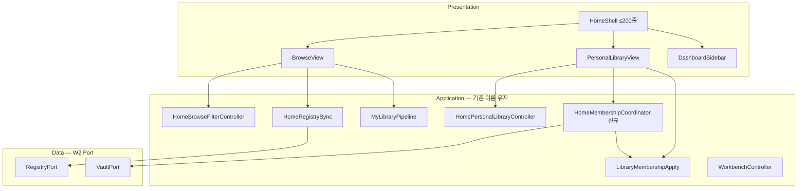
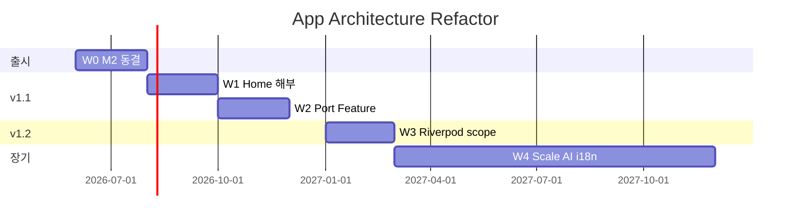

# App Architecture Refactor Plan — 점진 개편 (확장·AI·유지보수)

> **상태:** v1 리팩토링 우선 릴리스 노선 반영 (2026-06-13) · **ADR-007 수립 완료**  
> **목적:** 490 → 5k → 50k+ · AI 연동 · 기능 추가에도 **변경 지점 1~2곳**으로 수렴하는 구조  
> **전제:** 리라이트 없음 · **스팀 M2 완료** · **정식 릴리즈 전 Wave 1(Home 해부) 완수 우선**  
> **상위:** [data-architecture-redesign.md](../strategy/data-architecture-redesign.md) · [code-quality-review-plan.md](code-quality-review-plan.md) · [ROADMAP.md](../../ROADMAP.md)

---

## 1. 한 줄

**이미 있는 coordinator·SSOT 패턴(`HomeRegistrySync`, `LibraryMembershipApply`)을 표준으로 승격하고, Home을 Shell+View로 쪼갠 뒤, Registry·Vault·AI는 Port 뒤에 둔다.**

---

## 2. 검토 반영 (v1 초안 → v1 저장본)

| # | 초안 이슈 | 반영 |
|---|-----------|------|
| R1 | `HomeRegistryCoordinator` 등 **신규 이름 남발** | 기존 `HomeRegistrySync`·`Home*Controller` **이름 유지** · 신규만 `*Coordinator` 또는 `*Sync` |
| R2 | 최상위 `application/` **일괄 신설** | W1은 `screens/home/` 유지 · W2에 `core/ports/` · W3에 `features/` **점진 이전** |
| R3 | `home_screen.dart` **즉시 삭제** | `home_shell.dart`로 **분할·대체** 후 import 경로 정리 · 한 PR에 삭제+대체 |
| R4 | Riverpod **전면 전제** | [ROADMAP](../../ROADMAP.md) 정렬 — W3 **feature scope만** · W2까지는 **생성자 주입** |
| R5 | Port **과다** (5종 동시) | W2: `RegistryPort`·`VaultPort` **2종만** · Entitlement·Search는 **사용처 안정 후** |
| R6 | `workbench` 경로 미언급 | `lib/workbench/` + `lib/screens/workbench/` → W2에 `features/workbench/` **통합** |
| R7 | MVR Should-fix **미매핑** | §8 표로 W1 PR과 1:1 연결 |
| R8 | tool AI와 app AI **경계 모호** | §6.2 표 — app=사용자 로컬 · tool=maintainer만 |
| R9 | ADR 번호 | **ADR-007** (다음 가용: 001~006 존재) |
| R10 | 출시 동결 시점 | repo cleanup ✅ · **M2 완료 전 home 대규모 분할 금지** (cleanup-plan과 동일) |

---

## 3. North Star — 「깔끔한 구조」 정의

| 원칙 | 의미 | 현재 (MVR) |
|------|------|:----------:|
| 한 기능 = 한 진입점 | 담기·동기화 등 파일 1~2개로 설명 | 🔶 |
| 의존 단방향 | UI → coordinator/use-case → data · domain은 UI 모름 | 🔶 |
| 정책은 config | Tier1 no-poster 등 분기 최소 | ✅ |
| 경계에 Port | Registry·Vault·AI·IAP는 interface 뒤 | ❌ |
| 데이터 3계층 정렬 | Tier0/1/2 = 앱 feature **vault · catalog · library** | 🔶 |

**비목표:** Riverpod 전면 · `works_registry` 재작성 · akasha-db 스키마 변경 · M2 전 home 1PR 분할

---

## 4. 목표 아키텍처

### 4.1 레이어 (4층 — 단순 유지)

```
Presentation   Widget · Screen · Dialog     (얇게, ≤250줄)
Application    Coordinator · Use-case       (행동 1개 = 1클래스)
Domain         models · enums · policy      (Flutter/IO import 금지)
Data           Port 구현 · platform IO      (싱글톤은 adapter 안에만)
```

### 4.2 폴더 — 점진 목표 (Strangler Fig)

**현재 (`lib/`):** `config` · `models` · `screens` · `services` · `utils` · `widgets` · `workbench`

**단계별 목표:**

| 단계 | 추가·이동 | 비고 |
|------|-----------|------|
| **W1** | `screens/home/coordinators/` (신규 coordinator만) | 기존 `home/*` 유지 |
| **W2** | `core/ports/` · `data/adapters/` | `services/`는 adapter로 **래핑** |
| **W3** | `features/home/` · `features/workbench/` | `screens/` → feature로 **이전** |
| **W4** | `core/l10n/` | ARB 도입 시 |

```
lib/                          # 최종 목표 (W3 이후)
├── core/                     # ports, errors, feature_flags, l10n
├── domain/                   # models, config/policy (models+config 흡수)
├── data/adapters/            # WorksRegistryAdapter, VaultAdapter, …
├── features/
│   ├── home/                 # shell, views, coordinators
│   ├── workbench/            # shell, workspace, controller
│   ├── vault/
│   ├── catalog_contribution/
│   └── ai_import/            # clipboard, prompt templates, (미래 LLM)
├── shared/widgets/           # cross-feature (poster_card 등)
└── main.dart                 # bootstrap · Port wiring만
```

**규칙:** 새 코드는 **가장 가까운 미래 경로**에 둔다 (W1 coordinator → `screens/home/coordinators/`, W3에 `features/home/`로 move-only PR).

### 4.3 Home 목표 형태



---

## 5. 문제점 → 개편 매핑

| ID | 문제 (MVR) | 개편 | Wave |
|----|------------|------|:----:|
| P1 | `home_screen` God object (1385줄, import 70) | Shell + View + coordinator | W1 |
| P2 | 500줄+ 파일 6개 | 상한 §7 · service 추출 | W1~2 |
| P3 | Controller 패턴 혼재 | W1: coordinator로 흡수 · W3: CN은 workbench만 | W1~3 |
| P4 | `testWidgets` 10 · E2E 빈약 | coordinator unit + smoke 1건/feature | W1~ |
| P5 | Registry static | `RegistryPort` adapter (교체 아님) | W2 |
| P6 | `setState` 광범위 | feature scope (Riverpod W3) | W3 |
| P7 | AI 산재 (clipboard, prompts) | `features/ai_import` | W2 |
| P8 | 5k+ 검색 | `FusionSearchService` + `SearchPort` | W2~4 |
| P9 | i18n ARB 없음 | `core/l10n` | W4 |

---

## 6. AI · 카탈로그 경계

### 6.1 App vs tool (불변)

| 기능 | 위치 | 런타임 |
|------|------|:------:|
| Clipboard YAML import | app `ai_import` | ✅ |
| Prompt templates | app `ai_import` | ✅ |
| 작품 메타 제안 (미래) | app `AiImportPort` | ✅ opt-in |
| Contribution AI validation | `tool/` | ❌ app import 금지 |
| Catalog expansion pipeline | `tool/discovery` | ❌ |

### 6.2 `AiImportPort` (W2 스켈레톤)

```dart
abstract class AiImportPort {
  Future<AiImportResult> parseClipboard(String raw);
  // v1.2+: Future<WorkMetadataDraft> suggestMetadata(String title);
}
```

구현: `LocalMarkdownAiParser` (기존 parser) → 추후 `RemoteLlmClient` 추가.

### 6.3 카탈로그 규모 (앱 vs data)

| 규모 | 앱 | data/tool |
|------|-----|-----------|
| 490~5k | `RegistryPort` + prefetch | G1 supply · [scale-5k](../validation/scale-5k-risk-analysis.md) |
| 5k~50k | `SearchPort` 구현 교체 가능 | search index 분리 |
| 50k+ | cold start budget gate | CDN/R2 ([data-architecture](../strategy/data-architecture-redesign.md) §0.2) |

---

## 7. 실행 Wave

### Wave 0 — 출시 동결 해제 및 리팩토링 우선 노선 (2026-06-13)

스팀 데포 빌드 업로드 및 스토어 스크린샷 캡처(M2)가 물리적으로 완료됨에 따라, 정식 릴리즈 전에 **Wave 1(Home 해부) 리팩토링을 완수하여 코드 복잡도를 제어한 뒤 정식 릴리즈하는 노선**으로 변경합니다.

| # | 작업 | 산출 | 상태 |
|---|------|------|:----:|
| 0.1 | **ADR-007 앱 레이어링·가드레일 수립** | `docs/adr/ADR-007-app-layering.md` | ✅ 완료 |
| 0.2 | **M2 출시 과제 (데포 업로드·QA 등)** | [release-readiness](../release-readiness-checklist.md) | ✅ 완료 |
| 0.3 | **Wave 1 리팩토링 실행 (출시 전)** | `screens/home/` 분할 | ⏳ 대기 |

**허용:** 정식 릴리즈 전 `home_screen.dart` 대규모 분할 및 Coordinator 추출 전면 허용.

---

### Wave 1 — Home 해부 (출시 직후 · 4~6주 · PR 8~10)

**목표:** `home_screen.dart` **대체** → `home_shell.dart` ≤200줄 + View 2~3

#### Sprint 1.1 — Membership (MVR Should-fix #1, #2)

| PR | 내용 | 경로 |
|----|------|------|
| W1-1 | `HomeMembershipCoordinator` | `screens/home/coordinators/home_membership_coordinator.dart` |
| W1-2 | `_addWorkToLibrary` · `_applyWorkLibraryPanel` 이전 | coordinator가 `LibraryMembershipApply` 호출 |
| W1-3 | unit test + curated 담기 smoke `testWidgets` | `test/coordinators/home_membership_coordinator_test.dart` |
| W1-4 | `home_screen`에서 membership 메서드 제거 | diff ~200줄↓ |

**DoD:** `rg "_applyWorkLibraryPanel" lib/screens/home_screen.dart` → **0**

#### Sprint 1.2 — Browse · View

| PR | 내용 |
|----|------|
| W1-5 | `BrowseView` 추출 (그리드·정렬·`MyLibraryPipeline` 연동) |
| W1-6 | `PersonalLibraryView` 추출 |
| W1-7 | `HomeDialogs` facade (vault/sync/clipboard 진입만) |

#### Sprint 1.3 — Shell

| PR | 내용 |
|----|------|
| W1-8 | `HomeShell` — coordinator 조립 · `main.dart` → `HomeShell` |
| W1-9 | `home_screen.dart` 삭제 (move-only·동작 동일) |

**유지 (Keep — 이름·로직 변경 없음):** `HomeRegistrySync` · `LibraryMembershipApply` · `MyLibraryPipeline` · `FranchiseLibraryScope`

---

### Wave 2 — Port · Feature 시드 (v1.1 · 6~8주)

| PR | 내용 |
|----|------|
| W2-1 | `core/ports/registry_port.dart` + `WorksRegistryAdapter` |
| W2-2 | `core/ports/vault_port.dart` + `VaultAdapter` (`AkashaFileService` 래핑) |
| W2-3 | coordinator에 Port **생성자 주입** (global singleton 직접 호출 제거) |
| W2-4 | `FusionSearchService` ← `fusion_search_dialog.dart` (MVR Should-fix #3) |
| W2-5 | `features/ai_import/` — clipboard + `prompt_templates_dialog` 통합 |
| W2-6 | `features/workbench/` — `lib/workbench/` + `screens/workbench/` 통합 |
| W2-7 | `test/fakes/fake_registry_port.dart` · `fake_vault_port.dart` |

**W2 Port 추가 조건 (2종 이후):**

| Port | 조건 |
|------|------|
| `EntitlementPort` | M2 IAP 배선 **완료 후** |
| `SearchPort` | `FusionSearchService` 추출 **완료 후** |

---

### Wave 3 — 상태 관리 (v1.2 · 4~6주)

| 항목 | 결정 |
|------|------|
| Riverpod | **feature scope만** (`home`, `ai_import`) — 전면 마이그레이션 ❌ |
| `WorkbenchController` | ChangeNotifier **유지** (이미 양호) |
| `Home*Controller` plain | coordinator 흡수 후 **삭제** 또는 `*State` 리네이밍 |
| 대안 | Riverpod 보류 시 `InheritedWidget` + manual scope (ADR-007에 명시) |

---

### Wave 4 — 규모 · i18n (2027~)

| 항목 | 내용 |
|------|------|
| `SearchPort` 구현 교체 | isolate / 증분 인덱스 ([bottleneck report](../validation/registry-bottleneck-validation-report.md)) |
| `AiImportPort` LLM 구현 | opt-in API · 로컬 파서 fallback |
| `core/l10n` ARB | 전면 grep 후 feature 단위 마이그레이션 |
| Full Review 잔여 | Registry 3A · Workbench 3C · E1/E5 |

---

## 8. MVR Should-fix ↔ Wave 매핑

| MVR # | 항목 | Wave | PR |
|:-----:|------|:----:|-----|
| 1 | `HomeMembershipCoordinator` | W1 | W1-1~4 |
| 2 | curated 담기 smoke test | W1 | W1-3 |
| 3 | `fusion_search_dialog` service 추출 | W2 | W2-4 |
| 4 | Controller 네이밍 정리 | W3 | coordinator 흡수 |
| 5 | 490 cold start 실측 | W0 | 0.4 |

---

## 9. 코딩 규칙 (매 PR)

### 9.1 파일 상한

| 종류 | 상한 |
|------|------|
| Shell / Screen | 250줄 |
| Widget / Dialog | 200줄 |
| Coordinator / Use-case | 150줄 |
| Data adapter | 400줄 |

### 9.2 PR 규칙

1. 행동 변경 PR ≠ 구조 PR  
2. 한 PR = **한 coordinator** 또는 **한 Port**  
3. 이전 후 dead code **같은 PR**에서 삭제  
4. Port·scope 추가 시 ADR 한 줄 갱신  

### 9.3 신규 기능 체크리스트

- [ ] Coordinator/use-case 1개?
- [ ] Presentation은 coordinator만 호출?
- [ ] Policy는 `domain/` 또는 `config/`?
- [ ] Unit test ≥1?
- [ ] W1 이후 `home_shell`에 비즈니스 로직 없음?

---

## 10. 기능 추가 시 — 개편 후 터치 지점

| 시나리오 | 오늘 | 목표 (W2+) |
|----------|------|------------|
| curated 필드 | model + storage (**S**) | 동일 |
| 새 담기 UI | home + 4파일 | `HomeMembershipCoordinator` + widget (**2**) |
| Steam IAP | `EntitlementService` | `EntitlementPort` (**1**) |
| AI 메타 제안 | — | `AiImportPort` + use-case (**2**) |
| 새 MediaCategory | 다점 (**M**) | `CategoryRegistry` checklist |
| Discover 추천 | — | `features/discover/` 격리 |

---

## 11. 일정 (1인 스튜디오)



| Wave | 누적 | 핵심 산출 |
|------|------|-----------|
| W0 | M3 | ADR-007 · M2 |
| W1 | +6주 | `home_shell` · membership coordinator |
| W2 | +8주 | Port 2종 · ai_import · workbench 통합 |
| W3 | +6주 | Riverpod scope |
| W4 | 지속 | Search · LLM · l10n |

---

## 12. Anti-patterns (금지)

| 금지 | 이유 |
|------|------|
| M2 전 home 대규모 분할 | QA·diff |
| `HomeRegistrySync` 등 **무의미 rename** | 비용·혼란 |
| Repository 10종+ | Port 2~4개면 충분 |
| `works_registry` 로직 재작성 | baseline-v1 |
| `tool/` → `lib/` import | 경계 파괴 |
| 위젯에서 AI API 직접 호출 | 테스트·교체 불가 |

---

## 13. 첫 스프린트 (W0~W1 착수)

| 주 | 작업 |
|----|------|
| 1 | ADR-007 초안 · M2 IAP |
| 1 | `HomeMembershipCoordinator` 스켈레톤 + test |
| 2 | membership 메서드 이전 · home에서 삭제 |
| 2 | `BrowseView` 추출 착수 (시간 있으면) |

---

## 14. 연계 문서

| 문서 | 관계 |
|------|------|
| [code-quality-review-report.md](../reviews/code-quality-review-report.md) | 입력 · Amber 판정 |
| [repo-cleanup-plan.md](repo-cleanup-plan.md) | W0 동결 정책 일치 |
| [release-readiness-checklist.md](../release-readiness-checklist.md) | M2 게이트 |
| [data-architecture-redesign.md](../strategy/data-architecture-redesign.md) | Tier0/1/2 정렬 |
| [ROADMAP.md](../../ROADMAP.md) | Riverpod · AI pipeline 순서 |

---

## 15. 문서 이력

| 일자 | 변경 |
|------|------|
| 2026-06-12 | v1 — 초안 (대화) |
| 2026-06-12 | **v1 저장** — 검토 10건 반영 · MVR 매핑 · 점진 폴더 · Port 2종 · workbench 통합 |
