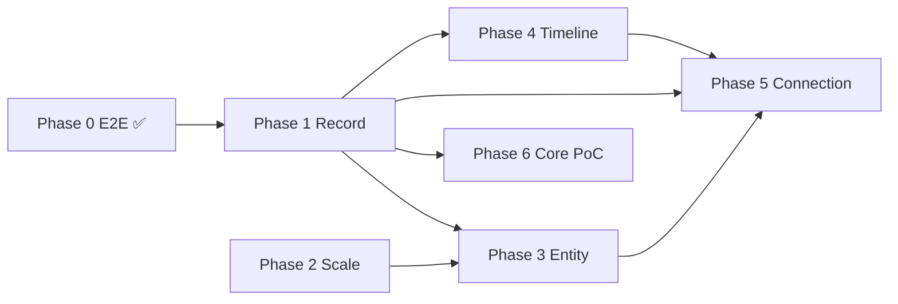

# AKASHA 아키텍처 진화 — 단계별 실행 (일정 없음)

> **지위:** **기술·구조 실행 SSOT** — 「언제」가 아니라 **「어떤 순서·어떤 단계」**  
> **제품 북극성:** [ultimate-archiving-vision.md](../product/ultimate-archiving-vision.md)  
> **Phase 0 제품 E2E:** [phase1-work-e2e-plan.md](phase1-work-e2e-plan.md)  
> **Steam M3:** 준비됨 · **품질 Ready 시** (blocking 아님)

---

## 1. 원칙

| 원칙 | 내용 |
|------|------|
| **의존성 순서** | 아래 Phase 번호 — N 완료(또는 최소 토대) 후 N+1 |
| **판단 기준** | 「이 Phase가 **다음 Phase를 막지 않게** 토대를 놓는가?」 |
| **금지** | 추측만으로 Phase 4~6 선행 · Steam 일정으로 Phase 건너뛰기 |
| **허용** | Phase 내 병렬 (예: Phase 2 search + bundle) |

```
Phase 0 ✅ → Phase 1 → Phase 2 → Phase 3 → Phase 4 → Phase 5 → Phase 6
  E2E       Record     Scale      Entity    Timeline   Link      Core
            Foundation  Layer      Types     Archive   Graph     PoC
```

---

## 2. Phase 0 — 작품 아카이빙 E2E ✅

**목표:** ① 발견 → ② 아카이브 → ③ 기록 → ④ 큐레이션 **동작 증명**

| 산출 | 상태 |
|------|:----:|
| Sanctum `.md` · 워크벤치 · 서재 | ✅ |
| v4 shard · lazy load · Tier 1/2 | ✅ |
| Wave 1 · ADR-007 레이어 | ✅ |
| G-AUTO · Dogfood | ✅ |

**다음 Phase 전제:** Phase 0 **유지** — 회귀 시 Phase 1+ 작업 중단·수리.

상세: [phase1-work-e2e-plan.md](phase1-work-e2e-plan.md)

---

## 3. Phase 1 — Record Foundation (현재)

**목표:** 작품·일기·Timeline **모두** 올릴 **최소 공통 추상화**를 코드·ADR로 고정.

| 개념 | 역할 |
|------|------|
| **ArchiveRecord** | 사용자 소유 축적 단위 |
| **EntityAnchor** | 선택적 닻 (`entity_id` + `type`) |
| **TimeAnchor** | 선택적 시점 |
| **RecordLink** | Record ↔ Entity · Record ↔ Record |

| # | 작업 | 산출 | 상태 |
|:-:|------|------|:----:|
| 1.1 | ADR-008 Record–Entity–Time | [ADR-008](../adr/ADR-008-record-entity-time-model.md) | ✅ |
| 1.2 | Core types | `lib/core/archiving/*` | ✅ |
| 1.3 | `AkashaItem` → `ArchiveRecord` 매퍼 | `archive_record_mapper.dart` | ✅ |
| 1.4 | `ArchiveRecordPort` + vault 어댑터 | `vault_archive_record_adapter.dart` | ✅ |
| 1.5 | 단위 테스트 | `archive_record_test.dart` | ✅ |
| 1.6 | 앱 wiring · Timeline `RecordKind` 소비 | — | ⏳ Phase 4 |

**Phase 1 Exit:** 작품 Journal이 `ArchiveRecord(kind: workJournal)`로 표현되고, **entity/time 없는 Record** 스키마가 **타입 수준**에서 허용됨.

**하지 않음:** Timeline UI · Entity type Tier 1 확장 · SQLite/MCP.

---

## 4. Phase 2 — Catalog Scale Layer

**목표:** 카탈로그 **무한 성장**에도 ① 발견이 깨지지 않음.

**트리거:** insert로 **체감** 병목 (또는 Phase 3 전 필수).

| # | 작업 | 근거 |
|:-:|------|------|
| 2.1 | search_index lazy / 분할 | cold start · O(n) 스캔 |
| 2.2 | Browse pagination · master_index full load 제거 | 메모리 · UI |
| 2.3 | manifest-only / eager bundle 정책 | APK · fetch |
| 2.4 | `RegistryPort` cursor/page API | Phase 3+ 공통 |

**Exit:** 5k 시나리오 **측정** 통과 (문서: [registry-scaling-review](../validation/registry-scaling-review.md)).

---

## 5. Phase 3 — Entity Generalization

**목표:** 작품 외 **Tier 1 Entity** (인물·사건·개념·현상) — **동일 패턴** (`entity_id` + `type`).

| # | 작업 |
|:-:|------|
| 3.1 | `EntityAnchorType` ↔ akasha-db schema |
| 3.2 | `EntityRegistryPort` (RegistryPort 일반화) |
| 3.3 | Sanctum Journal — work 외 entity 연결 |
| 3.4 | Fact 파이프라인·charter ([catalog-growth](../programs/catalog-growth-charter.md) 확장) |

**전제:** Phase 1 Record + Phase 2 search (발견).

---

## 6. Phase 4 — Timeline Archive

**목표:** **Journal First** — Entity 없는 일기·생각·아이디어 **1급 시민**.

| # | 작업 |
|:-:|------|
| 4.1 | Timeline entry 저장 (`.md` 또는 `timeline/` vault) |
| 4.2 | `RecordKind.timelineEntry` · `ArchiveRecordPort` 구현 |
| 4.3 | Timeline UI (시간축) |
| 4.4 | Entity Journal과 **소급·양방향 Link** |

**전제:** Phase 1 Record/Link.

---

## 7. Phase 5 — Connection & Appreciation

**목표:** 축적 → **연결 → 재활용** (ultimate §3).

| # | 작업 |
|:-:|------|
| 5.1 | 명시적 Link 저장 (`[[…]]` 외 metadata) |
| 5.2 | Entity ↔ Timeline 교차 탐색 |
| 5.3 | Appreciation 뷰 (갤러리·연결 카드) — 회상 **연출** 아님 |
| 5.4 | (선택) 그래프 인덱스 — **제품 목표 아님**, 연결 쿼리용 |

---

## 8. Phase 6 — Memory Core PoC

**목표:** AI-agnostic **기반** — 제품 **위**·**옆** 레이어.

```
.md (SSOT) → event_ledger.jsonl → SQLite cache → MCP
```

| # | 작업 |
|:-:|------|
| 6.1 | ledger 규격 · append-only |
| 6.2 | SQLite 적재기 (read cache) |
| 6.3 | MCP read tools (vault subset) |
| 6.4 | 「이 장면 멋졌어」→ Record 생성 **보조** |

**전제:** Phase 1 Record 안정. **제품 blocking 아님.**

---

## 9. Phase 의존성 (한 장)



**병렬 가능:** Phase 2 ‖ Phase 1 후반 · Phase 6 ‖ Phase 4~5 (PoC).

---

## 10. 현재 포인터

| | |
|--|--|
| **완료** | Phase 0 · Phase 1 (1.1~1.5) |
| **다음** | **Phase 2** — Catalog Scale Layer |

---

## 11. 문서 이력

| 변경 |
|------|
| 2026-06-14 | 초판 — 일정 제거 · Phase 0~6 의존성 |
