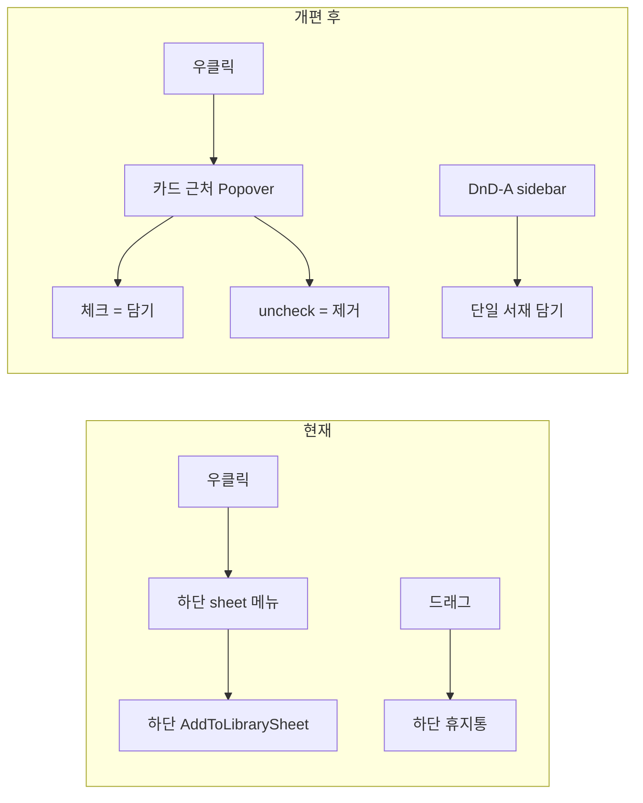

# Curated 서재 멤버십 UI 개편 — 카드 컨텍스트 통합

> **상태:** Phase A~B 구현 완료 (2026-06-10) · Phase C 잔여  
> **지위:** E1 · DnD-C · `AddToLibrarySheet` UX 개편 SSOT  
> **상위:** [curated-personal-library-plan.md](./curated-personal-library-plan.md) §7.3~7.5 · §7.13.5

---

## 1. 한 줄

**그리드 하단 휴지통(DnD-C)을 없애고, 카드 우클릭 위치에 「담기 / 제거 / 숨기기」를 한 패널로 통합한다.**

담기·제거 모두 **curated 서재 멀티 선택**을 같은 UI에서 처리한다. DnD-A(사이드바 담기)와 DnD-B(순서 변경)는 유지한다.

---

## 2. 배경 — 사용자 제기 + 기존 문제

### 2.1 사용자 제기 (2026-06-10)

| # | 불편 | 원인 |
|---|------|------|
| U1 | **하단 휴지통이 UI를 차지** | `LibraryRemoveDropZone`이 curated 메인 그리드 아래 항상 52px+ 패딩 점유 |
| U2 | **제거가 드래그 전용** | 우클릭으로는 제거 불가 → 하단까지 끌어야 함 |
| U3 | **우클릭 UI가 화면 하단** | `PosterCard` 컨텍스트·`AddToLibrarySheet` 모두 `showModalBottomSheet` |
| U4 | **담기 UI가 멀티 서재에 불편** | 2단(bottom sheet → 또 bottom sheet), 활성 서재 빠른 담기가 시트를 즉시 닫음 |

### 2.2 구현 검토로 확인된 기존 문제

| # | 문제 | 현재 동작 |
|---|------|-----------|
| P1 | **담기·제거 진입점 분리** | 담기 = E1 시트 / DnD-A · 제거 = DnD-C만 · E9 설정 |
| P2 | **2단 bottom sheet** | 우클릭 → 「서재에 담기」→ `AddToLibrarySheet` 또 열림 |
| P3 | **curated 뷰 맥락 무시** | 활성 서재에서 카드를 보는데 「이 서재에서 제거」가 컨텍스트에 없음 |
| P4 | **Windows 데스크톱 부적합** | Steam v1 타깃인데 커서·카드와 UI가 멀리 떨어짐 |
| P5 | **멀티 선택 UX 혼란** | Case D IP 토글 + 「활성 서재에 담기」 단일 버튼 + 체크리스트가 한 시트에 혼재 |
| P6 | **초기 체크 상태** | IP 범위 변경 시 `librariesContainingAll` 재동기화 — 부분 담김 IP 카드에서 직관적이지 않음 |
| P7 | **DnD 제스처 과다** | 우측 amber(담기) · 좌측 teal(순서) · 하단 red(제거) — 학습 비용 높음 |
| P8 | **숨기기 vs 서재** | 레지스트리 숨기기와 서재 멤버십이 같은 bottom sheet에 있으나 서재 제거는 없음 |

### 2.3 유지할 것 (개편 대상 아님)

| 항목 | 이유 |
|------|------|
| **DnD-A** (카드 → 사이드바) | D6 1순위 · 빠른 단일 서재 담기 |
| **DnD-B** (직접 배치 순 reorder) | `memberOrder` SSOT · E9와 동일 |
| **E9** 멤버 리스트 관리 | 대량·고아 정리·검색 담기 |
| **`memberOrder` / vault JSON** | 데이터 모델 변경 없음 |
| **Case D** (매체 vs IP 전체) | 시트 안에서 범위 선택만 UI 재배치 |

---

## 3. 목표 UX

### 3.1 원칙

1. **카드 근처** — 우클릭(global position) 또는 카드 anchor에 패널 표시  
2. **한 패널** — 담기·제거·(선택) 숨기기를 분리된 bottom sheet 2개가 아닌 **단일 「서재」 섹션**  
3. **멀티 서재 기본** — 체크리스트가 주 UI; 「적용」 한 번에 diff 반영  
4. **curated 맥락** — 활성 curated 서재가 있으면 해당 행 강조 + 「현재 서재에서 제거」  
5. **공간 회수** — 그리드 하단 `LibraryRemoveDropZone` **삭제**

### 3.2 제안 UI — `WorkLibraryPopover` (가칭)

**트리거:** 포스터 카드 `onSecondaryTap` / long-press (기존과 동일)  
**표시:** `showMenu` 또는 `Overlay` + `CompositedTransformFollower` — **클릭 좌표 근처**

```
┌─ 「원피스」 ─────────────────────┐
│  [ 이 매체만 | IP 전체 (3) ]      │  ← Case D (해당 시만)
├──────────────────────────────────┤
│  ☑ 인생 명작            (12작)   │  ← 활성 서재 (curated일 때 ▶ 표시)
│  ☐ 읽을 예정 2026                 │
│  ☑ 감상 완료                        │
│  ─────────────────────────────── │
│  ＋ 새 서재 만들기…               │
├──────────────────────────────────┤
│  [ 취소 ]            [ 적용 ]     │
└──────────────────────────────────┘
        ↑ (선택) 숨기기 ▸ 서브메뉴
```

**curated 활성 + 해당 작품이 활성 서재에 있을 때:**

```
│  ☑ 인생 명작  ◀ 현재 서재         │
│     └ [ 이 서재에서만 제거 ]      │  ← 체크 해제와 동일, 강조 링크
```

또는 체크 해제 = 제거로 통일하고 별도 버튼 생략 (구현 단순).

| 동작 | 결과 |
|------|------|
| 체크 ON → 적용 | `addWork` / `addWorks` (Case D 범위) |
| 체크 OFF → 적용 | `removeWork` (범위 내 각 id) |
| 활성 서재 행 | 목록 최상단 · 배경 강조 |
| 적용 | diff batch → vault 저장 → 스낵바 · ★N 배지 갱신 |

**숨기기(레지스트리):** 같은 패널 하단 `··· 더 보기` 또는 우클릭 2단 — **서재 블록과 시각 분리** (P8).

### 3.3 DnD-C 처리

| 항목 | 결정 |
|------|------|
| `LibraryRemoveDropZone` | **삭제** (위젯 · `librarySectionFooter` · home_screen 연동) |
| DnD-C (§7.13.5) | **폐기** — 제거는 E1 통합 패널로 대체 |
| 설계서 §7.13.2 | DnD-C 행 **deprecated** 표기 |

제거 접근성: 우클릭 → 체크 해제 → 적용 (또는 활성 서재 「제거」).

---

## 4. 진입점 재매핑

| # | 진입점 | 현재 | 개편 후 |
|---|--------|------|---------|
| E0 | DnD → 사이드바 | 유지 | 유지 (단일 서재 고속) |
| **E1** | 카드 우클릭 | bottom sheet → bottom sheet | **`WorkLibraryPopover` 1회** |
| E2 | 워크벤치 | `AddToLibrarySheet` | 동일 패널 컴포넌트 재사용 (dialog/anchor) |
| E3/E4 | 검색 | `AddToLibrarySheet` | 동일 컴ponent |
| ~~DnD-C~~ | 하단 휴지통 | drop 제거 | **삭제** |
| E9 | 설정 멤버 리스트 | 유지 | 유지 |

`AddToLibrarySheet` → **`showWorkLibraryPopover`** 로 리네임·리팩터 (내부 API는 membership service 동일).

---

## 5. 멀티 서재 UI 상세

### 5.1 체크리스트 규칙

| 규칙 | 내용 |
|------|------|
| 목록 | `curated` 서재만 · master 제외 |
| 초기값 | `effectiveWorkIds` 각 id에 대해 **모든 서재에 포함** 시 checked (IP 전체 모드는 AND) |
| 부분 담김 | IP 3매체 중 2개만 A 서재 → A는 **indeterminate** 또는 unchecked + subtitle 「2/3 매체」 (v1.2 후보; v1은 unchecked) |
| 정렬 | 활성 서재 → 이름순 |
| 새 서재 | 생성 후 목록에 추가 · **자동 check** · 패널 유지 (시트 닫지 않음) |

### 5.2 「활성 서재 빠른 담기」 버튼

**삭제.** 멀티 선택 패널과 역할 중복 · 시트 조기 종료(P5) 유발.

### 5.3 적용 피드백

```
「인생 명작」에 담았습니다 · 「읽을 예정」에서 제거했습니다
```
변경 0건이면 적용 비활성 또는 「변경 없음」.

---

## 6. 플랫폼 · 표시 방식

| 플랫폼 | 권장 |
|--------|------|
| **Windows (Steam v1)** | `TapDownDetails.globalPosition` + `showMenu` / 커스텀 `OverlayEntry` · max height + 스크롤 |
| 화면 가장자리 | 패널이 잘리면 좌표 clamp (카드 중심 기준 flip) |
| 터치 (후순) | bottom sheet fallback 허용 (feature flag 또는 `kIsDesktop`) |

`PosterCard`의 기존 hide 전용 bottom sheet → **popover 안 「표시 안 함」 서브섹션** 또는 **별도 우클릭 메뉴 항목 1개**로 축소.

---

## 7. 구현 단계

### Phase A — 제거 · 통합 (필수)

| # | 작업 | 산출 |
|---|------|------|
| A1 | `LibraryRemoveDropZone` · footer 슬롯 제거 | home_screen, browse_dashboard_sections |
| A2 | `WorkLibraryPopover` (anchor popover) 신규 | `lib/widgets/work_library_popover.dart` |
| A3 | `add_to_library_sheet.dart` 로직 이전 · popover API | membership diff 동일 |
| A4 | `PosterCard` 우클릭 → popover 직접 호출 (2단 sheet 제거) | poster_card / home_screen |
| A5 | curated 활성 시 「현재 서재」 행 강조 | popover UI |
| A6 | 설계서 §7.13 DnD-C deprecated · 본 문서 cross-link | docs |

### Phase B — 진입점 통일

| # | 작업 |
|---|------|
| B1 | E2 워크벤치 · E3/E4 검색 → 동일 popover (화면 중앙 dialog fallback 가능) |
| B2 | 숨기기 액션 popover 서브메뉴 또는 분리 |
| B3 | ★N 배지 · 스낵바 적용 후 `setState` |

### Phase C — polish (선택)

| # | 작업 |
|---|------|
| C1 | IP 부분 담김 indeterminate 체크 |
| C2 | 키보드: 카드 focus + Shift+F10 컨텍스트 |
| C3 | T22~T25 popover 위젯 테스트 |

---

## 8. 테스트 시나리오 (추가)

| ID | 시나리오 | 기대 |
|----|----------|------|
| T22 | curated 뷰 · 카드 우클릭 · 활성 서재 uncheck · 적용 | `removeWork` · md 유지 · 하단 휴지통 없음 |
| T23 | 2개 서재 check · 적용 | 둘 다 `memberOrder` append |
| T24 | Case D IP 전체 · 2개 서재 check | 범위 내 id 일괄 add |
| T25 | popover 적용 후 ★N 갱신 | 배지 수 일치 |
| T26 | DnD-C 영역 없음 | 그리드 footer 높이 감소 회귀 |

---

## 9. 비목표 (본 개편)

| 항목 | 이유 |
|------|------|
| DnD-A / DnD-B 변경 | 사용자 요청 범위 밖 |
| E9 설정 화면 구조 변경 | 관리용 유지 |
| `memberOrder` 스키마 변경 | D7 유지 |
| 사이드바 drop으로 제거 | 혼동 방지 |

---

## 10. open questions (구현 시 기본값)

| # | 질문 | **권장 기본값** |
|---|------|----------------|
| Q1 | 숨기기를 같은 popover에? | **하단 「표시 옵션」** 접이 1블록 (서재와 구분선) |
| Q2 | 대시보드에서 서재 목록 | **curated 전체** — checked=담김 · unchecked=미담김 |
| Q3 | popover vs centered dialog | **Windows = popover 우선** |

---

## 13. 구현 스펙 (확정)

| 컴포넌트 | 경로 | 역할 |
|----------|------|------|
| `MembershipApplyResult` | `lib/models/membership_apply_result.dart` | apply diff 결과·스낵바 |
| `applyCheckboxDiff` | `PersonalLibraryMembershipService` | 체크 ON/OFF batch |
| `WorkLibraryPanel` | `lib/widgets/work_library_panel.dart` | 공통 본문 UI |
| `showWorkLibraryPopover` | `lib/screens/home/dialogs/work_library_menu.dart` | E1 · cursor anchor |
| `showWorkLibraryDialog` | 동일 | E2/E3/E4 · 중앙 dialog |
| `PosterCard.onOpenLibraryMenu` | `lib/widgets/poster_card.dart` | `onSecondaryTapDown` → globalPosition |

**삭제:** `LibraryRemoveDropZone` · `add_to_library_sheet.dart` (→ `work_library_menu.dart`)

### Phase 상태

| Phase | 상태 |
|-------|:----:|
| A0 API·Panel·diff | ✅ |
| A1 휴지통 제거 | ✅ |
| A2 E1 popover·PosterCard | ✅ |
| A3 숨기기 ExpansionTile | ✅ |
| B1 E2/E3 dialog | ✅ |
| B2 scroll dismiss | ⬜ |
| C1~C3 polish·widget test | ⬜ |

---

## 14. 문서 이력

| 일자 | 변경 |
|------|------|
| 2026-06-10 | Phase A~B 구현 — popover · Panel · DnD-C 제거 |

---

## 12. 요약 다이어gram


