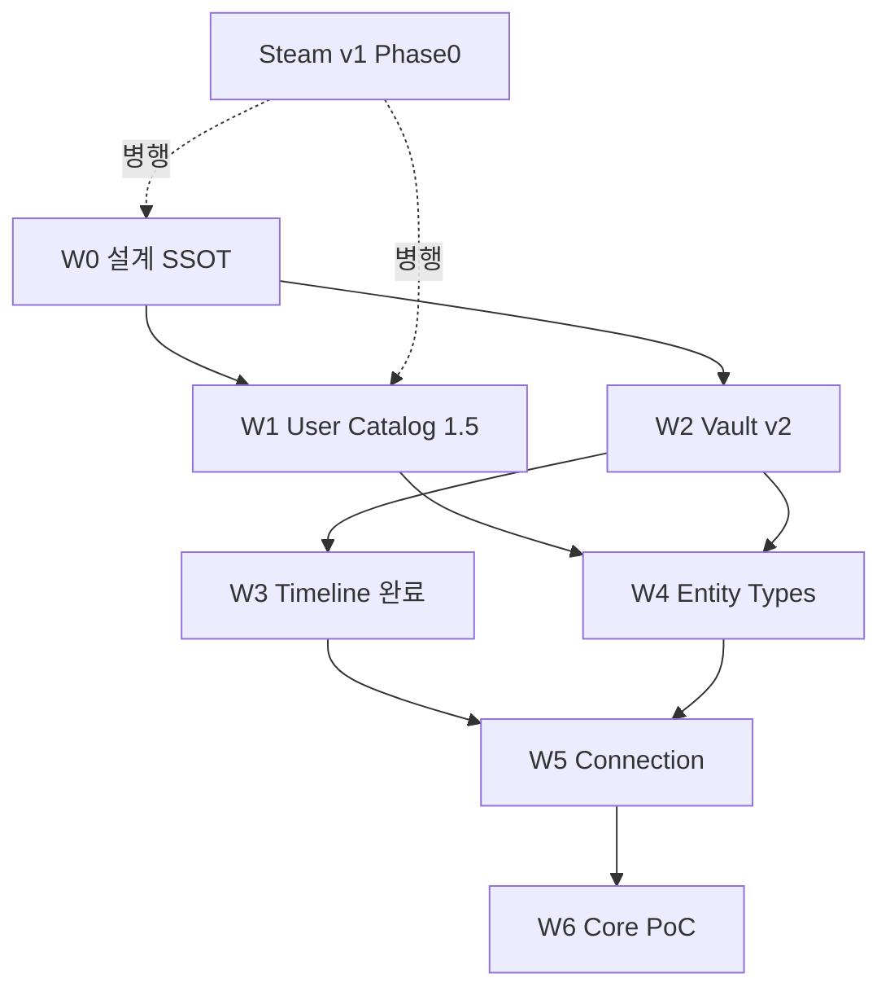

# Entity-Centric Evolution Plan — 존재 아카이빙 실행 SSOT

> **상태:** Wave 0 ✅ · Wave 1 ✅ · **Wave 2 설계 v1** · 코드 착수 대기  
> **로드맵:** [entity-centric-roadmap.md](entity-centric-roadmap.md) — 단계별 Gate  
> **갱신:** 2026-06-19  
> **결정:** 매체(Media Type) 최상위 분류 폐기 → **Entity + Record + Connection** 중심으로 진화  
**철학:** [entity-type-philosophy.md](../policy/entity-type-philosophy.md) — 7종 + Custom · Animal Type ❌  
> **북극성:** [ultimate-archiving-vision.md](../product/ultimate-archiving-vision.md)  
> **기술 토대:** [ADR-008](../adr/ADR-008-record-entity-time-model.md) · [architecture-evolution-phases.md](architecture-evolution-phases.md)  
> **선행 대화:** GPT Entity 모델 정렬 (2026-06-19)

---

## 1. 한 줄

**AKASHA 최상위는 「무엇을 아카이빙하는가(Entity)」이고, 「내가 남긴 것(Record)」과 「연결(Connection)」이 핵심이다.  
Phase 1(Work) UI·볼트는 유지하되, 내부 모델·스키마·문서를 Entity-ready로 맞춘 뒤 Phase 3~5를 순차 확장한다.**

---

## 2. 왜 이 계획인가

| 관점 | 기존 (Phase 0) | 목표 |
|------|----------------|------|
| **최상위 분류** | 만화·애니·게임… (`MediaCategory`) | **Entity Type** (work, person, event, place, concept, note, custom…) |
| **작품 하위** | = 최상위 | **Work subtype** (`anime`, `manga`, `game` …) |
| **핵심 자산** | `.md` (암묵적) | **ArchiveRecord** — `.md` + YAML SSOT |
| **완성도 지표** | 카탈로그 크기 | **찾기 → 기록 → 재탐색 → 연결** 루프 |
| **글로벌 DB** | 전 작품 커버 | **발견 품질** (10k+) + **유저 로컬 Fact** |

**대개편이 아닌 이유:** ADR-008 · `lib/core/archiving/*` · Phase 로드맵에 이미 동일 방향이 명시됨.  
**대개편이 되는 경우:** Steam v1 전에 UI·볼트·Tier 1 DB를 한 번에 전면 교체할 때 — **금지**.

---

## 3. 개념 모델 (SSOT)

### 3.1 세 축

```
┌─────────────────────────────────────────────────────────┐
│  Entity — 「내가 기록하고 싶은 대상」 (닻 / Anchor)       │
│  type + entity_id + (subtype)                           │
└──────────────────────────┬──────────────────────────────┘
                           │ 0..1 (Journal First: 없어도 됨)
┌──────────────────────────▼──────────────────────────────┐
│  Record — 「내가 남긴 것」 (Sanctum .md)                  │
│  kind: workJournal | freeformJournal | timelineEntry    │
└──────────────────────────┬──────────────────────────────┘
                           │ 0..N
┌──────────────────────────▼──────────────────────────────┐
│  Connection — 「관계」 (Phase 5)                          │
│  [[wiki]] · explicit link · sameDay                     │
└─────────────────────────────────────────────────────────┘
```

### 3.2 Entity Type (enum — [ADR-011](../adr/ADR-011-entity-type-subtype.md))

| `EntityAnchorType` | Phase | Tier 1 Fact | 예 |
|--------------------|:-----:|:-----------:|-----|
| `work` | **0** ✅ | ✅ `wk_` | 에이티식스 |
| `person` | 3 | 📋 | 아인슈타인 |
| `event` | 3 | 📋 | 제2차 세계대전 |
| `place` | 3b | 📋 | 서울 · 도쿄 |
| `concept` | 3 | 📋 | 상대성이론 · 자유의지 |
| `organization` | 3b | 📋 | 기업 · 브랜드 |
| `phenomenon` | 3 | 📋 | (기존 ADR-008) |
| `custom` | 0 | vault-only | 내 세계관 |

**Work subtype** (= 현재 `MediaCategory`): `animation` · `manga` · `webtoon` · `game` · `book` · `movie` · `drama` · (`music` — ADR-002 결정 후)

### 3.3 Record vs Note (GPT 정렬)

| GPT | AKASHA | 저장 |
|-----|--------|------|
| Note (Entity) | **Record** — Entity 없음 | `timeline/*.md` 또는 `journal/*.md` |
| Custom Entity | `EntityAnchorType.custom` + Record | vault entity journal |
| 일기·아이디어 | `RecordKind.timelineEntry` / `freeformJournal` | Journal First |

**원칙:** 「내 스타트업 아이디어」= Record 먼저 → 나중에 Concept/Organization Entity와 **연결**.

### 3.4 Tier 구조 (데이터)

| Tier | 이름 | 역할 | Phase |
|------|------|------|:-----:|
| **1** | Global Fact | Rune Atelier 큐레이션 · 발견 | 0 ✅ |
| **1.5** | User Local Catalog | 사전에 없는 Entity Fact · **즉시 검색** | **1.5** ← v1.x 필수 |
| **2** | Sanctum Record | 감상·기록·포스터 · **핵심 자산** | 0 ✅ |

---

## 4. 현재 위치 (2026-06-19)

| 영역 | 상태 | Gap |
|------|:----:|-----|
| Phase 0 Work E2E | ✅ | — |
| Phase 1 Record Foundation | ✅ | 앱 wiring 일부 (`AkashaItem` 주력) |
| Phase 2 Scale 2.0~2.3 | ✅ @10048 | RegistryPort page API ⏳ |
| Phase 4 Timeline | 🔶 | 4.1~4.4a ✅ · 4.4b Entity Link ⏳ |
| Phase 3 Entity types | ❌ | person/event/concept Tier 1 없음 |
| Phase 5 Connection | ❌ | Link UI·인덱스 |
| Tier 1.5 User Catalog | ✅ | Wave 1 `d4f8503` · [wave1-exit-review.md](wave1-exit-review.md) |
| `MediaCategory` = UI 최상위 | ✅ (의도적) | Entity type으로 **승격** 설계만 |

**Steam v1:** Phase 0 범위 **출시 가능** — 본 계획은 v1 **이후·병행** 확장.

---

## 5. 실행 원칙

| # | 원칙 |
|---|------|
| P1 | **문서·ADR 먼저**, 코드는 Exit 조건 충족 후 |
| P2 | **Journal First** — Entity 없이 Record 생성 허용 |
| P3 | **`.md` SSOT 불변** — Event Store/SQLite는 파생만 |
| P4 | **Phase 1 UI 유지** — Work 그리드·서재는 당분간 그대로 |
| P5 | **한 PR = 한 Port 또는 한 coordinator** ([extensibility-hardening](extensibility-hardening-plan.md)) |
| P6 | **검증 질문** ([ADR-008 §4](adr/ADR-008-record-entity-time-model.md)): work-only 가정 새로 만들지 않는가? |
| P7 | **카탈로그 확장**과 **Entity 확장**은 **별 트랙** ([catalog-growth-charter](catalog-growth-charter.md)) |

---

## 6. 단계별 실행 계획

### Wave 0 — 설계 SSOT (코드 **없음**) · **지금**

**목표:** GPT Entity 모델 ↔ ADR-008 ↔ product-vision **한 언어**로 통일.

| ID | 작업 | 산출 | Exit |
|----|------|------|------|
| W0-1 | **ADR-011** Entity Type & Subtype 스키마 | [ADR-011-entity-type-subtype.md](../adr/ADR-011-entity-type-subtype.md) | work/subtype·ID 규칙·Phase 매핑 |
| W0-2 | **Tier 1.5** User Local Catalog 정책 | [user-local-catalog-policy.md](../policy/user-local-catalog-policy.md) | 저장 위치·ID(`wk_u_*`)·검색 merge |
| W0-3 | **Vault layout** v2 스펙 | [vault-layout-v2.md](../product/vault-layout-v2.md) | 폴더·frontmatter 필드 (`entity_type`, `entity_id`) |
| W0-4 | `ultimate-archiving-vision.md` §4 표 갱신 | place·organization 행 | W0-1과 일치 |
| W0-5 | `product-vision.md` §2 「두 계층」→ 「Entity·Record·Connection」 | 1단락 추가 | 북극성 문장 유지 |
| W0-6 | `architecture-evolution-phases.md` §10 포인터 | 본 문서 링크 | 실행 SSOT 연결 |

**W0 Exit:** ✅ 2026-06-19 — ADR-011 · Tier 1.5 policy · vault v2 · SSOT 갱신 · **Wave 1 코드 Gate 열림**.

**W0 하지 않음:** enum 일괄 rename · 볼트 마이그레이션 스크립트 · akasha-db schema 변경.

---

### Wave 1 — Tier 1.5 User Local Catalog · v1.x **필수**

**목표:** 「사전에 없는 작품」을 **글로벌 merge 전**에도 Fact layer에서 찾·조인.

| ID | 작업 | 산출 | Exit |
|----|------|------|------|
| W1-1 | `UserCatalogStore` — `vault/catalog/user_entities.json` | data layer | CRUD·vault watch |
| W1-2 | Fusion search merge + dedupe (§6.1) | browse/search | custom work 검색 hit |
| W1-2a | `WorkIdCodec` ID helpers · `EntityAnchor.isWork` fix | **W1-0 선행** | P0-1 |
| W1-3 | `WorkIdCodec.buildUserLocal()` → `wk_u_{uuid}` | ID SSOT | legacy `custom_*` 신규 deprecated |
| W1-4 | `add_work_dialog` / Fusion CTA 경로 통합 | UX | 한 흐름: 등록 → catalog → (선택) archive |
| W1-5 | Contribution queue ↔ user catalog 관계 문서화 | policy § | merge 시 ID 치환 규칙 |
| W1-6 | 테스트: user catalog only · catalog+md · global+md | test | regression green |

**W1 Exit:** ✅ 코드·테스트 — [wave1-exit-review.md](wave1-exit-review.md) · dogfood ⏳

**W1 구현 SSOT:** [wave1-user-catalog-spec.md](wave1-user-catalog-spec.md)

**W2 설계 SSOT:** [wave2-vault-record-spec.md](wave2-vault-record-spec.md) · [wave2-pre-implementation-review.md](wave2-pre-implementation-review.md)

**W1 의존:** W0-2, W0-1 (ID 규칙).

---

### Wave 2 — Vault & Record 스키마 v2 · **하위 호환**

**목표:** frontmatter에 Entity 메타 명시 · 기존 `.md` **무 breaking**.

| ID | 작업 | 산출 | Exit |
|----|------|------|------|
| W2-1 | frontmatter `entity_type` · `entity_id` (optional) | parser | 없으면 `work` + `work_id` 추론 |
| W2-2 | `MarkdownParser` / `ArchiveRecordPort` Entity 경로 | adapter | read/write round-trip |
| W2-3 | 폴더 layout: `{vault}/works/` 신규 · `{vault}/{category}/` **호환** | file_service | 신규=works · 구=그대로 |
| W2-4 | `ArchiveRecordMapper` — `AkashaItem` 외 Port 주력 wiring 1곳 | Home/Browse | work-only 우회 1개 제거 |
| W2-5 | 마이그레이션: **없음 (lazy)** — 저장 시에만 새 필드 추가 | — | 구 파일 그대로 읽힘 |

**W2 Exit:** 모든 Record가 `ArchiveRecord`로 표현 가능 · 구 `.md` 100% 호환.

**W2 구현 SSOT:** [wave2-vault-record-spec.md](wave2-vault-record-spec.md)

**W2 의존:** W0-3, Phase 1 ✅, Wave 1 Exit Review.

---

### Wave 3 — Phase 4 완료 (Timeline · Journal First)

**목표:** Entity 없는 기록 = 1급 시민 · Work E2E와 **동등 UX**.

| ID | 작업 | 산출 | Exit |
|----|------|------|------|
| W3-1 | Phase 4.4b — Timeline ↔ Entity Link 표면화 | UI | timeline entry에서 `wk_` 링크 |
| W3-2 | Quick capture → `timeline/*.md` 안정화 | dogfood | Sprint B friction 0건 |
| W3-3 | `freeformJournal` — `journal/*.md` (Entity optional) | vault | 아이디어·메모 1파일 |
| W3-4 | Home shell: 「기록」축 탭 또는 사이드바 (Timeline list) | UX | Work-only Home 탈피 **표면** |
| W3-5 | `RecordKind`별 워크벤치 adapter (work vs timeline) | workbench | 편집·저장 E2E |

**W3 Exit:** 일기·아이디어 **앱 안에서** 기록·재탐색 · Phase 4 Exit ([architecture-evolution-phases §6](architecture-evolution-phases.md)).

---

### Wave 4 — Phase 3 Entity Generalization

**목표:** Work 외 Entity type — **동일 패턴** (Fact + Record).

| ID | 작업 | 산출 | Exit |
|----|------|------|------|
| W4-1 | `EntityRegistryPort` — `RegistryPort` 일반화 | core/ports | work registry 래핑 |
| W4-2 | akasha-db schema v5 초안 — `entityType` 필드 · person/event 샤드 | akasha-db ADR | CI gate 초안 |
| W4-3 | **Person** MVP — Tier 1 spine (Wikidata Q) + user local | 100~500 seed | 검색·아카이브 E2E |
| W4-4 | **Event** · **Concept** — vault journal + optional Tier 1 | parser/UI | 3 type dogfood |
| W4-5 | **Place** · **Organization** — ADR-011 확장 | enum | schema only → seed |
| W4-6 | Browse: Entity type 필터 (Work | Person | Event | All) | dashboard | Work 그리드 **유지** + 필터 |
| W4-7 | Work subtype `music` — [ADR-002](../adr/ADR-002-music-registry-model.md) 결정 후 | category | album/song unit |

**W4 Exit:** Person 1명 + Event 1건 + Concept 1건 **발견 → 아카이브 → 기록** E2E.

**W4 의존:** W1 (user local), W2 (vault v2), Phase 2 search (2.4 optional).

**W4 하지 않음:** 전 Entity Tier 1 10k bulk · IMDb급 person DB.

---

### Wave 5 — Phase 5 Connection

**목표:** 「에이티식스 → 작가 → 전쟁 → 평화주의」**관계**가 제품 핵심.

| ID | 작업 | 산출 | Exit |
|----|------|------|------|
| W5-1 | `[[entity_id|label]]` / `[[title]]` 파싱 → `RecordLink` | parser | 링크 추출 |
| W5-2 | Link index (vault scan · incremental) | service | 역방향 «누가 링크함» |
| W5-3 | Entity detail — «연결된 Record» 패널 | workbench | 3-hop 이내 표시 |
| W5-4 | Timeline ↔ Entity **sameDay** 휴리스틱 (optional) | Phase 5 | 같은 날 journal |
| W5-5 | Appreciation view — 연결 카드 (갤러리 v1.2) | UI | 회상 연출 ❌ |

**W5 Exit:** 1 Work journal에서 Person·Concept로 **링크 → 클릭 → 이동** E2E.

**W5 의존:** W3, W4 (최소 2 Entity type).

---

### Wave 6 — Phase 6 Memory Core (비 blocking)

**목표:** AI·MCP·ledger — Record **위** 보조 레이어.

| ID | 작업 | 시점 |
|----|------|------|
| W6-1 | event_ledger.jsonl append | W5 후 |
| W6-2 | SQLite read cache | W6-1 후 |
| W6-3 | MCP read tools | PoC |

**제품 blocking 아님** — W1~W5 안정 후.

---

## 7. 의존성 (한 장)



**병렬 가능:** W1 ‖ W2 (다른 파일) · W3 ‖ W4 초반 (Timeline vs Person schema) · Catalog growth ‖ 전 Wave.

---

## 8. Steam v1 · Sprint B와의 관계

| 시점 | 허용 | 금지 |
|------|------|------|
| **v1 출시 전** | W0 문서 · W1 설계 리뷰 · Sprint B bugfix | W4 Tier 1 bulk · UI 전면 개편 |
| **v1 출시 직후** | W1 구현 · W2 frontmatter · W3 Timeline UX | `MediaCategory` rename |
| **v1.1** | W3 + W1 user catalog · Connection preview | Phase 6 |
| **v1.2~v2** | W4 Entity · W5 Connection | akasha-db v5 전면 migration |

---

## 9. 성공 지표 (카탈로그 크기 ❌)

| 지표 | 측정 |
|------|------|
| **Record loop** | 발견/생성 → 아카이브 → 편집 → 재검색 **≤ N clicks** |
| **Journal First** | Entity 없이 Record 생성 **가능** · dogfood 주 1회+ |
| **Link density** | 아카이브 `.md` 중 `[[…]]` 포함 비율 (Phase 5) |
| **User local hit** | Fusion search에서 user catalog match rate |
| **work-only regression** | ADR-008 검증 질문 CI checklist |

---

## 10. 리스크 · 완화

| 리스크 | 완화 |
|--------|------|
| UI가 「작품 앱」으로 고착 | W3 Home 「기록」축 · copy는 ultimate SSOT |
| ID chaos (`wk_` / `custom_*` / `wk_u_*`) | W0-1 ID 표 · W1-3 단일 발급 · migration表 |
| Tier 1 explosion (person 100만) | User local + curated seed · dedupe gate |
| 볼트 폴더 혼란 | W0-3 layout · 구 경로 영구 호환 |
| Scope creep | Wave Exit 없이 다음 Wave **금지** |

---

## 11. 다음 액션 (즉시)

| 순서 | 작업 | 담당 | 코드 |
|:--:|------|------|:----:|
| 1 | ~~W0 설계 SSOT~~ | — | ✅ |
| 2 | **Wave 0 검토** — [entity-centric-wave0-review.md](entity-centric-wave0-review.md) | — | ✅ |
| 3 | **W1-0** WorkIdCodec · EntityAnchor.isWork | Engineering | ✅ 다음 |
| 4 | **W1-1~3** UserCatalogStore · Fusion · dialog | Engineering | ⏳ |

---

## 12. 문서 맵

| 문서 | 역할 |
|------|------|
| **본 문서** | Entity-centric **실행 SSOT** |
| [ultimate-archiving-vision.md](../product/ultimate-archiving-vision.md) | 제품 북극성 |
| [ADR-008](../adr/ADR-008-record-entity-time-model.md) | Record · Entity · Link |
| [ADR-011](../adr/ADR-011-entity-type-subtype.md) | Entity Type · Subtype · ID |
| [user-local-catalog-policy.md](../policy/user-local-catalog-policy.md) | Tier 1.5 |
| [vault-layout-v2.md](../product/vault-layout-v2.md) | 볼트 · frontmatter |
| [architecture-evolution-phases.md](architecture-evolution-phases.md) | Phase 0~6 기술 순서 |
| [extensibility-hardening-plan.md](extensibility-hardening-plan.md) | Port·리팩터 규칙 |
| [wave1-user-catalog-spec.md](wave1-user-catalog-spec.md) | **Wave 1** 구현 SSOT |
| [entity-centric-wave0-review.md](entity-centric-wave0-review.md) | Wave 0 **검토 v2** |
| [catalog-growth-charter.md](catalog-growth-charter.md) | Tier 1 Work **별 트랙** |

---

## 13. 문서 이력

| 일자 | 변경 |
|------|------|
| 2026-06-19 | 초판 — GPT Entity 정렬 · Wave 0~6 · Tier 1.5 · Steam v1 관계 |
| 2026-06-19 | **Wave 0 Exit** — ADR-011 · policy · vault v2 · SSOT 갱신 |
| 2026-06-19 | Wave 0 검토 — [entity-centric-wave0-review.md](entity-centric-wave0-review.md) · P0 패치 |
