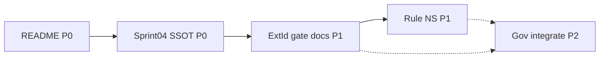

# Repository Information Architecture — 우선순위 평가

> **목적:** Sprint 04 **종료 전** 문서 체계 정리 **우선순위 확정**  
> **근거:** [sprint-04-document-reconciliation.md](sprint-04-document-reconciliation.md) · [rule-id-collision-analysis.md](rule-id-collision-analysis.md) · [doc-inventory-externalid.md](doc-inventory-externalid.md)  
> **기준일:** 2026-06-09 · Registry **430** · externalId **46.74%**

**금지 준수:** 수정 · rename · ADR · 구현 **없음** — **평가만**

---

## Executive Summary

| 순위 | 항목 | 등급 | 한 줄 |
|:----:|------|:----:|------|
| 1 | **B.** Sprint 04 active / superseded | **P0** | 잘못된 SSOT(`final-review` @402) **즉시 차단** |
| 2 | **C.** README 정합성 | **P0** | 진입점 **1파일** · Phase B·reconciliation **미노출** |
| 3 | **E.** ExternalId Quality Gate 문서 | **P1** | E4 정책 **미확정** · attach gate SSOT **초안 불완** |
| 4 | **A.** Rule Namespace (EG/SC/EN) | **P1** | 구현·gate 착수 **전** 필수 · 문서 각주로 **부분 해소 가능** |
| 5 | **D.** Coverage Governance 통합 | **P2** | Phase 2 **동결** 축 · Sprint 04 종료 **비차단** |

**권장 실행 순서:** **C → B → E → A(각주) → A(본 rename) → D**

---

## 평가 기준

| 등급 | 의미 |
|:----:|------|
| **P0** | Sprint 04 **종료 판정·SSOT** 오류 유발 · **저비용 고효과** |
| **P1** | Gate **구현·partial apply** 전 **정리 필요** · 미루면 **재작업** |
| **P2** | **구조 개선** · 단기 운영 **생존 가능** · 장기 부채 |

---

## A. Rule Namespace 정리 (EG / SC / EN)

### 개요

`E1`~`E5`가 **attach gate(EG)** · **Sprint cohort(SC)** · **enrich gate(CG/EN)** 에 **동시 사용** ([rule-id-collision-analysis.md](rule-id-collision-analysis.md)). 추천: **EG1~EG5** · **SC1~SC4** · enrich는 **EN1~EN8**(선택).

| 차원 | 평가 |
|------|------|
| **예상 효과** | **높음** — 「E2 BLOCK」= Save vs TMDB vs 출처매칭 **혼동 제거** · gate 구현 시 **계약 ID 안정** |
| **영향 문서 수** | **최소 8** (EG only: 7 docs + 1 tool) · **SC 포함 ~18** · **EN 포함 ~20** |
| **구현 난이도** | **중** — EG 문서+`post_gate.dart` **동기** · SC는 charter·economics·4 tools · EN은 Phase 2 **동결** 축이라 **높음** |
| **미룰 경우 위험** | **높음** (gate 구현 시) · **중** (문서만) — attach runner·PR 리뷰에서 **잘못된 Rule 인용** · `e1_*` 파일명 **영구 혼동** |

### 등급: **P1**

| 근거 | |
|------|--|
| Sprint 04 **문서 종료**만이면 **각주·reconciliation 링크**로 **임시 완화** 가능 |
| **EG 코드·gate 구현** 착수 시 **P0 승격** |
| **EN 일괄 rename**은 **비권고** — 본 항목에서 **EG+SC**만 Sprint 04 범위 |

### 권장 범위 (Sprint 04 내)

1. **EG1~EG5** — attach gate 문서·post-gate 도구  
2. **SC1~SC4** — charter · economics · baseline · sprint 도구 주석 (**파일 rename 선택**)  
3. **EN*** — **Sprint 04 범위 외** (각주만)

---

## B. Sprint 04 문서 정리 (active / superseded)

### 개요

**04-R1**(@402 · `final-review` · G2 달성) vs **04-R2**(@430 · Phase B · apply 보류) **이중 서사** ([sprint-04-document-reconciliation.md](sprint-04-document-reconciliation.md)).

| 차원 | 평가 |
|------|------|
| **예상 효과** | **매우 높음** — coverage **50% vs 46.74%** · blocking **0 vs HIGH 4** · 「Sprint 종료 GO」 **오독 방지** |
| **영향 문서 수** | **핵심 3~5** — `final-review` · `charter` · `economics-plan` 배너 · 선택 `readiness-review` · 메타 2건(reconciliation·inventory) **이미 반영** |
| **구현 난이도** | **낮음** — 상단 **superseded/active 배너** · SSOT 링크 · **본문 대량 개정 불필요** |
| **미룰 경우 위험** | **매우 높음** — partial apply·G2 재달성 **잘못된 전제** · `final-review`를 **현재 진실**로 읽는 **운영 사고** |

### 등급: **P0**

| SSOT (active) | superseded / archive |
|---------------|----------------------|
| `project-status-snapshot` · `baseline-report` | — |
| Phase B 4건 + `high-risk-disposition` | — |
| `sprint-04-document-reconciliation` (인덱스) | — |
| — | **`sprint-04-final-review`** (@402 1차 실행) |
| — | **`sprint-04-charter`·`economics-plan`** 수치 (@402 **각주**) |

---

## C. README 정합성 수정

### 개요

[docs/README.md](README.md) Phase 2에 **`sprint-04-final-review`만** 링크 · Phase B **5건·reconciliation·IA 조사 미등록** · @430 snapshot은 운영 섹션에만 존재.

| 차원 | 평가 |
|------|------|
| **예상 효과** | **높음** — **첫 진입점**에서 Sprint 04 **올바른 읽기 순서** · 신규 기여자 **SSOT 오류 감소** |
| **영향 문서 수** | **1** (`README.md`) · 간접 참조 링크 **~8** |
| **구현 난이도** | **매우 낮음** — 섹션 분리(04-R1 / 04-R2) · reconciliation · rule-id · snapshot **링크** |
| **미룰 경우 위험** | **높음** — B 배너 없이도 README가 **구 SSOT로 유도** · 조사 문서 **무방문** |

### 등급: **P0**

| 권고 README 구조 | |
|------------------|--|
| Sprint 04 **04-R2 (active)** | baseline → Phase B 체인 → reconciliation |
| Sprint 04 **04-R1 (archive)** | final-review (superseded) |
| **NS 범례** | EG/SC 1행 링크 → rule-id-collision-analysis |
| L0 | project-status-snapshot 유지 |

---

## D. Coverage Governance 통합

### 개요

[coverage-quality-governance.md](coverage-quality-governance.md)(정의) · [phase2-governance-review.md](phase2-governance-review.md)(요약) · [quality-gate-mvp.md](quality-gate-mvp.md)(titles.en) · attach gate **분산** · enrich **E1–E8** vs attach **E1–E5** **숫자 충돌**.

| 차원 | 평가 |
|------|------|
| **예상 효과** | **중~높음** (장기) — Quality 층 **단일 지도** · insert/enrich/attach/release **한 흐름** |
| **영향 문서 수** | **핵심 2~4** (governance · phase2-governance · quality-gate-mvp · canonical-dashboard) · 파급 **~10** |
| **구현 난이도** | **높음** — Phase 2 **동결** · EN rename **저항** · attach § **신규 작성** · **중복 제거** 논쟁 |
| **미룰 경우 위험** | **중** — 현재는 reconciliation·inventory로 **우회 가능** · gate **미구현**이라 **즉시 사고는 낮음** · **6개월+** 시 governance·externalId **이중 유지보수** |

### 등급: **P2**

| Sprint 04 종료 시 최소 | |
|------------------------|--|
| governance §4에 **「attach PRE-check → externalid-quality-gate-rules」** 링크 1줄 | |
| **EN rename·문서 합병**은 **Post–Sprint 04** |

---

## E. ExternalId Quality Gate 문서 정리

### 개요

[externalid-quality-gate-rules.md](externalid-quality-gate-rules.md) **초안** · E4 overlap vs [sprint-04-e4-effectiveness-review.md](sprint-04-e4-effectiveness-review.md) **비권고** · B-3~B-5 측정 **미동기화** · 구현 **없음**.

| 차원 | 평가 |
|------|------|
| **예상 효과** | **높음** — attach **정책 SSOT** 확정 · E4 **폐기/축소** 반영 · partial apply **판단 근거** |
| **영향 문서 수** | **5~7** — rules · post-gate · e4-effectiveness · disposition · quality-risk-review · reconciliation · (inventory) |
| **구현 난이도** | **중** — **정책 편집** (E4 §) · EG rename과 **동시**가 이상적 · **코드 없음** |
| **미룰 경우 위험** | **높음** — gate 구현 시 **과보수 E4** 재도입 · LOW 7건 **재오탐** · B-5 **실측 무시** |

### 등급: **P1**

| P0가 아닌 이유 | |
|----------------|--|
| Gate **미구현** · apply **보류** — **당장 런타임** 영향 없음 |
| **E4 한 절** + 상태(draft→reviewed)만으로 Sprint 04 **문서 종료 가능** |

| P1인 이유 | |
|-----------|--|
| Sprint 04 **품질 스토리** 완결에 **필수** |
| **A(EG)** 와 **동시 착수** 권장 |

### 정리 체크리스트 (평가용)

| # | 항목 |
|---|------|
| 1 | E4 — overlap **폐기** · 교차게임 **only** (B-5) |
| 2 | 문서 상태 **draft → reviewed (pre-impl)** |
| 3 | EG1~EG5 **용어** (A와 동기) |
| 4 | quality-gate-mvp · governance **경계** § 유지 |
| 5 | post-gate · e4-effectiveness **상호 링크** |

---

## 종합 매트릭스

| 항목 | 등급 | 효과 | 문서 수 | 난이도 | 미루면 위험 |
|------|:----:|:----:|--------:|:------:|:-----------:|
| **A** Rule NS | **P1** | 높음 | 8~20 | 중 | 높음† |
| **B** Sprint 04 SSOT | **P0** | 매우 높음 | 3~5 | 낮음 | **매우 높음** |
| **C** README | **P0** | 높음 | 1 | 매우 낮음 | 높음 |
| **D** Governance 통합 | **P2** | 중~높음 | 2~10 | 높음 | 중 |
| **E** externalId gate docs | **P1** | 높음 | 5~7 | 중 | 높음 |

† gate **구현 전**에는 **중**.

---

## Sprint 04 종료 전 권장 패키지

### Wave 1 — P0 (예상 0.5~1 session)

| # | 작업 | 산출 |
|---|------|------|
| 1 | **C** README Sprint 04 섹션 분리 | 읽기 순서·링크 |
| 2 | **B** `final-review` · charter · economics **superseded 배너** | SSOT 명시 |

**효과:** 잘못된 G2·종료 판정 **차단** · Phase B **발견 가능**.

### Wave 2 — P1 (예상 1~2 session)

| # | 작업 | 산출 |
|---|------|------|
| 3 | **E** rules E4 개정 · 상태 갱신 | gate 정책 SSOT |
| 4 | **A** EG1~EG5 문서·post-gate JSON 키 | NS 분리 (코드 1파일) |
| 5 | **A** SC1~SC4 charter/economics **각주** (선택 본문) | cohort 혼동 완화 |

**효과:** Sprint 04 **품질·gate 서사 완결** · 이후 구현 **착수 Gate**.

### Wave 3 — P2 (Post–Sprint 04)

| # | 작업 |
|---|------|
| 6 | **D** governance attach 축 링크 · EN 각주 |
| 7 | **D** phase2-governance vs coverage-quality-governance **역할 재정의** (필요 시) |

---

## 의존성

- **B·C** — **독립** · 병렬 가능  
- **E** — B SSOT **확정 후** (어떤 Phase가 active인지)  
- **A** — E **정책 확정 후** (EG 번호 매핑)  
- **D** — A·E **완료 후**가 효율적 · **필수 아님**

---

## Sprint 04 「종료」 정의 (문서 관점)

| 조건 | Wave |
|------|:----:|
| README + superseded 배너 | **1** |
| reconciliation이 **유일 인덱스**로 README에서 **도달 가능** | **1** |
| externalId gate **reviewed** (E4 B-5 반영) | **2** |
| EG/SC **문서 각주** 최소 | **2** |
| governance **통합 문서** | **3** (선택) |

**판정:** Wave **1 완료** = Sprint 04 **문서 SSOT 종료 최소선** · Wave **2** = **품질·gate IA 종료** · Wave **3** = **프로그램 IA 부채 상환**.

---

## 문서 이력

| 일자 | 변경 |
|------|------|
| 2026-06-09 | Repository IA 우선순위 — A~E P0/P1/P2 평가 |
